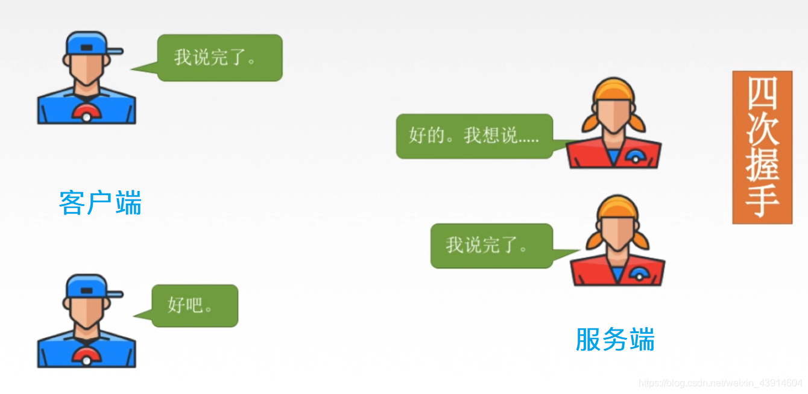
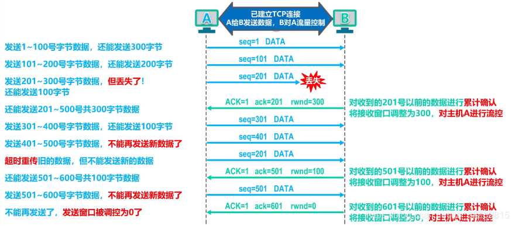

# 408 王道视频 计算机网络 笔记

>
> bilibili视频资源：
> 
> https://www.bilibili.com/video/BV19E411D78Q
> 
> 一个很好的CSDN博客，我就看这个总结
>
> https://blog.csdn.net/weixin_43914604/article/details/104722679
> 
> 


> 
> <font color="yellow">
>
> 重点：第五章 传输层，都是面试高频考点
>
> * 五层/OSI七层模型
>
> * TCP（连接建立-三次握手、连接释放-四次握手）
>
> * UDP
>
> 计网只学应用层和传输层差不多，其它稍微看看, 面试问的不多
> 
> </font>
>

> 
> <font color="gree">
>
> 递归式问法
>
> 1. OSI七层和TCP/IP五层: 
>
> 2. 每一层都有不同的协议
>
> 以上是宏观架构
>
> 3. 具体细节一般问传输层和应用层 
>
> > * 比如说, `udp`如何实现可靠传输? 
> > > 
> > > 答案：
> > > `tcp`咋整它就咋整呗:消息应答
> > > 那UDP的意义不就没了, 频繁传输那么多应答信息
> > > 所以说要实现udp和tcp，两种不同的满足不同需求
> > > 
> > 
> > * 比如说, `http` 报文结构， `get`和`post`方法 (应用层中http协议的内容)
> > > 
> > > 答案：
> > > 
> > > 
> 
> > * 还有`http`不同版本的区别
> > > 
> > > 答案：
> > > 
> 
> </font>
> 
>


> 
> <font color="pink">
>
> * 有那种叫你自己写一个`http`报文解析的小项目
>
> * 此外，我们最好做一遍开源项目`webserver`, 虽然比较烂大街
>
> 
> </font>
>
> 
> 


## 第 1 章 计算机网络体系结构


### 1.1 计算机网络概述

#### 1.1.1 计算机网络的概念、组成、功能和分类

> 
> https://blog.csdn.net/weixin_43914604/article/details/104535108
> 


#### 1.1.2 计算机网络的性能指标（速率、带宽、吞吐量、时延、往返时延、时延带宽积、信道利用率）

>
> https://blog.csdn.net/weixin_43914604/article/details/104541219
> 


### 1.2 计算机网络体系结构与参考模型

#### 1.2.1 计算机网络的分层结构、协议、服务和接口

>
> https://blog.csdn.net/weixin_43914604/article/details/104557738
> 

#### 1.2.2 OSI参考模型（应用层、表示层、会话层、传输层、网络层、数据链路层、物理层）

>
> https://blog.csdn.net/weixin_43914604/article/details/104589085
> 


#### 1.2.3 TCP/PI参考模型（应用层、传输层、网际层、网络接口层）、五层参考模型（应用层、传输层、网络层、数据链路层、物理层）、OSI与TCP/IP参考模型比较

>
> https://blog.csdn.net/weixin_43914604/article/details/104597450
> 


### 总结（第 1 章 计算机网络体系结构）

>
> https://blog.csdn.net/weixin_43914604/article/details/104599341
> 


## 第 2 章 物理层


### 2.1 通信基础

#### 2.1.1 物理层接口特性、数据通信模型、物理层基本概念（数据、信号、码元 、信源、信道、信宿 、速率、波特、带宽）

>
> https://blog.csdn.net/weixin_43914604/article/details/104679775
> 

####  2.1.2 奈氏准则和香农定理

>
> https://blog.csdn.net/weixin_43914604/article/details/104701860
> 

#### 2.1.3 编码与调制

>
> https://blog.csdn.net/weixin_43914604/article/details/104705331
> 


### 2.2 传输介质及物理设备

#### 2.2.1 传输介质（双绞线、同轴电缆、光纤、无线电缆、微波、激光、红外线）

>
> https://blog.csdn.net/weixin_43914604/article/details/104718169
> 


#### 2.2.2 物理层设备（中继器、集线器）

>
> https://blog.csdn.net/weixin_43914604/article/details/104719759
> 


### 总结（第 2 章 物理层）

>
> https://blog.csdn.net/weixin_43914604/article/details/104720769
> 


## 第 3 章 数据链路层


### 3.1 数据链路层的功能

#### 3.1.1 数据链路层的基本概念和功能概述

>
> https://blog.csdn.net/weixin_43914604/article/details/104778017
>


### 3.2 组帧

#### 3.2.1 封装成帧、帧定界、帧同步、透明传输（字符计数法、字符串的首尾填充法、零比特填充的首尾标志法、违规编码法

> 
> https://blog.csdn.net/weixin_43914604/article/details/104779973
> 


### 3.3 差错控制

#### 3.3.1 数据链路层之差错控制（检错编码和纠错编码）->（奇偶校验码、CRC循环冗余码、海明码）

>
> https://blog.csdn.net/weixin_43914604/article/details/104864783
> 


### 3.4 流量控制与可靠传输机制

#### 3.4.1 流量控制（停止-等待协议、滑动窗口、后退N帧协议GBN、选择重传协议SR）、滑动窗口、可靠传输机制

>
> https://blog.csdn.net/weixin_43914604/article/details/104908762
> 


### 3.5 介质访问控制

#### 3.5.1 介质访问控制（静态划分信道、FDM、TDM、STDM、WDM、CDM）、（动态划分信道、ALOHA、CSMA、CSMA/CD、CSMA/CA）、令牌传递协议

>
> https://blog.csdn.net/weixin_43914604/article/details/104935912
> 


### 3.6 局域网

#### 3.6.1 局域网（以太网与IEEE 802.3、IEEE 802.11、）

>
> https://blog.csdn.net/weixin_43914604/article/details/105016637
> 


### 3.7 广域网

#### 3.7.1 广域网（ppp协议、HDLC协议）

>
> https://blog.csdn.net/weixin_43914604/article/details/105028759
> 


### 3.8 数据链路层设备

#### 3.8.1 数据链路层设备（网桥、交换机）

>
> https://blog.csdn.net/weixin_43914604/article/details/105031190
> 


## 第 4 章 网络层


### 4.1 网络层的功能 

#### 4.1.1 网络层的功能（路由选择与分组转发、异构网络互连、拥塞控制）

>
> https://blog.csdn.net/weixin_43914604/article/details/105075503
> 


>
> **<font color="pink" size = 5>1. 主要任务与传输单位</font>**
> 
> > <div align=center>
> > 
> > </div>
>
> 
> 


#### 4.1.2 计算机网络之（电路交换、报文交换、分组交换–数据报–虚电路）

>
> https://blog.csdn.net/weixin_43914604/article/details/105077310
> 


### 4.2 路由算法与路由协议概述

#### 4.2.1 路由算法与路由协议概述（静态路由和动态路由—距离-向量路由算法—链路状态路由算法、层次路由）

>
> https://blog.csdn.net/weixin_43914604/article/details/105084158
> 


### 4.3 IPv4

#### 4.3.1 IPv4（IPv4分组、IPv4地址、NAT、子网划分与子网掩码、CIDR、ARP协议、DHCP、ICMP）

>
> https://blog.csdn.net/weixin_43914604/article/details/105138313
> 


### 4.4 IPv6

#### 4.4.1 IPv6(诞生原因、数据报格式、与IPv4的不同、地址表现形式、基本地址类型、IPv6与IPv4的过渡策略)

>
> https://blog.csdn.net/weixin_43914604/article/details/105297642
> 


### 4.5 路由协议

#### 4.5.1 路由选择协议（自治系统AS、RIP、OSPF、BGP）

>
> https://blog.csdn.net/weixin_43914604/article/details/105313629
> 


### 4.6 IP组播

#### 4.6.1 IP组播（IGMP、组播路由选择协议、组播地址）

>
> https://blog.csdn.net/weixin_43914604/article/details/105318560
> 


### 4.7 移动IP

#### 4.7.1 移动IP

>
> https://blog.csdn.net/weixin_43914604/article/details/105319753
> 


### 4.8 路由器

#### 4.8.1 网络层设备路由器

>
> https://blog.csdn.net/weixin_43914604/article/details/105322374
> 


## 第 5 章 传输层


### 5.1 传输层提供的服务

#### 5.1.1 （传输层提供的服务及功能概述、端口、套接字–Socket、无连接UDP和面向连接TCP服务）

>
> https://blog.csdn.net/weixin_43914604/article/details/105451022
> 

>
> **<font color="pink" size = 5>1. 传输层提供的服务及功能概述</font>**
> 
> <font color="yellow">服务：</font>
> 
> > <font color="gree">
> > 
> > 使用网络层的服务，
> > 
> > 为应用层提供通信和服务
> > 
> > </font>
> 
> <font color="yellow">功能：</font>
> 
> > 
> > 
> > * 传输层提供应用进程之间的逻辑通信(即端到端的通信) 
> > 
> > * 复用和分用 
> > 
> > * 传输层还要对收到的报文进行差错检测(首部和数据部分)
> > 
> > * 提供两种不同的传输协议，即面向连接的`TCP`和无连接的`UDP`
> > 
> 
> 
>
> <font color="yellow">以下是传输层功能的详细说明：</font>
>
> 1) 传输层提供应用进程之间的逻辑通信(即端到端的通信)
> > 
> > * 传输层与网络层的区别: 网络层提供的是**主机**之间的逻辑通信，传输层提供**应用进程**之间的逻辑通信
> > 
> > * 从网络层来说，通信的双方是两台主机，`IP` 数据报的首部给出了这两台主机的IP地址
> > 
> > * 这里 “ `逻辑通信` ” 的意思是:传输层之间的通信好像是沿水平方向传送数据，但事实上这两个传输层之间并没有一条水平方向的物理连接
> > 
> > <div align=center>
> > 
> > </div>
> > 
> > 从图中可以看出，中间的路由没有传输层，看着像是从一端直接到另一端。
> > 
>  
> 2) 复用和分用
> > 
> > * `复用`是指**发送方**,**不同的应用进程**都可使用**同一个传输层协议**传送数据;
> >
> > * `分用`是指**接收方**的传输层在剥去报文的首部后能够把这些数据正确交付到目的应用进程。
> > 
> > <div align=center>
> > 
> >  
> > </div>
> > 
> > 从图中可以看出，复用和分用是对应的概念，无法分开。发送时，将不同应用的数据合并，通过传输层传输，到达接收端后，能够将不同应用的数据分离，分别给对应的应用。
> > 
> 
> 3) 传输层还要对收到的报文进行差错检测(首部和数据部分)
> > 
> > <font color="yellow">
> > 
> > * 网络层只检查`IP`数据报的首部，不检验数据部分是否出错
> > 
> > * 差错检测在传输层进行。
> > 
> > </font>
>
> 4) 提供两种不同的传输协议，即面向连接的`TCP`和无连接的`UDP`
> > 
> > <font color="yellow">
> > 
> > * 网络层无法同时实现两种协议（即，在网络层要么只提供面向连接的服务，如虚电路; 要么只提供无连接服务，如数据报，而不可能在网络层同时存在这两种方式）。
> >  
> > * 传输层可以同时提供：面向连接的`TCP`和无连接的`UDP`？？？ 
> > 
> > </font>
> > 
> > > 
> > > 比如说局域网中两个端点，我们在电脑上同时跑两个应用进程，发送端---进程`1`用端口`S1`，进程`2`用端口`S2`； 接收端---进程`1`用端口`R1`，进程`2`用端口`R2`；
> > > 
> > > 这样，我们可以决定端口`S1-R1`使用`TCP`协议，端口`S2-R2`使用`UDP`协议
> > > 
> > > （<font color="yellow">注意： 端口号只有本地意义，在因特网中不同计算机的相同端口是没有联系的</font>）
> > > 
> > > 你想，你电脑可以又开直播(`UDP`)又下载数据(`TCP`)，肯定是可以实现的。
> > > 
> > 
> 


>
> **<font color="pink" size = 5>2. 传输层的寻址与端口</font>**
> 
>
> 1) 端口的作用
> > 
> > * 端口 能够让 应用层的各种应用进程 将其数据通过端口向下交付给 传输层，以及让 传输层 知道应当将其报文段中的数据向上通过 端口 交付给 应用层相应的进程。
> > 
> > * <font color="yellow">端口是`传输服务访问点`(`TSAP, Transport Service Access Point`)，它在`传输层`的作用类似于`IP`地址在`网络层`的作用或`MAC`地址在`数据链路层`的作用，只不过`IP`地址和`MAC`地址标识的是`主机`，而`端口`标识的是`主机`中的`应用进程`。</font>
> > 
> > * <font color="gree">数据链路层的`SAP`是`MAC`地址，网络层的`SAP`是`IP`地址，传输层的`SAP`是`端口`.</font>
> > 
> > * `SAP: Service Access Point` 服务访问点
> > 
> > * <font color="gree"> 在协议栈层间的抽象的协议端口是`软件端口`，它与路由器或交换机上的`硬件端口`是完全不同的概念。</font>
> > 
> > * `硬件端口`是不同硬件设备进行交互的接口，而`软件端口/逻辑端口`是应用层的各种协议进程与传输实体进行层间交互的一种地址。
> > 
> > * `传输层`使用的是`软件端口/逻辑端口`。
> > 
> > * `端口号只有本地意义`，在因特网中不同计算机的相同端口是没有联系的
> 
> 
> 2) 端口号的分类
> > 
> > * 端口号长度为`16bit`, 能表示`65536`个不同的端口
> > 
> > <div align=center>
> > 
> > </div>
> > 
> > 服务端-熟知端口号、登记端口号； 客户端-临时端口号
> > 
>
> 
> 3) 套接字 `Socket`
> > 
> > * 在网络中通过`IP`地址来`标识和区别不同的主机`，通过`端口号`来`标识和区分一台主机中的不同应用进程`。在网络中采用发送方和接收方的`套接字(Socket)组合`来`识别端点`。
> > 
> > <div align=center>
> > 
> > </div>
> > 
> > * 套接字是通信的基石，是支持`TCP/IP`协议的路通信的`基本操作单元`
> > 
> > * 可以将`套接字`看作不同主机间的进程进行双间通信的端点，它`构成了单个主机内及整个网络间的编程界面`。
> > 
> > <br>
> > 
> > * `Socket`(套接字)可以看成是两个网络应用程序进行通信时，各自`通信连接中的端点`，这是`一个逻辑上的概念`。它是网络环境中进程间通信的`API`(应用程序编程接口)，也`是可以被命名和寻址的通信端点`，使用中的每一个套接字都有其类型和一个与之相连进程。
> > 
> > <br>
> > 
> > * <font color="gree">通信时其中一个网络应用程序将要传输的一段信息写入它所在主机的 `Socket`中，该 `Socket`通过与网络接口卡(`NIC`)相连的传输介质将这段信息送到另外一台主机的 `Socket` 中，使对方能够接收到这段信息。 `Socket`是由`IP`地址和`端口`结合的，提供向应用层进程传送数据包的机制。</font>
> > 
> > <br>
> > 
> > * <font color="yellow">要通过互联网进行通信，至少需要`一对套接字`，其中一个运行于客户端，我们称之为 `Client Socket`，另一个运行于服务器端，我们称之为 `Server Socket`.</font>
> > 
> > <br>
> > 
> > * <font color="yellow">`Linux`网络编程（`Linux Network Programming`）中，`Socket`实际上就是一个文件</font>
> > 
> > 
> 
> 
> 


>
> **<font color="pink" size = 5>3. 无连接UDP和面向连接TCP服务</font>**
> 
> 
> <div align=center>
> 
> 
> </div>
>
> <font color="yellow">
> 
> `TCP`：`Transmission Control Protocol` 传输控制协议
> 
> `UDP`: `User Datagram Protocol` 用户数据报协议
>
> </font>
>
> `TCP`是`面向字节流`的，`UDP`是`面向报文`的； 
> 
> 面向字节流是指发送数据时以字节为单位（连续的字节），`TCP`一个数据报可以拆分成若干组进行发送，而`UDP`一个报文只能一次发完
> 


### 5.2 UDP协议

#### 5.2.1 UDP协议

> 
> `UDP`: `User Datagram Protocol` <font color="yellow">用户数据报协议</font>
> 
> https://blog.csdn.net/weixin_43914604/article/details/105453096
> 


>
> **<font color="pink" size = 5>1. 用户数据报协议UDP概述及特点优势</font>**
> 
> 
> <div align=center>
> 
> </div>
>
> **为什么应用开发人员宁愿在`UDP`之上构建应用，也不选择`TCP`?既然`TCP`提供可靠的服务，而`UDP`不提供，那么`TCP`总是首选吗?答案是否定的，因为有很多应用更适合用`UDP`，主要是因为`UDP`具有如下优点:**
>
> 1) <font color="pink">`UDP`无须建立连接</font>
> > 
> > * `UDP`不会引入建立连接的时延。
> > 
> > * 试想如果`DNS`运行在`TCP`而非`UDP`.上，那么`DNS`的速度会慢很多。
> > 
> > * `HTTP`使用`TCP`而非`UDP`，是因为对于基于文本数据的`Web`网页来说，可靠性是至关重要的。
> > 
> > <font color="yellow">选择哪种传输层协议，主要是你更看重可靠性，还是更看重时延和开销</font>。
>
> 
> 
> 2) <font color="pink">无连接状态</font>
> > 
> > * `TCP` 需要在端系统中维护连接状态。此连接状态包括接收和发送缓存、拥塞控制参数和序号与确认号的参数。
> > 
> > * `UDP`不维护连接状态，也不跟踪这些参数。
> > 
> > * 因此，**某些专用应用服务器使用`UDP`时，一般都能支持更多的活动客户机**。
> > 
>
> 
> 3) <font color="pink">分组首部开销小</font>
> > 
> > * `TCP`有`20B`的首部开销，而`UDP`仅有`8B`的开销。
> > 
> 
> 4) <font color="pink">应用层能更好地控制要发送的数据和发送时间</font>
> > 
> > * `UDP`没有拥塞控制，因此网络中的拥塞`不会影响主机的发送效率`。
> > 
> > * `某些实时应用要求以稳定的速度发送`，能容忍一些数据的丢失，但`不允许有较大的时延`，而`UDP`正好满足这些应用的需求。
> > 
>
> 
> 5) <font color="pink">`UDP`常用于一次性传输较少数据的网络应用</font>
> > 
> > * 如`DNS`、`SNMP`等，因为对于这些应用，若采用`TCP`，则将为连接创建、维护和拆除带来不小的开销。
> > 
> > * `UDP`也常用于多媒体应用(如`IP`电话、实时视频会议、流媒体等)，显然，可靠数据传输对这些应用来说并不是最重要的，但`TCP`的拥塞控制会导致数据出现较大的延迟，这是它们不可容忍的。
> > 
> 
> 
> 6) <font color="pink">`UDP`提供尽最大努力的交付，即不保证可靠交付</font>
> > 
> > * 但`这并不意味着应用对数据的要求是不可靠的`，因此所有维护传输<font color="gree">可靠性的工作需要用户在应用层来完成。</font>
> > 
> > * `应用实体可以根据应用的需求来灵活设计自己的可靠性机制`。
> > 
> 
> 7) <font color="pink">`UDP`是面向报文的</font>
> > 
> > * 发送方`UDP`对应用层交下来的报文，在添加首部后就向下交付给`IP`层，
既不合并，也不拆分，而是保留这些报文的边界;
> > 
> > * 接收方`UDP`对`IP`层交上来`UDP`用户数据报，在去除首部后就原封不动地交付给上层应用进程，一次交付一个完整的报文
> > 
> > * 因此**报文不可分割，是`UDP`数据报处理的最小单位**。
> > 
>
> 


 

>
> **<font color="pink" size = 5>2. `UDP`首部格式</font>**
> 
> 
> <div align=center>
> 
> </div>
>
> > 注：
> > `ICMP`（`Internet Control Message Protocol`）`Internet控制报文协议`。它是`TCP/IP`协议簇的一个`子协议`，用于在`IP主机`、`路由器`之间传递控制消息。`控制消息`是指`网络通不通、主机是否可达、路由是否可用等网络本身的消息`。这些控制消息虽然并不传输用户数据，但是对于用户数据的传递起着重要的作用.
> > 
> > `ICMP`使用`IP`的基本支持，就像它是一个更高级别的协议，但是，`ICMP`实际上是`IP`的一个组成部分，必须由每个`IP`模块实现
> > 
>
> **各字段意义如下：**
>
> * 1) 源端口号: 在需要对方回信时选用，不需要时可用全`0`。
> 
> * 2) 目的端口号: 这在终点交付报文时必须使用到。
> 
> * 3) 长度: `UDP`数据报的长度(包括首部和数据)，其最小值是`8` (仅有首部)。
> 
> * 4) 校验和: 检测`UDP`数据报在传输中是否有错。有错就丢弃。该字段是可选的，当源主机不想计算校验和时，则直接令该字段为全`0`。
> > 
> 
> 


>
> **<font color="pink" size = 5>3. 当传输层从`IP`层收到`UDP`数据报时</font>**
> 
>
> 根据首部中的目的端口，把`UDP`数据报通过相应的端口。上交给应用进程
> 
> <div align=center>
> 
> </div>
>
> 如果接收方`UDP`发现收到的报文中的目的端口号不正确（即不存在对应于端口号的应用进程），那么就丢弃该报文，并由`ICMP`发送“`端口不可达`”差错报文给发送方。
> 


>
> **<font color="pink" size = 5>4. UDP校验</font>**
> 
> 
> <div align=center>
> 
> 
> </div>
>
> > 注： 虽然图中说二进制反码运算，但是正数的反码与原码相同，所以不需要特别注意，一般只有数据部分才有负数。
> 
> * 伪首部和全`0`字节是不发送的，仅供校验使用
> 
> 如下博客中有具体运算
> https://www.cnblogs.com/jcchan/p/10400504.html
> 
> 
> 


### 5.3 TCP协议

#### 5.3.1 TCP协议（tcp协议特点、tcp报文段首部格式、tcp连接管理—三次握手、tcp连接释放—四次握手）

> 
> `TCP`：`Transmission Control Protocol` <font color="yellow">传输控制协议</font>
> 
> https://blog.csdn.net/weixin_43914604/article/details/105516090
>
> https://blog.csdn.net/liangwenmail/article/details/120354168
>
> 
>


>
> **<font color="pink" size = 5>1. TCP协议特点</font>**
> 
> 
> <div align=center>
> 
> </div>
> 
> 
> <div align=center>
> 
> </div>
> 
> 
> >
> > 该图中可以看出
> > 
> > 发送方`缓存`中存放的是数据部分，还未加上`TCP首部`，加上之后才进行传输
> > 
> > 接收方`缓存`中存放的是数据部分，去除了`TCP首部`，还没有上传到应用层
> > 
> 

>
> **<font color="pink" size = 5>2. TCP报文段的首部格式</font>**
> 
> 
>
> * `TCP`传送的`数据单元`称为`报文段`。一个`TCP`报文段分为`TCP`首部和`TCP`数据两部分，整个`TCP`报文段作为`IP`数据报的数据部分封装在`IP`数据报中
>
> * 其首部的前`20B`是固定的。`TCP`报文段的首部最短为`20B`，后面有`4N`字节是根据需要而增加的选项，通常长度为`4B`的整数倍。
> 
> `TCP`报文段既可以用来运载数据，又可以用来建立连接、释放连接和应答。
> 
> <div align=center>
> 
> </div>
>
> 1) `源端口字段 Source port number 和 目的端口字段 Destination port number`。各占`2B`。端口是传输层与应用层的服务接口，传输层的复用和分用功能都要通过端口实现。
> > 
> > `源端口 Source port` 即可以是客户端`Client`，也可以是服务器端`Server`
> > `目的端口字段 Destination port` 即可以是服务器端`Server`，也可以是客户端`Client`
> > 
> 
> 
> 
> 2) `序号字段 seq（Sequence number）`。占`4B`。`TCP`是面向字节流的(即`TCP`传送数据时是逐个字节传送的)，所以`TCP`连接传送的数据流中的每个字节都编上一个序号。`序号字段的值指的是`所发送的`本报文段数据中的第一个字节的序号`。
> 
> > <div align=center>
> > 
> > </div>
> > 
> > 该图中
> > `seq`是客户端`Client`设置的，传给服务器`Server`
> > `第1个报文段`的`数据部分`的第一个字节的序号是`1`, 所以`序号字段 seq = 1`；
> > `第2个报文段`的`数据部分`的第一个字节的序号是`4`, 所以`序号字段 seq = 4`；
> > 
>
> 
> 
> 
> 3) `确认号字段 ack（Acknowledgment number）`。占`4B`,是期望收到对方的下一个报文段的数据的第一个字节的序号。
> 若确认号为`N`，则表明到序号`N-1`为止的所有数据都已正确收到，下一个需要收到第`N`个字节了。
> 
> > <div align=center>
> > 
> > </div>
> >
> > 该图中可以看出
> > `ack`是服务器`Server`设置的，传给客户端`Client`
> > `第1个报文段`被服务器接收后，服务器就需要回复`ack = 4`，告诉客户端，我已接收到`序号3`为止的所有数据(`序号1`、`序号2`、`序号3`)
> > `第2个报文段`被服务器接收后，服务器端就需要回复`ack = 7`，告诉客户端，我已接收到`序号6`为止的所有数据(`序号1`、`序号2`、`序号3`、`序号4`、`序号5`、`序号6`)
> > 
>
> 
> 
>
> 4) `数据偏移 Data offset (即首部长度)`。占`4b`（`bit` 位），这里不是`IP`数据报分片的那个数据偏移，而是表示首部长度，它指出`TCP`报文段的数据起始处距离`TCP`报文段的起始处有多远。“数据偏移”的单位是`32bit`位(以`4B`为计算单位)。因此当此字段的值为`15`时，达到`TCP`首部的最大长度`60B`.
> 
> > <div align=center>
> > 
> > </div>
> >
> > 该图中可以看出
> > 
> > `Data offset 4bit 为 1111 `，即`Data offset = 15`，说明`数据起始处`距离`TCP报文段起始处`有`15 * 4B = 60B`。`B`指的是字节, `b`指的是位
> > 
>
> 
> 
> 
>
> 5) `保留字段 Reserved`。占`6b`（`bit` 位），保留为今后使用，但目前应置为`0`，该字段可以忽略不计。
>
> 
> 
> 6) `紧急位 URG (urgent)`。`URG=1时，表明 紧急指针字段Urgent pointer 有效`。它告诉系统报文段中有紧急数据，应尽快传送(相当于高优先级的数据), 不能在缓存中排队。但`URG`需要`和紧急指针配套使用`，即`数据从第一个字节到紧急指针所指字节就是紧急数据`。
> 
> > <div align=center>
> > 
> > </div>
> >
> > 该图中可以看出
> > 
> > 缓存区中有`3个报文段`（`4-5-6`、`7-8-9-10`、`11-12-13`），但是`第3个报文段`的`URG = 1`，`第1个报文段`和`第2个报文段`的`URG = 0`, 所以`发送顺序为: 报文段3、报文段1、报文段2`.
> > 
> > 
> > <font color="yellow">`URG`用于发送方，`PSH`用于接收方</font>
> > 
> 
> 7) `确认位 ACK`。`只有当确认位ACK=1时确认号字段ack才有效`。`当确认位 ACK=0 时，确认号字段 ack 无效`。<font color="yellow">`TCP`规定，在连接建立后所有传送的报文段都必须把`确认位ACK`置`1`.</font>
>
> 
> 
> 
>
> 8) `推送位 PSH (Push)`。 `TCP接收端`收到`PSH=1`的报文段，就尽快地交付给接收应用进程而不再等到整个缓存都填满后再向上交付。
> 
> > <div align=center>
> > 
> > </div>
> >
> > 该图中可以看出（发送端可以为客户端或服务器；接收端可以为客户端或服务器）
> > 
> > `发送端的缓冲区`有`3个报文段`，`缓冲区挤满后`，由于`报文3`的`URG=1`, 发送顺序为`报文段3、报文段1、报文段2`
> > 
> > `接收端`接收顺序为`报文段3、报文段1、报文段2`
> > 
> > `接收端的缓冲区挤满后`，就要`传输层 ---> 应用层`
> > 
> > 但是由于`报文2`的`PSH = 1`, 所以`应用层接收到报文的顺序`为`报文段2、报文段3、报文段1`
> > 
> > 
> > <font color="yellow">`URG`用于发送方，`PSH`用于接收方</font>
> > 
> 
> 9) `复位位 RST (Reset)`。`RST=1`时，表明`TCP`连接中出现严重差错(如主机崩溃或其他原因)，必须释放连接，然后再重新建立运输连接。
>
> 
>
> 
>
> 10) `同步位 SYN（synchronou）`。同步`SYN=1`表示这是一个`连接请求报文 或 连接接收报文`。当`SYN=1, ACK=0`时，表明这是一个连接请求报文，对方若同意建立连接，则在响应报文中使用`SYN=1, ACK=1`。即`SYN=1`表示这是一个`连接请求报文 或 连接接收报文`。
> 
> > <div align=center>
> > 
> > </div>
>
> 
> 
> 11) `终止位FIN (Finish)`。用来释放一个连接。`FIN=1`表明此报文段的发送方的数据已发送完毕，并要求释放传输连接.
>
> 
>
> 
> 
> 12) `窗口字段 (Window Size)`。占`2B`。它指出现在允许对方发送的数据量，接收方的数据缓存空间是有限的，因此 接收方 用窗口值 作为 让发送方设置其发送窗口的依据，单位为字节。
>
> > 
> > 窗口：指的是发送本报文段的一方的`接收窗口`，即现在允许对方发送的数据量。
> > 
> > 例如，客户端发送一个报文段，其中设置了窗口字段，用于告诉服务器，客户端有多大的接收缓存，这样服务器就可以设置发送缓冲，避免一次性发送过多内容给客户端，导致客户端接收不过来。
> > 
> > 例如，假设接收方（客户端）的缓存空间是`1700B`，确认报文段中首部的确认号是`701`（已接收`700`个字节），首部的窗口字段是`1000`。这表明，从`701`号算起，发送此报文段的接收方还有接收`1000B`数据(字节序号为`701 ~ 1700`)的接收缓存空间。
> > 
> > <div align=center>
> > 
> > </div>
> > 
> 
>
> 13) `校验和 Checksum`。占`2B`。校验和字段检验的范围包括首部和数据两部分。在计算校验和时，和`UDP`一样，要在`TCP`报文段的前面加上`12B`的伪首部(只需将`UDP`伪首部的第`4`个字段，即协议字段的`17`改成`6`，其他的和`UDP`一样)。
>
> > https://blog.csdn.net/weixin_43914604/article/details/105453096
> 
> 
> 
> 14) `紧急指针字段 Urgent pointer (if URG set)`。占 `16` 位，指出在本报文段中紧急数据共有多少字节（紧急数据放在本报文段数据的最前面）。
> 
> > <div align=center>
> > 
> > </div>
> >
> > 该图中可以看出
> > 
> > `URG=1`, 表示`Urgent Pointer`有效；
> > 
> > `Urgent Pointer=50`, 表示该报文段的数据部分从`第1个字节~第50个字节`是紧急字节
> 
>
> 15) `选项字段 Options`。长度可变。`TCP`最初只规定了一种选项，即最大报文段长度(`Maximum SegmentSize，MSS`)。`MSS`是`TCP`报文段中的数据字段的最大长度。窗口扩大、时间戳、选择确认...
>
> 
>
> 16) `填充字段`。这是为了使整个首部长度是`4B`的整数倍。填充`0`.
>
> 
> 
> 


>
> **<font color="pink" size = 5>维基百科与王道有出入</font>**
> 
> 
> <div align=center>
> 
> 
> </div>
>
> https://en.wikipedia.org/wiki/Transmission_Control_Protocol
>
> <font color="gree">
> 注：
>
> * 说法一：`保留字段Reserved`占`6`位和后面的`URG、ACK、PSH、RST、SYN、FIN`的`6bit`，长度为`12bit`
> 
> * 说法二：`保留字段Reserved`占`4`位和后面的`CWR、ECE、URG、ACK、PSH、RST、SYN、FIN`的`8bit`，长度为`12bit`
>  
> </font>
>
> 
> 


>
> **<font color="pink" size = 5>3. TCP连接管理</font>**
> 
> 
>
> * <font color="yellow">TCP是面向连接的协议，因此每个`TCP`连接都有`三个阶段`:`连接建立、数据传送 和 连接释放`。</font>
>
> * `TCP`连接的管理就是使传输连接的建立和释放都能正常进行。
>
> <font color="gree">在`TCP`连接建立的过程中，要解决以下三个问题:</font>
> > 
> > * 1) 要使每一方都能够确知对方的存在。
> > 
> > * 2) 要允许双方协商一些参数(如 最大窗口值、是否使用窗口扩大选项、时间戳选项及服务质量 等)。
> > 
> > * 3) 能够对运输实体资源(如 缓存大小、连接表中的项目 等)进行分配。
> > 
> 
> <font color="gree">每条`TCP`连接通过通信两端的两个端点(即`两个Socket套接字`)确定。</font>
> 
> <div align=center>
> 
> </div>
> 
> 
> 
>
> <font color="gree">
> 
> `5`个常见参数:
> 
> * `seq`为`序号字段`，标明本次报文段数据部分的第一个字节的序号
>
> * `ack`是`确认号字段`，告诉对方我接下来应该接收的数据是从字节序号`ack`开始的数据
> > 
> > 若确认号为`N`，则表明到序号`N-1`为止的所有数据都已正确收到，下一个需要收到第`N`个字节了。
> > 
>
> * `ACK`是`确认位`,`0`时确认号字段`ack`无效，`1`时确认号字段`ack`有效
>
> * `SYN`是`同步位`
> > 
> > 同步`SYN=1`表示这是一个`连接请求报文 或 连接接收报文`。当`SYN=1, ACK=0`时，表明这是一个连接请求报文，对方若同意建立连接，则在响应报文中使用`SYN=1, ACK=1`。即`SYN=1`表示这是一个`连接请求报文 或 连接接收报文`。
> > 
>
> * `FIN`是`终止位`, 用来释放一个连接。`FIN=1`表明此报文段的发送方的数据已发送完毕，并要求释放传输连接.
> 
> `1`个出现的参数:
> 
> * `PSH`是`推送位`, `TCP接收端`收到`PSH=1`的报文段，就尽快地交付给接收应用进程而不再等到整个缓存都填满后再向上交付。
> 
> </font>
>
> 
> > <font color="gree">注：</font>
> > 
> > * `序号字段 seq（Sequence number）`。占`4B`。`TCP`是面向字节流的(即`TCP`传送时是逐个字节传送的)，所以`TCP`连接传送的数据流中的每个字节都编上一个序号。`序号字段的值指的是`所发送的`本报文段数据中的第一个字节的序号`。
> > 
> > > 
> > > <div align=center>
> > > 
> > > </div>
> > > 
> > > 该图中可以看出
> > > `seq`是客户端`Client`设置的，传给服务器`Server`
> > > `第1个报文段`的`数据部分`的第一个字节的序号是`1`, 所以`序号字段 seq = 1`；
> > > `第2个报文段`的`数据部分`的第一个字节的序号是`4`, 所以`序号字段 seq = 4`；
> > > 
> > 
> > 
> > `ack`是`确认号字段`，占`4B`。是期望收到对方的下一个报文段的数据的第一个字节的序号。若确认号为`N`，则表明到序号`N-1`为止的所有数据都已正确收到。
> > 
> > > 
> > > <div align=center>
> > > 
> > > </div>
> > > 
> > > 
> > > 该图中可以看出
> > > `ack`是服务器`Server`设置的，传给客户端`Client`
> > > `第1个报文段`被服务器接收后，服务器就需要回复`ack = 4`，告诉客户端，我已接收到`序号3`为止的所有数据(`序号1`、`序号2`、`序号3`)
> > > `第2个报文段`被服务器接收后，服务器端就需要回复`ack = 7`，告诉客户端，我已接收到`序号6`为止的所有数据(`序号1`、`序号2`、`序号3`、`序号4`、`序号5`、`序号6`)
> > > 
> > 
> > 
> > 
> > * `ACK`是`确认位`，只有当`确认位ACK=1`时`确认号字段ack`才有效。当`确认位ACK=0`时，`确认号字段ack`无效。`TCP`规定，在`连接建立后`所有传送的报文段都必须把`确认位ACK`置`1`.
> > 
> > 
> > 
> > * `SYN`是`同步位`。同步`SYN=1`表示这是一个`连接请求报文 或 连接接收报文`。当`SYN=1, ACK=0`时，表明这是一个连接请求报文，对方若同意建立连接，则在响应报文中使用`SYN=1, ACK=1`。即`SYN=1`表示这是一个`连接请求报文 或 连接接收报文`。
> >
> > > <div align=center>
> > > 
> > > </div>
> > 
> > 
> > * `PSH`是`推送位`。 `TCP接收端`收到`PSH=1`的报文段，就尽快地交付给接收应用进程而不再等到整个缓存都填满后再向上交付。
> > 
> > > <div align=center>
> > > 
> > > </div>
> > > 
> > > 该图中可以看出（发送端可以为客户端或服务器；接收端可以为客户端或服务器）
> > > 
> > > `发送端的缓冲区`有`3个报文段`，`缓冲区挤满后`，由于`报文3`的`URS=1`, 发送顺序为`报文段3、报文段1、报文段2`
> > > 
> > > `接收端`接收顺序为`报文段3、报文段1、报文段2`
> > > 
> > > `接收端的缓冲区挤满后`，就要`传输层 ---> 应用层`
> > > 
> > > 但是由于`报文2`的`PSH = 1`, 所以`应用层接收到报文的顺序`为`报文段2、报文段3、报文段1`
> > > 
> > > 
> > > <font color="yellow">`URG`用于发送方，`PSH`用于接收方</font>
> > > 
> > 
> > 
> > * `FIN`是`终止位`。用来释放一个连接。`FIN=1`表明此报文段的发送方的数据已发送完毕，并要求释放传输连接.
> > 
>
> 
> 


>
> **<font color="pink" size = 5>3.1. 连接的建立 - - - 三次握手</font>**
>  
> 
> `4`个重要参数:
> 
> * `seq`为`序号字段`，标明所发送的`本报文段数据中的第一个字节的序号`。
>
> * `ack`是`确认号字段`，告诉对方我接下来应该接收的数据是从字节序号`ack`开始的数据。
> > 期望收到对方的下一个报文段的数据部分的第一个字节的序号。若确认号为`N`，则表明到序号`N-1`为止的所有数据都已正确收到。
>
> * `ACK`是`确认位`, `0`时确认号字段`ack`无效，`1`时确认号字段`ack`有效
>
> * `SYN`是`同步位`，`SYN=1`表示这是一个`连接请求报文 或 连接接收报文`。
> > 当`SYN=1, ACK=0`时，表明这是一个连接请求报文，对方若同意建立连接，则在响应报文中使用`SYN=1, ACK=1`。
> 
> 
> <div align=center>
> 
> </div> 
> 
>
> * 第一步:客户机的`TCP(层)`首先向服务器的`TCP(层)`发送一个连接请求报文段。这个特殊的报文段中不含应用层数据，其首部中的`SYN`标志位被置为`1`。另外，客户机会`随机`选择一个起始序号 `seq= x`(连接请求报文不携带数据，但要消耗一个序号)。
>
> * 第二步:服务器的`TCP(层)`收到连接请求报文段后，如同意建立连接，就向客户机发回确认，并为该`TCP`连接分配`TCP`缓存和变量。在确认报文段中，`SYN`和`ACK`位都被置为`1`,确认号字段的值为`x + 1`, 并且服务器`随机`产生起始序号`seq = y`(确认报文不携带数据,但也要消耗-一个序号)。确认报文段同样不包含应用层数据。
> 
> * 第三步:当客户机收到确认报文段后，还要向服务器给出确认，并且也要给该连接分配缓存和变量。这个报文段的`ACK`标志位被置`1`,序号字段为`x + 1`,确认号字段`ack = y + 1`。该报文段可以携带数据，若不携带数据则不消耗序号。
> 
> 成功进行以上三步后，就建立了`TCP`连接，接下来就可以传送应用层数据。
>
> 
> `TCP`提供的是全双工通信，因此通信双方的应用进程在任何时候都能发送数据。
> 
> > 
> > <font color="gree">注意</font>
> > 
> > <font color="gree">1. 一般情况：连接已建立，未断开时</font>
> > 
> > > * `客户端`发送报文时的`ack` 需要在接收的服务器报文的`seq`基础上`+ data_length`，即`client_ack = server_seq + data_length`
> > > 
> > > * `服务器`发送报文时的`ack` 需要在接收的客户端报文的`seq`基础上`+ data_length`，即`server_ack = client_seq + data_length`
> > > 
> > > 
> > > 
> > > * `客户端`发送报文时的`seq`, 只跟自身有关，等于前面已传送过的数据的下一个字节，即`client_seq = previous_client_seq + previous_data_length`; 
> > > 
> > > * `服务器`发送报文时的`seq`, 只跟自身有关，等于前面已传送过的数据的下一个字节，即`server_seq = previous_server_seq + previous_data_length`
> > > > 
> > > > `例如上一次发送的报文包含第3-4-5字节， seq=3, data_length = 3, 那么下一次发送报文的seq= 3+3 = 6`
> > > > 
> > 
> > 
> > <font color="gree">2. 特殊情况：连接正在建立（三次挥手）、连接正在释放（四次握手）</font>
> > 
> > > https://www.cnblogs.com/realjimmy/p/12930797.html
> > > 
> > > <font color="pink">
> > > 
> > > * 连接建立(`SYN=1`)过程中，连接请求报文并不携带数据(即`seq = x，但data_length = 0;`) 按理说应该 `第二次握手ack = x；第三次握手seq = x; `，但我们依然认为其携带数据长度为`1`，所以有`第二次握手ack = x + 1; 第三次握手seq = x + 1`
> > > 
> > > * 连接释放(`FIN=1`) 过程中，连接释放报文并不携带数据(即`seq = u，但data_length = 0;`) 按理说应该 `第二次挥手ack = u；第四次挥手seq = u; `，但我们依然认为其携带数据长度为`1`，所以有`第二次挥手ack = u + 1; 第四次挥手seq = u + 1`
> > > 
> > > </font>
> > 
> 


>
> **<font color="pink" size = 5>3.2. SYN泛洪攻击</font>**
>  
> * 服务器端的资源是在完成第二次握手时分配的
> 
> * 而客户端的资源是在完成第三次握手时分配的
> 
> 这就使得`服务器`易于受到`SYN`洪泛攻击。
> 
> 
> <div align=center>
> 
> </div> 
> 
> https://blog.51cto.com/u_15169172/4132077
>
> * `SYN flood`攻击的含义
> 
> 攻击客户端在短时间内伪造大量不存在的`IP`地址，向服务器不断地发送`SYN`包，服务器回复确认包，并等待客户的确认。
> 
> 由于源地址是不存在的，服务器需要不断的重发直至超时，这些伪造的`SYN`包将长时间占用未连接队列（`Linux`默认的限制一般是`256`个），正常的`SYN`请求被丢弃，目标系统运行缓慢，严重者引起网络阻塞甚至系统瘫痪。
> 
> 
> <div align=center>
> 
> </div> 
> 
> * 解决办法
>
> 1. 修改`TCP`协议实现：一般在较新的的`TCP/IP`协议栈都对这一过程进行修正来防范`syn`攻击
> 2. `SynAttackProtect`保护机制、`SYN cookies`技术、增加最大半连接和缩短超时时间
>
> 
> 


>
> **<font color="pink" size = 5>3.3. TCP连接释放----四次握手</font>**
>  
> 
> `5`个重要参数:
> 
> * `seq`为`序号字段`，标明所发送的`本报文段数据中的第一个字节的序号`。
>
> * `ack`是`确认号字段`，告诉对方我接下来应该接收的数据是从字节序号`ack`开始的数据。
> > 期望收到对方的下一个报文段的数据的第一个字节的序号。若确认号为`N`，则表明到序号`N-1`为止的所有数据都已正确收到。
>
> * `ACK`是`确认位`, `0`时确认号字段`ack`无效，`1`时确认号字段`ack`有效
>
> * `SYN`是`同步位`，`SYN=1`表示这是一个`连接请求报文 或 连接接收报文`。
> > 当`SYN=1, ACK=0`时，表明这是一个连接请求报文，对方若同意建立连接，则在响应报文中使用`SYN=1, ACK=1`。
> 
>
> * `FIN`是`终止位`
> > 用来释放一个连接。`FIN=1`表明此报文段的发送方的数据已发送完毕，并要求释放传输连接.
>
> 
>  
> <font color="gree">天下没有不散的筵席，`TCP`同样如此。参与`TCP`连接的两个进程中的任何- 一个都能终止该连接。`TCP`连接释放的过程通常称为`四次握手`</font>
> 
>
> <div align=center>
> 
> 
> </div> 
>
> 
>
> * 第一步:`客户机打算关闭连接`时，向其`TCP`发送一个连接释放报文段， 并停止发送数据，主动关闭`TCP`连接，该报文段的`FIN`标志位被置`1`,`seq=u, 它等于前面已传送过的数据的最后一个字节的序号加1` (`FIN`报文段即使不携带数据，也要消耗一个序号)。
> > 
> > `TCP` 是全双工的，即可以想象为一条`TCP`连接上有两条数据通路。
> > 发送`FIN`报文时，发送`FIN`的一端不能再发送数据，即关闭了其中一条数据通路，但对方还可以发送数据。
> > 
>
> * 第二步:服务器收到连接释放报文段后即发出确认，`确认号是ack=u+1`, `而这个报文段自己的序号是sep = v,等于它前面已传送过的数据的最后一个字节的序号加1`。
> > 
> > 此时，从客户机到服务器这个方向的连接就释放了，`TCP`连接处于半关闭状态。
> > 
> > 但服务器若发送数据，客户机仍要接收，即从服务器到客户机这个方向的连接并未关闭。
> > 
> 
> * 第三步:若服务器已经没有要向客户机发送的数据，就通知`TCP`释放连接，此时其发出`FIN = 1`的连接释放报文段。`sep = w`
> 
> 
> * 第四步:客户机收到连接释放报文段后，必须发出确认。在确认报文段中，`ACK`字段被置为`1`，`确认号ack=w+1`, `序号seq=u+1`. 此时`TCP`连接还未释放，必须经过时间等待计时器设置的时间`2MSL`后，`客户A`才进入连接关闭状态。
>
> 
> 
> 
> > 
> > <font color="gree">注意</font>
> > 
> > <font color="gree">1. 一般情况：连接已建立，未断开时</font>
> > 
> > > * `客户端`发送报文时的`ack` 需要在接收的服务器报文的`seq`基础上`+ data_length`，即`client_ack = server_seq + data_length`
> > > 
> > > * `服务器`发送报文时的`ack` 需要在接收的客户端报文的`seq`基础上`+ data_length`，即`server_ack = client_seq + data_length`
> > > 
> > > 
> > > 
> > > * `客户端`发送报文时的`seq`, 只跟自身有关，等于前面已传送过的数据的下一个字节，即`client_seq = previous_client_seq + previous_data_length`; 
> > > 
> > > * `服务器`发送报文时的`seq`, 只跟自身有关，等于前面已传送过的数据的下一个字节，即`server_seq = previous_server_seq + previous_data_length`
> > > > 
> > > > `例如上一次发送的报文包含第3-4-5字节， seq=3, data_length = 3, 那么下一次发送报文的seq= 3+3 = 6`
> > > > 
> > 
> > 
> > <font color="gree">2. 特殊情况：连接正在建立（三次挥手）、连接正在释放（四次握手）</font>
> > 
> > > https://www.cnblogs.com/realjimmy/p/12930797.html
> > > 
> > > <font color="pink">
> > > 
> > > * 连接建立(`SYN=1`)过程中，连接请求报文并不携带数据(即`seq = x，但data_length = 0;`) 按理说应该 `第二次握手ack = x；第三次握手seq = x; `，但我们依然认为其携带数据长度为`1`，所以有`第二次握手ack = x + 1; 第三次握手seq = x + 1`
> > > 
> > > * 连接释放(`FIN=1`) 过程中，连接释放报文并不携带数据(即`seq = u，但data_length = 0;`) 按理说应该 `第二次挥手ack = u；第四次挥手seq = u; `，但我们依然认为其携带数据长度为`1`，所以有`第二次挥手ack = u + 1; 第四次挥手seq = u + 1`
> > > 
> > > </font>
> > 
> 


>
> **<font color="pink" size = 5>3.4. TCP连接建立和释放的总结如下</font>**
>
> <font color="yellow">注意：以下内容中，只要是没特别说明的位，都是置`0`的状态</font>
>
> 
> **详细情况如下：**
> 
> * 1)连接建立。分为3步:
> > ① `SYN=1, ... , seq=x`。 客户端-连接请求报文
> > ② `SYN=1, ACK=1, seq=y, ack=x+1` 服务器-连接接收报文
> > ③ `ACK=1, ... , seq=x+1, ack=y+1`。 客户端-确认开始发送（既然后面是数据传输了，`SYN`就不能再置`1`了，不写就默认置`0`，这里只是特别说明一下）
> > 
> > 注意：
> > 由于①中连接请求报文段不携带数据，则连接建立时`previous_data_length = 0`,不消耗序号； 所以③中的`current_client_seq = previous_client_seq + previous_data_length + 1 = previous_client_seq + 1 = x + 1`
> > 
> 
> * 2)释放连接。分为4步:
> > ① `FIN=1, ... , seq=u` 客户端-连接释放报文（这里序号`u`所指字节已经无意义）
> > ② `ACK=1, ... , seq=v, ack=u+1`，服务器-确认不再接收，但是会发送完所剩数据
> > ③ `FIN=1，ACK=1, seq=w，ack=u+1`， 服务器-连接释放报文（这里序号`w`所指字节已经无意义）
> > ④ `ACK=1, ... , seq=u+1, ack=w+1` 客户端-确认连接断开
> > 
> > 注意：
> > 由于①中连接释放报文段不携带数据，则连接释放时`previous_data_length = 0`,不消耗序号； 所以④中`current_client_seq = previous_client_seq + previous_data_length + 1 = previous_client_seq + 1 = u + 1`
> > 
> 
> **简化记忆如下：**
> 
> * 1)连接建立。分为3步:
> > ① `seq=x`。客户端-连接请求
> > ② `seq=y, ack=x+1` 服务器-连接接收
> > ③ `seq=x+1, ack=y+1`。客户端-确认
> 
> * 2)释放连接。分为4步:
> > ① `seq=u` 客户端-连接释放
> > ② `seq=v, ack=u+1`  服务器-确认，发送完所剩数据
> > ③ `seq=w，ack=u+1`  服务器-连接释放
> > ④ `seq=u+1, ack=w+1` 客户端-确认连接断开
> 
> 
> 
> > 
> > <font color="gree">注意</font>
> > 
> > <font color="gree">1. 一般情况：连接已建立，未断开时</font>
> > 
> > > * `客户端`发送报文时的`ack` 需要在接收的服务器报文的`seq`基础上`+ data_length`，即`client_ack = server_seq + data_length`
> > > 
> > > * `服务器`发送报文时的`ack` 需要在接收的客户端报文的`seq`基础上`+ data_length`，即`server_ack = client_seq + data_length`
> > > 
> > > 
> > > 
> > > * `客户端`发送报文时的`seq`, 只跟自身有关，等于前面已传送过的数据的下一个字节，即`client_seq = previous_client_seq + previous_data_length`; 
> > > 
> > > * `服务器`发送报文时的`seq`, 只跟自身有关，等于前面已传送过的数据的下一个字节，即`server_seq = previous_server_seq + previous_data_length`
> > > > 
> > > > `例如上一次发送的报文包含第3-4-5字节， seq=3, data_length = 3, 那么下一次发送报文的seq= 3+3 = 6`
> > > > 
> > 
> > 
> > <font color="gree">2. 特殊情况：连接正在建立（三次挥手）、连接正在释放（四次握手）</font>
> > 
> > > https://www.cnblogs.com/realjimmy/p/12930797.html
> > > 
> > > <font color="pink">
> > > 
> > > * 连接建立(`SYN=1`)过程中，连接请求报文并不携带数据(即`seq = x，但data_length = 0;`) 按理说应该 `第二次握手ack = x；第三次握手seq = x; `，但我们依然认为其携带数据长度为`1`，所以有`第二次握手ack = x + 1; 第三次握手seq = x + 1`
> > > 
> > > * 连接释放(`FIN=1`) 过程中，连接释放报文并不携带数据(即`seq = u，但data_length = 0;`) 按理说应该 `第二次挥手ack = u；第四次挥手seq = u; `，但我们依然认为其携带数据长度为`1`，所以有`第二次挥手ack = u + 1; 第四次挥手seq = u + 1`
> > > 
> > > </font>
> > 
> 


>
> **<font color="pink" size = 5>3.5. 补充别的博客内容</font>**
>
> https://blog.csdn.net/str_lyc/article/details/109543525
>
> https://blog.csdn.net/m0_38106923/article/details/108292454
>
> https://blog.51cto.com/u_15169172/4132077
>
> **<font color="pink">一、TCP"三次握手"</font>**
> 
> **1.1 概括：**
>
> "三次握手"是指建立一个`TCP`连接时，需要客户端与服务器总共发送`3`个包。
`进行三次握手的主要作用是确认客户端与服务器两方的发送能力与接收能力是否正常`。
(连接服务器指定的端口，建立`TCP`连接，并同步双方的序列号和确认号)
>
> **1.2 流程图：**
>
> 刚开始时：客户端处于 `Closed` 状态；服务器处于 `Listen(监听)` 状态
>
> <div align=center>
> 
> 
> </div> 
>
> ```c++
> // 三次握手状态名词解析​​​​​​​
>  
> CLOSED：不在连接状态（这是为方便描述假想的状态，实际不存在）
> 
> LISTEN：等待从任何远端TCP 和端口的连接请求。
>  
> SYN_SENT：发送完一个连接请求后等待一个匹配的连接请求。
>  
> SYN_RECEIVED：发送连接请求并且接收到匹配的连接请求以后等待连接请求确认。
>  
> ESTABLISHED：表示一个打开的连接，接收到的数据可以被投递给用户。连接的数据传输阶段的正常状态。
> ```
>
> `SYN_RVCD: SYN_Received`
>
> **1.3 每次握手的目的：**
>
> **第一次握手**：客服端发送一个报文（`SYN`），服务器接收到了
>
> ```html
> 结论：客户端的发送能力 和 服务器的接受能力没有问题
> ```
> 
> **第二次握手**：服务器回应客户端发送一个报文（`ACK`），客户端接收到了
>
> ```html
> 结论：服务器的发送能力和接收能力没有问题；
>      客户端的发送和接收能力没有问题。
>      但此时服务器不能确认客户端的接受能力有没有问题。
> ```
> 
> **第三次握手**：客户端回应服务器并发送一个报文，服务器接收到了
>
> ```html
> 结论：通过这次接收，服务器确认客户端的接收能力和发送能力没有问题；
>      本身的发送和接收能力也没有问题。
> ```
> 
> **因此需要三次握手才能确认客户端和服务器的发送、接收能力是否正常**
>
>
> **<font color="pink">二、`TCP` 四次挥手</font>**
> 
> **3.1 概括**
> 
> 建立一个`TCP`连接需要三次握手，而终止一个连接要经过四次挥手，`TCP` 连接的拆除需要发送四个包，因此称为四次挥手客户端或服务端均可主动发起挥手动作
>
> **3.2 TCP 半关闭**
> 
> 这由`TCP`的半关闭（`half-close`）造成的，所谓的半关闭，其实就是`TCP`提供了连接的一端在结束它的发送后还能接收来自另一端数据的能力。
>
> **3.3 流程图**
>
> 刚开始双方都处于 `ESTABLISHED` 状态，假如是客户端先发起关闭请求。
>
> <div align=center>
> 
> 
> </div> 
>
> 
> ```c++
> // 四次挥手状态名词解析​​​​​​​
>  
> ESTABLISHED：表示一个打开的连接，接收到的数据可以被投递给用户。连接的数据传输阶段的正常状态。
> 
> FIN_WAIT_1：等待远端TCP 的连接终止请求，或者等待之前发送的连接终止请求的确认。
>  
> FIN_WAIT_2：等待远端TCP 的连接终止请求。
>  
> CLOSE_WAIT：等待本地用户的连接终止请求。
>  
> CLOSING：等待远端TCP 的连接终止请求确认。
>  
> LAST_ACK：等待先前发送给远端TCP 的连接终止请求的确认（包括它字节的连接终止请求的确认）
>  
> TIME_WAIT：等待足够的时间过去以确保远端TCP 接收到它的连接终止请求的确认。
> TIME_WAIT 两个存在的理由：
>           1.可靠的实现tcp全双工连接的终止；
>           2.允许老的重复分节在网络中消逝。
>  
> CLOSED：不在连接状态（这是为方便描述假想的状态，实际不存在）
> ```
> 
>
> **<font color="pink">三、总结</font>**
>
> 
>
> `TCP`的三次握手和四次挥手实质就是`TCP`通信的连接和断开。
> 
> 三次握手：为了对每次发送的数据量进行跟踪与协商，确保数据段的发送和接收同步，根据所接收到的数据量而确认数据发送、接收完毕后何时撤消联系，并建立虚连接。
> 
> 四次挥手：即终止`TCP`连接，就是指断开一个`TCP`连接时，需要客户端和服务端总共发送4个包以确认连接的断开。
> 
> <div align=center>
> 
> </div> 
>
> 
> ```c++
> // 11种状态名词解析​​​​​​​
> 
> // 三次握手
> CLOSED：不在连接状态（这是为方便描述假想的状态，实际不存在）
> 
> LISTEN：等待从任何远端TCP 和端口的连接请求。
>  
> SYN_SENT：发送完一个连接请求后等待一个匹配的连接请求。
>  
> SYN_RECEIVED：发送连接请求并且接收到匹配的连接请求以后等待连接请求确认。
>  
> ESTABLISHED：表示一个打开的连接，接收到的数据可以被投递给用户。连接的数据传输阶段的正常状态。
> 
> // 四次挥手
>  
> ESTABLISHED：表示一个打开的连接，接收到的数据可以被投递给用户。连接的数据传输阶段的正常状态。
> 
> FIN_WAIT_1：等待远端TCP 的连接终止请求，或者等待之前发送的连接终止请求的确认。
>  
> FIN_WAIT_2：等待远端TCP 的连接终止请求。
>  
> CLOSE_WAIT：等待本地用户的连接终止请求。
>  
> CLOSING：等待远端TCP 的连接终止请求确认。
>  
> LAST_ACK：等待先前发送给远端TCP 的连接终止请求的确认（包括它字节的连接终止请求的确认）
>  
> TIME_WAIT：等待足够的时间过去以确保远端TCP 接收到它的连接终止请求的确认。
> TIME_WAIT 两个存在的理由：
>           1.可靠的实现tcp全双工连接的终止；
>           2.允许老的重复分节在网络中消逝。
>  
> CLOSED：不在连接状态（这是为方便描述假想的状态，实际不存在）
> ```
>
> * 三次握手的过程
>
> > 
> > <div align=center>
> > 
> > </div> 
> > 
> > 在 `TCP/IP` 协议中，`TCP` 协议提供可靠的连接服务，采用三次握手建立一个连接。因为 `TCP` 连接的建立采用`客户-服务器`方式。`主动发起连接建立的应用进程叫做客户，而被动等待连接建立的应用进程叫做服务器`。
> > 
> > 第一次握手：
> > 客户端`Client`执行`connect()`函数，向服务器`Server`发送连接请求报文段，这时`TCP`报文首部的同步位`SYN=1`.这时`客户端Client进入SYN_SENT（同步已发送）状态`，等待服务器`Server`的确认
> > 
> > 第二次握手：
> > 服务器`Server`收到请求报文段后，如果同意建立连接，则向客户端`Client`发送确认，在确认报文段中`SYN=1,ACK=1`。这时`服务器Server就进入SYN_RCVD（同步收到）状态`, `客户端Client进入ESTABLISHED状态`
> > 
> > 第三次握手：
> > 客户端`Client`在收到服务器`Server`的确认过后，还要给服务器`Server`给出确认，确认报文段中`ACK=1`.`TCP`连接已经建立, `服务器Server都进入ESTABLISHED状态`。完成三次握手，随后客户端`Client`与服务器`Server`之间就可以传输数据了。
> > 
> 
> * 四次挥手的过程
> 
> > 
> > <div align=center>
> > 
> > </div> 
> > 
> > 在客户端`Client`与服务器`Server`通信完毕过后，主动断开方调用`close()`，开始进行四次挥手。`一般来说，主动断开方都是客户端Client。`
> > 
> > 以下：`Client`： 客户端(进程)； `Server`： 服务器(进程)；
> >  
> > 第一次挥手：
> > `Client`先向`TCP`发出链接释放报文段，并停止再发送数据，主动关闭`TCP`连接。在连接释放报文段中`FIN=1`。`Client`进入`FIN_WAIT_1（终止等待1）`状态。
> >  
> > 第二次挥手：
> > `Server`收到连接释放报文段后即发出确认，在确认报文段中`ACK=1`。然后`Server`进入`CLOSE_WAIT（等待关闭）状态`。`Client`收到`Server`的确认后，就进入`FIN_WAIT_2（终止等待2）状态`，等待`Server`发出的连接释放报文段
> > 
> > `此时的TCP连接处于半关闭状态`，即`Client`已经没有数据要发送了，但是`Server`若发送数据，`Client`仍要接收。也就是说，`Server --->>> Client`这个方向的连接并没有关闭，这个状态可能会持续一些时间
> > 
> > 第三次挥手：
> > 若`Server`已经没有要向`Client`发送的数据，其应用进程就通知`TCP`释放连接，这时`Server`发出的连接释放报文段必须使`FIN=1`,。这时`Server`就进入`LAST_ACK（最后确认）状态`，等待`Client`的确认
> > 
> > 第四次挥手：
> > `Client`在收到`Server`的连接释放报文段后，必须对此发出确认。在确认报文段中`ACK=1`。然后`Client`进入到`TIME_WAIT（时间等待）状态`。
> > > 
> > > ​​注意！！！​​
> > > 
> > > 现在`TCP`连接还没有释放掉，必须经过时间等待计时器设置的`2MSL`后，`Client`才进入`CLOSE(关闭)状态`。`MSL叫做最长报文段寿命，即报文段存活最大时间`
> > > 
> > > `Server`收到`Client`的确认报文段过后就会进入`CLOSE(关闭)状态`。服务器在撤销相应的传输控制块`TCB`后，就结束了这次的`TCP`连接，`Server`结束`TCP`连接的时间要比`Client`早一些
> > > 
> > 
> 
> 
> 
>
> **<font color="pink">四、三次握手的问题汇总</font>**
> 
> **4.1 为什么需要三次握手？**
>
> 假设现在有两个人`A，B`需要进行数据通信，那么就有下列的过程：
> 
> * `B---->A`，`B`先给`A`说，我一会给你发的数据，数据开始序号为`ISN`，是`10`，你读数据的时候应该从`10`往后读，`10`前面的数据都是非法的。
> * `A---->B`，`A`给`B`说，好，我知道了，我一会给你发的数据，数据开始序号为`20`，你读数据时应该从`20`往后读，`20`前面都是非法的。
> * `B---->A`，`B`给`A`回复说，好，我知道了。
> 
> 这时，`A,B`都知道了彼此的序列号，`A,B`也知道对方发过来的`ISN`正确的位置开始读数据，故都可以放下的发数据。功能如下：
>
> * 双方都知道彼此的的起始序列号，并且也知道对方知道。意思就是`双方都做好了发送数据的准备工作，也知道对方准备好了`。
> * 在握手的过程中，双方对初始化序号`seq`进行协商，确认
>
> 
> **4.2 两次握手不行吗？**
>
> 【情况假设之“已失效的报文段”】
> 
> 使用三次握手, 而不是两次握手, 是为了**防止当已失效的连接请求报文段**突然又传到服务端，造成双方的不一致，导致资源的浪费
> 
> ```html
>   "已失效的链接请求报文段"是指：当客户端发送一个 SYN 报文，由于阻塞或某些原因在网络中滞留, 
> 导致客户端认为丢包了(其实没有丢)，于是又重新发送一个新的 SYN 报文，若这次顺利完成，双方建立的链接。
>   此时网络中存在隐患那个滞留的 SYN 文，若这个 SYN 在连接期间被服务接收到，
> 服务器会无视它，但若在连接释放之后接收到此 SYN 报文，服务器会认为客户端又向向他发出连接请求，
> 于是并返回一个 SYNACK 报文回应。
>   若此时不采用三次握手，就建立新的连接。这时服务器认为已完成连接，向客户端发送数据，
> 而客户端处于 Closed 状态会丢弃这些数据，
> 也不发送数据，则服务端一直等待客户端发送数据，导致浪费资源。
> ```
>
> `客户端A`发出的第一个连接请求报文段在某些网络结点长时间滞留了，但是并没有丢失，导致此报文段延误到连接释放后的某个时间才到达`服务器B`。这个请求连接报文段是一个已失效的报文段，但是`服务器B`不知道，它以为`客户端A`又发出一次新的连接请求，于是就向`客户端A`发出确认报文段，同意建立连接。
> 
> 以下针对三次握手和两次握手情况分析：
>
> * ​`​两次握手​`​：`服务器B`向`客户端A`发出确认报文段，但是`客户端A`并没有发出建立连接的请求，所以它不会理会`服务器B`发出的确认报文。但是`服务器B`却以为新的连接已经建立，状态变为`ESTABLISTED`，并一直等待`客户端A`发数据，用自己的资源去维护这个连接，这样`服务器B`的资源就白白被浪费了。
>
> * `三次握手`​​：`服务器B`向`客户端A`发出确认报文段，此时`服务器B`处于`SYN_RCVD状态`。但是实际情况是，`客户端A`没发请求连接，自然不给`服务器B`确认报文段发出确认。`服务器B`由于收不到确认，就知道`客户端A`并没有要求建立连接；`服务器B`就不会建立连接，状态不会变为`ESTABLISHED`
> 
> `两次握手​造成了服务器资源的浪费`​​:从上面的例子我们可以看出，不进行第三次握手的确认，服务器可能就会维护许多不成功的连接，这些连接都不能正常通信，只能白白浪费服务器资源。
> 
>
> **4.3 在三次握手过程中，如果服务器一直收不到客户端的`ack`会发生什么？**
>
> 服务器会给每个待完成的半连接都设一个定时器，如果超过时间还没有收到客户端的`ACK`消息，则重新发送一次`SYN-ACK`消息给客户端，直到重试超过一定次数时才会放弃。
> 
>  
> 
> **4.4 什么是半连接队列、全连接队列、`SYN-ACK`？**
> 
> **半连接队列：**
>
> ```html
>    服务器第一次接收到客户端发送过来的SYN报文，就会处于SYN-RCVD状态(即 SYN_Received).
> 此时双方还未完全建立连接，服务器会把此时状态下的请求连接放在一个队列中，
> 把这种队列称为"半连接队列"
> ```
> 
> **全连接队列：**
>
> ```html
>   已完成"三次握手"，建立的连接就会存放在 全连接队列中，若队列已满，就有可能出现丢包现象
> ```
>
> **`SYN-ACK` 重传次数问题:**
>
> ```html
>   服务器发送SYN-ACK报文，如果未收到客户端返回确认的报文，则服务器会进行首次重传，等待
> 一段时间后仍未收到客户端返回的确认报文，则进行第二次重传。若重传次数超过系统规定的最大
> 重传次数，系统会将该连接信息从半连接队列中删除。
> 注意：每次重传后等待时间不一样，一般为递增。
> ```
> 
> > 
> **几种特殊状态**
> > 
> > ​1、`半连接状态`：​​发生在`TCP`三次握手过程中。客户端向服务器发起连接，服务器也进行了回应，但是客户端却不进行第三次握手
> > 
> > ​2、`半打开状态`​​：在`TCP`连接中，如果某一端异常关闭，则该连接处于半打开状态。
> > 
> > ​3、`半关闭状态`​​：​发生在`TCP`四次挥手过程中。当`TCP`链接中客户端向服务器发送 `FIN` 请求关闭，服务端回应 `ACK` 之后，并没有立即发送 `FIN` 给客户端，客户端就处于半关闭状态，此时客户端可以接收服务器发送的数据，但是客户端已经不能再向服务器发送数据。
> > 
> 
> 
> **4.5 三次握手过程中可以携带数据吗？**
> 
> **其实第三次握手的时候，可以携带数据，但是第一二次握手不可以携带数据**
> 
> ```html
>   若第一次握手携带数据的话，假如有人攻击服务器，那他每次都在第一次握手中的SYN报文中携带
> 大量数据，因为攻击者不理服务器的接收、发送能力是否正常，然后重复发送SYN报文，这会让服务
> 器花费大量时间及内存空间来接收这些报文。
> ```
> 
> 简单来讲：`第一握手不可以存放数据`，其中简单的原因是`会让服务器更加容易受到攻击`。
> 而对于第三次握手的话，因为此时的客户端`ESTABLISHED`状态，对于客户端来讲，它已经建立起来了连接，并且也已经知道服务器的接受、发送能力没有问题，所以携带数据也没有问题
> 
> 
> **4.6 `SYN`攻击是什么？**
> 
> **服务器的资源分配是在二次握手的时候；客户端的资源分配是在完成第三次握手时分配的**
> 
> ```html
>    所有服务器容易受到SYN的洪泛攻击，SYN攻击就是Client在短时间内伪造大量不存在的IP地
> 址并向Server不断地发送SYN包，Server则回应发送确认包，并等待Client确认，由于源IP地址
> 不存在，因为Server需要不断重复的发送直至超时，这些伪造的SYN包将长时间占用半连接队列，导
> 至正常的SYN请求因为队列已满而丢弃，从而引起网络拥塞甚至系统瘫痪。
> 
> 检测SYN攻击：
> 1.当你在服务器上看到大量的半连接状态时，特别是源IP地址是随机的，基本上可确认是SYN攻击
> 2.在linux上可使用系统自带的netstat命令来检测SYN攻击
>     netstat -n -p TCP | grep SYN_RECV
>     
> 常见的防御SYN攻击的方式：
> 1.缩短超时时间
> 2.增加最大半连接数
> 3.过滤网关防护
> 4.SYN cookies技术
> ```
> 
> **4.7 `ISN(Initial Sequence Number)`是固定的吗？ 初始序列号`Seq`为什么要随机初始化？**
>
> 主要是为了`保证网络安全`，如果不是随机产生初始化序列号，黑客将会以很容易的方式获取到你与其他主机之间通信的初始化序列号，并且`伪造序列号进行攻击`。
> 
> 三次握手的其中一个重要功能是客户端和服务端交换 `ISN(Initial Sequence Number)`，以便让对方知道接下来接收数据的时候如何按序列号组装数据。如果 `ISN` 是固定的，`攻击者很容易猜出后续的确认号`，因此 `ISN` 是动态生成的。
>
> ```html
>   当一端为建立连接而发送它的 SYN 时，它为连接选择一个初始序号。ISN 随时间而变化，
> 因此每个连接都将具有不同的 ISN。ISN 可以看作是一个 32 比特的计数器，每 4ms 加 1 。
> 这样选择序号的目的在于防止在网络中被延迟的分组在以后又被传送，
> 而导致某个连接的一方对它做错误的解释。
> ```
> 
> 
>
> **<font color="pink">五、四次挥手的问题汇总</font>**
>
> **5.1 TCP挥手为什么需要四次？**
> 
> **因为`TCP`是全双工通信的**
> 
> （当服务端收到客户端的`SYN`连接请求报文后，可以直接发送`SYN+ACK`报文。其中`ACK`报文是用来应答的，`SYN`报文是用来同步的。）
> 但在关闭连接时，当服务端收到`FIN`报文时仅代表客户端不会再发送数据报文了，但客户端仍可以接收数据报文，且服务器此时可能还有数据报文需要发送，不会立即关闭`SOCKET`。
> 所以只能先回复一个`ACK`报文，告诉客户端，“你发的`FIN`报文我收到了”，这样客户端便不会因为没有收到应答而继续发送断开连接的请求(`FIN`报文)。
> 当客户端处理完数据报文后，便发送给主动方`FIN`报文。这样可以保证数据通信正常可靠地完成，因此不能一起发送。故需要四次挥手。
>
>
> 
> **5.2 `CLOSE_WAIT`状态有什么影响？**
>
> 当服务器收到客户端的`FIN`，并回复了`ACK`后，会进入`CLOSE_WAIT`状态，此时`TCP`链接处于半关闭状态。
> `CLOSE_WAIT`状态一直存在就说明服务器并没有发送`FIN`报文段, 也没有调用`close()`。
> 而服务期长期保持这个状态，就会一直占用这大量的`socket`文件描述符，大量的`CLOSE_WAIT`状态存在就会导致文件描述符被占用，一些客户端无法连接。
>
> <font color="gree">文件描述符是什么？</font>
> 
> **5.3 `Socket`中的`close()`是一次就关闭的吗？半关闭状态是怎么产生的？**
>
> 使用`close()`中止一个连接，但它只是减少文件描述符的引用计数，并不直接关闭连接，只有当描述符的引用计数为`0`的时候才关闭连接。
而客户端的半关闭状态是指收到服务器的`ACK`报文过后，此时客户端不能向服务器发送数据了，但是仍然可以接收到服务器发来的数据。
>
> 
> **5.4 如果已经建立了连接, 但是客户端突发故障了怎么办？**
> 
> `TCP`设有一个保活计时器。服务器每收到一次客户端的请求后都会重新复位这个计时器，时间通常设置的是`2`个小时，若两个小时还没有收到客户端的任何数据，服务器就会发送一个`探测报文段`，以后每隔`75`分钟发送一次。若一连发送`10`个探测报文段仍然没有反应，服务器就认为客户端出了故障，接着就关闭连接。
>
> 
> **5.5 为什么需要`TIME_WAIT`状态？为什么 `TIME_WAIT` 状态还需要等 `2MSL`后才能返回到 `CLOSED` 状态？**
> 
> `TIME_WAIT`状态指的是主动关闭的一方收到了对方发来的`FIN`报文并且本端发送了`ACK`报文确认后的状态。
> 
> 首先，我们做一个测试，首先启动`Server`，然后启动`Client`，然后用`Ctrl-C`使`Server`终止，这时马上再运行`Server`，结果如下：
> > 
> > <div align=center>
> > 
> > </div> 
> > 
>
> 这是因为，虽然`Server`的应用程序终止了，但是`TCP`协议层的连接并没有完全断开，因此不能再次监听同样的`Server`端口，
>
> > * `TCP`规定，主动关闭连接的一方要处于`TIME_WAIT`状态，等待两个`MSL`的时间后才能回到`CLOSE`状态。
> > * 我们使用`Ctrl-C`终止了`Server`。所以`Server`是主动关闭连接的一方，在`TIME_WAIT`期间仍然不能再次监听同样的`Server`端口
> > 
> 
> `TIME_WAIT`状态也称为`2MSL`等待状态，当`TCP`执行一个主动关闭，并发回最后一个`ACK`，该连接必须在`TIME_WAIT`状态停留的时间为`2`倍的`MSL`。这样可让`TCP`再次发送最后的`ACK`以防这个`ACK`丢失（另一端超时并重发最后的`FIN`）
> 这种`2MSL`等待的另一个结果是这个`TCP`连接在`2MSL`等待期间，定义这个连接的插口（客户的`IP地址和端口号`，服务器的`IP地址和端口号`）不能再被使用。这个连接只能在`2MSL`结束后才能再被使用。
>
> 
> **5.6 为什么需要`TIME_WAIT`状态？四次挥手释放连接时，等待`2MSL`的意义?**
> 
> 
> `MSL`可译为“最长报文段寿命”，它是任何报文在网络上存在的最长时间，超过这个时间报文将被丢弃。
>
> **两个理由：**
> 
> 1.保证客户端发送的最后一个`ACK`报文段能够到达服务端。
>
> ```html
>     为了保证客户端发送的最后一个ACK报文段能够到达服务器。因为这个ACK有可能丢失，
> 从而导致处在LAST-ACK状态的服务器收不到对FIN-ACK的确认报文。服务器会超时重传
> 这个FIN-ACK，接着客户端再重传一次确认，重新启动时间等待计时器。最后客户端和服务器
> 都能正常的关闭。假设客户端不等待2MSL，而是在发送完ACK之后直接释放关闭，一但这个ACK
> 丢失的话，服务器就无法正常的进入关闭连接状态。
> ```
> 
> 2.防止“已失效的报文段”出现在本连接中。
> 
> ```html
>     客户端在发送完最后一个ACK报文段后，再经过2MSL，就可以使本连接持续的时间内所产生的
> 所有报文段都从网络中消失，使下一个新的连接中不会出现这种旧的连接请求报文段。
> ```
> 
> 
> **5.7 为什么`TIME_WAIT`状态需要经过`2MSL`才能返回到`CLOSE`状态？**
> 
> `2MSL`的时间是从客户端收到`FIN`报文段后发送给服务器`ACK`开始计时的，考虑到重传的因素，那么就需要服务器再次给客户端传`FIN+ACK`报文段。
> 
> 保证在两个传输方向上的尚未被接收或迟到的报文段都消失，理论上保证最后一个报文可靠到达，就需要`2MSL`，`一个方向一个1MSL`。
>  
> 
> **5.8 `TIME_WAIT`会带来哪些问题？**
>
> * 作为服务器，短时间内关闭了大量的客户端连接，会造成服务器上出现大量的`TIME_WAIT`连接，占据大量的`tuple`(源`IP`地址、目的`IP`地址、协议号、源端口、目的端口), 严重消耗着服务器的资源
> * 作为客户端，短时间内大量的短连接，会大量消耗`Client`机器的端口，毕竟端口只有`65535`个，端口耗尽了，后续就无法启用新的连接了。
>  
> 
> **5.9 解决`TIME_WAIT状`态引起的`bind`失败的方法？**
>
> 因为服务器的`TCP`连接没有完全断开之前是不允许重新监听，在某些情况下是不合理的。因为一般我们的服务器都会处理大量的客户端的连接，由于请求量很大所以可能导致`TIME_WAIT`的连接数很多，每个连接都会占用一个通信`tuple`.
>
> 所以我们可以使用`setsockopt()`设置`socket`描述符的选项`SO_REUSEADDR`为`1`，表示允许创建端口号相同但是`IP`地址不同的多个`socket`描述符。
> 
> > 
> > <div align=center>
> > 
> > </div> 
> > 
>
> 加上`setsockopt`之后，`ctrl+c`终止服务器之后也可以马上启动服务器效果如下：
> 
> > 
> > <div align=center>
> > 
> > </div> 
> > 
> 
> 
> **5.10 三次挥手可以吗？**
>
> 可以，当特殊情况发生时，客户端断开连接发送`FIN`，服务器收到后，刚好已经处理完了所有的数据，这时就可以将`ACK+FIN`一起发送过去，这样就是三次挥手。
>
> 即`只要是服务器没有需要发送的数据，就可以免去第二次握手，只需要四次握手中的1、3、4步骤。`
> 
> 
> **5.11 `TIME_WAIT`和`CLOSE_WAIT`的区别？**
> 
> 
> > `CLOSE_WAIT`状态是被动关闭的一端在接收到另一端关闭请求过后并将`ACK`发送出去后所处的状态。这种状态表示：收到了对端关闭的情况，但是本端还没有完成工作，未关闭。
> > `TIME_WAIT`状态是主动关闭一端在本端已经关闭的前提下，收到另一端(对端)的关闭请求并且将`ACK`发送出去所处的状态。这种状态表示：双方都已经完成工作，只是为了确保迟来的数据报能被识别丢弃，可靠的终止`TCP`连接。
> 
> 
> 


>
> **<font color="pink" size = 5>3.6. TCP的编程流程</font>**
>
> https://blog.51cto.com/u_15169172/4132077
>
>
> **<font color="pink">一、`TCP`编程中三次握手和四次挥手的全过程</font>**
>
> 
> > 
> > <div align=center>
> > 
> > </div> 
> > 
>  
>
> **<font color="pink">二、`TCP`状态转换图</font>**
>
> 从上面图中详细描述的三次握手四次挥手的过程，我们可以总结出以下的状态转换
>
> 【服务器状态转换】
> > * 
> > * `​[CLOSED->LISTEN]`​​：服务器调用`listen`后就进入`LISTEN`状态，等待客户端向自己发起连接
> > * `​[LISTEN->SYN_RCVD]`​：一旦监听到连接请求，就会将该连接放入内核中维护的连接等待队列中，并向客户端发送`SYN+ACK`报文确认已收到客户端的连接请求
> > * `​[SYN_RCVD->ESTABLISHED]`​​：服务器一旦受到了客户端的确认报文段，就进入`ESTABLISHED`状态，就可以进行数据读写了
> > * ​`​[ESTABLISHED->CLOSE_WAIT]​​`：当客户端主动关闭连接（调用`close`）服务器收到客户端发送的结束报文段`FIN`，服务器向客户端返回确认收到关闭连接的报文后，就会进入`CLOSE_WAIT`
> > * `​[CLOSE_WAIT->LAST_ACK]​`​:当服务器真正调用`close`关闭连接时，会向客户端发送`FIN`报文，自己则进入`LAST_ACK`状态，等待最后一个`ACK`的到来
> > * ​[`LAST_ACK->CLOSED]`​​：服务器收到了客户端对`FIN`报文段响应`ACK`，至此服务器关闭连接成功
>
> 【客户端状态转换】
> > * `[CLOSED->SYN_SEND]`：客户端调用`connect`,向服务器发送同步报文段，表示想与服务器建立连接，自己进入`SYN_SEND`状态等待服务器的响应
> > * `[SYN_SEND->ESTABLISHED]`：`connect`调用成功，客户端收到服务器的响应报文段，自己进入`FIN_WAIT_1`状态，等待服务器的响应
> > * `[ESTABLISHED->FIN_WIAT_1]`：客户端主动调用`close`，向服务器发送结束报文段，自己进入`FIN_WAIT_1`状态，等待服务器响应
> > * `[FIN_WAIT_1->FIN_WAIT_2]`：客户端收到服务器对结束报文段的确认，则进入`FIN_wAIT_2`状态，开始等待服务器的结束报文段
> > * `[FIN_WAIT_2 -> TIME_WAIT]`：客户端收到服务器发来的结束报文段，进入`TIME_WAIT`，并发出对服务器发送的结束报文的响应`LAST_ACK`
> > * `[TIME_WAIT -> CLOSED]`：客户端要等待一个`2MSL`的时间，才会进入`CLOSED`状态。
> > 
> 
> > 
> > <div align=center>
> > 
> > </div> 
> > 
>
> 【补充——`RST`复位报文段】
> 在上面的状态转换图中，我们可以看见从状态`SYN_RVCD`到`LISTEN`状态通过`RST`复位报文段实现。作用就是通知对方关闭连接或者重新建立连接。主要有三种情况
> > 
> > * 当客户端程序访问一个不存在的端口时，目标主机给它发送一个复位报文段
> > * 异常终止连接，`TCP`提供了异常终止一个连接的方法，即给对方发送一个复位报文段，一旦发送了复位报文段，发送端所有排队等待发送的数据都将被丢弃
> > * 处理半打开连接。对于半连接状态的，此时如果对端向连接写入数据，则会收到本端回复的复位报文段
> > 
>
> 
>
> **<font color="pink">三、`connect()`、`listen()`和`accept()`三者之间的关系</font>**
> 
> https://blog.51cto.com/u_15169172/4132077
> 
> 1、`connect()` 函数分析
> 
> ​​【功能】​​
> > 
> > 客户端主动连接服务器，建立连接是通过三次握手。
> > 
> 
> ​【注意】​​
> > 
> > * 这个连接的过程是内核完成的，不是这个函数完成的，这个函数的作用仅仅是通知给`linux内核`，让`linux内核`自动完成`TCP`三次握手连接
> > * 通常情况下，客户端的`connect()`函数会默认一直阻塞，直到三次握手成功或超时失败才返回
> > 
> 
> 
> 2、`listen()`函数分析
>
> ​【功能】​​
> > 
> > 将该套接字`Socket`和套接字对应的连接队列长度告诉`linux内核`。因此，可以看出，只要TCP`服务器`调用了`listen()`，`客户端`就可以通过`connect()`和服务器建立连接，而这个连接的过程是内核完成的
> > 
> 
>
> ​​【注意】​​
> > 
> > * `listen()`函数不会阻塞
> > 
> > * 在被动状态的`socket`有两个队列，一个是正在进行三次握手的`socket`队列(`半连接队列`)，一个是完成三次握手的`socket`队列（`全连接队列`）。在握手完成后会从正在握手队列移到握手完成的队列，此时已经建立连接。
> > 
>
> 
> 3、`accept()`函数分析
>
> ​【功能】​​
> > 
> > 从连接队列头部取出一个已经完成的连接，如果这个队列没有已经完成的连接，`accept()`函数就会阻塞，直到取出队列中已完成的用户连接为止。
> > 
>
> 
> 
> 


#### 5.3.2 TCP可靠传输

>
> https://blog.csdn.net/weixin_43914604/article/details/105524592
> 
> https://blog.csdn.net/mocas_wang/article/details/109368587
>
> 
>
> **<font color="pink">TCP可靠传输简介</font>**
> 
> > <div align=center>
> > 
> > </div> 
>
> 
> `传输层（TCP）需要可靠传输的原因：网络层（IP）只能尽力交付，没有可靠传输机制`
>
> <font color="yellow">TCP提供的可靠数据传输服务是 “ 要`保证接收方进程从缓冲区读出的字节流与发送方发出的字节流是完全一样的` ”。</font>
> 
> <font color="pink">`方法`： TCP使用了`校验、序号、确认、重传`机制来达到这个目的。</font>
> 
> 
> **<font color="pink">1. 校验</font>**
> 
> <font color="gree">`TCP`和`UDP`的校验方式相同：伪首部 + 首部 + 数据部分 采用二进制反码求和，然后和求反码，最终填入校验和字段</font>
> 
> >
> > `校验和 Checksum`。占`2B`。校验和字段检验的范围包括首部和数据两部分。在计算校验和时，和`UDP`一样，要在`TCP`报文段的前面加上`12B`的伪首部(只需将`UDP`伪首部的第`4`个字段，即协议字段的`17`改成`6`，其他的和`UDP`一样)。
> > 
> > https://blog.csdn.net/weixin_43914604/article/details/105453096
>
> > `UDP`的校验方式如下
> > 
> > <div align=center>
> > 
> > 
> > </div>
> > 
> > 注： 虽然图中说二进制反码运算，但是正数的反码与原码相同，所以不需要特别注意，一般只有数据部分才有负数。
> > 
> > * 伪首部和全`0`字节是不发送的，仅供校验使用
> > 
> > 如下博客中有具体运算
> > https://www.cnblogs.com/jcchan/p/10400504.html
> > 
> > 
>  
>  
> 
> **<font color="pink">2. 序号</font>**
> 
> > <div align=center>
> > 
> > </div> 
>
> **<font color="pink">3. 确认</font>**
> 
> > <div align=center>
> > 
> > 
> > </div> 
> > 
> > 
> > * 针对发送端发出的数据包的确认应答信号`ACK`
> > 
> > * 针对数据包到达接收端主机顺序乱掉的顺序控制
> > 
>
> **<font color="pink">4. 重传</font>**
> 
> > <div align=center>
> > 
> > </div> 
> > 
> > 
> > * 针对数据包丢失或者出现定时器超时的重发机制
> > 
> > ```c++
> > 什么是冗余ACK？
> > 每当比期望序号大的失序报文段到达时，发送一个冗余ACK，指明下一个期待字节的序号
> > 
> > 例如：
> > 发送方已发送：报文段1，报文段2，报文段3，报文段4，报文段5
> > 
> > 接收方收到 报文段1，返回 给报文段1的 确认ACK（确认号为 报文段2的第一个字节）
> > 接收方收到 报文段3，仍旧返回 给报文段1的 确认ACK（确认号为 报文段2的第一个字节）
> > 接收方收到 报文段4，仍旧返回 给报文段1的 确认ACK（确认号为 报文段2的第一个字节）
> > 接收方收到 报文段5，仍旧返回 给报文段1的 确认ACK（确认号为 报文段2的第一个字节）
> >  
> > 发送方收到3个对于报文段1的冗余ACK --->>> 认为报文段2丢失，重传报文段2
> > ```
> > 
>
> 
>
> <font color="pink">其实不只是`校验、序号、确认、重传`机制来达成可靠性传输的目的，后面的`流量控制`、`拥塞控制`也可以说是可靠传输的一部分</font>
>
> 
>


#### 5.3.3 TCP流量控制

>
> **滑动窗口**
>
> * `TCP 利用滑动窗口实现流量控制的机制`。
> 
> * `滑动窗口（Sliding window）`是一种流量控制技术。早期的网络通信中，通信双方不会考虑网络的拥挤情况直接发送数据。由于大家不知道网络拥塞状况，同时发送数据，导致中间节点阻塞掉包，谁也发不了数据，所以就有了滑动窗口机制来解决此问题。
> 
> * `TCP` 中采用滑动窗口来进行传输控制，滑动窗口的大小意味着接收方还有多大的缓冲区可以用于接收数据。发送方可以通过滑动窗口的大小来确定应该发送多少字节的数据。当滑动窗口为 `0` 时，发送方一般不能再发送数据报，但有两种情况除外，一种情况是可以发送紧急数据，例如，允许用户终止在远端机上的运行进程。另一种情况是发送方可以发送一个 `1` 字节的数据报来通知接收方重新声明它希望接收的下一字节及发送方的滑动窗口大小。
> 
> 


>
> https://blog.csdn.net/weixin_43914604/article/details/105531547
> 
> <font color="pink">
> 
> 在通信过程中，接收方根据自己接收缓存的大小，告知发送方自己还能接收多少字节，`动态地调整`发送方的发送窗口大小，这称为`接收窗口rwnd(receive window)`, `即调整TCP确认报文段的首部中的 " 窗口字段值 " `，来限制 发送方 向网络注入报文的速率。
>
> 同时，发送方根据其对当前网络拥塞程序的估计而确定的窗口值，这称为`拥塞窗口cwnd(congestion window)`，其大小与网络的带宽和时延密切相关。
>
> 取两者中的最小值，作为`发送窗口swnd(send window)`的大小
> 
> `服务器的发送窗口swnd = min { 客户端的接收窗口rwnd, 根据网络情况计算的拥塞窗口cwnd }` 
>
> `rwnd: 接收方告知发送方，自己的接收缓存多大`
> `cwnd: 发送方感知网络拥塞状况`
> `swnd: 发送方设置`
> 
> `rwnd 和 cwnd 是动态变化的，所以 swnd 也是动态变化的，所以叫滑动窗口`
> 
> </font>
> 
> > <div align=center>
> > 
> > </div> 
> 
> * 例如，在通信中，有效数据只从`A`发往`B`，而`B`仅向`A`发送确认报文，这时`B`可以通过设置确认报文段首部的窗口字段来将`rwnd`通知给`A`。
>
> * `rwnd` 即接收方允许连续接收的最大能力，单位是字节。
>
> * 发送方`A`总是根据最新收到的`rwnd`值来限制自己发送窗口的大小，从而将未确认的数据量控制在`rwnd`大小之内，保证`A`不会使`B`的接收缓存溢出。
>
> * 当然，`A`的发送窗口的实际大小取`rwnd`和`cwnd`中的最小值。
> 
> > <div align=center>
> > 
> > 
> > </div> 
>
> 下面这个图更清晰
> 
> > <div align=center>
> > 
> > </div> 
>
> 
> 
> **<font color="gree">传输层和数据链路层的流量控制的区别是:</font>**
> 
> <font color="gree">
> 
> * 传输层定义`端到端`用户之间的流量控制，数据链路层定义`两个中间的相邻结点`的流量控制。
> * 另外，`数据链路层`的滑动窗口协议的`窗口大小不能动态变化`，`传输层的`则`可以动态变化`。
> 
> </font>
> 


> 
> <font color="gree">注：</font>
> > 
> > `窗口字段 (Window Size)`。占`2B`。它指出现在允许对方发送的数据量，接收方的数据缓存空间是有限的，因此 接收方 用窗口值 作为 让发送方设置其发送窗口的依据，单位为字节。
> > 
> > 窗口：指的是发送本报文段的一方的`接收窗口`，即现在允许对方发送的数据量。
> > 
> > 例如，客户端发送一个报文段，其中设置了窗口字段，用于告诉服务器，客户端有多大的接收缓存，这样服务器就可以设置发送缓冲，避免一次性发送过多内容给客户端，导致客户端接收不过来。
> > 
> > 例如，假设确认号是`701`，窗口字段是`1000`。这表明，从`701`号算起，发送此报文段的接收方还有接收`1000B`数据(字节序号为`701 ~ 1700`)的接收缓存空间。
> > 
> > 
> > <div align=center>
> > 
> > </div>
> > 
> > 
> > 是不是如果服务器没有收到客户端确认`701 ~ 1700`的确认报文段，就不能发送第`1701`个字节？
> > 
> > 
>


#### 5.3.4 TCP拥塞控制(慢开始与拥塞避免、快重传和快恢复)

>
> <font color="yellow">
> 
> 注意我们讨论拥塞控制算法时的假定，接收方缓存`rwnd`足够大，所以`swnd = min {rwnd, cwnd} = cwnd`
>
> 所以以下讨论中，拥塞窗口`cwnd`多大，发送窗口`swnd`就多大
> 
> </font>
>
> 

>
> https://blog.csdn.net/weixin_43914604/article/details/105532044
>
> 
> 
> **<font color="pink">1. 什么是拥塞控制？</font>**
> 
> `所谓拥塞控制，是指防止过多的数据注入网络，保证网络中的路由器或链路不致过载`。
> 
> 出现拥塞时，端点并不了解到拥塞发生的细节，`对通信连接的端点来说，拥塞往往表现为通信时延的增加`。
> 
> 当然，`拥塞控制和流量控制也有相似的地方，即它们都通过控制发送方发送数据的速率来达到控制效果`。
> 
> 
> **<font color="pink">2. 拥塞控制与流量控制的区别？</font>**
> 
> * `拥塞控制`是让网络能够承受现有的网络负荷，是一个`全局性的过程`，`涉及`所有的主机、所有的路由器，以及与降低网络传输性能有关的`所有因素`。
>
> * `流量控制`往往是指`点对点的通信量的控制`，即接收端控制发送端，它所要做的是抑制发送端发送数据的速率，以便使接收端来得及接收。
> 
> > <div align=center>
> > 
> > </div> 
> > 
> > **例如：**
> > 
> > 
> > 例1： 某个链路的传输速率为`10Gb/s`,某巨型机向一台`PC`以`1Gb/s`的速率传送文件，显然网络的带宽是足够大的，不存在拥塞问题，但如此高的发送速率将导致`PC`可能来不及接收，因此必须进行`流量控制`。`只有一台算机工作的话，只需要进行流量控制，但是只有一台的情况不符合实际。`
> > 
> > 例2： 若有`100`万台`PC`在此链路上以`1Mb/s`的速率传送文件, `很多对发送-接收通信`，则现在的问题就变为网络的负载是否超过了现有网络所能承受的范围。就像我们上网一样，有时候加载会很慢，提示访问请求过多，请稍后再试，就是网络产生了拥塞，带宽小，一下不能支持给多个请求终端发送数据。`实际情况就是很多台计算机同时工作，流量控制和拥塞控制都必须考虑。`
> > 
> > 
> 


>
> <font color="gree">为了更好地对传输层进行`拥塞控制`，因特网建议标准定义了以下`4种算法`:`慢开始`、`拥塞避免`、`快重传`、`快恢复`。</font>
>
> 
> 
> **<font color="pink">3. 拥塞控制的4种算法</font>**
> 
> > <div align=center>
> > 
> > </div> 
> 
> `慢开始：Slow Start`
>
> `拥塞避免：Congestion Avoidance`
>
> `快重传：Fast Retransmit`
>
> `快恢复：Fast Recovery`
>
> <font color="yellow">
> 
> 注意我们讨论拥塞控制算法时的假定，接收方缓存`rwnd`足够大，所以`swnd = min {rwnd, cwnd} = cwnd`
>
> 所以以下讨论中，拥塞窗口多大，发送窗口就多大
> 
> </font>
>
> 
> 
> 
> **<font color="pink">3.1. 慢开始 与 拥塞避免</font>**
> 
> > <div align=center>
> > 
> > </div> 
> > 
> > <font color="pink">
> > 
> > 疑问：不是`cwnd`翻倍吗，为什么第16轮次时`8 -> 12`, 而不是`8 -> 16`,
> > 注意，在慢开始阶段，若`2*cwnd > ssthresh`，则下一个`RTT`的`cwnd`应等于`ssthresh`，而不是`2*cwnd`，即`cwnd`不能越过`ssthresh`值。如上图，在`16`个轮次时，`cwnd=8、ssthresh=12`，第`17`轮次时，`cwnd=12`，而不是`16`。
> > 
> > </font>
> > 
> 
> (1) 慢开始算法
>
> `ssthresh : slow start thresh 慢开始门限(阈值)`
> 
> * 在`TCP`刚刚连接好并开始发送`TCP`报文段时，<font color="gree">先令拥塞窗口`cwnd= 1`,即一个最大报文段长度`MSS`</font>.每收到一个对新报文段的确认后，将`cwnd`加`1`,即增大一个 `MSS`. 用这样的方法逐步增大发送方的拥塞窗口`cwnd`,可使分组注入网络的速率更加合理。即`cwnd每次增长都是翻倍` 
> > 
> > 例如，`A`向`B`发送数据，发送时`A`的拥塞窗口为`2`,那么`A`一次可以发送两个`TCP`报文段，经过一个`RTT`后(也称一个`传输轮次`)，`A`收到`B`对刚才两个报文的确认，于是把拥塞窗口调整为`4`，下一次发送时就可一次发送`4`个报文段。
> > 
> > `RTT: Round-Trip Time 往返时延`
> > 
> > `为什么两个报文段发送并收到确认，是1个RTT?, 应该比1个RTT略大吧？`，是不是忽略发送时延，接收处理时延了？
> > 
> > 
> 
> 
> * 使用慢开始算法后，每经过一个传输轮次(即往返时延`RTT`)，拥塞窗口`cwnd`就会加倍，即`cwnd`的大小指数式增长。这样，慢开始一直把拥塞窗口`cwnd`增大到一个规定的`慢开始门限ssthresh(阈值)`，`然后改用拥塞避免算法`。
> 
> 
> (2) 拥塞避免算法
> 
> * 拥塞避免算法的做法如下:发送端的拥塞窗口`cwnd`每经过一个往返时延`RTT`就增加一个`MSS`的大小，而不是加倍, 使`cwnd`按线性规律缓慢增长(即加法增大),而当出现一次超时(超时则认为是发生了网络拥塞)时，令慢开始门限`ssthresh`等于当前`cwnd`的一半(即乘法减小)。
> 
> * 根据`cwnd`的大小执行不同的算法，可归纳如下:
> > * 当`cwnd < ssthresh`时，使用`慢开始算法`。
> > * 当`cwnd > ssthresh`时，停止使用慢开始算法而改用`拥塞避免算法`。
> > * 当`cwnd = sthresh`时，既可使用慢开始算法，又可使用拥塞避免算法(通常做法)。
> > * 只要出现一次超时(网络拥塞：未按时收到确认，重传计时器超时)时， 更新`ssthresh = max {cwnd / 2, 2}; cwnd = 1;`， 重新回到`慢开始算法`，从`cwnd = 1`开始`指数增长`. `重传丢失的报文段`
> > 保证`ssthresh`不到小于`2`
> 
> (3) 网络拥塞的处理
>
> * 网络出现拥塞时，无论是在慢开始阶段还是在拥塞避免阶段，只要发送方检测到超时事件的发生(未按时收到确认，重传计时器超时)，就要把慢开始门限`ssthresh`设置为出现拥塞时的发送方的`cwnd`值的一半(但不能小于`2`, 即`ssthresh >= 2`)。
然后把拥塞窗口`cwnd`重新设置为`1`,执行慢开始算法。这样做的目的是`swnd = min{cwnd, rwnd} = cwnd = 1; 迅速减少主机发送到网络中的分组数，使得发生拥塞的路由器有足够时间把队列中积压的分组处理完`。
> 
> * 拥塞避免`并不能完全能避免拥塞`。利用以上措施要完全避免网络拥塞是不可能的。拥塞避免是指`在拥塞避免阶段把拥塞窗口控制为按线性规律增长，使网络比较不容易出现拥塞。`
>
> > 注： 
> > 
> > 在慢开始和拥塞避免算法中使用了“乘法减小”和“加法增大”方法。
> > 
> > * `"乘法减小"`是指不论是在慢开始阶段还是在拥塞避免阶段，只要出现一次超时(即很可能出现了网络拥塞)，就把慢开始门限值`ssthresh`设置为当前拥塞窗口值的一半。网络频繁出现拥塞时，`ssthresh` 值就下降得很快，以大大减少注入网络的分组数。
> > * `"加法增大"`是指执行拥塞避免算法后，在收到对所有报文段的确认后(即经过一个 `RTT`),就把拥塞窗口`cwnd`增加一个`MSS`大小，使拥塞窗口缓慢增大，以防止网络过早出现拥塞。
> > 
>
> 
> 
> 
> 
> 
> **<font color="pink">3.2. 快重传 和 快恢复</font>**
>
> <font color="gree">
> 
> 快重传 和 快恢复 算法 是对 慢开始 和 拥塞避免 算法的改进
> 
> 快速重传算法首次出现在`4.3BSD`的`Tahoe`版本，快速恢复首次出现在`4.3BSD`的`Reno`版本，也称之为`Reno`版的`TCP`拥塞控制算法。
> 
> </font>
> 
> (1) 快重传
>
> * 在`TCP`可靠传输机制中，`快重传技术`使用了`冗余ACK来检测丢包的发生`。同样，`冗余ACK也用于网络拥塞的检测`(丢了包当然意味着网络可能出现了拥塞)。快重传并非取消重传计时器，而是在某些情况下可更早地重传丢失的报文段。
`当发送方连续收到三个重复的ACK报文时，直接重传对方尚未收到的报文段，而不必等待那个丢失报文段对应的重传计时器超时`。
> 
> (2) 快恢复
> 
> * `快恢复算法`的原理如下:
>
> * 发送端收到`连续三个冗余ACK` (即重复确认)时，执行“乘法减小”算法，把慢开始门限`ssthresh` 设置为出现拥塞时发送方`cwnd`的一半。即`ssthresh = max {cwnd / 2, 2}`
>
> * 与慢开始(慢开始算法将拥塞窗口`cwnd`设置为`1`)的不同之处是，它把`cwnd`的值设置为慢开始门限`ssthresh`改变后的数值，然后开始执行拥塞避免算法(“ 加法增大”)，使拥塞窗口缓慢地线性增大。即`ssthresh = max {cwnd / 2, 2}; cwnd = ssthresh;`
> 
> `由于跳过了cwnd从1起始的慢开始过程,所以被称为快恢复`。
> 
> * 根据`cwnd`的大小执行不同的算法，可归纳如下:
> > * 当`cwnd < ssthresh`时，使用`慢开始算法`。
> > * 当`cwnd > ssthresh`时，停止使用慢开始算法而改用`拥塞避免算法`。
> > * 当`cwnd = sthresh`时，既可使用慢开始算法，又可使用拥塞避免算法(通常做法)。
> > * 连续收到三个冗余`ACK`时， 更新`ssthresh = max {cwnd / 2, 2}; cwnd = ssthresh;`， 继续执行`拥塞避免算法`，从`cwnd = 新ssthresh`开始`线性增长`. `然后重传丢失的报文段`
> > 保证`ssthresh`不到小于`2`
> 
> > 补充：
> > 
> > 检测到网络拥塞时，有些具体实现不是`cwnd = ssthresh;`而是`cwnd = ssthresh+3;`
> > 
> > 加`3`的原因是因为收到`3`个重复的`ACK`，表明有`3`个"老"的数据包离开了网络
> > 
> 
> 
> 
> **<font color="pink">3.3. 慢开始和拥塞避免 --- 快重传和快恢复 的2点区别</font>**
>
> <font color="pink">1. 判断出现拥塞的方式不同</font>
> 
> ```c++
> * 慢开始和拥塞避免算法: 如何才算检测到网络拥塞？
> 
> > 发送方检测到超时事件的发生(即未按时收到确认，重传计时器超时)
> 
> * 快重传和快恢复算法: 如何才算检测到网络拥塞？
>
> > 发送端收到连续三个冗余ACK (即重复确认)
> ```
>  
> <font color="gree">一般来说，连续收到三个冗余`ACK`时，重传计时器还未超时，所以叫`快重传`</font>
> 
> >
> > 
> > <font color="red">疑问：什么是冗余ACK？</font>
> > 
> > ```c++
> > 什么是冗余ACK？
> > 每当比期望序号大的失序报文段到达时，发送一个冗余ACK，指明下一个期待字节的序号
> > 
> > 例如：
> > 发送方已发送：报文段1，报文段2，报文段3，报文段4，报文段5
> > 
> > 接收方收到 报文段1，返回 给报文段1的 确认ACK（确认号为 报文段2的第一个字节）
> > 接收方收到 报文段3，仍旧返回 给报文段1的 确认ACK（确认号为 报文段2的第一个字节）
> > 接收方收到 报文段4，仍旧返回 给报文段1的 确认ACK（确认号为 报文段2的第一个字节）
> > 接收方收到 报文段5，仍旧返回 给报文段1的 确认ACK（确认号为 报文段2的第一个字节）
> >  
> > 发送方收到3个对于报文段1的冗余ACK --->>> 认为报文段2丢失，重传报文段2
> > ```
> > 
> > 
> > <font color="red">疑问：为什么发送方连续收到三个冗余ACK，会比重传计时器超时时间`RTO`要快，这时候重传计时器还没到时间？</font>
> > 
> > 1. 一般来说，重传计时器(`Retransmission Timer`)设置的重传时间`RTO`（`Retransmission Time－Out`）应当`略大于`TCP报文段的平均往返时延`RTT`(`Round Trip Time`)，`一般取RTO = EstimatedRTT + 4 * DevRTT, 即RTO = RTTs + 4 * RTTd`;
> > 
> > 2. `1个RTT是多久？`
> > 
> > > 比如
> > > * 发送方依次发送`{ 报文段1，报文段2，...}`
> > > * 接收方收到报文段后，会返回对应的确认报文段
> > > * 发送方正常情况会依次收到`{ 报文段1的ACK确认报文段，报文段2的ACK确认报文段，...}`
> > > 
> > > `RTT = (发送方发送报文段1的时刻 ~ 发送方收到报文段1的ACK确认报文段的时刻)`
> > > 或者`RTT = (发送方发送报文段2的时刻 ~ 发送方收到报文段2的ACK确认报文段的时刻)`
> > > `...`
> > > 或者`RTT = (发送方发送报文段n的时刻 ~ 发送方收到报文段n的ACK确认报文段的时刻)`
> > > 
> > 
> > 3. 如果是从发送方发出`报文段1`，到发送方接收到`报文段5的ACK确认报文段`, 这之间耗时，`比1个RTT大多少呢`？
> > 
> > > 比如
> > > 因为发送方在连续发送`{ 报文段1，报文段2，报文段3，报文段4，报文段5 }`时，是这样的：
> > > 
> > > 发送方在`报文段1`发出后，就可以发送`报文段2`，不用等发送方收到`报文段1的ACK确认`。而且`连续发送5个报文段所需的时间一般都可以忽略不计`，`耗时主要是在网络中传输的时间`，
> > > 
> > > 当接收方顺利按照顺序接收到时`报文段1`时，就会发送`报文段1的ACK确认报文段`，这时候可能马上又收到了`报文段2`, 所以可以马上发送`报文段2的ACK确认报文段`...，直到按照顺序接收到`报文段1，报文段2，报文段3，报文段4，报文段5`
> > > 
> > > 当发送方接收到`{ 报文段1的ACK确认报文段，报文段2的ACK确认报文段，报文段3的ACK确认报文段，报文段4的ACK确认报文段，报文段的ACK5确认报文段 }`时，整个传输过程结束，
> > > 
> > > 整个过程耗费的时间实际上只比`1个RTT`大一点，因为`3、4、5这3个报文段发送时延和接收处理时延加起来都比较小，全球那么大范围，传播时延占比还是比较大的`
> > > 
> > 
> > 
> > `所以，从发送报文段1到接收到3个冗余ACK的时间，只比RTT大一点，还没有到重传计时器的设定超时时间RTO, 因为RTO = RTTS + 4 * RTTD`
> > 
> 
> 
> 
> <font color="pink">2. 发生拥塞后，`ssthresh`和`cwnd`的更新方式不同</font>
> 
> ```c++
> * 慢开始和拥塞避免算法: 检测到网络拥塞时
> ssthresh = max {cwnd / 2, 2};  // ssthresh最低不能小于2 
> cwnd = 1;
> 
> * 快重传和快恢复算法: 检测到网络拥塞时
> ssthresh = max {cwnd / 2, 2};  // ssthresh最低不能小于2  
> cwnd = ssthresh;
> ```
>  
> <font color="gree">由于跳过了cwnd从1起始的慢开始过程, 所以叫`快恢复`</font>
> 
> 
> 
> 
> **<font color="pink">3.4. 图像展示对比</font>**
> 
> **快恢复算法的实现过程如图所示，作为对比，虚线为慢开始的处理过程。**
> 
> > <div align=center>
> > 
> > </div> 
> > 
> > <font color="gree">彩色图如下</font>
> > 
> > <div align=center>
> > 
> > </div> 
> > 
> > 
> > <div align=center>
> > 
> > </div> 
> > 
> > 在流量控制中，发送方发送数据的量由接收方决定，而在拥塞控制中，则由发送方自己通过检测网络状况来决定。
> > 
> > `实际上，慢开始、拥塞避免、快重传和快恢复几种算法应是同时应用在拥塞控制机制之中的`
> > `当发送方检测到超时的时候，就采用慢开始和拥塞避免;`
> > `当发送方接收到冗余ACK时，就采用快重传和快恢复。`
> > 
> > 
> > * `TCP Tahoe版本：慢开始、拥塞避免`
> > > * 当`cwnd < ssthresh`时，使用`慢开始算法`。
> > > * 当`cwnd > ssthresh`时，停止使用慢开始算法而改用`拥塞避免算法`。
> > > * 当`cwnd = sthresh`时，既可使用慢开始算法，又可使用拥塞避免算法(通常做法)。
> > > * 只要出现一次超时(网络拥塞：未按时收到确认，重传计时器超时)时， 更新`ssthresh = max {cwnd / 2, 2}; cwnd = 1;` ， 重新回到`慢开始算法`，从`cwnd = 1`开始`指数增长`
> > > 保证`ssthresh`不到小于`2`
> > 
> > 
> > * `TCP Reno版本：慢开始、拥塞避免、快重传、快恢复`
> > > * 当`cwnd < ssthresh`时，使用`慢开始算法`。
> > > * 当`cwnd > ssthresh`时，停止使用慢开始算法而改用`拥塞避免算法`。
> > > * 当`cwnd = sthresh`时，既可使用慢开始算法，又可使用拥塞避免算法(通常做法)。
> > > * 连续收到三个冗余`ACK`时（`快重传`）， 更新`ssthresh = max {cwnd / 2, 2}; cwnd = ssthresh;`（`快恢复`）， 继续执行`拥塞避免算法`，从`cwnd = 新ssthresh`开始`线性增长`
> > > 保证`ssthresh`不到小于`2`
> > 
>
> 
> 
> `注意： 发送方发送窗口的实际大小由流量控制和拥塞控制共同决定。`
因此，当题目中同时出现接收端窗口(`rwnd`) 和拥塞窗口(`cwnd`) 时，发送方实际的发送窗口大小是由`rwnd`和`cwnd`中较小的那一个确定的。
> 
> 


#### 5.3.5 停止等待协议 ( 数据链路层的协议 )

> 
> 停止等待协议（`stop-and-wait`）是 `最简单` 但也是 `最基础` 的 `数据链路层协议`。`很多有关协议的基本概念都可以从这个协议中学习到`。
> 
> 停止等待就是每发送完一个分组就停止发送，等待对方的确认。在收到确认后再发送下一个分组
> 
> 在停止等待协议中，若接收方收到重复分组，就丢弃该分组，但同时还要发送确认；
>
> 停止等待协议是为了实现可靠传输的
> 
> **1. 无差错情况:**
> 
> > <div align=center>
> > 
> > </div> 
> > 
> > 发送方发送分组,接收方在规定时间内收到,并且回复确认.发送方再次发送。
> > 
>
> 
> **2. 出现差错情况（超时重传）:**
> 
> > <div align=center>
> > 
> > </div> 
> > 
> > 停止等待协议中超时重传是指只要超过一段时间仍然没有收到确认，就重传前面发送过的分组（认为刚才发送过的分组丢失了）。因此`每发送完一个分组需要设置一个超时计时器，其重转时间应比数据在分组传输的平均往返时间更长一些`。这种自动重传方式常称为 `自动重传请求 ARQ (Automatic Repeat reQuest)` 。另外在停止等待协议中若收到重复分组，就丢弃该分组，但同时还要发送确认。
> > 
> 
> 
> **3. 确认丢失和确认迟到**
>
> `3.1 确认丢失：确认消息在传输过程丢失`
> 
> > <div align=center>
> > 
> > </div> 
> > 
> > 当`A`发送`M1`消息，`B`收到后，`B`向`A`发送了一个`M1`确认消息，但却在传输过程中丢失。而`A`并不知道，在超时计时过后，`A`重传`M1`消息，`B`再次收到该消息后采取以下两点措施：
> > 
> > 处理如下：
> > 
> > 1. 丢弃这个重复的`M1`消息，不向上层交付。
> > 2. 向`A`发送确认消息。（不会认为已经发送过了，就不再发送。`A`能重传，就证明`B`的确认消息丢失）。
> >
> 
> `3.2 确认迟到 ：确认消息在传输过程中迟到`
> 
> > <div align=center>
> > 
> > </div> 
> > 
> > `A`发送`M1`消息，`B`收到并发送确认。在超时时间内没有收到确认消息，`A`重传`M1`消息，`B`仍然收到并继续发送确认消息（`B`收到了`2`份`M1`）。此时`A`收到了`B`第二次发送的确认消息。接着发送其他数据。过了一会，`A`收到了`B`第一次发送的对`M1`的确认消息（`A`也收到了`2`份确认消息）。
> > 
> > 处理如下：
> > 
> > 1. `A`收到重复的确认后，直接丢弃。
> > 2. `B`收到重复的`M1`后，也直接丢弃重复的`M1`。
> > 
> > 
>


> 
> `数据链路层的可靠传输协议—停止等待、后退N帧、选择重传`
> 
> https://zhuanlan.zhihu.com/p/589068775?utm_id=0
> 
> **1. 自动重传请求 `ARQ` 协议 - 数据链路层的停止等待协议的一部分**
>
> > 停止等待协议中超时重传是指只要超过一段时间仍然没有收到确认，就重传前面发送过的分组（认为刚才发送过的分组丢失了）。因此每发送完一个分组需要设置一个超时计时器，其重转时间应比数据在分组传输的平均往返时间更长一些。这种自动重传方式常称为`自动重传请求ARQ`。
> > 
> > `优点： 简单`
> > `缺点： 信道利用率低`
> > 
> 
> **2. 后退N帧协议(GBN, Go-Back-N) - 滑动窗口协议1** 
> 
> `注: 谢希仁将GBN协议叫做连续ARQ协议。`
> 
> > 
> > `连续 ARQ 协议`可`提高信道利用率`。
> > `发送方维持一个发送窗口，凡位于发送窗口内的分组可以连续发送出去，而不需要等待对方确认。`
> > `接收方一般采用累计确认，对按序到达的最后一个分组发送确认，表明到这个分组为止的所有分组都已经正确收到了。`
> > 
> > 
> > `优点： 信道利用率高，容易实现，即使确认丢失，也不必重传`。
> > `缺点： 不能向发送方反映出接收方已经正确收到的所有分组的信息`。 比如：发送方发送了 `5` 条消息，中间第三条丢失（`3`号），这时接收方只能对前两个发送确认。发送方无法知道后三个分组的下落，而只好把后三个全部重传一次。这也叫 `Go-Back-N（回退 N）`，表示需要退回来重传已经发送过的 `N` 个消息。
> 
> **3. 选择重传协议(SR) - 滑动窗口协议2**
> 
> > 后退N帧协议由于采取累计确认的方式, 重传所有未被确认的帧, 这样做在某些质量差的信道中会极大降低信道利用率。
> > 
> > 于是我们想`只重传出错的帧`, 这时我们需要`加大接收窗口的长度, 缓存乱序到达的帧`, 这就是选择重传协议(`SR`)。
> > 
> > * 位于发送窗口内的帧都可以连续发送出去
> > 
> > * 位于接收窗口内的帧都可以被接收并发送确认, 而不会被丢弃。
>
> 总之, 这样设置滑动窗口可以不必重传所有帧, 只需重传已超时的帧即可。
>
> 
> **总结：**
> 
> * `后退N帧GBN协议`与`选择重传SR协议`属于`滑动窗口协议`
>
> * `后退N帧协议`采用`累计确认方式`; `选择重传协议`采用`逐一确认方式`
>
> * `后退N帧协议超时重传所有帧`; `选择重传协议只重传超时帧`。
> 


#### 5.3.2 5.3.3 5.3.4 5.3.5 三小节的总结

> 
>
> <font color="pink">总结</font>
>
> <font color="gree">
> 
> `TCP`，控制传输协议，和 `UDP` 的差别很大，它充分实现了数据传输时的各种控制功能：
> 
> * 针对发送端发出的数据包的确认应答信号ACK
> * 针对数据包丢失或者出现定时器超时的重发机制
> * 针对数据包到达接收端主机顺序乱掉的顺序控制
> * 针对高效传输数据包的流动窗口控制
> * 针对避免网络拥堵时候的流量控制
> * 针对刚开始启动的时候避免一下子发送大量数据包而导致网络瘫痪的慢启动算法和拥塞控制（后升级为快重传和快恢复算法）。
> 
> 而这些在`UDP`中都是没有的！此外，`TCP`作为一种面向有连接的控制传输协议，只有在确认对端主机存在时才会发送数据，从而可以控制通信流量的浪费。
>
> </font>
>
> <font color="yellow">
> 
> `TCP`通过`序列号`、`检验和`、`确认应答信号`、`重发控制`、`连接管理`、`窗口控制`、`流量控制`、`拥塞控制`实现可靠性。
>
> * 应用数据被分割成 `TCP` 认为最适合发送的数据块。
> * `TCP` 给发送的每一个包进行编号，接收方对数据包进行排序，把有序数据传送给应用层。
> * `校验和`： `TCP` 将保持它首部和数据的检验和。这是一个端到端的检验和，目的是检测数据在传输过程中的任何变化。如果收到段的检验和有差错，`TCP` 将丢弃这个报文段和不确认收到此报文段。
> * `TCP` 的接收端会丢弃重复的数据。
> * `流量控制`： `TCP` 连接的每一方都有固定大小的缓冲空间，`TCP`的接收端只允许发送端发送接收端缓冲区能接纳的数据。当接收方来不及处理发送方的数据，能提示发送方降低发送的速率，防止包丢失。`TCP` 使用的流量控制协议是可变大小的滑动窗口协议。 （`TCP` 利用滑动窗口实现流量控制）
> * `拥塞控制`： 当网络拥塞时，减少数据的发送。
> * `停止等待协议`: 也是为了实现可靠传输的，它的基本原理就是每发完一个分组就- 停止发送，等待对方确认。在收到确认后再发下一个分组。 
> * `超时重传`： 当 `TCP` 发出一个段后，它启动一个定时器，等待目的端确认收到这个报文段。如果不能及时收到一个确认，将重发这个报文段。
>
> </font>
> 
> 
> 
> **传输层 和 数据链路层 的流量控制的区别是:**
> 
> * 传输层定义`端到端`用户之间的流量控制，数据链路层定义`两个中间的相邻结点`的流量控制。
> * 另外，`数据链路层`的滑动窗口协议的`窗口大小不能动态变化`，`传输层的`则`可以动态变化`。
> 
> 
> 
> **传输层的 流量控制 与 拥塞控制 的相同点是:**
> 
> * 都通过控制发送方发送数据的速率来达到控制效果
>
> 
> **传输层的 流量控制 与 拥塞控制 的区别是:**
> 
> 1. `流量控制`只考虑接收方的情况，对于整个网络中的其他节点不关心; `拥塞控制`考虑了整个网络的整体情况
>
> 2. `流量控制`通过判断接收方缓存还剩下多少，来动态调整发送方的窗口大小； `拥塞控制`是通过判断整个网络的情况，来动态调整发送方的窗口大小
> 
> 3. `流量控制`是指防止过多的数据被发送，保证接收方有足够的缓存空间来接收 ; `拥塞控制`是指防止过多的数据注入网络，保证网络中的路由器或链路不致过载。
> 
> 
> > 
> > 例1： 某个链路的传输速率为`10Gb/s`,某巨型机向一台`PC`以`1Gb/s`的速率传送文件，显然网络的带宽是足够大的，不存在拥塞问题，但如此高的发送速率将导致`PC`可能来不及接收，因此必须进行`流量控制`。`只有一台算机工作的话，只需要进行流量控制，但是只有一台的情况不符合实际。`
> > 
> > 例2： 若有`100`万台`PC`在此链路上以`1Mb/s`的速率传送文件, `很多对发送-接收通信`，则现在的问题就变为网络的负载是否超过了现有网络所能承受的范围。就像我们上网一样，有时候加载会很慢，提示访问请求过多，请稍后再试，就是网络产生了拥塞，带宽小，一下不能支持给多个请求终端发送数据。`实际情况就是很多台计算机同时工作，流量控制和拥塞控制都必须考虑。`
> > 
> 
> 


### 5.4 相关问答

> **名词**
>
> `MTU: Maximum Transmission Unit 最大传输单元`
> > 
> > 链路层的帧（`frame`）中的数据部分的最大字节数. 
> > 以太网中的一般为`1500`字节
> > 
> 
> `MSS: Maximum Segment Size 最大报文段长度`
> > 
> > `TCP的报文段中的数据部分的最大字节数`
> > 
> > `MTU 减去IPv4的Header，再减去TCP的Header, IPv4的Header和TCP的Header一般都是20字节，则 MSS = 1500-20-20 = 1460字节`
> > 
> > `注意：UDP的Header是8B， TCP的Header是20B； 而且MSS只是TCP中的概念，UDP中没有MSS的概念`
> 
> > 
> > 当发送方主机想要调整`MSS`时，应注意以下几点：
> > * `MSS不包含TCP及IP的协议头长度`。
> > * `MSS选项只能在初始化连接请求（SYN=1）使用`。
> > * `发送方与接收方的MSS不一定相等`。
> > 
> 
>
> 
> 
> 区分`MSS`与`MTU`
> > 
> > `MTU: Maximum Transmission Unit 最大传输单元`
> > `MTU`应用于`OSI`模型的第二层`数据链接层`，`并无具体针对的协议`
> > `MTU`限制了数据链接层上可以传输的数据包的大小，也因此限制了上层（网络层）的数据包大小。
> > 例如，如果已知某局域网的`MTU`为`1500`字节，则在网络层的`因特网协议（Internet Protocol, IP）`里，最大的数据包大小为`1500`字节（包含`IP`协议头）
> > 
> > `MSS: Maximum Segment Size 最大报文段长度`
> > `MSS`针对的是`OSI`模型里第四层`传输层`的`TCP协议`。因为`MSS`应用的协议在数据链接层的上层，`MSS会受到MTU的限制`。
> > 
> > <div align=center>
> > 
> > </div> 
> > 
> > 
> > 
> 
> `MSL: Maximum Segment Lifetime 报文最大生存时间`
> > 
> >  每个`TCP`实现必须选择一个`MSL`。它是任何报文段被丢弃前在网络内的最长时间。这个时间是有限的，因为`TCP`报文段以`IP`数据报在网络内传输，而<font color="gree">`IP`数据报则有限制其生存时间的`TTL`时间</font>。`RFC 793`指出`MSL`为`2`分钟，现实中常用`30`秒或`1`分钟。
> > 
> > `Windows : MSL = 2 min = 120s`
> > `linux(Ubuntu, CentOs) : MSL = 1 min = 60s`
> > `Unix : MSL = 0.5 min = 30s`
> > 
> > 
>
> `2MSL`
> > 
> > 当`TCP`执行主动关闭，并发出最后一个`ACK`，该链接必须在`TIME_WAIT`状态下停留的时间为`2MSL`。这样可以
> > （1）让TCP再次发送最后的ACK以防这个ACK丢失（被动关闭的一方超时并重发最后的FIN）；保证TCP的可靠的全双工连接的终止。
> > （2）允许老的重复分节在网络中消失。
> > 
> 
> 
> `TTL: time-to-live 生存时间字段`
> > 
> >  <font color="gree">在`IP`首部中的`8`位字段。该字段不是存的具体时间，而是设置了数据报可以经过的最多路由器数</font>。它制定了数据报的生存时间。`TTL`的初始值由源主机设置（通常为`32`或`64`），一旦经过一个处理它的路由器，它的值就减去`1`.当该字段值为`0`时，数据报就被丢弃，并发送`ICMP`报文通知源主机。
> > 
> > 
> 
> 
> `RTT: round-trip-time 往返时间`
> > 
> > `TCP`超时与重传中最重要的部分就是对一个给定连接的往返时间`RTT`的测量。由于路由器和网络流量均会变化，因此这个时间可能经常会变化，`TCP`应该跟踪这些变化并相应地改变其超时时间。
> > 
> 
>
> `RTO: Retransmission Timeout 超时重传时间`
> > 
> > `TCP中触发超时重传机制的时间，应略大于RTT`
> > `RFC2988`中建议`RTO = EstimatedRTT + 4 * DevRTT = RTTs + 4 * RTTd`
> > `RTTd`是`RTT`的偏差的加权平均值
> > 对于`i=1`，`RTTD[i] = 新RTT样本/2`
> > 对于`i>1`，`RTTD[i] = (1 - b) * RTTD[i-1] + b * | 新RTT样本 - RTTD[i] |`，建议`b=1/4`
> >  
> 
> 
> 
> 
> 


> 
> `1. 为什么四次挥手发送最后一次报文后要等待2MSL (报文最大生存时间)的时间？`
>
> 答：
> 
> `(1) 保证客户端发送的最后一个`ACK`报文段能够到达服务端。`
>
> ```html
>     为了保证客户端发送的最后一个ACK报文段能够到达服务器。因为这个ACK有可能丢失，
> 从而导致处在LAST-ACK状态的服务器收不到对FIN-ACK的确认报文。服务器会超时重传
> 这个FIN-ACK，接着客户端再重传一次确认，重新启动时间等待计时器。最后客户端和服务器
> 都能正常的关闭。假设客户端不等待2MSL，而是在发送完ACK之后直接释放关闭，一但这个ACK
> 丢失的话，服务器就无法正常的进入关闭连接状态。
> ```
> 
> `(2) 防止“已失效的报文段”出现在下一次的连接中。`
> 
> ```html
>     客户端在发送完最后一个ACK报文段后，再经过2MSL，就可以使本连接持续的时间内所产生的
> 所有报文段都从网络中消失，使下一个新的连接中不会出现这种旧连接中的报文段。
> ```
> 
> 
> 


>
> `2. TCP使用的是GBN(后退N帧协议)还是SR(选择重传协议)？`
>
> 答：
>
> 这是为了让人踩坑而出的问题。
> 
> `首先，TCP是传输层协议，GBN和SR都是数据链路层协议，只是思想上有些相似`
> 
> > 
> > <font color="red">TCP 和 GBN 和 SR 的思想上的区别</font>
> > 
> > ```c++
> > TCP：
> > 发送方已发送：报文段1，报文段2，报文段3，报文段4，报文段5
> > 
> > 接收方收到 报文段1，返回 给报文段1的 确认ACK（确认号为 报文段2的第一个字节）
> > 接收方收到 报文段3，仍旧返回 给报文段1的 确认ACK（确认号为 报文段2的第一个字节）， 失序的报文段缓存下来
> > 接收方收到 报文段4，仍旧返回 给报文段1的 确认ACK（确认号为 报文段2的第一个字节）， 失序的报文段缓存下来
> > 接收方收到 报文段5，仍旧返回 给报文段1的 确认ACK（确认号为 报文段2的第一个字节）， 失序的报文段缓存下来
> >  
> > 发送方收到3个对于报文段1的冗余ACK --->>> 认为报文段2丢失，重传报文段2
> > ```
> > 
> > ```c++
> > GBN：
> > 发送方已发送：帧1，帧2，帧3，帧4，帧5
> > 
> > 接收方收到 帧1，
> > 接收方收到 帧3，失序的帧直接丢弃
> > 接收方收到 帧4，失序的帧直接丢弃
> > 接收方收到 帧5，失序的帧直接丢弃。
> > 
> > 接收方返回 拥有最高序列号的、已被正确接收的帧1的ACK, 希望收到的下一个帧是 帧2
> >  
> > 发送方收到 接收方希望收到 的 下一个帧，即帧2 --->>> 认为帧2丢失了，帧3、帧4、帧5也可能丢失了，重传帧2、帧3、帧4、帧5
> > ```
> > 
> > ```c++
> > SR：
> > 发送方已发送：帧1，帧2，帧3，帧4，帧5
> > 
> > 接收方收到 帧1，接收方返回 帧1的ACK确认帧
> > 接收方收到 帧3，接收方返回 帧3的ACK确认帧， 失序的帧缓存下来
> > 接收方收到 帧4，接收方返回 帧4的ACK确认帧， 失序的帧缓存下来
> > 接收方收到 帧5，接收方返回 帧5的ACK确认帧， 失序的帧缓存下来
> >  
> > 发送方收到帧1，帧3，帧4，帧5的确认后，一直没收到帧2的确认帧 --->>> 等到帧2对应的重传计时器超时，就重传帧2
> > ```
> > 
> > 
> 
> 
> > <font color="red">`TCP`和`GBN`相同点：</font>
> > 
> > * 都是累积确认，只返回已经收到的有序报文或帧的ACK确认，不返回失序的报文或帧的ACK确认
> > 
> > <font color="red">`TCP`和`GBN`不同点：</font>
> > 
> > * `TCP`正确收到但失序的报文并不会被丢弃，而是缓存起来，并且发送`冗余ACK`指明希望收到的下一个报文段；`GBN`正确收到但失序的报文会被丢弃
> > 
> > * `TCP`只重传丢失的报文段；`GBN`重传所有丢失+失序的帧
> > > 
> > > 例如，`A`发送了`N`个报文段，其中第`k(k < N)`个报文段丢失，其余`N-1`个报文段正确地按序到达接收方`B`。
> > > * 当使用`GBN`时，`A`需要重传分组`k`，以及所有后继分组`k+1，k+2，...，N`。
> > > * 相反，`TCP`却最多重传一个报文段，即报文段`k`。
> > > 
> > 
> 
> > <font color="red">`TCP`和`SR`相同点：</font>
> > 
> > * 都是只重传丢失的报文段或帧
> > 
> > 另外，`TCP`中提供一个`SACK(Selective ACK)`选项，也就是选择确认选项。当使用选择确认选项的时候，`TCP`看起来就和`SR`非常相似。因此，`TCP`的差错恢复机制可以看成是`GBN`和`SR`协议的混合体。
> > 
> > 
> > <font color="red">`TCP`和`SR`不同点：</font>
> > 
> > * `TCP`的3、4、5一共3个失序报文段的确认报文段中的确认号字段`ack`都为报文段2的第一个字节，`即连续3个冗余ACK`；`SR`的3、4、5一共3个失序帧的确认帧，分别对应帧3、帧4、帧5, `即逐一确认所收到的报文段，不发送冗余ACK`；
> > 
> > * `TCP`只要收到`报文段1的3个冗余ACK`，就重传丢失的报文段2, 不会等报文段2的重传计时器超时；`SR`必须`等到帧2的重传计时器超时`，才会重传丢失的帧2；
> > 
> 
> 


>
> `3. 为什么超时时间发生时cwnd被置为1，而收到3个冗余ACK时cwnd只是减半？`
>
> 答：
> 
> <font color="gree">首先应分析那种情况的`网络拥塞程度`更严重。</font>
>
> 一般来说，`TCP`只要收到`报文段1的3个冗余ACK`，就重传丢失的报文段, 不会等丢失报文段对应的重传计时器超时；
>
> <font color="pink">
> 
> 所以说，在收到`3`个冗余`ACK`的情况下，网络虽然拥塞，但至少`ACK`报文段能够被正确交付。
> 
> 但是，如果丢失报文段对应的重传计时器超时，才重传丢失的报文段，说明网络可能已经拥塞的连`冗余ACK`报文段都传输不了，发送方只能等待超时后重传数据。
> 
> 因此，超时时间发生时，网络拥塞更严重，所以发送方应该最大限度地抑制数据发送量，所以`cwnd`置为`1`；收到`3`个冗余`ACK`时，网络拥塞相对而言不是很严重，所以`cwnd`减半即可。
> 
> </font>
> 
> > 
> > * `TCP Tahoe版本：慢开始、拥塞避免`
> > > * 当`cwnd < ssthresh`时，使用`慢开始算法`。
> > > * 当`cwnd > ssthresh`时，停止使用慢开始算法而改用`拥塞避免算法`。
> > > * 当`cwnd = sthresh`时，既可使用慢开始算法，又可使用拥塞避免算法(通常做法)。
> > > * 只要出现一次超时(网络拥塞：未按时收到确认，重传计时器超时)时， 更新`ssthresh = max {cwnd / 2, 2}; cwnd = 1;` ， 重新回到`慢开始算法`，从`cwnd = 1`开始`指数增长`
> > > 保证`ssthresh`不到小于`2`
> > 
> > 
> > * `TCP Reno版本：慢开始、拥塞避免、快重传、快恢复`
> > > * 当`cwnd < ssthresh`时，使用`慢开始算法`。
> > > * 当`cwnd > ssthresh`时，停止使用慢开始算法而改用`拥塞避免算法`。
> > > * 当`cwnd = sthresh`时，既可使用慢开始算法，又可使用拥塞避免算法(通常做法)。
> > > * 连续收到三个冗余`ACK`时（`快重传`）， 更新`ssthresh = max {cwnd / 2, 2}; cwnd = ssthresh;`（`快恢复`）， 继续执行`拥塞避免算法`，从`cwnd = 新ssthresh`开始`线性增长`
> > > 保证`ssthresh`不到小于`2`
> > 
>
> `所以，TCP Reno版本中，`
> `发生了重传计时器超时才重传的情况，ssthresh = max {cwnd / 2, 2}; cwnd = 1；变为执行 慢启动算法`
> `只有连续收到三个冗余ACK并重传时，（快恢复）ssthresh = max {cwnd / 2, 2}; cwnd = ssthresh，变为执行 拥塞避免算法` 
> 
> 
> 


>
> `4. 为什么不采用"两次握手"建立连接？`
>
> 答：
> 
> 【情况假设之“已失效的报文段”】
> 
> 使用三次握手, 而不是两次握手, 是为了**防止当已失效的连接请求报文段**突然又传到服务端，造成双方的不一致，导致资源的浪费
> 
> ```html
>   "已失效的链接请求报文段"是指：当客户端发送一个 SYN 报文，由于阻塞或某些原因在网络中滞留, 
> 导致客户端认为丢包了(其实没有丢)，于是又重新发送一个新的 SYN 报文，若这次顺利完成，双方建立的链接。
>   此时网络中存在隐患那个滞留的 SYN 文，若这个 SYN 在连接期间被服务接收到，
> 服务器会无视它，但若在连接释放之后接收到此 SYN 报文，服务器会认为客户端又向向他发出连接请求，
> 于是并返回一个 SYNACK 报文回应。
>   若此时不采用三次握手，就建立新的连接。这时服务器认为已完成连接，向客户端发送数据，
> 而客户端处于 Closed 状态会丢弃这些数据，
> 也不发送数据，则服务端一直等待客户端发送数据，导致浪费资源。
> ```
>
> `客户端A`发出的第一个连接请求报文段在某些网络结点长时间滞留了，但是并没有丢失，导致此报文段延误到连接释放后的某个时间才到达`服务器B`。这个请求连接报文段是一个已失效的报文段，但是`服务器B`不知道，它以为`客户端A`又发出一次新的连接请求，于是就向`客户端A`发出确认报文段，同意建立连接。
> 
> 以下针对三次握手和两次握手情况分析：
>
> * ​`​两次握手​`​：`服务器B`向`客户端A`发出确认报文段，但是`客户端A`并没有发出建立连接的请求，所以它不会理会`服务器B`发出的确认报文。但是`服务器B`却以为新的连接已经建立，状态变为`ESTABLISTED`，并一直等待`客户端A`发数据，用自己的资源去维护这个连接，这样`服务器B`的资源就白白被浪费了。
>
> * `三次握手`​​：`服务器B`向`客户端A`发出确认报文段，此时`服务器B`处于`SYN_RCVD状态`。但是实际情况是，`客户端A`没发请求连接，自然不给`服务器B`确认报文段发出确认。`服务器B`由于收不到确认，就知道`客户端A`并没有要求建立连接，就不会建立连接，状态不会变为`ESTABLISHED`
> 
> `两次握手​造成了服务器资源的浪费`​​:从上面的例子我们可以看出，不进行第三次握手的确认，服务器可能就会维护许多不成功的连接，这些连接都不能正常通信，只能白白浪费服务器资源。
> 
> 


>
> `5. 是否TCP和UDP都需要计算往返时间RTT？`
>
> 答：
> 
> 往返时间`RTT`只是针对传输层`TCP`协议才很重要，因为`TCP`要根据`RTT`的值来设置超时计时器的超时时间。
> 
> <font color="gree">`UDP`没有确认和重传机制，因此`RTT`对`UDP`没有什么意义。</font>
>
> 
> 
> 


>
> `6. 为什么TCP在建立连接的时候不能每次选择相同的、固定的初始序号？`
>
> 答：
>  
> ```html
>   当一端为建立连接而发送它的 SYN 时，它为连接选择一个初始序号。ISN 随时间而变化，
> 因此每个连接都将具有不同的 ISN。ISN 可以看作是一个 32 比特的计数器，每 4ms 加 1 。
> 这样选择序号的目的在于防止在网络中被延迟的分组在以后又被传送，
> 而导致某个连接的一方对它做错误的解释。
> ```
>
> 1. 为了保证网络安全，如果不是随机产生初始化序列号，黑客将会以很容易的方式获取到你与其他主机之间通信的初始化序列号，并且伪造序列号进行攻击。
>
> > 
> > 三次握手的其中一个重要功能是客户端和服务端交换 `ISN(Initial Sequence Number)`，以便让对方知道接下来接收数据的时候如何按序列号组装数据。如果 `ISN` 是固定的，攻击者很容易猜出后续的确认号，因此 `ISN` 是动态生成的。
> > 
> 
> 2. 防止在网络中被延迟的分组在以后又被传送, 从而导致某个连接的一方对它做错误的解释
>
> > ```html
> > (1) 假如A和B频繁地建立连接，传送一些TCP报文段后再释放连接，然后又不断的建立新的连接、传送报文段和释放连接。
> > 
> > (2) 假如每一次建立连接时，主机A都选择相同的、固定的初始序号，如1。
> > 
> > (3) 若主机A发送出的某些TCP报文段在网络中会滞留较长的时间，以致造成主机A超时重传这些TCP报文段。
> > 
> > (4) 若有一些在网络中滞留时间较长的TCP报文段最后终于到达了主机B，
> > 但这时传送该报文段的那个连接早已释放了，而在到达主机B时的TCP连接是一条新的TCP连接。
> > 
> > 以上这些情况可能会导致在新的TCP连接中的主机B有可能会接收在旧的连接传送的、已经没有意义的、过时的TCP报文段
> > (因为这个TCP报文段的序号有可能正好处于新的连接所使用的序号范围内)。
> > 因为必须使得迟到的TCP报文段的序号不在新的连接中使用的序号范围内。
> > 所以，TCP在建立新的连接时所选择的初始序号一定要和前面的一些连接所使用过的序号不一样。
> > 因此，不同的TCP连接不能使用相同的初始序号。
> > ```
> > 
>
> 
> 


>
> `7. 在使用TCP传输数据时，如果有一个确认报文段丢失了，也不一定会引起与该确认报文段对应的数据的重传。试说明理由。`
>
> 注意：丢失的是`确认报文段`，不是带有数据的`报文段`
> 
> 答：
>
> 这是因为发送方可能还未重传时，就收到了更高序号的确认。例如主机`A`连续发送两个报文段，均正确到达主机`B`。`B`连续发送两个确认`ACK1`和`ACK2`(`ACK2`的序号比`ACK1`的序号高)。但前一个确认帧在传输时丢失了。若在超时前，`ACK2`被`A`接收，更高的序号代表该序号之前的所有字节都被接收了，所以`A`知道前一个报文也被正确的接收了，这种情况下`A`不会重传第一个报文段。
> 
> 
> 
> 
> 


## 第 6 章 应用层


### 6.1 网络应用模型

#### 6.1.1 应用层概述(`C/S`模型与`p2p`模型)

>
> https://blog.csdn.net/weixin_43914604/article/details/105582318
>
>
> **<font color="pink" size = 5>1. 应用层概述</font>**
> 
> > <div align=center>
> > 
> > </div> 
> 
>
> **<font color="pink" size = 5>2. 网络应用模型</font>**
> 
> > <div align=center>
> > 
> > </div> 
> 
> (1) 客户/服务器模型（`C/S`）
> 
> > <div align=center>
> > 
> > </div> 
> 
> (2) `P2P`模型
> 
> > <div align=center>
> > 
> > </div> 
> 
> * 在`P2P`模型中，各计算机没有固定的客户和服务器划分。相反，任意一一对计算机一称为对等方(`Peer`)， 直接相互通信。
>
> * `P2P` 模型`从本质上来看仍然使用客户/服务器方式`，每个结点既作为客户访问其他结点的资源，也作为服务器提供资源给其他结点访问。
>
> * 当前比较流行的`P2P`应用有`PPlive`、`Bittorrent` 和电驴等。
>
> **与`C/S`模型相比，`P2P` 模型的优点主要体现如下:**
> > 
> > 1) 减轻了服务器的计算压力，消除了对某个服务器的完全依赖，可以将任务分配到各个结点上，因此大大提高了系统效率和资源利用率(例如，播放流媒体时对服务器的压力过大，而通过`P2P`模型，可以利用大量的客户机来提供服务)。
> > 
> > 2) 多个客户机之间可以直接共享文档。
> > 
> > 3) 可扩展性好，传统服务器有响应和带宽的限制，因此只能接受一定数量的请求。
> > 
> > 4) 网络健壮性强，单个结点的失效不会影响其他部分的结点。
> > 
> 
> **P2P模型也有缺点。**
> 
> > 
> > 在获取服务的同时,还要给其他结点提供服务，因此会占用较多的内存，影响整机速度。
例如，经常进行`P2P`下载还会对硬盘造成较大的损伤。据某互联网调研机构统计，当前`P2P`程序已占互联网`50%~90%`的流量，使网络变得非常拥塞，因此各大`ISP` (互联网服务2提供商，如电信、网通等)通常都对`P2P`应用持反对态度。
> > 
> 
> 


### 6.2 域名系统DNS

#### 6.2.1 详解DNS域名解析系统（域名、域名服务器[根、顶级、授权/权限、本地]、域名解析过程[递归与迭代]）

>
> https://blog.csdn.net/weixin_43914604/article/details/105583806
>
>
> **<font color="pink" size = 5>1. DNS系统</font>**
>
> * 域名系统(`Domain Name System, DNS`)是因特网使用的命名系统，用来把便于人们记忆的`具有特定含义的主机名`(如`www.BitHachi.com`)转换为便于机器处理的`IP`地址。
> 
> 相对于`IP`地址，人们更喜欢使用具有特定含义的字符串来标识因特网上的计算机。
> 
> `DNS`系统采用客户/服务器(`C/S`)模型，其协议运行在`UDP`之上，使用`53`号端口。
>
> 从概念上可将`DNS`分为`3`部分:`层次域名空间`、`域名服务器`和`解析器`。
> 
> <div align=center>
> 
> </div> 
> 
> * 某台主机访问网站`www.bithachi.cn`网站为例，`DNS`的大致流程
> 
> > <div align=center>
> > 
> > </div> 
> 
>
>
> **<font color="pink" size = 5>2. 域名</font>**
>
> > * 因特网采用层次树状结构的命名方法。采用这种命名方法，任何一个连接到因特网的主机或路由器，都有一个唯一的层次结构名称，即域名(`Domain Name`)。
> > 
> > * `域(Domain)`是名字空间中一个可被管理的划分。
> >  
> > * 域还可以划分为子域，而子域还可以继续划分为子域的子域，这样就形成
了顶级域、二级域、三级域等。
> 
> **在域名系统中，每个域分别由不同的组织进行管理。每个组织都可以将它的域再分成一定数目的子域，并将这些子域委托给其他组织去管理。**
>
> 例如，管理`CN`域的中国将`EDU.CN`子域授权给中国教育和科研计算机网(`CERNET`)来管理。
>
> 比如我的域名`bithachi.cn`是一个二级域名，我可以任意分配三级域名，比如`1001.bithachi.cn`和`1002.bithachi.cn`，这两个网址是可以访问的小项目
>
> **域名空间的树状结构：**
> 
> > <div align=center>
> > 
> > </div> 
>
> 每个域名都由`标号`序列组成，而各标号之间用点(“`.`”)隔开。
> 
> > <div align=center>
> > 
> > </div> 
>
> **关于域名中的标号有以下几点需要注意:**
> > 
> > <font color="gree">
> > 
> > 1) 标号中的英文不区分大小写。.
> > 2) 标号中除连字符(`-`) 外不能使用其他的标点符号。
> > 3) 每个标号不超过`63`个字符，多标号组成的完整域名最长不超过`255`个字符。
> > 4) 级别最低的域名写在最左边，级别最高的顶级域名写在最右边。
> > 
> > </font>
> > 
> 
> `顶级域名(Top Level Domain, TLD)`分为如下三大类:
> > 
> > 1) `国家顶级域名(nTLD)`。国家和某些地区的域名，如“`.cn`”表示中国，“`.us`”表示美国，“`.uk`”表示英国。
> > 2) `通用顶级域名(gTLD)`。 常见的有“`.com`” (公司)、“`.net`" (网络服务机构)、“`.org`”(非营利性组织)和“`.gov`" (国家或政府部门)等。
> > 3) `基础结构域名`。`这种顶级域名只有一个，即arpa`, 用于反向域名解析，因此又称反向域名。`反向域名解析与通常的正向域名解析相反，提供IP地址到域名的对应`，反向域名格式如：`X.X.X.in-addr.arpa`。很多网络服务提供商要求访问的`IP`地址具有反向域名解析的结果，否则不提供服务。
> > 
> 
> `国家顶级域名下注册的二级域名均由该国家自行确定。`
> 
> 
>
>
> **<font color="pink" size = 5>3. 域名服务器</font>**
>
> * `因特网的域名系统被设计成一个联机分布式的数据库系统，并采用 客户/服务器 (C/S) 模型。`
> 
> * 域名到`IP`地址的解析是由运行在域名服务器上的程序完成的，一个服务器所负责管辖的(或有权限的)范围称为区(不以“域”为单位)，各单位根据具体情况来划分自己管辖范围的区，但在一个区中的所有结点必须是能够连通的，每个区设置相应的权限域名服务器，用来保存该区中的所有主机的域名到`IP`地址的映射。
>
> * 每个域名服务器不但能够进行一些域名到`IP`地址的解析，而且还必须具有连向其他域名服务器的信息。当自己不能进行域名到`IP`地址的转换时，能够知道到什么地方去找其他域名服务器。
>
> `DNS`使用了大量的域名服务器，它们以层次方式组织。没有一台域名服务器具有因特网上所有主机的映射，相反，该映射分布在所有的`DNS`上。
>
> 采用分布式设计的`DNS`，是一个在因特网上实现分布式数据库的精彩范例。主要有`4`种类型的域名服务器。
> 
> > <div align=center>
> > 
> > </div> 
> 
> **(1) 根域名服务器**
>
> * 根域名服务器是最高层次的域名服务器，`所有的根域名服务器都知道所有的顶级域名服务器的IP地址`。
>
> * 根域名服务器也是最重要的域名服务器，`不管是哪个本地域名服务器，若要对因特网上任何一个域名进行解析，只要自己无法解析，就首先要求助于根域名服务器。`
>
> * `因特网上有13个根域名服务器`，尽管我们将这`13`个根域名服务器中的每个都视为单个服务器，但每个“服务器”实际上是冗余服务器的集群，以提供安全性和可靠性。
> 
> * 需要注意的是，根域名服务器用来管辖顶级域(如`.com`)， `通常它并不直接把待查询的域名直接转换成`IP`地址，而是告诉本地域名服务器下一步应当找哪个顶级域名服务器进行查询。`
> 
>
> **(2) 顶级域名服务器**
>
> * 这些域名服务器`负责管理在该顶级域名服务器注册的所有二级域名`。
> 
> * 收到`DNS`查询请求时,就给出相应的回答(可能是最后的结果，也可能是下一步应当查找的域名服务器的`IP`地址)。
> 
>
> **(3) 授权域名服务器(权限域名服务器)**
>
> * `每台主机都必须在授权域名服务器处登记`。为了更加可靠地工作，一台主机最好至少有两个授权域名服务器。
>
> * 实际上，许多`域名服务器`都`同时`充当`本地域名服务器`和`授权域名服务器`。
>
> * `授权域名服务器总能将其管辖的主机名转换为该主机的IP地址`。
> 
>
> **(4) 本地域名服务器**
> 
> * 本地域名服务器对域名系统非常重要。
>
> * 每个因特网服务提供者(`ISP`)， 或一所大学，甚至一所大学中的各个系，都可以拥有一个本地域名服务器。
> 
> * `当一台主机发出DNS查询请求时，这个查询请求报文就发送给该主机的本地域名服务器。`
>
> * 事实上，我们在`Windows`系统中配置“本地连接”时，就需要填写`DNS`地址，这个地址就是本地`DNS` (域名服务器)的地址。
>
>
>
> **<font color="pink" size = 5>4. 域名解析过程</font>**
> 
> * `域名解析是指把域名映射成为IP地址或把IP地址映射成域名的过程。前者称为正向解析，后者称为反向解析。`
> 
> * 当客户端需要域名解析时，通过本机的`DNS客户端`构造一个`DNS请求报文`，以`UDP数据报`方式发往`本地域名服务器`。
>
> * 域名解析有两种方式:`递归查询`和`递归与迭代相结合的查询`。
>
> **<font color="pink">4.1. （很少用）递归查询方式</font>**
> 
> * 递归查询的过程如下图所示，`由于该方法给根域名服务造成的负载过大，所以在实际中几乎不使用`。
> 
> > <div align=center>
> > 
> > </div> 
> > 
> > `主机`向`本地域名服务器`的查询采用的是`递归`查询
> > 
> > > * 也就是说，如果本地主机所询问的本地域名服务器不知道被查询域名的`IP`地址，那么本地域名服务器就以`DNS`客户的身份，向根域名服务器继续发出查询请求报文(即替该主机继续查询)，而不是让该主机自己进行下一步的查询。
> > > 
> > > * 在这种情况下，本地域名服务器只需向根域名服务器查询一次，后面的几次查询都是递归地在其他几个域名服务器之间进行的[见图(a)中的步骤③~⑥]。
> > > 
> > > * 在步骤⑦中，本地域名服务器从根域名服务器得到了所需的`IP`地址,最后在步骤⑧中，本地域名服务器把查询结果告诉主机`m.xyz.com`.
> > > 
> > 
> 
> **<font color="pink">4.2. （常用）递归与迭代相结合的查询方式</font>**
>
> 常用递归与迭代相结合的查询方式如下图所示，该方式分为两个部分
> 
> > <div align=center>
> > 
> > </div> 
> > 
> > `本地域名服务器`向`根域名服务器`的查询采用`迭代`查询
> > 
> > > * 当`根域名服务器`收到`本地域名服务器`发出的`迭代查询请求报文`时，要么给出所要查询的`IP`地址，要么告诉本地域名服务器:“`你下一步应当向哪个顶级域名服务器进行查询`”。
> > > 
> > > * 然后让本地域名服务器向这个顶级域名服务器进行后续的查询，`如图(b)所示`。
> > > 
> > > * 同样，`顶级域名服务器`收到查询报文后，要么给出所要查询的`IP`地址，要么告诉本地域名服务器:“`下一步应向哪个权限域名服务器查询`”。
> > > 
> > > * 最后，知道所要解析的域名的`IP`地址后，把这个结果返回给发起查询的主机。
> > > 
> > 
> 
> **<font color="pink">4.3. 举例说明域名解析的过程</font>**
> 
> > <div align=center>
> > 
> > </div> 
> > 
> 
> 假定某客户机想获知域名为`y.abc.com`主机的`IP`地址，域名解析的过程(`共使用8个UDP报文`)如下:
>
> > 
> > * ① `客户机`向其`本地域名服务器`发出`DNS请求报文 (UDP协议)`。
> > * ② `本地域名服务器`收到请求后，`查询本地缓存`，若没有该记录，则以`DNS`客户的身份向`根域名服务器`发出`解析请求`。
> > * ③ `根域名服务器`收到请求后，判断该域名属于`.com`域，将对应的`顶级域名服务器dns.com`的`IP地址`返回给`本地域名服务器`。
> > * ④ `本地域名服务器`向`顶级域名服务器dns.com`发出`解析请求报文`。
> > * ⑤ `顶级域名服务器dns.com`收到请求后，判断该域名属于`abc.com`域，因此将对应的`授权域名服务器dns.abc.com`的`IP地址`返回给`本地域名服务器`。
> > * ⑥ `本地域名服务器`向`授权域名服务器dns.abc.com`发起`解析请求报文`。
> > * ⑦ `授权域名服务器dns.abc.com`收到请求后，将查询结果返回给`本地域名服务器`。
> > * ⑧ `本地域名服务器`将查询结果`保存到本地缓存`，`同时返回给客户机`。
> > 
>
> 注： 
> > 
> > * 为了提高`DNS`的查询效率，并减少因特网上的`DNS`查询报文数量，在域名服务器中广泛地使用了`高速缓存`
> > 
> > * 当一个DNS服务器接收到`DNS`查询结果时，它能将该`DNS`信息缓存在高速缓存中。这样，当另一个相同的域名查询到达该`DNS`服务器时，该服务器就能够直接提供所要求的`IP`地址，而不需要再去向其他`DNS`服务器询问。
> > 
> > * 因为主机名和`IP`地址之间的映射不是永久的，所以`DNS`服务器将在一段时间后丢弃高速缓存中的信息
> > 
> 
> 


### 6.3 FTP协议

#### 6.3.1 FTP协议

>
> https://blog.csdn.net/weixin_43914604/article/details/105895775
> 


### 6.4 电子邮件系统的组成和结构

#### 6.4.1 你真的了解电子邮件系统的组成和结构吗？（SMTP、POP3、IMAP、MIME……）

>
> https://blog.csdn.net/weixin_43914604/article/details/105896201
> 


### 6.5 万维网与HTTP


#### 6.5.1 万维网www与HTTP协议

>
> https://blog.csdn.net/weixin_43914604/article/details/105901440
>
> `www: World Wide Web 万维网`
>
> `HTTP: Hypertext Transfer Protocol 超文本传输协议`
>
> `HTML: HyperText Markup Language 超文本标记语言`
> 
>
> **<font color="pink" size = 5>1. www万维网</font>**
>
> **<font color="pink">（1） 什么是万维网？</font>**
>
> * `万维网(World Wide Web, WWW)是一个资料空间，在这个空间中:一样有用的事物称为一样“资源”,并由一个全域“统一资源定位符”(URL)标识。这些资源通过超文本传输协议(HTTP)传送给使用者，通过单击链接来获取资源。`
>
> * 万维网使用链接的方法能让用户非常方便地从因特网上的一个站点访问另一个站点，从而主动地按需获取丰富的信息。
> 
> **<font color="pink">（2）万维网的组成</font>**
>
> **万维网的内核部分是由三个标准构成的:**
>
> * 1) `统一资源定位符(URL)`。 负责标识万维网上的各种文档，并使每个文档在整个万维网的范围内具有唯一的标识符`URL`。
> * 2) `超文本传输协议(HTTP)`。 一个应用层协议，它使用`TCP`连接进行可靠的传输，`HTTP`是万维网中 客户程序 和 服务器程序 之间交互所必须严格遵守的协议。
> * 3) `超文本标记语言(HTML)`。 一种文档结构的标记语言，它使用一些约定的标记对页面上的各种信息(包括文字、声音、图像、视频等)、格式进行描述。
> 
> 注：
> > `超文本标记语言(HyperText Markup Language，HTML)使得万维网页面的设计者可以很方便地用一个超链接从本页面的某处链接到因特网上的任何一个万维网页面，并能够在自己的计算机屏幕上显示这些页面。`
> 
> 
> 
> **<font color="pink">（3）URL 统一资源定位符</font>**
> 
> > <div align=center>
> > 
> > </div> 
> 
> > 
> > * `URL`是对可以从因特网上得到的资源的位置和访问方法的一种简洁表示。`URL`相当于一个文件名在网络范围的扩展。
> > 
> > * `URL`的一般形式是: `<协议>://<主机>:<端口>/<路径>`。
> > > `<协议>`有`http`、`ftp`常见的协议等;
> > > `<主机>`是存放资源的主机在因特网中的`域名`，`也可以是IP地址`;
> > > `<端口>`和`<路径>`有时可以省略。
> > 
> > * `在URL中不区分大小写`
> > 
> 
> 
> **<font color="pink">（4）万维网工作流程</font>**
>
> * 万维网以客户/服务器方式工作。
>
> * `浏览器`是在用户计算机上的万维网`客户程序`，而万维网文档所驻留的计算机则运行服务器程序，这台计算机称万维网服务器。
> 
> * 客户程序向服务器程序发出请求，服务器程序向客户程序送回客户所要的文档。工作流程如下:
> > ① `Web用户` 使用`Web浏览器`(指定`URL`)与`Web服务器`建立连接，并发送浏览请求。
> > ② `Web服务器` 把`URL`转换为文件路径，并返回信息给`Web浏览器`。
> > ③ 通信完成，关闭连接。
> > 
>
> 
>
> 
>
> 
> 
>
> **<font color="pink" size = 5>2. HTTP — 超文本传输协议</font>**
>
> ```html
> * HTTP定义了浏览器(万维网客户进程)怎样向万维网服务器请求万维网文档，以及服务器怎样把文档传送给浏览器。
> 
> * 从层次的角度看，HTTP是面向事务的(Transaction-oriented) 应用层协议，
>   它规定了在 浏览器 和 服务器 之间的 请求 和 响应 的格式与规则，
>   是万维网上能够可靠地交换文件(包括文本、声音、图像等各种多媒体文件)的重要基础。
> ```
> 
> **<font color="pink">（1）HTTP操作过程</font>**
> 
> ```html
> * 在浏览器和服务器之间的请求与响应的交互，必须遵循规定的格式和规则，这些格式和规则就是HTTP。
> 
> * 因此HTTP有两类报文:
>   > 请求报文(从Web客户端向Web服务器发送服务请求)
>   > 响应报文(从Web服务器对Web客户端请求的回答)。
> ```
>
> * 从协议执行过程来说，浏览器要访问`WWW`服务器时，首先要完成对`www`服务器的域名解析，获得`www`服务器`IP`地址。
>
> * 一旦获得了服务器的`IP`地址，浏览器就通过`TCP`向服务器发送连接建立请求。万维网的大致工作过程如图所示。
> 
> > <div align=center>
> > 
> > </div> 
> > 
> > 1. web浏览器解析`URL`
> > 2. 向`本地域名服务器`，发送`DNS请求解析报文`
> > 3. 本地域名服务器返回对应的`IP地址`
> > 4. 浏览器与服务器建立`TCP连接`
> > 5. 浏览器发送`HTTP请求`，服务器发送`HTTP响应`
> > 6. `TCP连接断开`
> > 7. 浏览器使用`HTML`解释信息，显示内容
> 
> 
> * 每个万维网站点都有一个服务器进程，它不断地`监听TCP的端口80(默认)`，当监听到连接请求后便与浏览器建立连接。
>
> * `TCP`连接建立后, 浏览器就向服务器发送请求获取某个`Web`页面的`HTTP`请求。
>
> * 服务器收到`HTTP`请求后，将构建所请求`Web`页的必需信息，并通过`HTTP`响应返回给浏览器。
>
> * 浏览器再将信息进行解释, 然后将`Web`页显示给用户。
>
> * 最后，`TCP`连接释放。
>
> 
> 
> 
> **用户单击鼠标后所发生的事件按顺序如下(以访问清华大学的网站为例):**
> > 1) 浏览器分析链接指向页面的URL (http://www.tsinghuaedu.cn/chn/index.html)
> > 2) 浏览器向DNS请求解析`www.tsinghua.edu.cn`的IP地址。
> > 3) 域名系统`DNS解析`出清华大学服务器的IP地址。
> > 4) 浏览器与该服务器`建立TCP连接(默认端口号为80)`。
> > 5) 浏览器发出`HTTP请求`: `GET /chn/index.htm`.
> > 6) 服务器通过`HTTP响应`把文件`index.htm` 发送给浏览器。
> > 7) `TCP连接释放`。
> > 8) 浏览器解释文件`index.html`, 并将`Web`页显示给用户。
>
> 
>
> 
> **<font color="pink">（2）HTTP特点</font>**
> 
> > <div align=center>
> > 
> > </div> 
> 
> > `HTTP是无状态的`。也就是说，同一个客户第二次访问同一个服务器上的页面时，服务器的响应与第一次被访问时的相同。
因为服务器并不记得曾经访问过的这个客户，也不记得为该客户曾经服务过多少次。
`HTTP的无状态特性简化了服务器的设计，使服务器更容易支持大量并发的HTTP请求`。
>
> 
> > 在实际应用中，通常使用 `Cookie` 加数据库的方式来`跟踪用户的活动`(如记录用户最近浏览的商品等)。
`Cookie 是一个存储在用户主机中的文本文件`，里面含有一串“识别码”，如“123456”，`用于Web服务识别用户`。
`Web服务器根据Cookie就能从数据库中查询到该用户的活动记录`，进而执行一些个性化的工作，如根据用户之前浏览过的商品向其推荐新产品等。
> 
> 
> > `HTTP`采用`TCP`作为运输层协议，保证了数据的可靠传输。
`HTTP`不必考虑数据在传输过程中被丢弃后又怎样被重传。
但是，`HTTP本身是无连接的`。也就是说，虽然`HTTP`使用了`TCP`连接，但`通信的双方在交换HTTP报文之前不需要先建立HTTP连接`。
>
> 
> > `HTTP`既可以使用`非持久连接`，也可以使用`持久连接`(`HTTP/1.1`支持)。
> > 
> > * `对于非持久连接，每个网页元素对象(如JPEG图形、Flash 等)的传输都需要单独建立一个TCP连接`，`如图6.12所示`(第三次握手的报文段中捎带了客户对万维网文档的请求)。也就是说，请求一个万维网文档所需的时间是该文档的传输时间(与文档大小成正比)加上两倍往返时间`RTT`(一个`RTT`用于`TCP`连接，另一个`RTT`用于请求和接收文档)。
> > 
> > > <div align=center>
> > > 
> > > </div> 
> > 
> > 
> > * `持久连接，是指万维网服务器在发送响应后仍然保持这条连接`，使同一个客户和服务器可以继续在这条连接上传送后续的`HTTP`请求与响应报文，`如图6.13所示`。
> > 
> > 
> > * `持久连接`又分为`非流水线`和`流水线`两种方式。
`对于非流水线方式，客户在收到前一个响应后才能发出下一个请求`;
`HTTP/1.1 的默认方式是使用流水线的持久连接`。这种情况下，客户每遇到一个对象引用就立即发出一个请求，因而客户可以逐个地连续发出对各个引用对象的请求。如果所有的请求和响应都是连续发送的，那么所有引用的对象共计经历`1`个`RTT`延迟，而不是像非流水线方式那样，每个引用都必须有`1`个`RTT`延迟。
> 
> 
>
> 
> **<font color="pink">（3）HTTP报文结构</font>**
>
> * `HTTP`是`面向文本`的(`Text-Oriented`)， 因此报文中的`每个字段都是一一些ASCII码串`，并且`每个字段的长度都是不确定的`。`有两类HTTP报文`:
>
> > * 请求报文: 从客户向服务器发送的请求报文
> > * 响应报文: 从服务器到客户的回答 
> 
> > <div align=center>
> > 
> > </div> 
> 
> 
> * `HTTP请求报文和响应报文都由三个部分组成`。`两种报文格式的区别是开始行不同`。
>
> * `开始行:用于区分是请求报文还是响应报文`。
> > 在`请求报文中`的开始行称为`请求行`；
> > 在`响应报文中`的开始行称为`状态行`；
> > 开始行的三个字段之间都以空格分隔，最后的“`CR`"和“`LF`”分别代表“`回车`”和“`换行`”。
> > 
> > * `请求报文`的“`请求行`”有三个内容:`方法`、`请求资源的URL`、`HTTP的版本`
> > > 
> > > * 其中，“方法”是对所请求对象进行的操作，这些`方法实际上也就是一些命令`。`HTTP请求报文中常用的几个方法:`
> > > 
> > > <div align=center>
> > > 
> > > </div> 
> > >  
> > 
> 
> * `首部行:用来说明浏览器、服务器或报文主体的一些信息`。
> > 首部可有几行，但可不使用。
> > 在每个首部行都有首部字段名和它的值，每行在结束的地方都要有“`回车CR`”和"`换行LF`”。
> > 整个首部结束时，还有一空行将首部行和后面的实体主体分开。
> >
>
> 
> * `实体主体:在请求报文中一般不用这个字段，而在响应报文中也可能没有这个字段`。
>
> 
>
> 
> **<font color="pink">（4）WireShark捕获HTTP报文实例</font>**
>
> * 请求报文
> 
> > <div align=center>
> > 
> > 
> > </div> 
> 
>
> * 响应报文
> 
> > <div align=center>
> > 
> > </div> 
>
>
> 
> 
>
> **<font color="pink" size = 5>3.常用应用程序的协议及端口号</font>**
> 
> > <div align=center>
> > 
> > </div> 
> 
> 
>
> 


