# 408 王道视频 操作系统 笔记

>
> bilibili视频资源：
> 
> https://www.bilibili.com/video/BV1YE411D7nH
> 
> 一个很好的CSDN博客，我就看这个总结
>
> https://bithachi.blog.csdn.net/article/details/104415990
> 
> 

> 
> > `进程：Process`
> > `线程：Thread`
> > `互斥：Mutex`
> > `同步：Synchronization`
> > `原语：Primitive`
> > `内存：Memory`
>
> 
> > `创建态new`、
> > `终止态terminated`，
> > `运行态running`，   运行队列
> > `就绪态ready`，  就绪队列
> > `阻塞态waiting/sleeping/blocked`  等待队列/阻塞队列
> > 
> > 队列中只存储`PCB`就够了，并不存储整个进程实体的所有内容
> 
> > 
> > 进程的`创建`原语 `create`
> > 进程的`终止`原语 `Terminate`
> > 进程的`唤醒`和`阻塞`原语 `wakeup` `block`
> > 进程的`切换/调度`原语 Dispatch
> 
> > 
> > `TID: 线程标识符 Thread Identity`
> > 
> > `PID：进程标识符 Process Identity`
> > 
> > `UID：用户标识符 User Identity`
>
> > `PCB: Process control block 进程控制块`
> > 
> > `TCB: Thread control block 线程控制块`
>
> > `用户级线程(ULT，User-Level Thread 或 User Thread)`
> > `内核级线程(KLT, Kernel-Level Thread 或 KernelThread)`。
>
> 
> > 
> > `寄存器: Register`
> > 
> > `高速缓存：Cache`
> > 
> > `内存：Memory`
> > 
> > `外存：一般是硬盘 Hard Disk Drive`
> 
> 


>
> <font color="yellow">本课程的讲解，都是默认计算机只有一个`CPU`，即`单核CPU`；除非特别说明`多核CPU`</font>
> 
> <font color="pink">
>
> 市面上在售的CPU都是多核心CPU，本质上是多个CPU；例如i7-10700k的8核CPU，本质上就是8个CPU（设备管理器中可以看到），同一时刻可以运行8个进程Process
>
>  
> > <div align=center>
> > 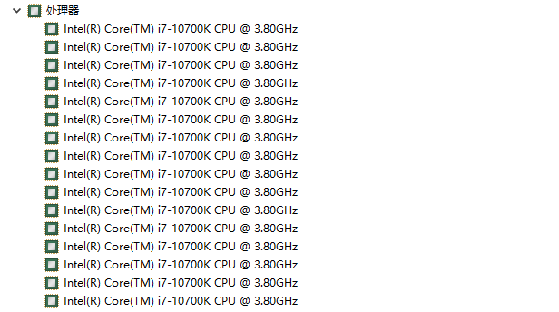
> > </div> 
>
> 在没有线程Thread这个概念之前，进程Process是CPU调度的基本单位；但是有了线程Thread概念后，线程Thread就成了CPU调度的基本单位； 严格来说，内核级线程才是CPU调度的基本单位
>
> 资源分配的基本单位依然是进程Process
> 
> 8核16线程的10700k，就相当于是同一时刻，有16个CPU调度16个线程？
> 
> 8个CPU核心，模拟出来16个CPU？
> 
> </font>
> 


## 第 1 章 计算机系统概述


### 1.1 操作系统的基本概念

#### 1.1.1 操作系统的概念、功能和目标（系统资源的管理者、提供接口、作为扩充机器、虚拟机）

> 
> https://blog.csdn.net/weixin_43914604/article/details/104408571
>
> **<font color="pink" size = 5>1. 熟悉的操作系统举例</font>**
>  
> > <div align=center>
> > 
> > </div> 
> 
> 
> **<font color="pink" size = 5>2. 操作系统的层次结构</font>**
>  
> > <div align=center>
> > 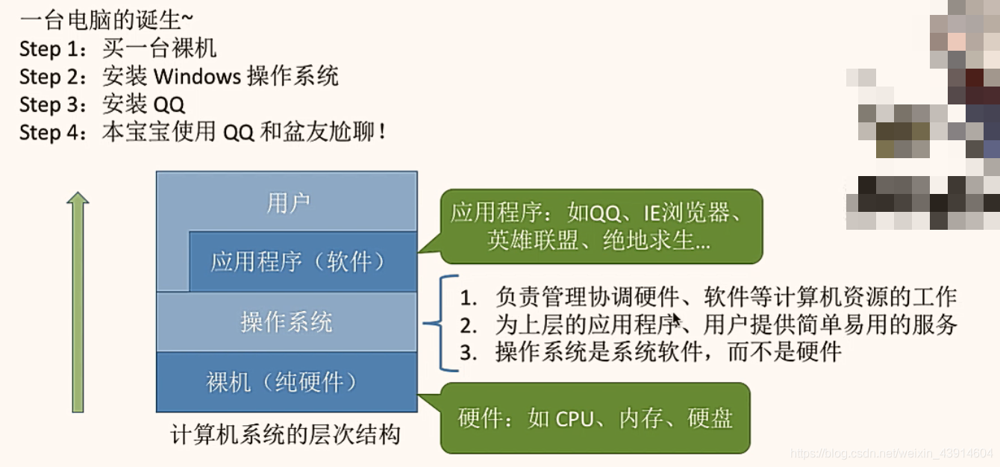
> > </div> 
> 
> 
> **<font color="pink" size = 5>3. 操作系统的概念</font>**
> 
> > * 是系统最基本最核心的软件，属于系统软件
> > * 控制和管理整个计算机的硬件和软件资源
> > * 合理的组织、调度计算机的工作与资源的分配
> > * 为用户和其它软件提供方便的接口和环境
> > 
> > <div align=center>
> > 
> > </div> 
> 
> 
> 
> **<font color="pink" size = 5>4. 操作系统的功能和目标</font>**
> 
> > <div align=center>
> > 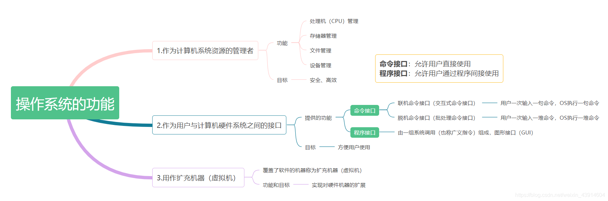
> > </div> 
> > 
> > 用一个直观的例子来理解上述图中操作系统的功能：
> > 
> > * 我们假设：用户是雇主，操作系统是工人（用来操作机器），计算机是机器（由处理机(CPU)、存储器、设备、文件几个部件构成）
> > * 工人有熟练的技能去控制和协调各个部件的工作，这就是操作系统对资源的管理
> > * 同时，工人必须接受雇主的命令，这就是“接口”
> > * 有了工人，机器就能发挥更大的作用，因此工人就成了“扩充机器”
> > * 工人操作机器、机器有了更大的作用比如GUI界面，于是工人便成了扩充机器，去扩充GUI界面等功能
> > 
> 
> 
> <font color="pink">4.1. 作为计算机系统资源的管理者</font>
> 
> > * 管理软硬件资源、合理的组织、调度计算机的工作与资源的分配
> > 
> > <div align=center>
> > 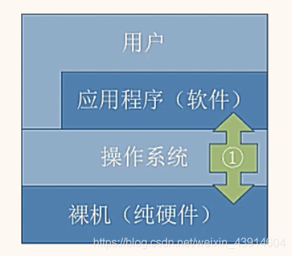
> > </div> 
> > 
>
> 
> `1. 处理器（CPU）管理`
> > 
> > * 在多道程序环境下，<font color="gree">`CPU`的分配和运行都以`进程Procss`（或`线程Thread`）为基本单位</font>，因此<font color="yellow">对`CPU`的管理可理解为对进程的管理</font>。
> > 
> > * <font color="gree">进程管理的主要功能包括`进程控制`、`进程同步`、`进程通信`、`死锁处理`、`处理机（CPU）调度`等</font>。附上一张图理解对进程的管理。
> > 
> > <div align=center>
> > 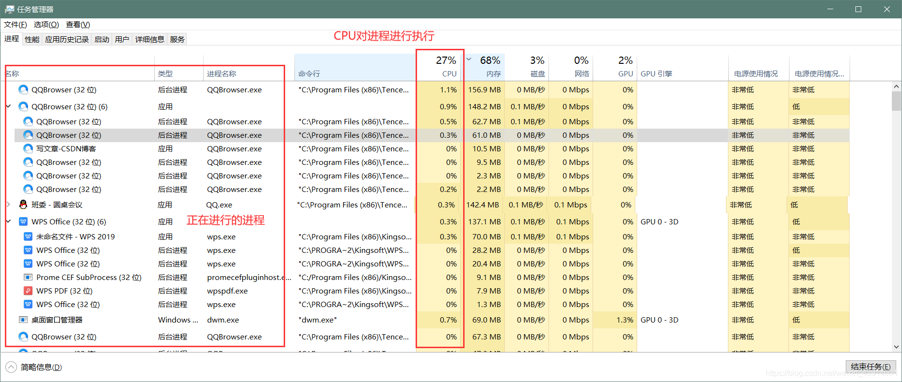
> > </div> 
> > 
>
> 
> `2. 存储器管理`
> > 
> > * 为多道程序的运行提供良好的环境，方便用户使用及提高内存的利用率
> > 
> > * <font color="gree">存储器管理主要包括`内存分配与回收`、`地址映射`、`内存保护与共享`、`内存扩充`等功能</font>。
> > 
> > <div align=center>
> > 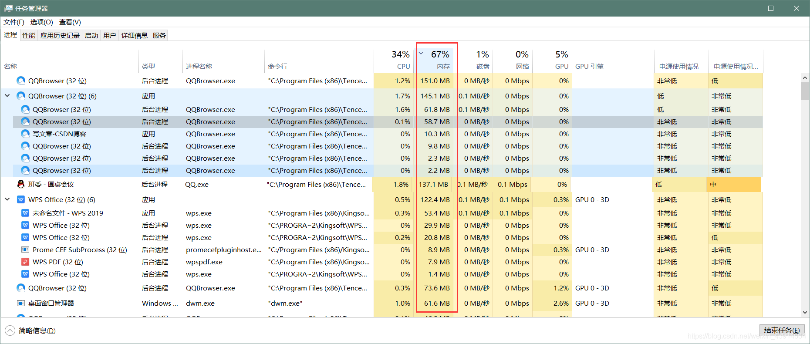
> > </div> 
> > 
>
> 
> `3. 文件管理`
> > 
> > * `计算机中所有的信息都是以文件的形式存在的`，操作系统中`负责文件的管理`的部分称为`文件系统`，
> > 
> > * <font color="gree">文件管理包括`文件存储空间的管理`、`目录管理`、`文件读写管理和保护`等</font>
> > 
> > <div align=center>
> > 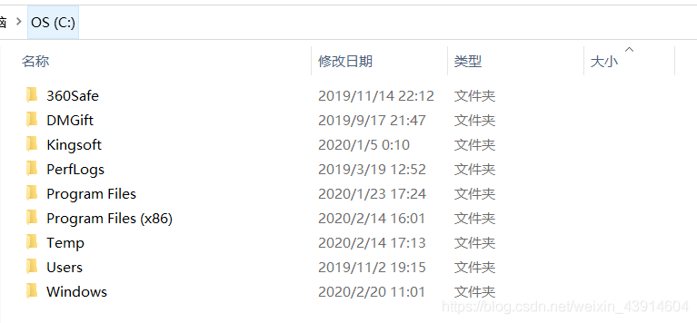
> > </div> 
> > 
>
> 
> `4. 设备管理`
> > 
> > * 设备管理的主要任务是完成用户的I/O请求，方便用户使用各种设备，并提高设备的利用率
> > 
> > * <font color="gree">设备管理包括`缓存管理`、`设备分配`、`设备处理`、`虚拟设备`等</font>
> > 
> > <div align=center>
> > 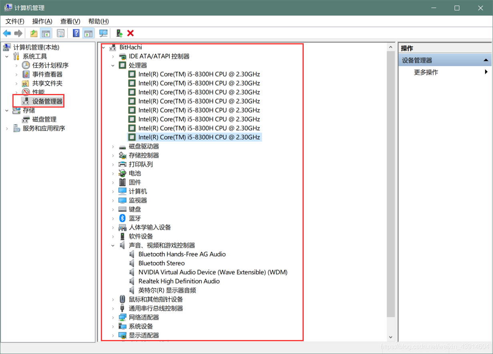
> > </div> 
> > 
> 
> 
> <font color="yellow">以上`4`种管理功能都由 "操作系统" 负责，"用户程序" 无须关注。</font>
> 
> 
> 
> 
> 
> <font color="pink">4.2. 作为用户与计算机硬件系统之间的接口</font>
>
> > * 为了让用户方便、快捷、可靠的操作计算机硬件并执行自己的程序，操作系统提供了用户接口
> > 
> > * <font color="gree">操作系统提供的接口分为两类：`命令接口`和`程序接口`</font>
> > 
> > * `命令接口`：`用户可以直接使用`的，利用这些操作命令来组织和控制作业的执行
> > * `程序接口`：`用户通过程序间接使用`的，编程人员可以使用它们来请求操作系统服务
> > 
> > <div align=center>
> > 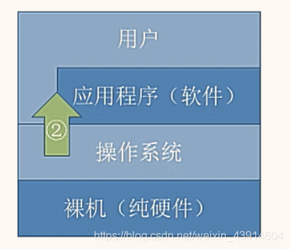
> > </div> 
> > 
>
> 
> `1. 命令接口`
> > 
> > * <font color="gree">命令接口分为两类：`联机命令接口（交互式命令接口）`和`脱机命令接口（批处理接口）`，用户可以直接调用</font>
> > 
> > * `联机命令接口`：又称`交互式命令接口`，适用于分时或实时系统的接口，由一组键盘操作命令组成。`用户输入一条指令，操作系统就执行一条指令`；
> > 
> > <div align=center>
> > 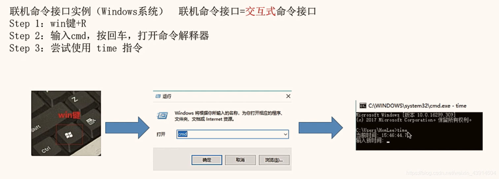
> > </div> 
> > 
> > * `脱机命令接口`：又称`批处理接口`，使用于批处理系统，由一组作业控制命令组成。`用户输入一堆指令，操作系统运行一堆指令。在操作系统运行这些命令时用户不可干预`。
> > > 
> > > `批处理(Batch)`，也称为批处理脚本。顾名思义，批处理就是对某对象进行批量的处理，通常被认为是一种简化的脚本语言，它应用于`DOS`和`Windows`系统中。批处理文件的扩展名为`.bat`。
> > > 
> > > <div align=center>
> > > 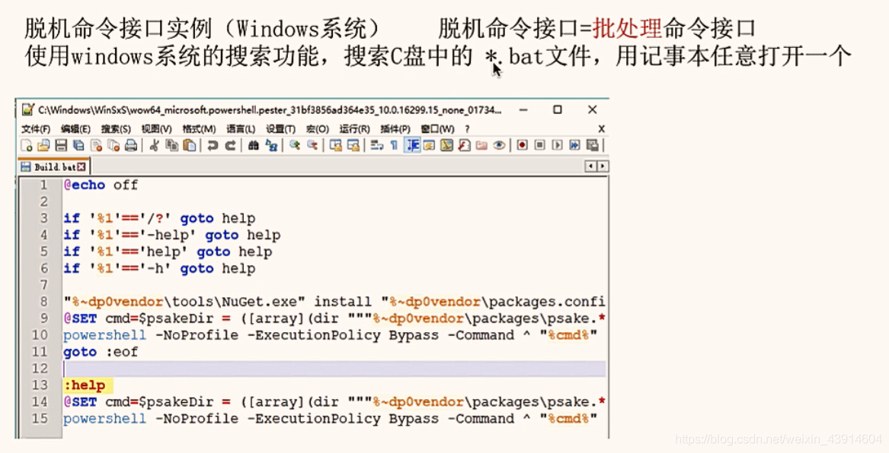
> > > </div> 
> > > 
> > > <font color="gree">类似于`Linux`中的`.sh`脚本</font>
> > > 
> > 
>
> 
> `2. 程序接口`
> > 
> > * `程序接口`：由一组系统调用（`也称广义指令`）组成
> > 
> > * 用户通过在程序中使用这些系统调用来请求操作系统为其提供服务，只能通过用户程序间接调用
> > 
> > * 如 `使用各种外部设备`、`申请分配`、`回收内存`及其它各种要求
> > > 
> > > <div align=center>
> > > 
> > > </div> 
> > > 
> > 
> > ```html
> > 动态链接库英文为DLL，是Dynamic Link Library的缩写。DLL是一个包含可由多个程序，同时使用的代码和数据的库。
> > ```
> > 
> > * 比如常见的图形用户界面程序接口`GUI（Graphical User Interface）`
> > > 
> > > <div align=center>
> > > 
> > > </div> 
> > > 
> > 
> > <div align=center>
> > 
> > </div> 
> > 
> 
> 
> 
> <font color="pink">4.3. 作为扩充机器（虚拟机）</font>
>
> > * `没有任何软件支持的计算机`称为`裸机`
> > 
> > <div align=center>
> > 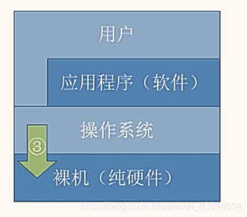
> > </div> 
> > 
> > * `覆盖了软件的机器`称为`扩充机器`或`虚拟机`
> > 
> > <div align=center>
> > 
> > </div> 
> > 
> 
> 


#### 1.1.2 操作系统的特征（并发、共享、虚拟、异步）

>
> https://blog.csdn.net/weixin_43914604/article/details/104416461
> 
> > 
> > * 操作系统是一种系统软件，但与其它系统软件和应用软件有很大的不同，它有自己的特殊性，及基本特征。
> > 
> > <div align=center>
> > 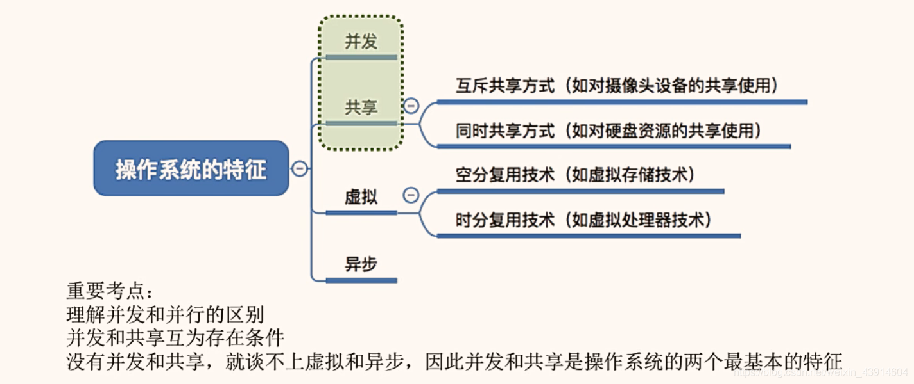
> > </div> 
> > 
> > <font color="pink">
> > 
> > 特征：`并发`、`共享`、`虚拟`、`异步`
> > 
> > 最基本特征：`并发`、`共享`（没有`并发`和`共享`，就没有`虚拟`和`异步`）
> > 
> > `并发`和`共享`互为存在条件
> >  
> > </font>
> > 
> 
>
> 
>
> **<font color="pink" size = 5>1. 并发</font>**
>  
> > 
> > <font color="yellow">理解并发和并行的区别</font>
> > 
> > * `并发`：两个或多个事件在`同一时间间隔内发生`，这些事件在`宏观上是同时发生`的，在`微观上是交替发生`的， 操作系统的`并发性指系统中同时存在着多个运行的程序`
> > 
> > * `并行`：两个或多个事件在`同一时刻发生`
> > 
> > * `一个CPU (单核CPU) 同一时刻只能执行一个程序`，因此`操作系统会协调多个程序使他们交替进行`（这些程序在`宏观上是同时发生的`，在`微观上是交替进行的`）
> > 
> > * 操作系统是伴随着 `"多道程序技术"` 出现的，因此`操作系统和并发是一同诞生的`
> > 
> > * 在如今的计算机中，一般都是`多核CPU`的，即在`同一时刻可以并行执行多个程序`，比如我的计算机是`8核`的，我的计算机可以`在同一时刻并行执行8个程序`，但是`事实上我们计算机执行的程序并不止8个，因此并发技术是必须存在的，并发性必不可少`。
> > 
> > <font color="yellow">例如，对于一个`8`核计算机（`8个CPU`），本质上同一时刻可以执行`8`个程序，但是由于有并发技术，宏观上看起来有`超过8个`程序同时运行，微观上还是只有`8个`程序同时运行。</font>
> > 
> > <font color="gree">即可以超过8个程序`并发 (宏观并行，微观串行)`，但是只能有8个程序`并行`</font>
> > 
> > <div align=center>
> > 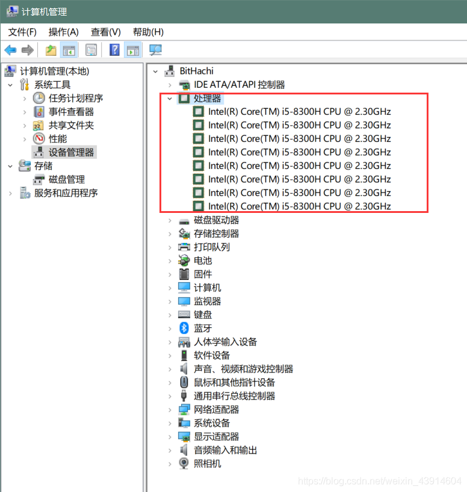
> > </div> 
> > 
>
> 
> 
>
> 
>
> **<font color="pink" size = 5>2. 共享</font>**
>  
> > 
> > * `资源共享`即`共享`，是指系统中的资源可以供`内存中多个并发执行的进程共同使用`
> > 
> > * <font color="yellow">共享分为两类：`互斥共享`和`同时共享`</font>
> > 
> > 
> 
> 
> 
> <font color="pink">2.1. 互斥共享</font>
> 
> > 
> > * 计算机中的某个资源在`一段时间内只能允许一个进程访问`，别的进程没有使用权
> > 
> > * `临界资源 (独占资源)`：在一段时间内只允许一个进程访问的资源，计算机中`大多数物理设备及某些软件中的栈、变量和表格都属于临界资源，它们被要求互斥共享`
> > 
> > * <font color="green">举个例子：比如QQ和微信视频。同一段时间内`摄像头`只能分配给其中一个进程</font>
> > 
> > 
> 
> 
> 
> <font color="pink">2.2. 同时共享</font>
> 
> > 
> > * 计算机中的某个资源在在`一段时间内可以同时允许多个进程访问`
> > 
> > * `同时共享`通常要求`一个请求分为几个时间片段间隔的完成，即交替进行，"分时共享"`; 但是也有一些不用分时间片，可以真正共享，例如扬声器
> > 
> > * 这里的同时指在`宏观上是同时`的，在`微观上是交替进行访问`的，只是`CPU`处理速度很快，我们感觉不到，在宏观上感觉是在同时进行
> > 
> > * <font color="green">举个例子：比如QQ在发送文件A，微信在发送文件B，宏观上两个进程A和B都在访问磁盘，在我们看来是同时进行的，但是在微观上两个进程A和B是交替进行访问磁盘的，只是时间太短，cpu处理速度太快，我们感觉不到。</font>
> > 
> > * <font color="gree">`注意`：有时候多个进程可能真的是在同时进行资源访问，比如玩游戏时可以放音乐，游戏声音和音乐声音都能听见</font>
> > 
> > * <font color="yellow">`大部分`的同时共享资源只是`并发`访问，`个别`的同时共享资源是`并行`访问</font>
> > 
>
> 
> <font color="pink">2.3. 并发性和共享性互为存在条件</font>
> > 
> > <div align=center>
> > 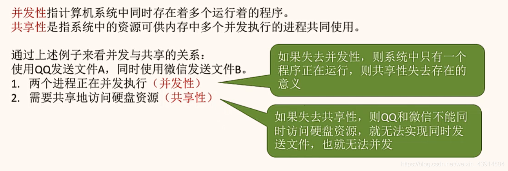
> > </div> 
> > 
>
> 
> 
>
> **<font color="pink" size = 5>3. 虚拟</font>**
> > 
> > ```html
> > 多道程序设计：是指在计算机内存中同时存放几道相互独立的程序，使它们在管理程序控制之下，相互穿插的运行。 
> > 两个或两个以上程序在计算机系统中同处于开始到结束之间的状态。
> > 这就称为多道程序设计。多道程序技术运行的特征：多道、宏观上并行、微观上串行。
> > ```
> > 
> > * `虚拟是把一个物理上的实体变为若干逻辑上的对应物`。
> > 
> > * 物理实体（前者）是实际存在的；而后者是虚的，是用户感觉上的事务
> > 
> > * 虚拟技术：用于实现虚拟的技术
> > 
> > * `虚拟处理器（CPU）`：通过多道程序设计技术，采用让多道程序并发执行的方法，分时来使用一个CPU，`实际物理上只有一个CPU，但是用户感觉到有多个CPU`
> > 
> > * `虚拟存储器`：从逻辑上扩充存储器容量（例如虚拟内存、虚拟显存），用户感觉到的但实际不存在的存储器
> > 
> > * `虚拟设备`：将一台物理设备虚拟为逻辑上的多台设备，使多个用户在同一时间段内访问同一台设备，即同时共享，用户宏观上感觉是同时的，但实际上是微观交替访问同一台设备的 
> > 
> > * 操作系统的`虚拟技术科归纳为`：
> > > 
> > > * `时分复用技术：如处理器的分时共享`
> > > 
> > > * `空间复用技术：如虚拟存储器`
> > > 
> > > <div align=center>
> > > 
> > > </div> 
> > >  
>
> 
> 
> 
>
> **<font color="pink" size = 5>4. 异步</font>**
> > 
> > * `异步`：多道程序环境允许`多个程序并发`执行，但由于资源有限，如`CPU`只有一个，`进程的执行并不是一贯到底的，而是走走停停的`，它以不可预知的速度向前推进。
> > 
> > * <font color="green">比如A进程正在占用CPU计算，B进程这时也想占用CPU计算，B进程只有等，等A进程算完了，A进程去访问磁盘资源了，这时B进程再占用CPU进行计算，B进程还没计算完，A进程从磁盘取出资源了，A进程发现B这时在占用CPU，这时A进程就需要等待，等B算完后再继续到CPU中进行计算。`由于每个进程占用资源的时间不固定，所以进程的执行以不可预知的速度前进`</font>
> > 
> > 
>
> 


### 1.2 操作系统的发展和分类

#### 1.2.1 操作系统的发展和分类（手工、单道/多道批处理、分时、实时、网络、分布式、嵌入式、个人计算机）

>
> https://blog.csdn.net/weixin_43914604/article/details/104445449
> 
>
> **<font color="pink" size = 5>1. 操作系统的分类及其特征优劣</font>**
> > 
> > <div align=center>
> > 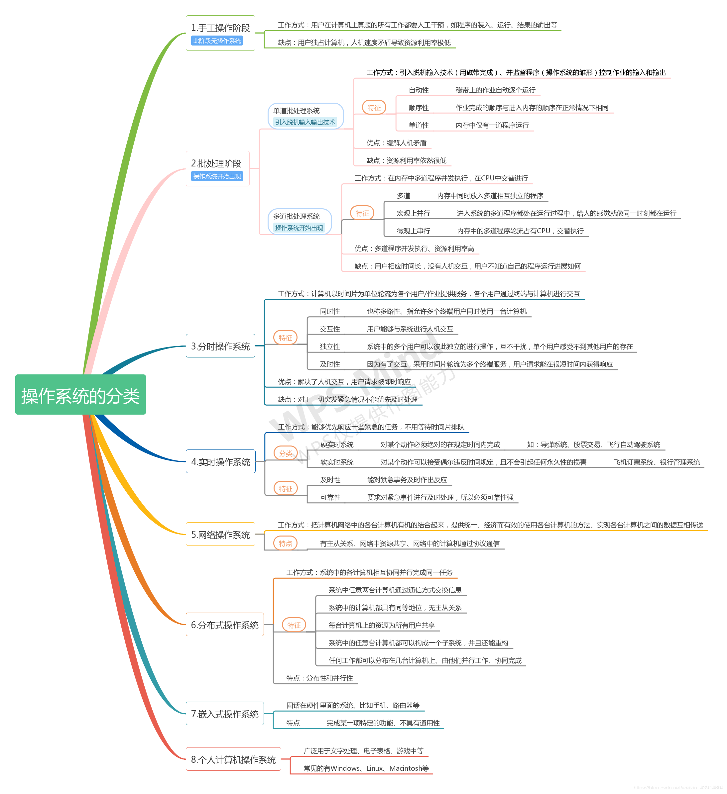
> > </div> 
> > 
> 
>
> **<font color="pink" size = 5>2. 操作系统的发展历程</font>**
> > 
> > <div align=center>
> > 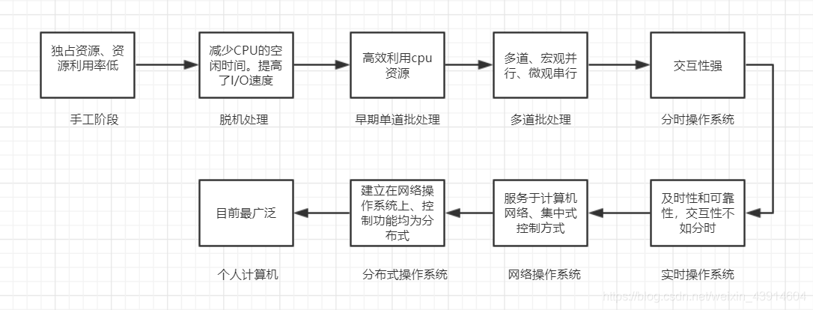
> > </div> 
> > 
> 
> 
> 


### 1.3 操作系统的运行机制和体系结构

#### 1.3.1 操作系统的运行机制和体系结构（大内核、小内核）

>
> https://blog.csdn.net/weixin_43914604/article/details/104452762
>


>
> **<font color="pink" size = 5>1. 操作系统的运行机制和体系结构</font>**
> 
> > <div align=center>
> > 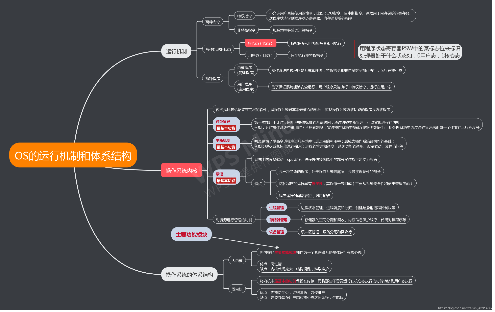
> > </div> 
> 
> 
> 
> <font color="pink">1.1. 运行机制</font>
>
> 
> `1. 两种命令`
> > 
> > 在一个系统中既有操作系统的程序，也由普通用户的程序。众多的指令中，有些指令只能由系统来使用，禁止用户程序去直接访问。为了保证操作系统和各个应用程序能够顺利运行，就必须对它们进行限制，否则的话就无法保证系统的安全性和稳定性。
> > 
> > * `特权指令`：`不允许用户直接使用的命令`。比如：I/O指令、置中断指令、存取用于内存保存的寄存器、送程序状态字到程序状态寄存器、内存清零等指令
> > 
> > * `非特权指令`：加减乘除等`普通运算指令`
> > 
> 
> `2. 两种处理器状态`
> > 
> > https://blog.csdn.net/weixin_43557723/article/details/109960725
> > 
> > 根据运行程序对资源和机器指令的使用权限，把处理器设置为不同的状态
> > 
> > * `核心态（管态）`：特权指令和非特权指令都可以执行。又叫内核态、系统态、特权态。
> > > <font color="gree">注： `trap`陷入指令是唯一一个只能在用户态执行，而不可在核心态执行的指令, 所以`trap陷入指令` 是 非特权指令。 `访管指令（又叫陷入指令、trap指令）` </font>
> > > 
> > > `核心态`是操作系统`内核所运行的模式`，是`操作系统的管理程序运行时的状态`。运行在该模式的代码，可以无限制地对系统存储、外部设备进行访问，并且具有改变处理器状态的能力。
> > > 
> > > `管态和超级用户的区别`：前者是指`CPU`的状态，后者是指一种特殊的计算机用户；前者主要是从硬件的角度去执行任何指令，而后者是从软件的角度来管理系统的软硬件资源，如用户账户、权限管理、文件访问等。`超级用户执行的程序不一定运行在管态，而管态程序也不一定由系统管理员启动，普通用户也可以启动。`
> > 
> > 
> > 
> > * `用户态（目态）`：只能执行非特权指令。又叫普通态
> > > 
> > > 核心态是操作系统内核所运行的模式，是操作系统的管理程序运行时的状态。运行在该模式的代码，可以无限制地对系统存储、外部设备进行访问。
> > > 
> > > `用户态是用户程序运行时的状态`，它具有较低的特权级别。在这种状态下不能使用特权指令，不能直接使用系统资源，也不能改变CPU的工作状态，并且`只能访问这个用户程序自己的存储空间`。
> > > 
> > > 用户态不允许程序进行处理器中要求特权态的操作，以避免操作系统崩溃。`每个进程都在各自的用户空间中运行，而不允许存取其他程序的用户空间。`
> > > 
> > 
> > * `总结：`
> > > 
> > > * 在内核态下`CPU`可执行任何指令，在用户态下`CPU`只能执行非特权指令。
> > > 
> > > * 当`CPU`处于内核态，可以随意进入用户态；而当`CPU`处于用户态时，用户从用户态切换到内核态只有在系统调用时才发生，一般程序一开始都是运行于用户态，当程序需要使用系统资源时，就必须通过软中断机制进入内核态。
> > > 
> > > * `两种CPU状态之间的转换方式`：
> > > > 
> > > > * `用户态—>内核态：系统调用（中断机制）` 例如： 访管指令、缺页、整数除以0
> > > > * `内核态—>用户态：设置程序状态字PSW。`
> > > > 用程序状态寄存器PSW中的某标志位来标识处理器处于什么状态，如：0是用户态，1是核心态。
> > > > 
> > > 
> 
>
> 
> `3. 两种程序`
> > 
> > * `内核程序（管理程序）`: 操作系统内核程序是系统管理者，特权指令和非特权指令都可执行，运行在核心态。
> > 
> > * `用户程序（应用程序）`: 为了保证系统能够安全运行，用户程序只能执行非特权指令，运行在用户态。
> >  
> 
> 
> 
> 
> 
> 
> <font color="pink">1.2. 操作系统内核</font>
> 
> > * `内核`是计算机配置在底层的软件，是操作系统最基本最核心的部分；
> > 
> > * 实现操作系统内核功能的程序是`内核程序`
> > 
> > * 内核的`3个最基本功能`：`时钟管理`、`中断机制`、`原语`
> > 
> > * 内核的`5大功能`：`对资源进行管理`（`进程管理`、`内存管理`、`设备管理`、`文件系统管理`、`网络管理`）
>
> 
> 
> `1. 时钟管理`
> > 
> > * 第一功能用于计时；
> > 
> > * 向用户提供标准的系统时间；
> > 
> > * 通过时钟中断管理，可以实现进程的切换
> > 
> > 例如：分时操作系统中采用时间片轮转制度；实时操作系统中按截止时间控制运行；批处理系统中通过时钟管理来衡量一个作业的运行程序等
> >  
> 
>
> 
> `2. 中断机制`
> > 
> > * 初衷是为了提高多道程序运行环境中汇总CPU的利用率；
> > 
> > * 后成为操作系统操作的基础；
> > 
> > 例如：键盘或鼠标信息的输入；进程的管理和调度；系统功能的调用；设备驱动；文件访问等
> > 
> 
>
> 
> `3. 原语`
> > 
> > * 系统中的设备驱动、CPU切换、进程通信等功能中的部分操作都可定义为`原语`
> > 
> > * 特点如下：
> > > 
> > > * 是一种特殊的程序，处于操作系统最底层，是最接近硬件的部分
> > > 
> > > * 这种程序的运行具有`原子性`，其操作一气呵成，执行期间不允许中断（主要从系统安全性和便于管理考虑）
> > > > ```html
> > > > 原子(性)操作：不可以被中断
> > > > ``` 
> > > 
> > > 
> > > * 程序运行时间都较短，调用频繁
> > 
> 
> 
> `4. 对资源进行管理的5大功能`
> > 
> > * `进程管理`：`进程状态管理`、`进程调度和分派`、`创建与撤销进程控制块`等
> > >  
> > > Linux内核负责进程创建和销毁，并完成进程之间的通信，以及进程的输入和输出；
> > >  
> > > 而且，进程管理控制了多个进程对Soc上的一个或者多个CPU资源的使用。  
> >
> >
> > * `内存管理`：`存储器的空间分配和挥手`、`内存信息保护程序`、`代码对换程序`等
> > >  
> > > 内存资源的使用策略对操作系统性能体现来说，尤为重要。
> > >  
> > > 内存在有限的内存资源上，为每一个进程建立了一个虚拟地址空间。
> > >  
> > > 内核的不同功能部分与内存管理子系统通过一套函数调用交互，使得通信高效简单。 
> > >  
> > 
> > * `文件系统管理`：
> > >  
> > >  `Linux`在很大程度上基于文件系统的概念; `几乎 Linux中的任何东西都可看作一个文件`. 内核在非结构化的硬件之上建立了一个结构化的文件系统, 结果是文件的抽象非常多地在整个系统中应用. 另外, `Linux` 支持多个文件系统类型, 就是说, 物理介质上不同的数据组织方式. 例如, 磁盘可被格式化成标准 `Linux` 的 `ext4`文件系统, 普遍使用的 `FAT` 文件系统, 或者其他几个文件系统.
> > > 
> >  
> > * `I/O设备管理`：`缓冲区管理`、`设备分配和回收`等
> > >  
> > >  几乎任何一个操作系统最终都运行在一个物理平台上，内核中包含访问平台上硬件设备的驱动代码。
> > >  
> > 
> > * `网络管理`
> > > 
> > > 大部分网络操作不会关联具体的进程，因为数据包的传输是异步事件。应用程序访问数据包之前，内核完成数据包的收集、标识和分发等任务。
> > > 
> > > 网络必须由操作系统来管理, 因为大部分网络操作不是特定于某一个进程: 进入系统的报文是异步事件. 报文在某一个进程接手之前必须被收集, 识别, 分发. 系统负责在程序和网络接口之间递送数据报文, 它必须根据程序的网络活动来控制程序的执行. 另外, 所有的路由和地址解析问题都在内核中实现. 
> > > 
> 
> 
> 
> 
> <font color="pink">1.3. 体系结构</font>
> 
> 
> `1. 大内核`
> > 
> > * 将内核的主要功能模块都作为一个紧密联系的整体运行在核心态
> > 
> > * 优点：高性能； 
> > 
> > * 缺点：内核代码庞大，结构混乱，难以维护
> 
> 
> `2. 微内核`
> > 
> > * 将内核中最基本的功能保留在内核，而将那些不需要运行在核心态执行的功能转移到用户态执行
> > 
> > * 优点：内核功能少，结构清晰，方便维护
> > 
> > * 缺点：需要频繁在用户态和核心态之间切换，性能低
> 
> 
> 
> 


> 
>
> **<font color="pink" size = 5>2. 操作系统内核在计算机系统中的层次结构</font>**
> 
> > <div align=center>
> > 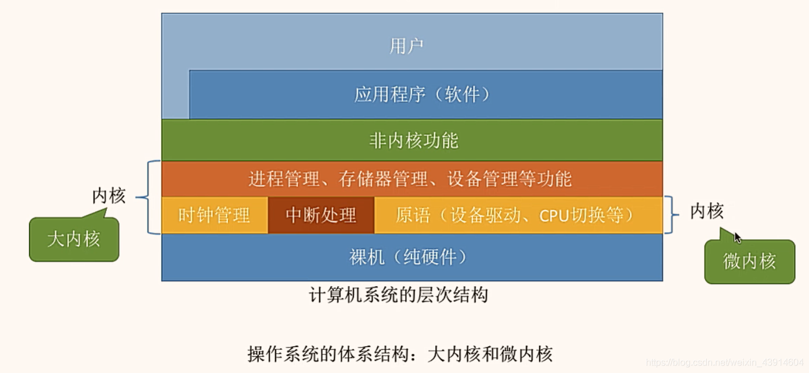
> > </div> 
> 
> 
> 


> 
>
> **<font color="pink" size = 5>3. 操作系统体系结构类比</font>**
> 
> > <div align=center>
> > 
> > </div> 
> 
> 
> 


> 
>
> **<font color="pink" size = 5>4. 操作系统用户态和核心态的转换</font>**
> 
> > <div align=center>
> > 
> > </div> 
> 
> 
> 


#### 1.3.2 中断和异常（内中断和外中断、中断处理过程）

>
> https://blog.csdn.net/weixin_43914604/article/details/104462974
> 
> 
> > <div align=center>
> > 
> > </div> 
> 
> 

>
> **<font color="pink" size = 5>1. 中断机制的诞生</font>**
>
> * 为了实现多道程序并发执行的一种技术，为了提高资源利用率
>
> 
> 


>
> **<font color="pink" size = 5>2. 中断的概念与作用</font>**
> 
> 
> <font color="pink">2.1. 概念</font>
>
> * 发生中断，就意味着需要操作系统介入开展管理工作，CPU会立即进入核心态
> 
> <font color="pink">2.2. 作用</font>
>
> * "中断" 是CPU从用户态进入核心态的`唯一途径 `
>
> 
>


>
> **<font color="pink" size = 5>3. 中断的分类</font>**
> 
> 
> <font color="pink">3.1. 内中断（也称异常、例外、陷入）</font>
> 
> 信号来源于CPU内部，与当前执行的指令有关
>
> * 分类方法一： 
> > 
> > 1. 自愿中断：
> > > 
> > > * 指令中断： 如 用户程序中想要调用操作系统功能时, 就使用的`访管指令（又叫陷入指令、trap指令）`
> > > 
> > 
> > 2. 强迫中断：
> > 
> > > * 硬件故障： 如 `缺页`
> > > 
> > > * 软件中断： 如 整数除以0
> > 
> 
>
> * 分类方法二： 
> > 
> > 1. 陷阱、陷入（trap）: `有意而为之`的异常，如`系统调用`
> > 
> > 2. 故障（fault）: 由`错误条件`引起的，可能被故障处理程序修复，如缺页
> > 
> > > 
> > > 缺页是什么？https://blog.51cto.com/u_15076236/3846340
> > > 
> >
> > 3. 终止（abort）：不可恢复的致命错误造成的结果，终止处理程序不再将控制返回给引发终止的应用程序，如整数除以0
> > 
> 
> 
> <font color="pink">3.2. 外中断（也称中断）</font>
> 
> 信号来源于CPU外部，与当前执行的指令无关
>
> * 外设要求
> > 
> > 如：`I/O操作完成发出的中断信号`
> > 
>
> * 人工干预
> > 
> > 如：用户强行终止一个进程
> > 
> 
> 


>
> **<font color="pink" size = 5>4. 外中断的处理过程</font>**
> 
> > <div align=center>
> > 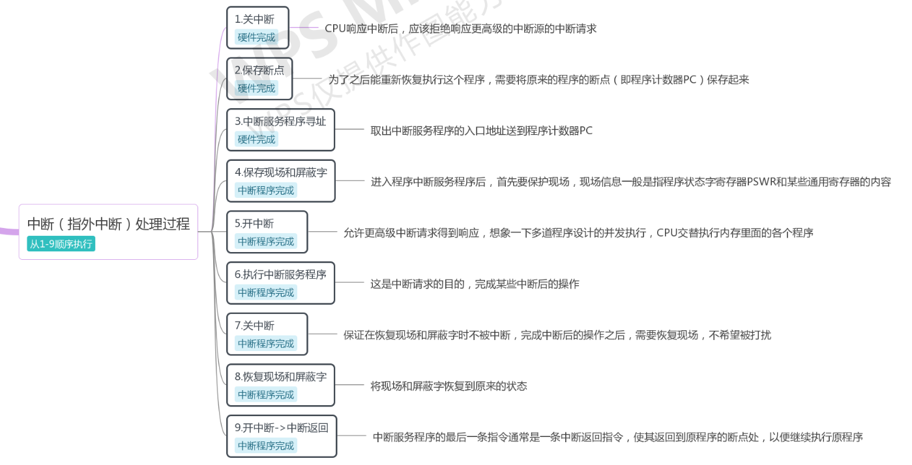
> > </div> 
> 
> 
> 
> 


#### 1.3.3 系统调用（执行过程、访管指令、库函数与系统调用）

>
> https://blog.csdn.net/weixin_43914604/article/details/104464558
> 

>
> **<font color="pink" size = 5>1. 系统调用知识框架图</font>**
> 
> > <div align=center>
> > 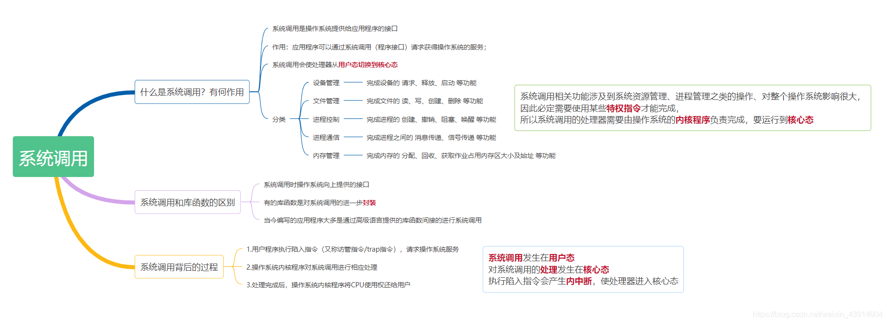
> > </div> 
> 
> 
> <font color="pink">1.1. 什么是系统调用？有何作用？</font>
>
> * 系统调用是`操作系统提供给应用程序的接口`
>
> * 作用：应用程序可以通过系统调用（程序接口）请求获得操作系统的服务
>
> * `系统调用`, 会`触发中断`, 使CPU（处理器）从`用户态切换到核心态`
>
> * 系统调用相关功能涉及到系统资源管理、进程管理之类的操作，对整个操作系统影响很大，因此必定需要使用某些`特权指令`才能完成。所以系统调用的处理器需要由操作系统的`内核程序`负责完成，要运行到`核心态`
>
> * `系统调用的触发 发生在 用户态`，`对系统调用的处理 发生在 核心态`。执行陷入指令会产生`内中断`，使处理器进入`核心态`
>  
> * 分类
> > 
> > * `进程管理`：
> > > 
> > > * `进程控制`：完成进程的 `创建`、`撤销`、`阻塞`、`唤醒` 等功能
> > > 
> > > * `进程通信`：完成进程之间的 `消息传递`、`信号传递` 等功能
> > > 
> > 
> > 
> > * `内存管理`：完成内存的 `分配`、`回收`、`获取作业占用内存区大小及始址` 等功能
> > 
> > 
> > * `文件管理`：完成文件的 `读`、`写`、`创建`、`删除` 等功能
> > 
> > 
> > * `设备管理`：完成设备的 `请求`、`释放`、`启动` 等功能
> 
> 
> <font color="pink">1.2 系统调用和库函数的区别</font>
> 
> * 系统调用 是 操作系统向上提供的接口
>
> * 有的库函数 是 对系统调用的进一步封装
> 
> * 当今编写的应用程序大多是通过高级语言提供的库函数间接地进行系统调用
>
> 
> 
> <font color="pink">1.3 系统调用背后的过程</font>
>
> * 用户程序执行`陷入指令`（又称`访管指令`/`trap指令`）， 请求操作系统服务
>
> * 操作系统内核程序对系统调用进行相应处理
>
> * 处理完成后，操作系统内核程序将CPU使用权还给用户
>
> <font color="gree">`trap`陷入指令是唯一一个只能在用户态执行，而不可在核心态执行的指令</font>
> 
> 
> 


>
> **<font color="pink" size = 5>2. 系统调用的执行过程</font>**
> 
> > <div align=center>
> > 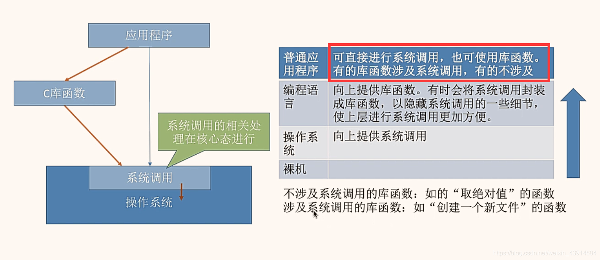
> > </div> 
> 
> 


>
> **<font color="pink" size = 5>3. 系统调用和库函数的区别</font>**
> 
> > <div align=center>
> > 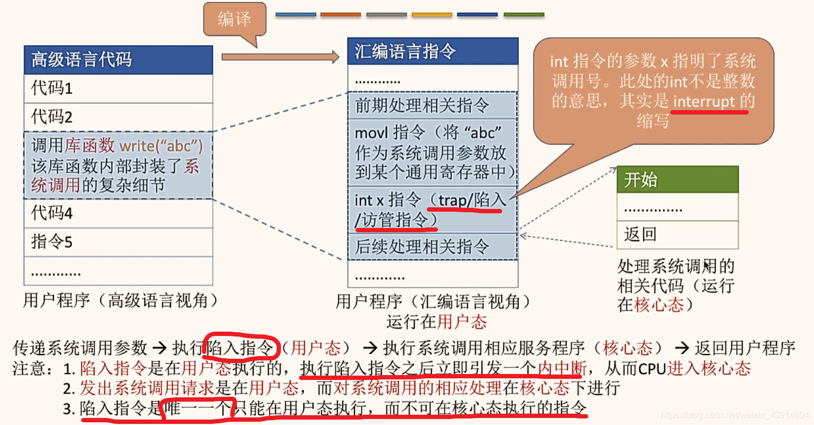
> > </div> 
> 
> 


### 第一章操作系统概述错题整理

>
> https://blog.csdn.net/weixin_43914604/article/details/104480486
>
> 
> 
> > <div align=center>
> > 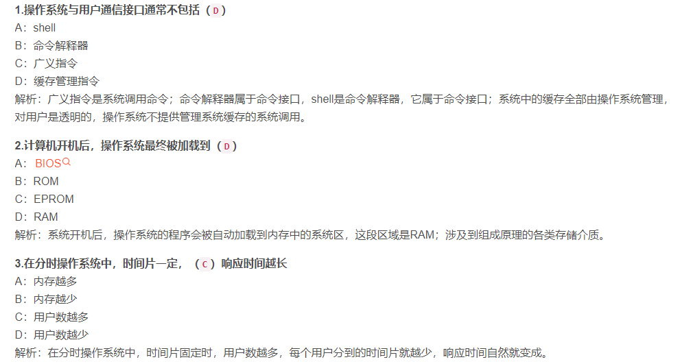
> > 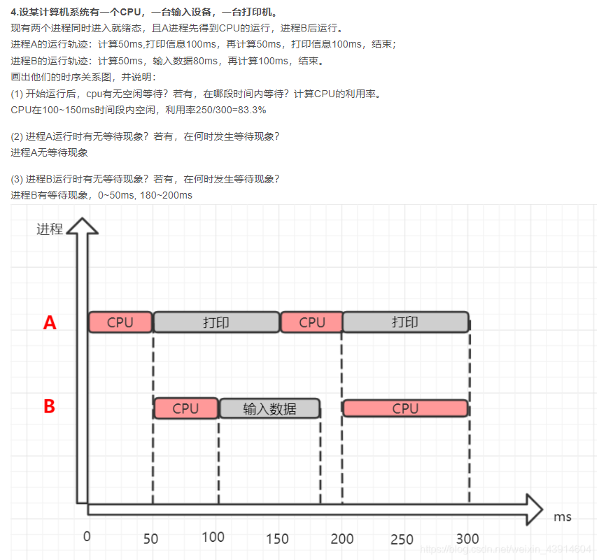
> > 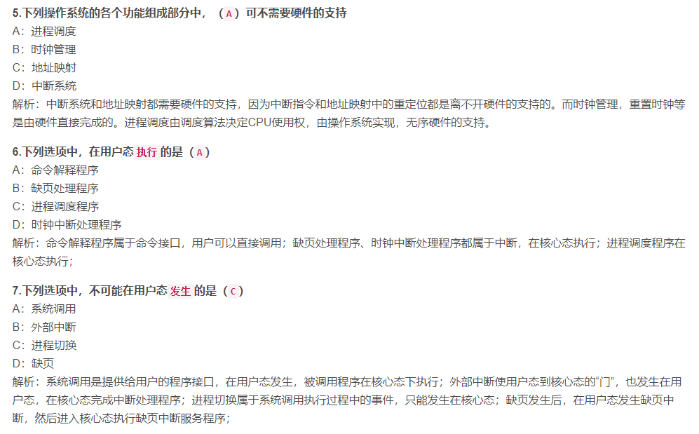 
> > 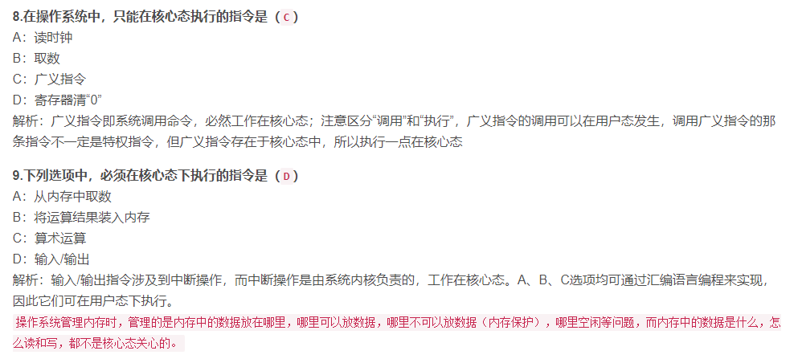 
> > 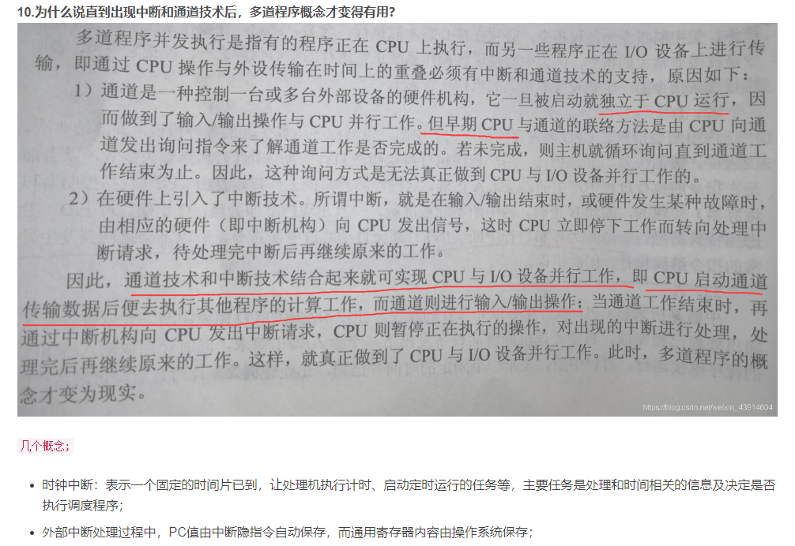 
> > </div> 
>
> 
> 


## 第 2 章 进程管理


### 2.1 进程与线程

#### 2.1.1 进程的定义、特征、组成、组织

>
> https://blog.csdn.net/weixin_43914604/article/details/104758221
> 


>
> **<font color="pink" size = 5>1. 进程的定义</font>**
>
> 
> <font color="pink">1.1. 程序的概念</font>
> 
> 
> > <div align=center>
> > 
> > </div> 
>
> 
> <font color="pink">1.2. 进程的概念</font>
> 
> 
> > <div align=center>
> > 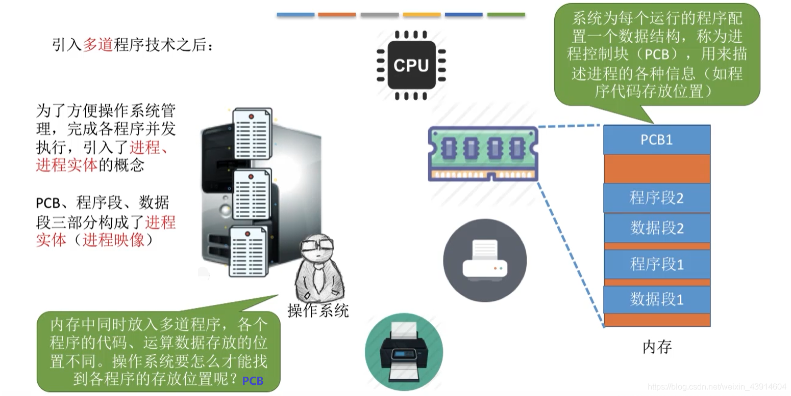
> > </div> 
>
> 
> `进程实体（进程映像）`：进程控制块（PCB）、程序段、数据段.
> > 
> > 是计算机中的程序关于某数据集合上的一次运行活动，是系统进行资源分配的基本单位。
> > 
>
> `进程控制块（PCB）`: 是操作系统核心中一种数据结构，主要表示进程状态。`描述进程的各种信息（如程序代码存放位置）, 包含了操作系统对进程进行管理所需的各种信息。` 例如`进程状态、程序计数器、存储器管理、输入输出状态等`
>
> 
> * <font color="gree">进程和程序的区别和联系：</font>
> 
> > ```c++
> > 区别：
> > (1) 进程是动态的;程序是静态的。
> > (2) 进程有独立性，能并发执行;程序不能并发执行。
> > (3) 二者无一一对应关系。
> > (4) 进程异步运行，会相互制约; 程序不具备此特征。
> > (5) 组成不同。进程包含PCB、程序段、数据段; 程序包含数据和指令代码。
> > (6) 程序是一个包含了所有指令和数据的静态实体。本身除占用磁盘的存储空间外，并不占用系统如CPU、内存等运行资源。
> > (7) 进程由程序段、数据段和PCB构成,会占用系统如CPU、内存等运行资源。
> > (8) 一个程序可以启动多个进程来共同完成。
> > 
> > 联系：
> > (1) 进程不能脱离具体程序而虚设， 程序规定了相应进程所要完成的动作。
> > ```
> 
> 
> 
> <font color="pink">1.3. 进程的定义</font>
> 
> > <div align=center>
> > 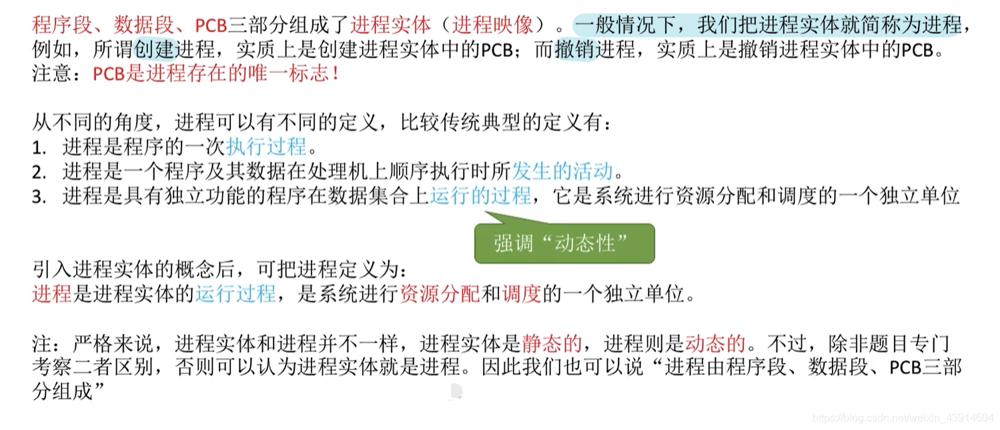
> > </div> 
> 
> `进程实体（进程映像）`：进程控制块（PCB）、程序段、数据段.
>
> 其实，`进程`可以有`多种定义方式`
> 
> > ```html
> > 定义1：进程是程序的一次执行过程
> > 定义2：进程是一个程序及其数据在处理器上顺序执行时所发生的活动
> > 定义3：进程是具有独立功能的程序在数据集合上运行的过程，它是系统进行资源分配和调度的一个独立单位
> > ```
>
> 引入进程实体的概念后，可以把进程定义为：
> 
> ```html
> 进程 是进程实体的运行过程，是系统进行资源分配和调度的一个基本单位
> ```
> 
> `PCB是进程存在的唯一标志`
> 
> > ```html
> > 创建进程：实质上是创建进程实体中的PCB
> > 
> > 撤销进程：实质上是撤销进程实体中的PCB
> > ```
>
>
> 严格来说，进程实体和进程并不一样，`进程实体是静态的，进程则是动态的`。
>
> <font color="pink">不过，除非题目专门考察二者的区别，否则可以认为`进程实体`就是`进程`。</font>
>
> <font color="pink">因此我们也可以说 "进程由程序段、数据段、PCB三部分组成"</font>
>
> 
> 
> 


>
> **<font color="pink" size = 5>2. 进程的特征</font>**
> 
> > <div align=center>
> > 
> > </div> 
> 
> `进程同步机制是什么？内容在第几节`
>
> 


>
> **<font color="pink" size = 5>3. 进程的组成</font>**
> 
> > <div align=center>
> > 
> > </div> 
>
> * `进程控制块（PCB）`: 是操作系统核心中一种数据结构，主要表示进程状态。`描述进程的各种信息（如程序代码存放位置）, 包含了操作系统对进程进行管理所需的各种信息。`
> > 也可以说`PCB`是进程的管理者（操作系统），操作系统管理进程所需的数据都在`PCB`中。
> 
> * `程序段`：就是一堆代码
>
> * `数据段`：程序本身运行时使用、产生的运算数据。包括`全局变量`、`局部变量`、`宏定义的常量`等
>
> 
> 
> 其中最重要的就是`进程控制块PCB（Process Control Block）`
> 
> * <font color="yellow">PCB简介：</font>
> > 
> > `PCB`中记录了操作系统所需的，用于描述进程的当前情况以及控制进程运行的全部信息。 例如`进程状态、程序计数器、存储器管理、输入输出状态等`
> > 
> > PCB的作用是使一个在多道程序环境下不能独立运行的程序（含数据），成为一个能独立运行的基本单位，一个能与其他进程并发执行的进程。
> > 
> > 或者说，`操作系统（OS）是根据PCB来对并发执行的进程进行控制和管理的。`
> > 
> > <font color="gree">例如，当`OS`要调度某进程执行时，要从该进程的`PCB`中查处其现行状态及优先级；在调度到某进程后，要根据其`PCB`中所保存的处理机状态信息，设置该进程恢复运行的现场，并根据其`PCB`中的程序和数据的`内存始址`，找到其程序和数据；</font>
> > 
> > 进程在执行过程中，当需要和与之合作的进程实现同步，通信或者访问文件时，也都需要访问`PCB`；
> > 
> > 当进程由于某种原因而暂停执行时，又须将器断点的处理机环境保存在`PCB`中。
> > 
> > <font color="gree">可见，在进程的整个生命期中，系统总是通过`PCB`对进程进行控制的，即系统是根据进程的`PCB`而不是任何别的什么而感知到该进程的存在的。</font>
> > 
> > <font color="yellow">所以说，`PCB`是进程存在的唯一标志。</font>
> > 
> > `PCB通常包含的内容：`
> > 
> > <div align=center>
> > 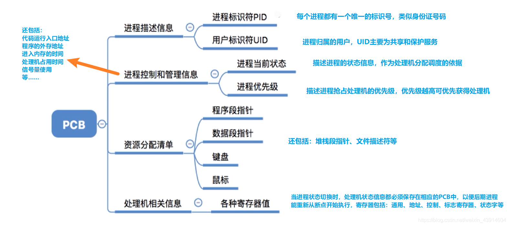
> > </div> 
> > 
> 
> 
> 
> 
> 


>
> **<font color="pink" size = 5>4. 进程的组织</font>**
> 
> > <div align=center>
> > 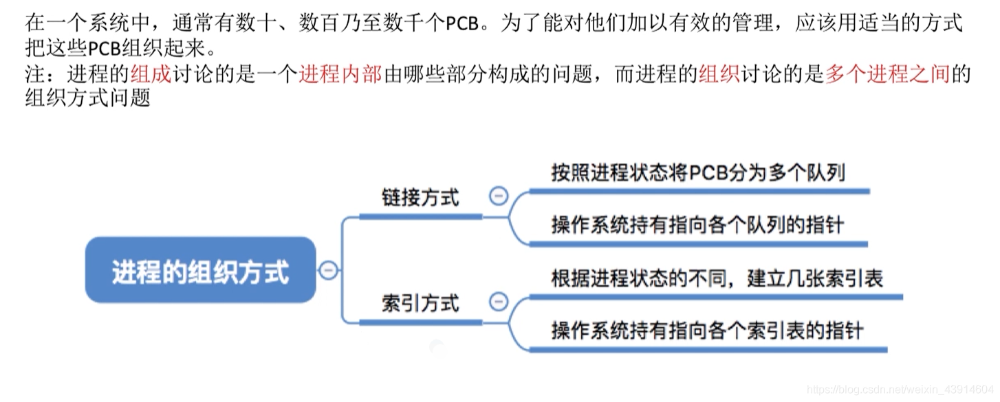
> > </div> 
> 
> 在`三态模型`中，进程状态分为三个基本状态，即`运行态`，`就绪态`，`阻塞态`。
> 
> 在`五态模型`中，进程分为`创建态`、`终止态`，`运行态`，`就绪态`，`阻塞态`。
> 
> ```c++
> （1）运行(running)态：进程占有处理器正在运行。
> （2）就绪(ready)态：进程具备运行条件，等待系统分配处理器以便运行。
> （3）阻塞(blocked)态：又称为等待(wait)态或睡眠(sleep)态，指进程不具备运行条件，正在等待某个事件的完成。
> ```
> 
> 
> 
> <font color="pink">4.1. 链接方式</font>
> 
> > <div align=center>
> > 
> > </div> 
> 
> 
> 
> <font color="pink">4.2. 索引方式</font>
> 
> > <div align=center>
> > 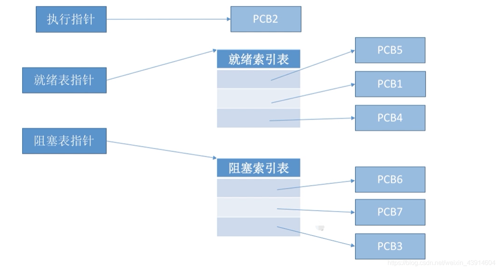
> > </div> 
> 
> 
> 
> 
> 


#### 2.1.2 进程的状态（运行、就绪、阻塞、创建、终止）及转换（就绪->运行、运行->就绪、运行->阻塞、阻塞->就绪）

>
> https://blog.csdn.net/weixin_43914604/article/details/104819326
> 


>
> **<font color="pink" size = 5>思维导图总览</font>**
> 
> > <div align=center>
> > 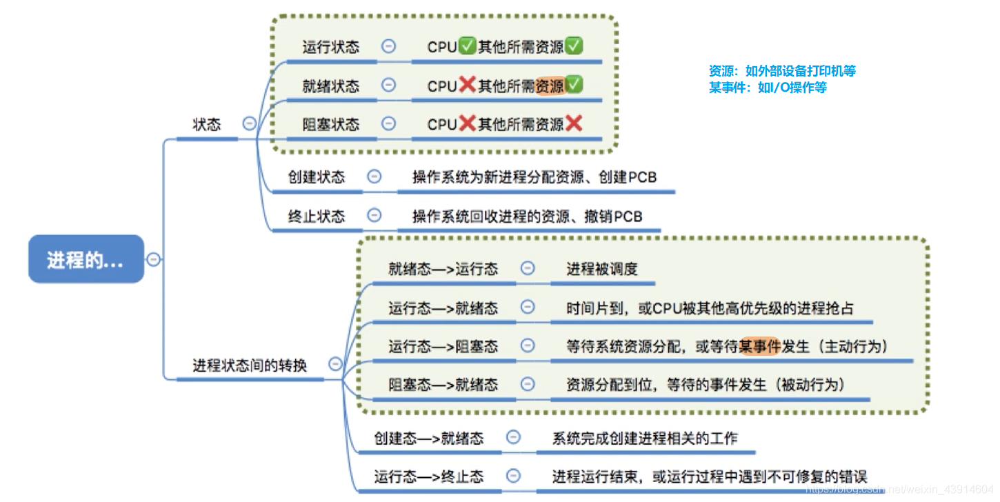
> > </div> 
> 
> 
> 


>
> **<font color="pink" size = 5>1. 进程的状态</font>**
>
> 
> <font color="pink">1.1. 三种基本状态（就绪、运行、阻塞）</font>
> 
> > <div align=center>
> > 
> > </div> 
> > 
> > `3种基本状态，都有对应的 队列`
> > 
> > > `运行态 ---- 运行队列` 单CPU的运行队列长度只为1
> > > 
> > > `阻塞态/等待态 --- 等待队列`
> > > 
> > > `就绪态 ---- 就绪队列`
>
> 
> <font color="pink">1.2. 创建态和结束态</font>
> 
> > <div align=center>
> > 
> > </div> 
>  
> * <font color="yellow">创建态</font>
> 
> > <div align=center>
> > 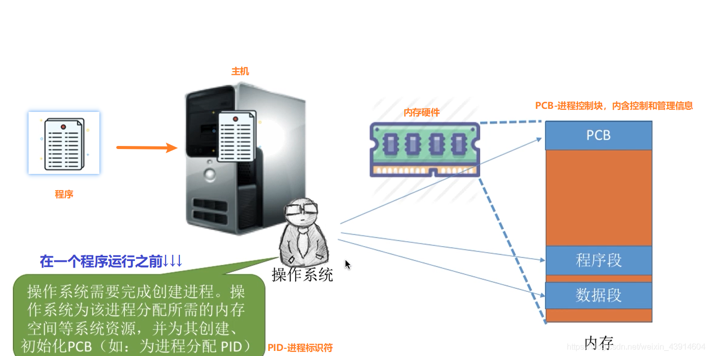
> > </div> 
> 
> * <font color="yellow">结束态</font>
> 
> > <div align=center>
> > 
> > </div> 
>
> 
> 
> 


>
> **<font color="pink" size = 5>2. 进程状态之间的转换</font>**
> 
> * 进程一共有如下`5`种状态，那么他们之间如何实现切换呢？
> 
> > <div align=center>
> > 
> > </div> 
> 
> 
> 
> * 咱们从一个进程的从无到有看起，来了解进程`5`种状态之间的转换
> 
> > <div align=center>
> > 
> > </div> 
> > 
> > * `新建进程时会分配系统资源`，一般新建完就可以`创建态 --->>> 就绪态`；<font color="pink">如果就绪队列已满呢？</font>
> > 
> > * `撤销进程时会回收系统资源`，一般是3种基本状态都能撤销`就绪态/阻塞态/运行态 --->>> 终止态`
> > 
> > * `可以 就绪态 <<<--->>> 运行态`
> > 
> > * `不能 阻塞态 --->>> 运行态，只能 阻塞态 --->>> 就绪态 --->>> 运行态`
> > 
> > * `不能 就绪态 --->>> 阻塞态，只能 就绪态 --->>> 运行态 --->>> 阻塞态`
> > 
> > * `阻塞态Blocked = 等待态Waitng`
> 
> 
> * 来一张形象生动的图片感受一下`5`种状态之间的切换
> 
> > <div align=center>
> > 
> > </div> 
> 
> 


#### 2.1.3 原语(`primitive`)实现对进程的控制

>
> https://blog.csdn.net/weixin_43914604/article/details/104880533
> 

>
> **<font color="pink" size = 5>思维导图</font>**
> 
> > <div align=center>
> > 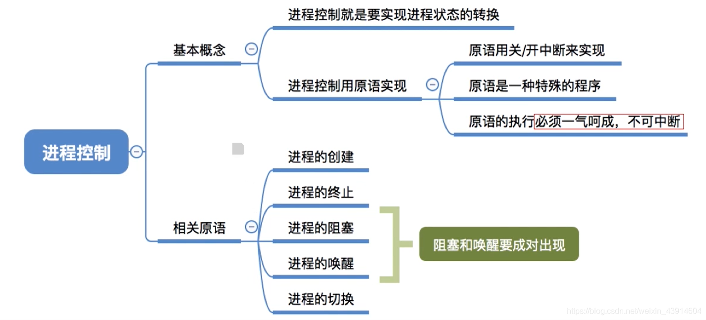
> > </div> 
> 
> 内核的`3个最基本功能`：`时钟管理`、`中断机制`、`原语`
> 
>
> > 
> > * 系统中的设备驱动、CPU切换、进程通信等功能中的部分操作都可定义为`原语`
> > 
> > * 特点如下：
> > > 
> > > * 是一种特殊的程序，处于操作系统最底层，是最接近硬件的部分
> > > 
> > > * 这种程序的运行具有`原子性`，其操作一气呵成，执行期间不允许中断（主要从系统安全性和便于管理考虑）
> > > > ```html
> > > > 原子(性)操作：不可以被中断
> > > > ``` 
> > > 
> > > 
> > > * 程序运行时间都较短，调用频繁
> > 
> 

>
> **<font color="pink" size = 5>1. 什么是进程控制？</font>**
>
> > <div align=center>
> > 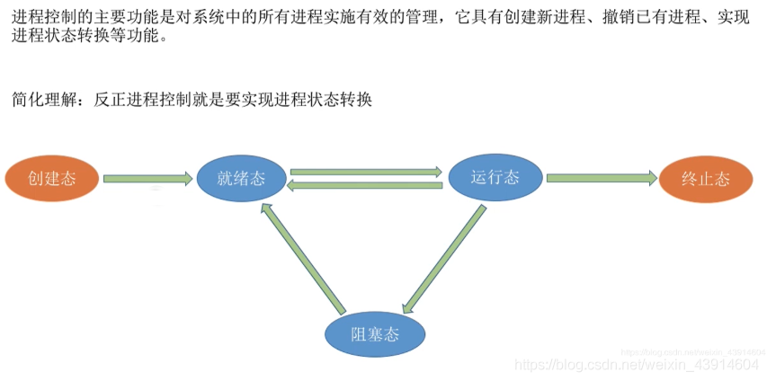
> > </div> 
>
> `进程控制`包括：`创建新进程`、`撤销已有进程`、`实现进程状态转换`
>
> 
>
> 
> 


>
> **<font color="pink" size = 5>2. 原语实现对进程的控制</font>**
> 
> > <div align=center>
> > 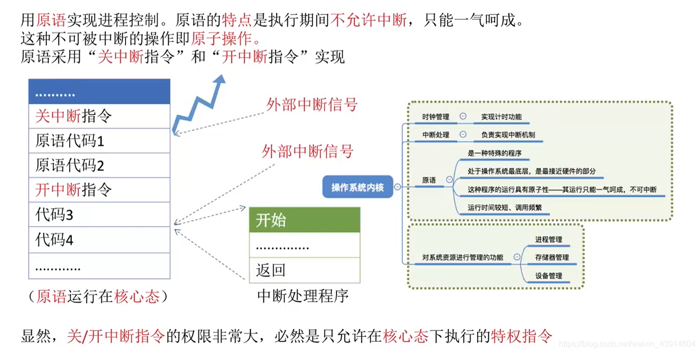
> > </div> 
> > 
> > * `原语`是一种特殊的程序，处于操作系统最底层，是最接近硬件的部分
> > 
> > * `原语`的运行具有`原子性`，其操作一气呵成, 执行期间不允许中断（主要从系统安全性和便于管理考虑）
> > 
> > > ```html
> > > 原子(性)操作：不可以被中断，只能一气呵成
> > > ```
> > 
> > * 原语的特点就是执行期间`不允许中断`，只能一气呵成
> > 
> > * 原语采用"`关中断`指令"和"`开中断`指令"实现
> > 显然，`关/开中断指令`的权限非常打赏，`是只允许在核心态下执行的特权指令`
> > 
> > * `原语`运行时间都较短，调用频繁
>
> 
> 


>
> **<font color="pink" size = 5>3. 回忆进程的组织</font>**
>
> * 进程在操作系统中的组织使各个进程能够有序的进行切换和运行
> 
> > <div align=center>
> > 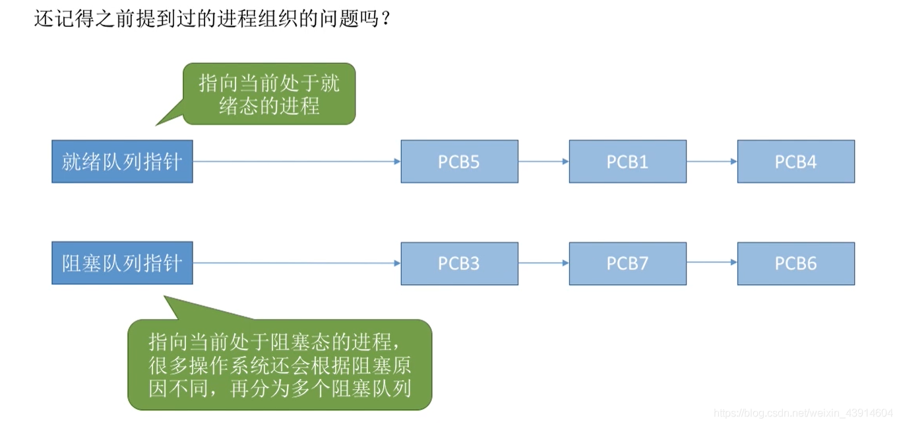
> > </div> 
> > 
>
> 


>
> **<font color="pink" size = 5>4. 进程控制大致图解</font>**
> 
> > <div align=center>
> > 
> > </div> 
> > 
> > 
> > * `新建进程时会分配系统资源`，一般新建完就可以`创建态 --->>> 就绪态`
> > 
> > * `撤销进程时会回收系统资源`，一般是运行结束撤销`运行态 --->>> 终止态`
> > 
> > * `可以 就绪态 <<<--->>> 运行态`
> > 
> > * `不能 阻塞态 --->>> 运行态，只能 阻塞态 --->>> 就绪态 --->>> 运行态`
> > 
> > * `不能 就绪态 --->>> 阻塞态，只能 就绪态 --->>> 运行态 --->>> 阻塞态`
> > 
> > * `阻塞态Blocked = 等待态Waitng`
>  
> 
> <font color="gree">调度 和 切换 的区别：</font>
> > 
> > * `调度`是指决定资源分配给哪个进程的行为，`是决策`行为
> > * ` 切换`是指实际分配的行为，`是执行`行为
> > `一般来说先有资源调度，后有进程切换`
> > 
> > 
> 


>
> **<font color="pink" size = 5>5. 进程控制原语的相同点</font>**
> 
> > <div align=center>
> > 
> > </div> 
> > 
>
> * 接下来我们就具体学习一下`关于进程控制的5种原语`，进程的`创建、终止、唤醒、阻塞、切换`；
>
> 
> 


>
> **<font color="pink" size = 5>6. 进程控制的五种原语(`primitive`)</font>**
> > 
> > * `新建进程时会分配系统资源`，一般新建完就可以`无 --->>> 创建态 --->>> 就绪态`；如果就绪队列已满呢？`无 --->>> 创建态 --->>> ??? `
> > 
> > * `撤销进程时会回收系统资源`，一般是3种基本状态都能撤销`就绪态/阻塞态/运行态 --->>> 终止态 --->>> 无`
> > 
> > * `可以 就绪态 <<<--->>> 运行态`
> > 
> > * `不能 阻塞态 --->>> 运行态，只能 阻塞态 --->>> 就绪态 --->>> 运行态`
> > 
> > * `不能 就绪态 --->>> 阻塞态，只能 就绪态 --->>> 运行态 --->>> 阻塞态`
> > 
> > * `阻塞态Blocked = 等待态Waitng`
> 
> <br>
> <br>
> 
> > 
> > * `新建进程时会分配系统资源`，执行`创建原语`，就可以新建进程，如果就绪队列未满，则马上将`PCB插入就绪队列`, `无 --->>> 创建态 --->>> 就绪态`；如果就绪队列已满呢？`无 --->>> 创建态 --->>> ??? `
> > 
> > * `撤销进程时会回收系统资源`，执行`终止原语`，`删除PCB`，`就绪态/阻塞态/运行态 --->>> 终止态 --->>> 无`
> > 
> > * 执行`切换原语`，状态转换。
> > > 
> > > 如果当前是就绪态，则`就绪态 --->>> 运行态`
> > > 如果当前是运行态，则`运行态 --->>> 阻塞态/就绪态`
> > > 
> > 
> > * 执行`唤醒原语`，改变当前的阻塞状态，`阻塞态 --->>> 就绪态`
> > 
> > * 执行`阻塞原语`，将当前状态改为阻塞状态，`运行态 --->>> 阻塞态`
> > 
> > 
> 
> <br>
> <br>
> 
> 
> <font color="pink">6.1. 进程的`创建`原语 `create`</font>
> 
> > <div align=center>
> > 
> > </div> 
> 
>
> 
> <font color="pink">6.2. 进程的`终止`原语 `Terminate` </font>
> 
> > <div align=center>
> > 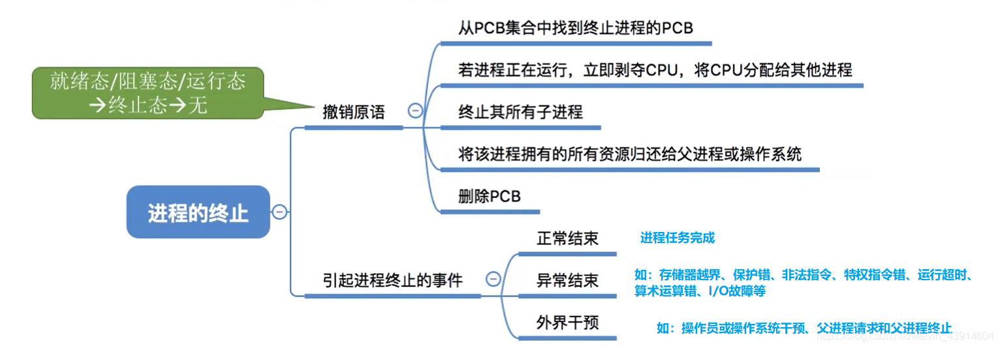
> > </div> 
> > 
> > 父子进程之间的关系？
> > 
> > 关于资源：子进程得到的是除了代码段是与父进程共享的以外，其他所有的都是得到父进程的一个副本，子进程的所有资源都继承父进程，得到父进程资源的副本，既然为副本，也就是说，二者并不共享地址空间。，两个是单独的进程，继承了以后二者就没有什么关联了，子进程单独运行。（采用写时复制技术）
> > 
> > 关于文件描述符：继承父进程的文件描述符时，相当于调用了dup函数，父子进程共享文件表项，即共同操作同一个文件，一个进程修改了文件，另一个进程也知道此文件被修改了。
> > 
> > https://blog.csdn.net/qq_35923749/article/details/83549730
> 
> 
> <font color="pink">6.3. 进程的`唤醒`和`阻塞`原语 `wakeup` `block`</font>
>
> > * 进程的`阻塞和唤醒原语`是成对存在的，`必须成对使用`。`因何事阻塞，就要由何事唤醒
> > `
> > * 阻塞原语是由被阻塞进程自我调用实现的
> > 
> > * 唤醒原语是由一个被唤醒进程合作或被其他相关的进程调用实现的
> > 
> > <div align=center>
> > 
> > </div> 
>
> 
> <font color="pink">6.3. 进程的`切换/调度`原语 `Dispatch`</font>
> 
> > <div align=center>
> > 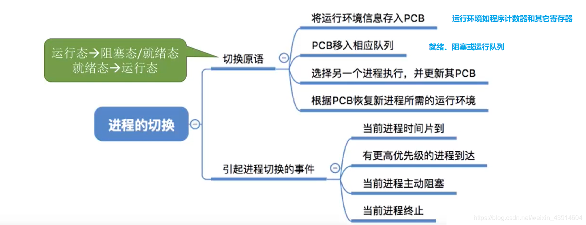
> > </div> 
> 
> 
> 
> 
> 


#### 2.1.4 进程之间的通信（共享通信、消息传递、管道通信）

>
> https://blog.csdn.net/weixin_43914604/article/details/104882398
> 


>
> **<font color="pink" size = 5>思维导图</font>**
> 
> > <div align=center>
> > 
> > </div> 
> 
> 
> 
> 


>
> **<font color="pink" size = 5>1. 什么是进程间通信（IPC，Inter-Process Communication）？</font>**
>
> > 
> > <div align=center>
> > 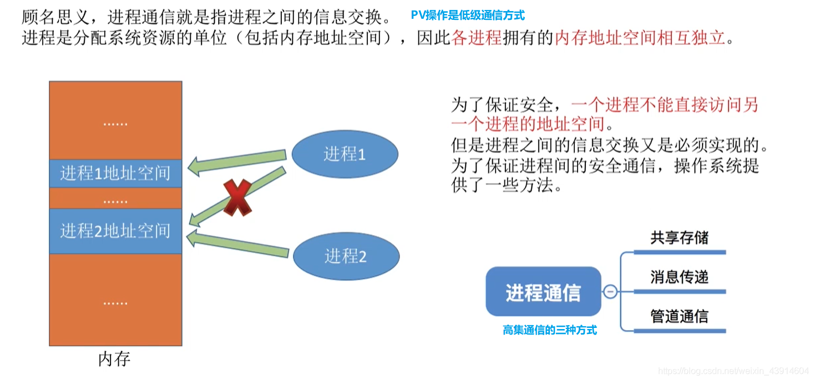
> > </div> 
> > 
> > * 图中我们可以知道什么是进程通信，以及进程通信的低级和高级方式；
> > 
> > * 我们还可以知道为什么要引入进程通信方式，以及它的意义
> > 
>
> 
> 


>
> **<font color="pink" size = 5>2. 共享存储</font>**
>
> > 
> > <div align=center>
> > 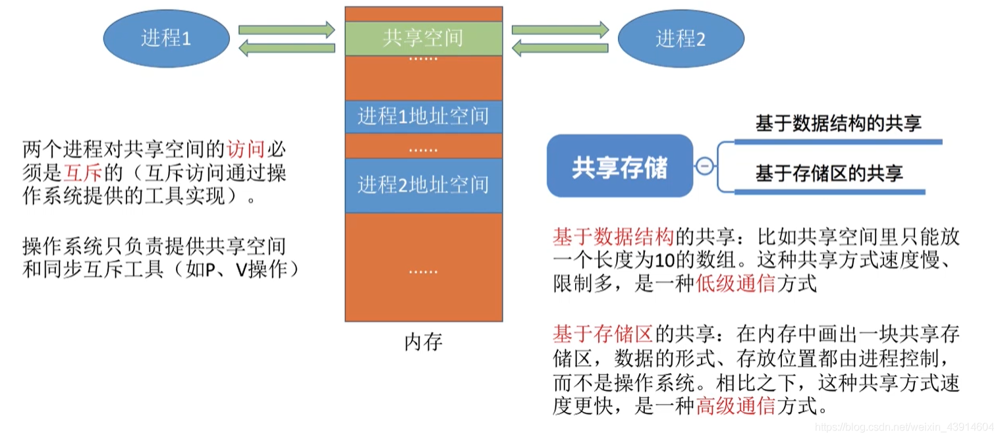
> > </div> 
> > 
> > 共享一块大家都可以访问的空间，一次只能有一个进程进行读或写操作
> > 
> > * 共享数据结构，例如一个数组
> > 
> > * 共享一个存储区
> > 
>
> 


>
> **<font color="pink" size = 5>3. 管道通信</font>**
>
> > 
> > <div align=center>
> > 
> > </div> 
> > 
> > * `管道通信`：是利用`FIFO`排队模型来指挥进程间的通信。把它当作是连接两个实体的一个单向连接器
> > 
> > * 由于管道只能`单向流动`，所以`一个时间段只能允许读(read)`, `一个时间段只能允许写(write)`，不然就会发生错乱。
> > 
> > * `必须管道内为空/满后，才可以变动属性`: `没写满，不允许读`；`没读空，不允许写`。
> > 
> 
> 
> 
> 


>
> **<font color="pink" size = 5>4. 消息传递</font>**
>
> > 
> > <div align=center>
> > 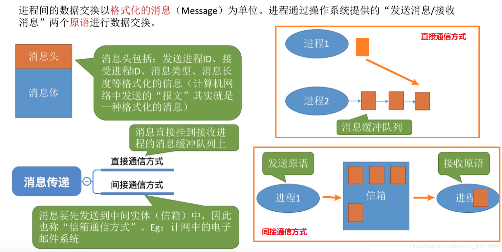
> > </div> 
> > 
> > * 分成两种：`直接通信（缓冲队列）`、`间接通信（信箱）`
> > 
> > * `发送信息的进程` 将 `消息头` 写好，`接受信息的进程` 根据 `消息头` 读取信息 或 寻找信封 是哪一个
> > 
> 
> 


#### 2.1.5 线程概念与多线程模型

>
> https://blog.csdn.net/weixin_43914604/article/details/104885645
> 


>
> **<font color="pink" size = 5>思维导图</font>**
> 
> > <div align=center>
> > 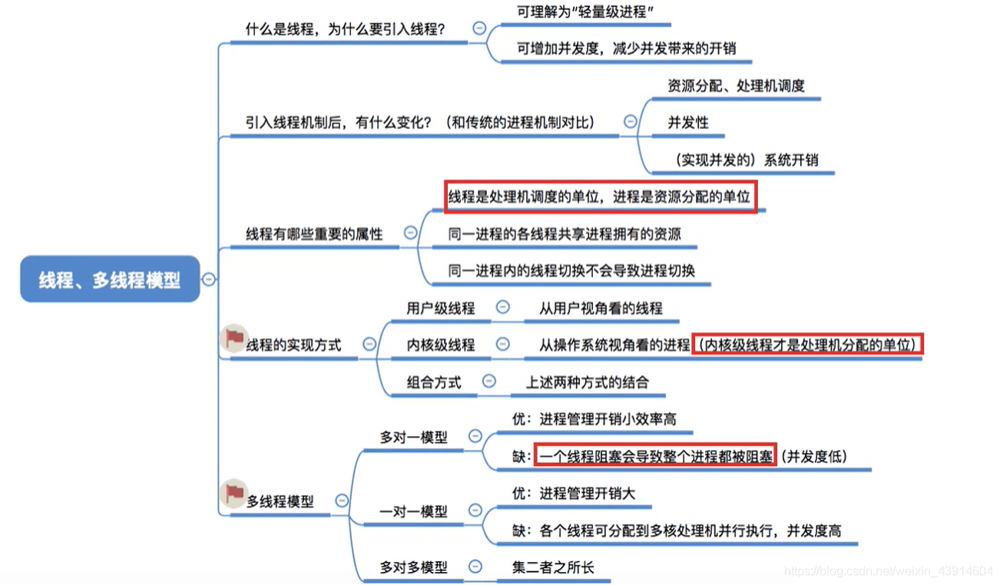
> > </div> 
> 
> 


>
> **<font color="pink" size = 5>1. 为什么要引入线程Thread？</font>**
>
> 例如，QQ进程，需要实现视频、文字聊天、传送文件等功能，如果没有线程，那么只能按照代码的先后顺序执行；引入线程后，就可以并发执行这些功能
> 
> > 
> > <div align=center>
> > 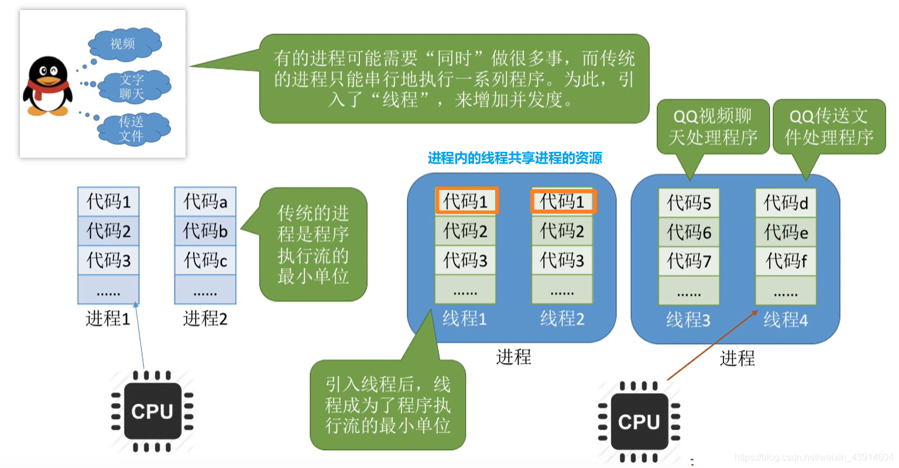
> > </div> 
> > 
> > * 为了方便于理解，我打开了我的任务管理器，可以看出chrome一个进程，下面有很多分支，可以把这些分支当做线程看待，`下图中的PID可能并不是进程标识符，可能是指TID线程标识符`。
> > 
> > <div align=center>
> > 
> > </div> 
> > 
> > 
> > 
> 
> <font color="gree">注：</font>
> > 
> > https://blog.csdn.net/tsh123321/article/details/88948734
> > 
> > * `PID 和 TID`
> > > `PID： Process Identity 进程标识符`
> > > `TID： Thread Identity 线程标识符`
> > 
> > * 但是, `内核并没有真正区分它们, 所以上图中的PID，其实是我们定义的TID，只是内核不区分而已`：线程和进程很像，但它与同一组的线程共享一些东西（内存，fds …）
> > 因此，`TID`实际上是`内核（线程）中可调度对象的标识符`，而`PID`是`共享内存和fds（文件描述符）的可调度对象组的标识符`。
> > 
> > 所以，
> > `没有线程概念时，进程是CPU执行的基本单元，是程序执行流的最小单位`；
> > `自从有了线程的概念后，实际情况为 线程是处理机CPU调度的单位，进程是除了CPU资源之外的其他系统资源分配的单位（如内存地址空间、打印机等都是分配给进程的）`
> > 
> > 但是有趣的是，当一个进程只有一个线程时，`PID`和`TID`总是相同的。因此，任何与`TID`一起使用的函数都将自动使用`PID`。
> > 
>
> 
> 
> 


>
> **<font color="pink" size = 5>2. 什么是线程Thread？</font>**
>
> > 
> > <div align=center>
> > 
> > </div> 
> > 
> > 
> > * `没有线程概念时，线程是CPU执行的基本单元，也是程序执行流的最小单位`；
> > 
> > * `自从有了线程的概念后，实际情况为 线程是处理机CPU调度的单位，进程是除了CPU资源之外的其他系统资源分配的单位（如内存地址空间、打印机等都是分配给进程的）`
> > 
> 
> `Linux中，线程Thread也称为轻量级进程LWP(light weight process)`
>
> 


>
> **<font color="pink" size = 5>3. 引入线程带来的变化 及 进程Thread与线程Process的比较</font>**
>
> > 
> > <div align=center>
> > 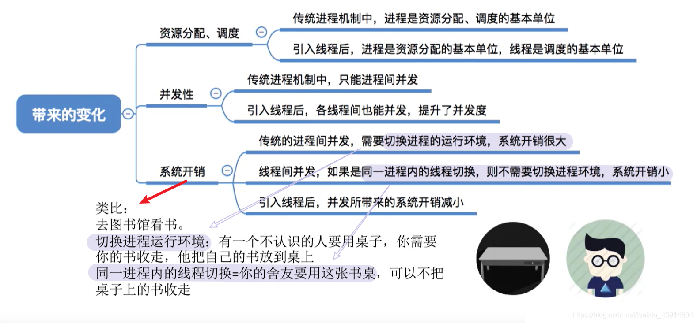
> > </div> 
> > 
> 
> 
> * 原来`CPU调度Process`；现在`CPU调度Thread`
> 
>
> * 原来一个`Process`同一时刻只能占用一个`CPU`；现在一个`Process`中的不同`Thread`可以占用不同的`CPU`；并发性高，效率高
>
> * `Process`有`PID（Process Identity）`和`PCB（Process Control Block）`；`Thread`有`TID（Thread Identity）`和`TCB（Thread Control Block）`
>
> * `原来除CPU之外的系统资源分配的单位是Proces，现在还是Proces`
> `同一个Proces中的不同Thread间共享该Process的系统资源`；
>
> * `各个Process拥有的内存地址空间相互独立，一个进程不能直接访问另一个进程的地址空间，以保证安全；导致进程间通信Inter-Process Communication必须通过操作系统提供的三种方式：共享存储、管道通信、消息传递`
> `但是同一个Process中的不同Threads由于共享系统资源（其中就有内存地址空间），所以同一个Process中的不同Threads之间进行通信Inter-Threads Communication，无需系统干预`
>
> * `同一Process中的Threads切换，不会引起Process切换，这样避免系统调用，开销很小`
> `不同Process中的Threads切换，会引起Process切换，系统调用的开销很大(系统调用使用中断机制，用户态->核心态)`
>
> 
> 


>
> **<font color="pink" size = 5>4. 线程的属性</font>**
>
> > 
> > <div align=center>
> > 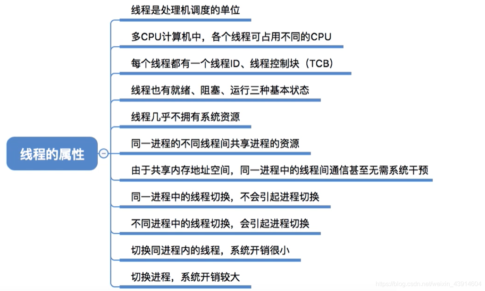
> > </div> 
> > 
> 
> 
> 


>
> **<font color="pink" size = 5>5. 线程的实现方式 UTL 和 KTL</font>**
>
> * 线程的实现分为两类：
> `用户级线程(ULT，User-Level Thread 或 User Thread)`
> `内核级线程(KLT, Kernel-Level Thread 或 KernelThread)`。
> 
> 内核级线程又称内核支持的线程。
> 
> 
>
> 
> <font color="pink">5.1. 用户级线程(`User-Level Thread, ULT`)</font>
> 
> > <div align=center>
> > 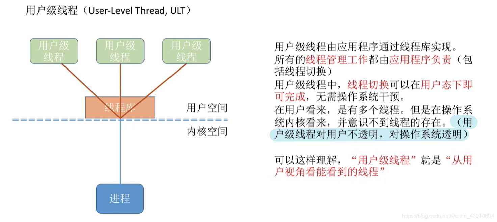
> > </div> 
> 
> `用户级线程并不是操作系统中真正的线程, 不是CPU分配的单位`
> `内核级线程才是真正的线程, 才是CPU分配的基本单位`
> 
> 
> 
> <font color="pink">5.2. 内核级线程(`Kernel-Level Thread, KLT`)</font>
> 
> > <div align=center>
> > 
> > </div> 
> > 
> > <font color="pink">
> > 
> > 这里说的是不是不准确，
> > 
> > 同一进程中的线程切换，不用系统调用吧？不会触发中断，不会用户态->核心态？
> > 
> > 只有线程切换时，分属于不同进程，才需要系统调用，触发中断，用户态->核心态
> > 
> > </font>
> 
> 
> 
> <font color="pink">5.3. 特殊的组合方式及重点注意</font>
> 
> > <div align=center>
> > 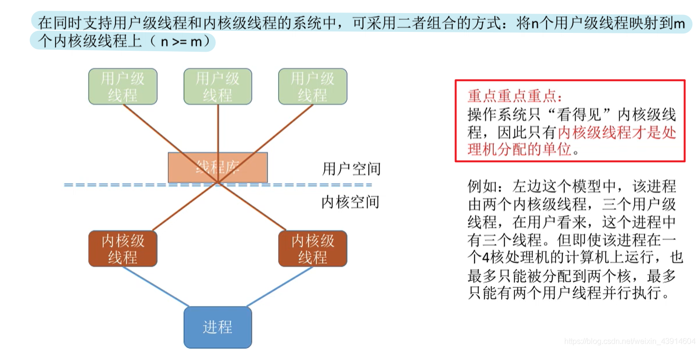
> > </div> 
> 
> `不管怎么映射，有几个内核级线程，就只能分配几个CPU来并行执行`
> 
> 
> 


>
> **<font color="pink" size = 5>6. 多线程模型</font>**
>
> * 前面我们提到了线程的实现方式，有用户级线程和内核级线程。
> 
> * `用户级线程 和 内核级线程 两种模式的交叉组合 就会产生几种不一样的组织结构，即不一样的模型。`
>
> 
> 
>
> 
> <font color="pink">6.1. 多对一模型</font>
> 
> > <div align=center>
> > 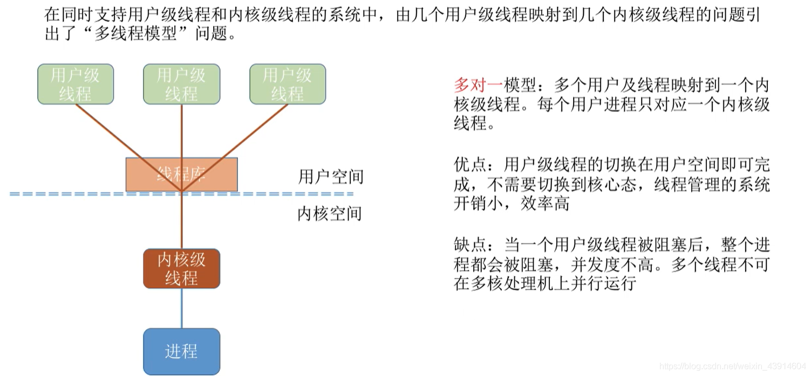
> > </div> 
> > 
> > `没看懂：为什么一个用户级线程被阻塞后，整个进程都会被阻塞？`
> > 
> > https://linduo.blog.csdn.net/article/details/78972283
> > 
> > * 所有`用户线程`对应同一个的`内核调度实体（KES）`
> > 
> > * 线程的创建、调度、同步，由所属进程的`用户空间线程库`实现。
> > 
> > * 用户态线程，对内核几乎是透明的（许多操作不需要内核接管）
> > 
> > * 但线程总要有一些操作经过内核，比如系统调用。
> > 
> > * 不需要频繁的内核态/用户态切换，处理速度非常快。
> > 
> > * **该模式下，当进程的某个线程，系统调用（比如I/O）阻塞时，该进程也会阻塞。**
> > 
> > * 原因：该模式下，进程的所有线程，都对应一个内核调度实体（KES），并且内核不知道这个进程有哪些线程。KES无法将其他线程，调度到其他处理器上。该进程（所有的线程）被阻塞，直到本次系统调用（比如I/O）结束。
> > 
> 
> 
> <font color="pink">6.2. 一对一模型</font>
> 
> > <div align=center>
> > 
> > </div> 
> > 
> > <font color="gree">目前（`linux`）基本上都采用`一对一模型`。</font>
> > 
> > `没看懂：为什么一个用户级线程被阻塞后，别的线程还可以继续执行？`
> > 
> > https://linduo.blog.csdn.net/article/details/78972283
> > 
> > 
> > * 每个`用户线程`都对应一个的`内核调度实体（KES）`。
> > 
> > * 内核会对每个线程进行调度，可以调度到其他处理器上。
> > 
> > * `线程每次操作会在用户态和内核态切换`。
> > 
> > * 线程数量过多时，对系统性能有影响。
>
> 
> 
> <font color="pink">6.3. 多对多模型</font>
> 
> > <div align=center>
> > 
> > </div> 
> >  
> > 
> > 此种模型效率是三种模型中最好的
> > 
> > https://linduo.blog.csdn.net/article/details/78972283
> > 
> > 
> > * 每个用户线程拥有多个内核调度实体
> > 
> > * 多个用户线程也可以对应一个内核调度实体
> > 
> > * 实现该模型非常复杂。
> 
> 
> 
> 
> <font color="pink">6.4. 总结</font>
> > 
> > https://linduo.blog.csdn.net/article/details/78972283
> > 
> >  
> > * 线程系统调用阻塞时，在多对1用户级线程模型下，会导致所属进程阻塞。
> > 
> > * 在1对1或多对多模型下，不会导致该问题的发生。
> >
> > * 如果是单进程单线程的话，不管哪个模型，都会阻塞的。
> > 
> 
> 


### 2.2 处理机的调度

#### 2.2.1 处理机调度的概念及层次

>
> https://blog.csdn.net/weixin_43914604/article/details/105323244
> 


>
> **<font color="pink" size = 5>思维导图</font>**
> 
> > <div align=center>
> > 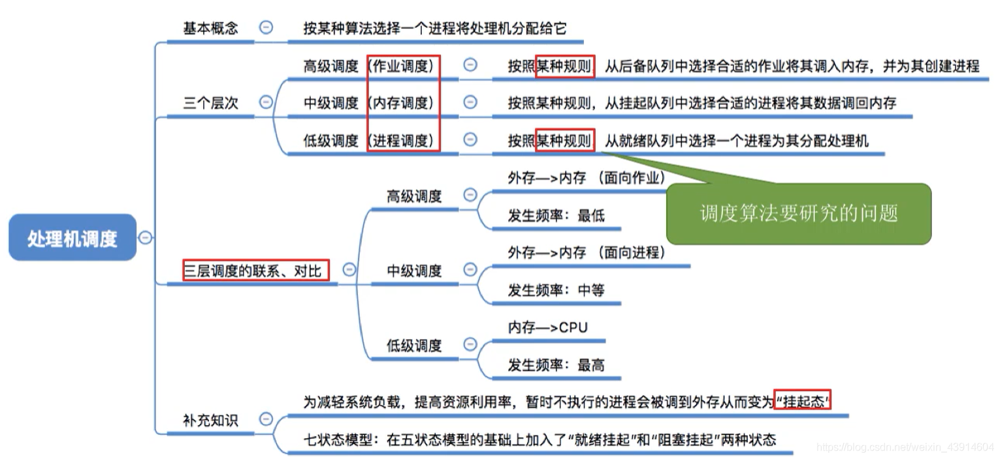
> > </div> 
> 
> 


>
> **<font color="pink" size = 5>1. 调度的基本概念</font>**
> 
> > <div align=center>
> > 
> > </div> 
> 
> 
>


>
> **<font color="pink" size = 5>2. 调度的三个层次</font>**
>
> <font color="yellow">没开始叫`作业`，开始了叫`进程`</font>
>
> 
> <font color="pink">2.1. 高级调度（ 作业调度）</font>
> 
> > <div align=center>
> > 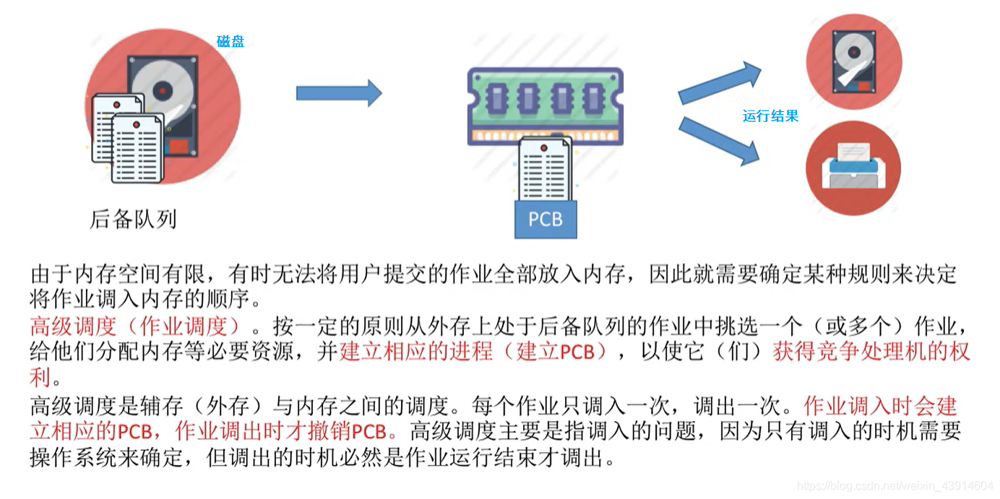
> > </div> 
>
> `我理解的作业调度：将一个任务从无到有，新建相关进程，进程结束后从有到无撤销。`
>
> 
> <font color="pink">2.2. 中级调度（内存调度）</font>
> 
> > <div align=center>
> > 
> > </div> 
> 
> `我理解的内存调度`：
> > 当前进程已经存在，只是暂时轮不到该进程执行，为了提高内存利用率(内存有限，只能先换出去，让别的进程入内存)，将该进程从内存暂时调度到外存。但是呢，之前我们没遇到过这种进程状态，所以现在定义 `"暂时从内存调到外存等待的进程状态为 挂起状态"`。
>
> 注意：
> > 
> > * `PCB仍然在内存中`，并不是一起调到外存；`被调到外存的是进程数据`，PCB会记录进程数据在外存中的位置、进程状态等信息。
> > 
> > * `被挂起的进程PCB会被放到挂起队列中`
>
> 
> > 
> <font color="pink">2.3. 进程的挂起状态与七状态模型</font>
> 
> > <div align=center>
> > 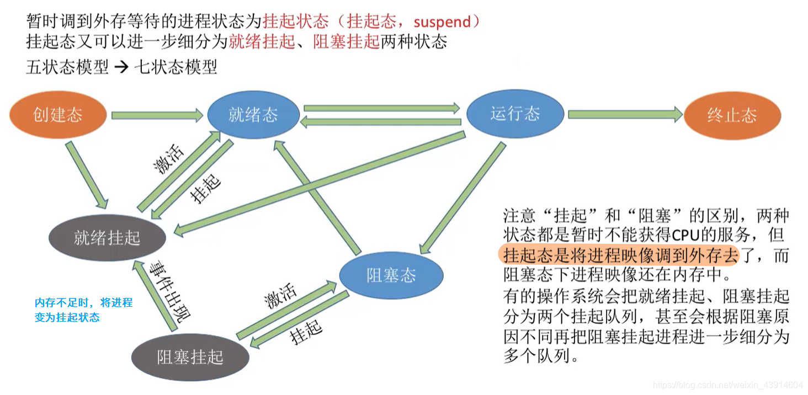
> > </div> 
> > 
> > `图注：进程映像 = 进程实体 = PCB + 程序段 + 数据段`
> 
> 上面提到了`挂起状态`，实际上可分为：`就绪挂起`、`阻塞挂起`
>
> * `就绪挂起`和`就绪态`的唯一区别：除了`PCB`以外的进程实体被调到外存中
>
> * `阻塞挂起`和`阻塞态`的唯一区别：除了`PCB`以外的进程实体被调到外存中
> 
> * `其他的各种状态间的转换关系，实际上是没变的。`
> > 
> > `就绪挂起  --- >>> 就绪态` 对应 `激活`
> > 
> > `就绪挂起 <<< ---  就绪态` 对应 `挂起`
> > 
> > `阻塞挂起  --- >>> 阻塞态` 对应 `激活`
> > 
> > `阻塞挂起 <<< ---  阻塞态` 对应 `挂起`
> > 
> 
> 
> 
> 
> 
> <font color="pink">2.4. 低级调度（进程调度）</font>
> 
> > <div align=center>
> > 
> > </div> 
>
> `这种很简单，就是之前提到过的进程控制`
> > `就绪态  <<< --- >>> 运行态`，`就绪队列 <<< --- >>> 运行队列`； 
> > `阻塞态  --- >>> 就绪态`，`阻塞队列  --- >>> 就绪队列`； 
> > `运行态 --- >>> 阻塞态`，`运行队列  --- >>> 阻塞队列`； 
> 
> 
> 
> 
> <font color="pink">2.5. 三层调度的联系和对比</font>
> 
> > <div align=center>
> > 
> > </div> 
>
> 
> 


#### 2.2.2 进程调度的时机（主动放弃与被动放弃）、切换与过程（广义与狭义）、方式（非剥夺与剥夺）

>
> https://blog.csdn.net/weixin_43914604/article/details/105324472
> 


>
> **<font color="pink" size = 5>思维导图</font>**
> 
> > <div align=center>
> > 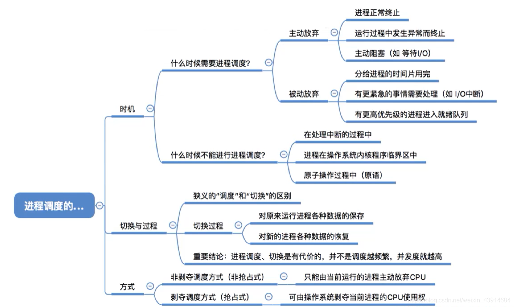
> > </div> 
>
> 
> 
> 


>
> **<font color="pink" size = 5>1. 时机</font>**
>
> 
> <font color="pink">1.1. 什么时候进行进程调度？</font>
> 
> > <div align=center>
> > 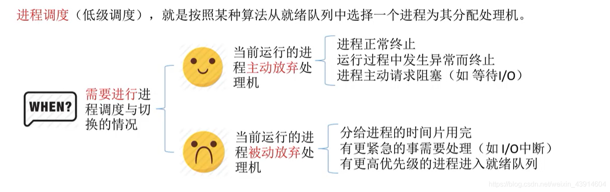
> > </div> 
>
>
> 
> <font color="pink">1.2. 什么时候不能进行进程调度？</font>
> 
> > <div align=center>
> > 
> > </div> 
>
> 
>
> 
> <font color="pink">1.3. OS内核程序临界区 与 普通临界区 的进程调度情况</font>
>
> `评论区`有人说：感觉抠`内核资源临界区`和`普通资源临界区`的区别真没什么必要
> 
> > <div align=center>
> > 
> > 
> > </div> 
> 
> https://blog.csdn.net/gary101818/article/details/124198452
> 
> <font color="gree">没看懂1.3.</font>
> 
> 
>


>
> **<font color="pink" size = 5>2. 进程调度的方式</font>**
> 
> * 所谓进程调度方式，是指当某个进程正在处理机上执行时，若有某个更为重要或紧迫的进程需要处理，即有优先权更高的进程进入就绪队列，此时应如何分配处理机。
> 
> > <div align=center>
> > 
> > </div> 
> 
> `现在的各种操作系统应该是 剥夺调度方式 吧？`
>
> 
> 
> 


>
> **<font color="pink" size = 5>3. 进程的切换和过程</font>**
> 
> 
> > <div align=center>
> > 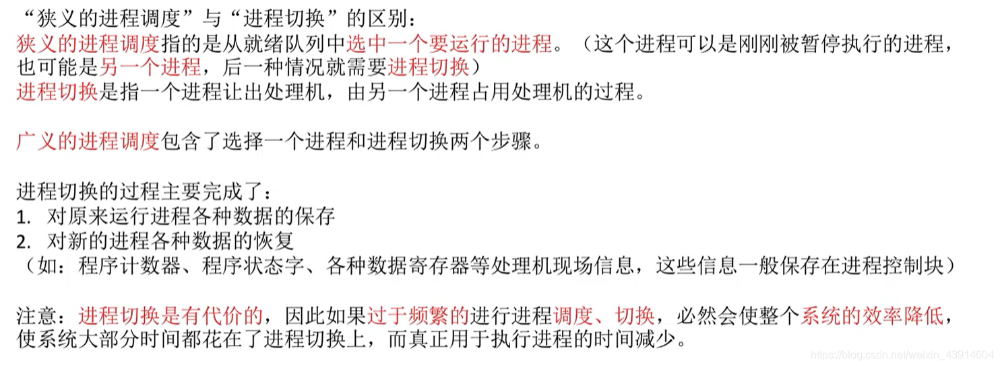
> > </div> 
> 
> 
>
> 


#### 2.2.3 度算法的评价指标（CPU利用率、系统吞吐量、周转时间、等待时间、响应时间）

>
> https://blog.csdn.net/weixin_43914604/article/details/105325136
> 


>
> **<font color="pink" size = 5>思维导图</font>**
> 
> > <div align=center>
> > 
> > </div> 
>
> 
> 
> 


>
> **<font color="pink" size = 5>1. CPU利用率</font>**
> 
> > <div align=center>
> > 
> > </div> 
>
> 

>
> **<font color="pink" size = 5>2. 系统吞吐量</font>**
> 
> > <div align=center>
> > 
> > </div> 
>
> 
> 
> 


>
> **<font color="pink" size = 5>3. 周转时间</font>**
> 
> > <div align=center>
> > 
> > 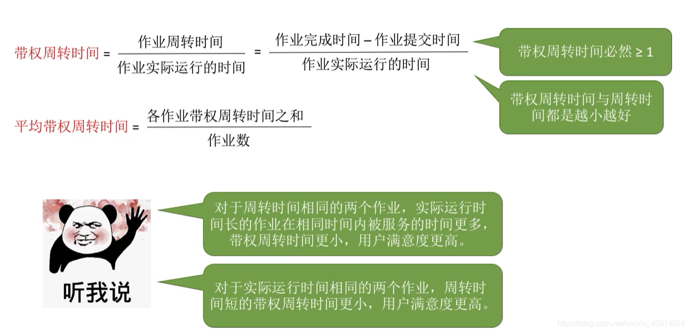
> > </div> 
>
> 
> `带权周转时间：我本来就只需要运行一会，但是你让我等待周转的时间太长了，那肯定不行，简单的作业不能等待太久，所以带权周转时间越小越好`
> 


>
> **<font color="pink" size = 5>4. 等待时间 = 周转时间 - 实际运行时间</font>**
> 
> > <div align=center>
> > 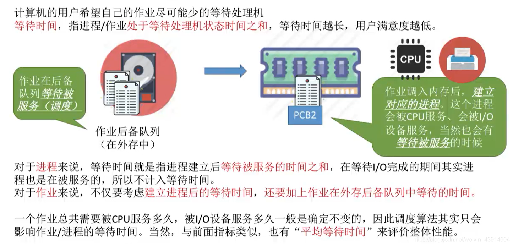
> > </div> 
>
> 
> 
> 


>
> **<font color="pink" size = 5>5. 响应时间</font>**
> 
> > <div align=center>
> > 
> > </div> 
>
> 
> 
> 


#### 2.2.4 早期批处理系统的 3种 作业/进程调度算法（FCFS先来先服务、SJF短作业优先、HRRN高响应比优先）

>
> https://blog.csdn.net/weixin_43914604/article/details/105328521
> 


>
> **<font color="pink" size = 5>思维导图</font>**
> 
> > <div align=center>
> > 
> > </div> 
>
> 
> 
> 


>
> **<font color="pink" size = 5>1. 先来先服务—FCFS（First come first sever）</font>**
> 
> > <div align=center>
> > 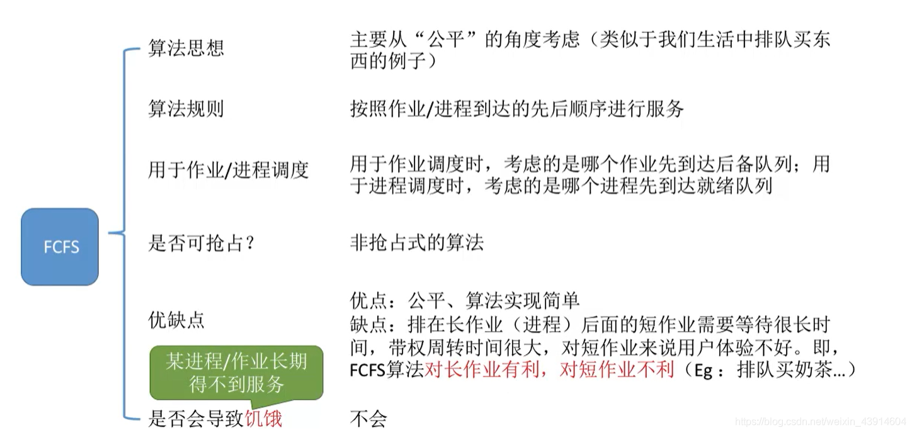
> > </div> 
>
> `例题：比较简单`
> 
> > <div align=center>
> > 
> > </div> 
>
> 
> 


>
> **<font color="pink" size = 5>2. 短作业优先—SJF/SPF、SRTN</font>**
> 
> > <div align=center>
> > 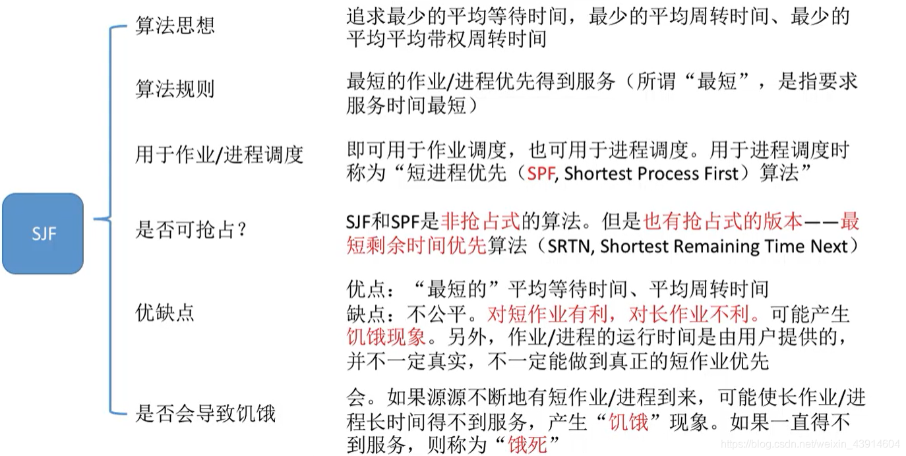
> > </div> 
>
> * 非抢占式`SJF/SPF`
> 
> `用于作业：SJF（Shortest Job First）`   `无->创建太->就绪态`
> `用于进程：SPF（Shortest Process First）`  `就绪态 -> 运行态`
>
> * 抢占式`SRTN`
> `SRTN（Shortest Remaining Time Next）`
> 
> 
> * `非抢占式例题`
> 
> > <div align=center>
> > 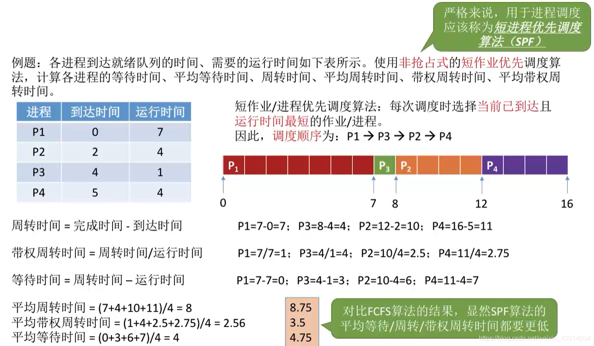
> > </div> 
> 
> * `抢占式例题`
> 
> > <div align=center>
> > 
> > 
> > </div> 
> 
> * `注意几个细节`
> 
> > <div align=center>
> > 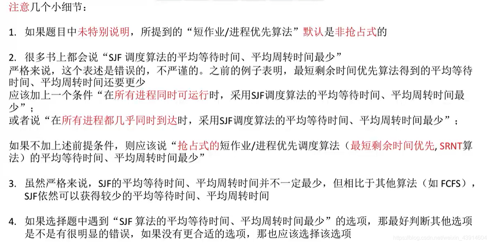
> > </div> 
> 
> 
> 


>
> **<font color="pink" size = 5>3. 高响应比优先—HRRN(Highest Response Ratio Next)</font>**
> 
> > <div align=center>
> > 
> > 
> > </div> 
> 
> `例题：比较简单`
> 
> > <div align=center>
> > 
> > </div> 
>
> 
> 


>
> **<font color="pink" size = 5>4. 三种算法的对比和总结</font>**
> 
> > <div align=center>
> > 
> > </div> 
> 
> 


#### 2.2.5 后期交互式系统的 3种 作业/进程调度算法（时间片轮转调度算法、优先级调度算法、多级反馈队列调度算法）

>
> https://blog.csdn.net/weixin_43914604/article/details/105333646
> 


>
> **<font color="pink" size = 5>思维导图</font>**
> 
> > <div align=center>
> > 
> > </div> 
> 
> 


>
> **<font color="pink" size = 5>1. 时间片轮转—RR（Round-Robin）</font>**
> 
> > <div align=center>
> > 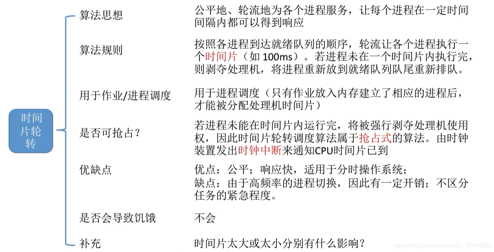
> > </div> 
> 
> 
> * `时间片为2举例`
> 
> > <div align=center>
> > 
> > 
> > </div> 
> 
> 
> * `时间片为5举例`
> 
> > <div align=center>
> > 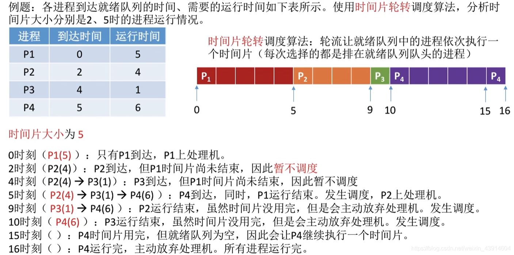
> > </div> 
> 
> 
> * `可能出现的问题，比如与FCFS对比`
> 
> > <div align=center>
> > 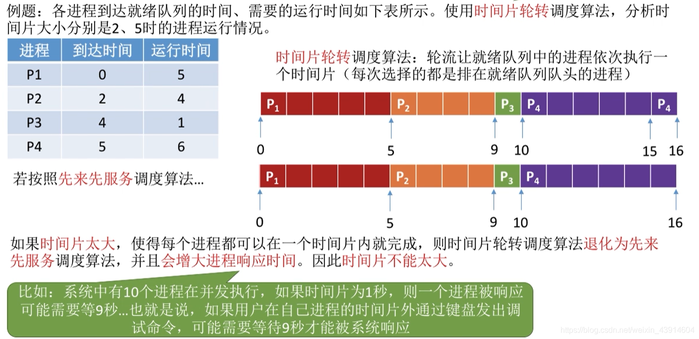
> > 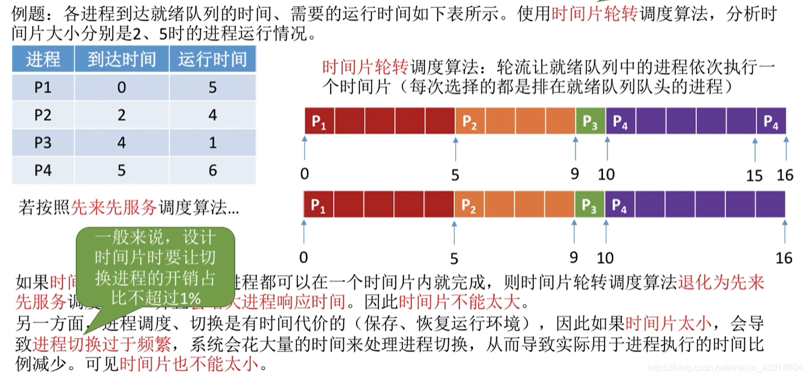
> > </div> 
> > 
> > `时间片不能太大，否则就和FCFS没区别了`
> > `时间片不能太小，否则进程切换频繁，系统开销很大（保存、恢复CPU运行环境）`
> > 
>
> 
> 


>
> **<font color="pink" size = 5>2. 优先级调度算法</font>**
> 
> > <div align=center>
> > 
> > </div> 
> 
> * `非抢占式例子`
> 
> > <div align=center>
> > 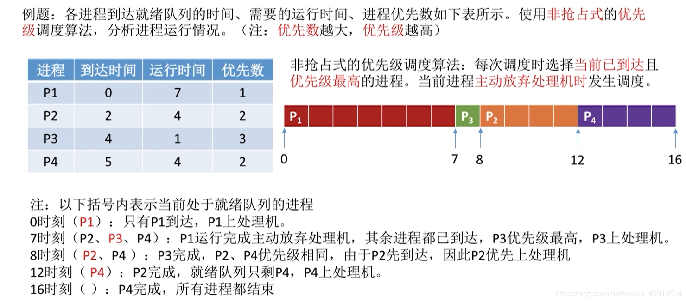
> > </div> 
> 
> 
> * `抢占式例子`
> 
> > <div align=center>
> > 
> > </div> 
> 
> 
> * `补充`
> 
> > <div align=center>
> > 
> > </div> 
> 
> 
> 
> 


>
> **<font color="pink" size = 5>3. 多级反馈队列调度算法（进来后根据规律设置优先级，不同优先级队列，对应的时间片长度不同；）</font>**
> 
> > <div align=center>
> > 
> > 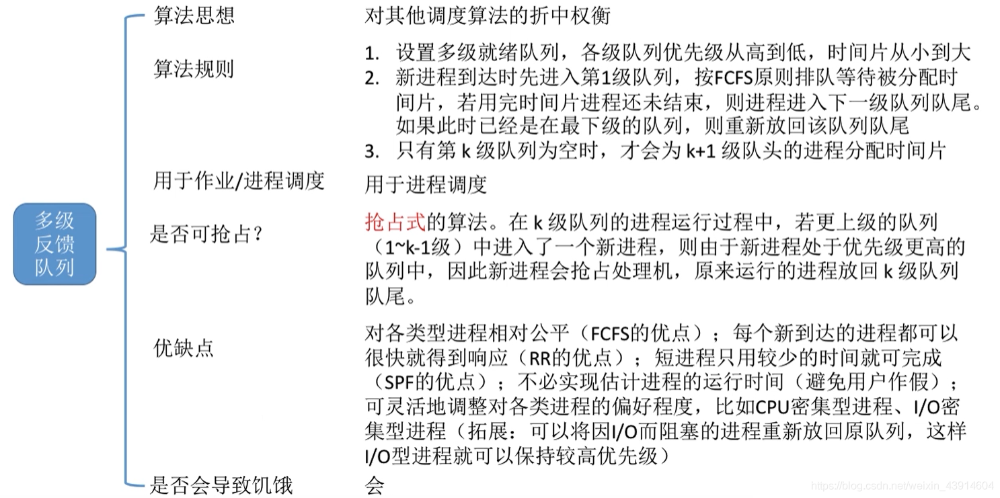
> > </div> 
>
> 
> * `举个例子`
> 
> > <div align=center>
> > 
> > 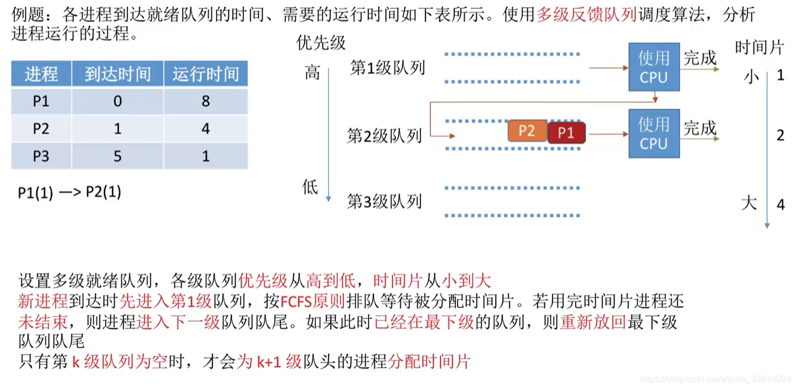
> > 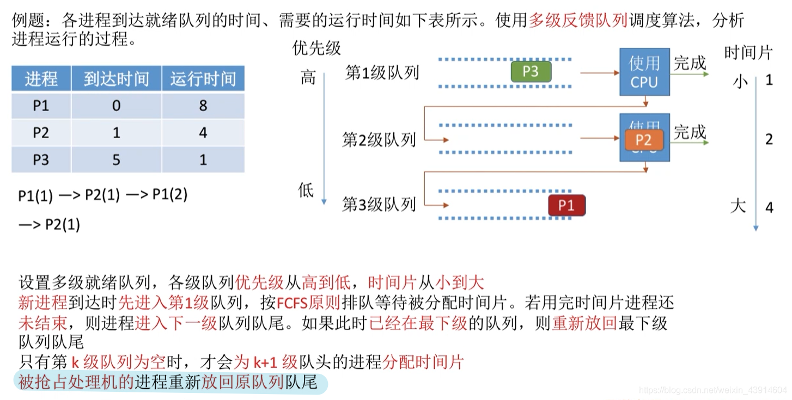
> > 
> > 
> > 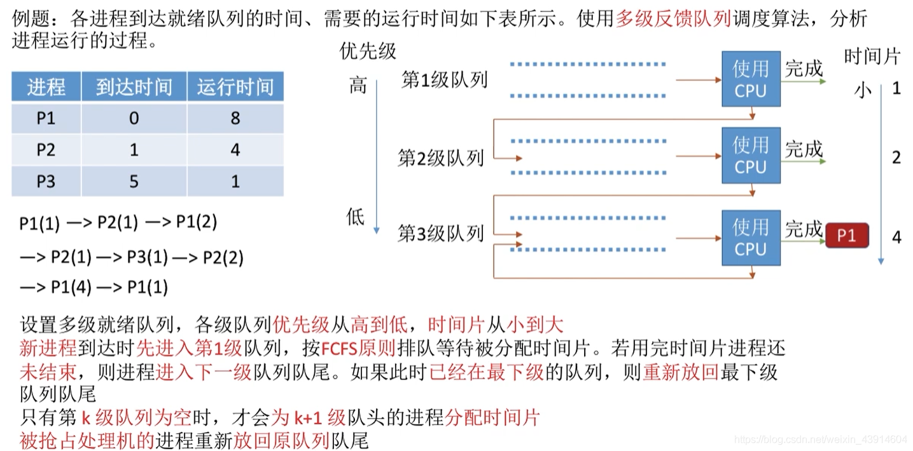
> > </div> 
> > 
> > 注意点：
> > 1. `4`时刻`P1`两个时间片用完进入第三级队列队尾，此时`P2`在第`2`级队列里，`P2`还需要三个时间片，这个时候`P2`开始执行，`2`级队列是两个时间片的，`P2`应该执行两个时间片，但是`5`时刻`1`级队列进入`P3`，由于抢占的原因`P2`停止执行被放入二级队列队尾
> > 
> > 2. 流程图里三个队列画了3个`cpu`（类似多核并行处理），感觉有点误导的倾向了，但其实并不是多核并行的情况，而是同一个`cpu`流转到了不同的队列去分配时间片并做相应处理工作，在这个模型里实际上任意时刻都只有一个`cpu`在工作，实际上还是并发
> > 
> 


>
> **<font color="pink" size = 5>4. 三种算法的对比总结</font>**
> 
> > <div align=center>
> > 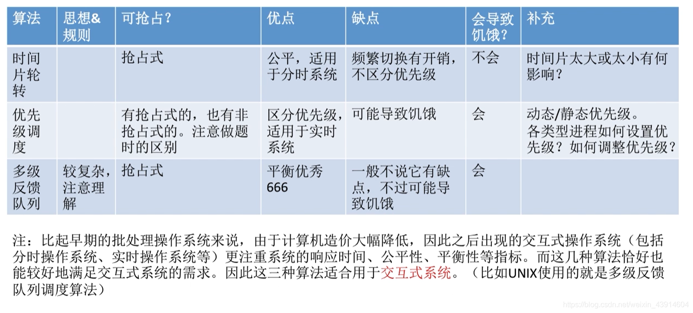
> > </div> 
> 
> 
> 
> 
>


### 2.3 进程的同步Synchronization与互斥Mutex

#### 2.3.1 进程的同步与互斥

>
> https://blog.csdn.net/weixin_43914604/article/details/104942405
> 


>
> <font color="gree">
> 
> 互斥问题的前提：两个及以上个进程已经运行（进入运行队列），只是他们都需要访问同一个临界资源，这时候产生了互斥问题。
> 
> 一般多`CPU`才会同时执行多进程，才有进程互斥问题吧？
> 
> 单`CPU`机器，也需要考虑进程互斥问题？
>
> 互斥问题不用考虑CPU是单核还是多核，因为都存在互斥问题
>
> `我们思考问题的前提都是单核CPU, 多核CPU过于复杂，先不考虑`
> 
> </font>
> 
> 
> 


>
> **<font color="pink" size = 5>思维导图</font>**
> 
> > <div align=center>
> > 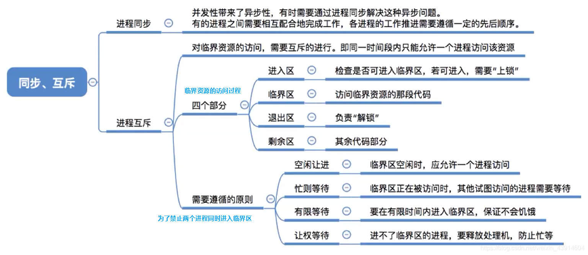
> > </div> 
> > 
> > 
> > 
> > * `异步`：多道程序环境允许`多个程序并发`执行，但由于资源有限，如`CPU`只有一个，`进程的执行并不是一贯到底的，而是走走停停的`，它以不可预知的速度向前推进。
> > 
> > > <font color="green">比如A进程正在占用CPU计算，B进程这时也想占用CPU计算，B进程只有等，等A进程算完了，A进程去访问磁盘资源了，这时B进程再占用CPU进行计算，B进程还没计算完，A进程从磁盘取出资源了，A进程发现B这时在占用CPU，这时A进程就需要等待，等B算完后再继续到CPU中进行计算。由于每个进程占用资源的时间不固定，所以进程的执行以不可预知的速度前进</font>
> > 
> > 
> > * `临界资源 (独占资源)`：在一段时间内只允许一个进程访问的资源，计算机中`大多数物理设备及某些软件中的栈、变量和表格都属于临界资源，它们被要求互斥共享`
> > > 
> > > 许多物理设备 (比如摄像头、打印机) 都属于临界资源。此外还有许多变量、数据、内存缓冲区等都属于临界资源。
> > > 
> > > `临界资源包括CPU吗？`毕竟一个`CPU`在一段时间内只执行一个进程
> > > 
> > > `互斥共享`：计算机中的某个资源在`一段时间内只能允许一个进程访问`，别的进程没有使用权
> > > 
> > > <font color="green">举个例子：比如QQ和微信视频。同一段时间内摄像头只能分配给其中一个进程</font>
> > 
> > 
>
> `进程互斥的4个原则`
> > 
> > * `空闲让进`：临界区空闲时，应允许一个进程访问
> > * `忙则等待`：临界区正在被访问时，其他试图访问的进程需要等待
> > * `有限等待`：要在有限时间内进入临界区，保证不会饥饿
> > * `让权等待`：进不了临界区的进程，要释放处理机，防止忙等
> 


>
> **<font color="pink" size = 5>1. 进程同步Synchronization</font>**
> 
> 
> * `同步也称为直接制约关系`
> 
> * 在多道程序环境下，进程是并发执行的(`并发：宏观上并行，微观上串行`)，不同进程之间存在着不同的相互制约关系。为了`协调进程之间的相互制约关系`,如等待、传递信息等，引入了`进程同步`的概念。`进程同步是为了解决进程的异步问题`。
> 
> * `异步问题: 各并发执行的进程以各自独立的、不可预知的速度向前推进`
> 
> > <font color="green">一个简单的例子来理解这个概念。例如，让系统计算1 + 2x3，假设系统产生两个进程: 一个是加法进程，一个是乘法进程。要让计算结果是正确的，一定要让加法进程发生在乘法进程之后,但实际上操作系统具有异步性,若不加以制约，加法进程发生在乘法进程之前是绝对有可能的，因此要制定一定的机制去约束加法进程，让它在乘法进程完成之后才发生。</font>
>
> ```c++
> 异步性：进程具有异步性的特征。异步性是指，各并发执行的进程以各自独立的、不可预知的速度向前推进。
> ```
> 
> 


>
> **<font color="pink" size = 5>2. 进程互斥Mutex</font>**
> 
> 
> * `互斥`，亦称`间接制约关系`。`进程互斥`指当一个进程访问某`临界资源`时，另一个想要访问该临界资源的进程必须等待。当前访问临界资源的进程访问结束，释放该资源之后，另一个进程才能去访问临界资源。
> 
> * 对`临界资源`的访问，必须互斥地进行。
> 
> > <div align=center>
> > 
> > </div> 
> 
> * 为了禁止两个进程同时进入`临界区`，需遵循以下准则
> 
> > <div align=center>
> > 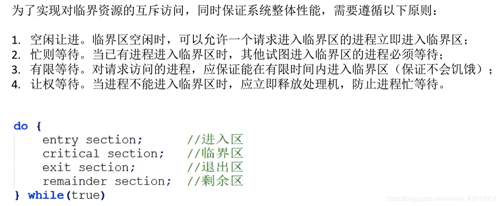
> > </div> 
> 
> ```c++
> do {
>     entry section;       // 进入区
>     critical section;    // 临界区
>     exit section;        // 退出区
>     remainder section;   // 剩余区
> } while(true)
> ```
> 


#### 2.3.2 实现临界区进程互斥的软件实现方法

>
> https://blog.csdn.net/weixin_43914604/article/details/104943004
> 

>
> **<font color="pink" size = 5>思维导图</font>**
> 
> > <div align=center>
> > 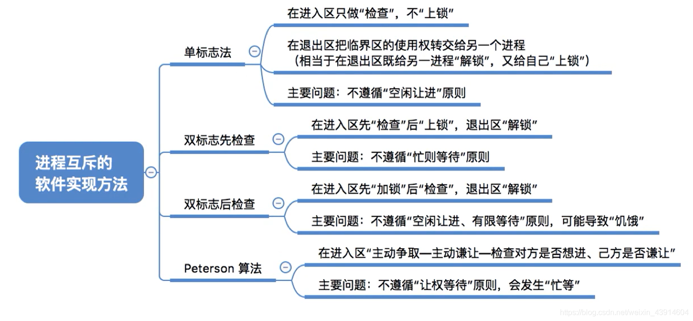
> > </div> 
> > 
>
> 
> 
> * `软件实现互斥的方法思想`：
> > 在进入区设置并检查一些标志 来标明是否有进程在临界区中
> > 若已有进程在临界区，则在进入区通过循环检查进行等待，
> > 进程离开临界区后则在退出区修改标志。
> > `入区通过循环检查进行等待，进程离开临界区后则在退出区修改标志`。
> 
> 
>
> `进程互斥的4个原则`
> > 
> > * `空闲让进`：临界区空闲时，应允许一个进程访问
> > * `忙则等待`：临界区正在被访问时，其他试图访问的进程需要等待
> > * `有限等待`：要在有限时间内进入临界区，保证不会饥饿
> > * `让权等待`：进不了临界区的进程，要释放处理机，防止忙等
> 

>
> **<font color="pink" size = 5>1. 单标志法</font>**
> 
> > <div align=center>
> > 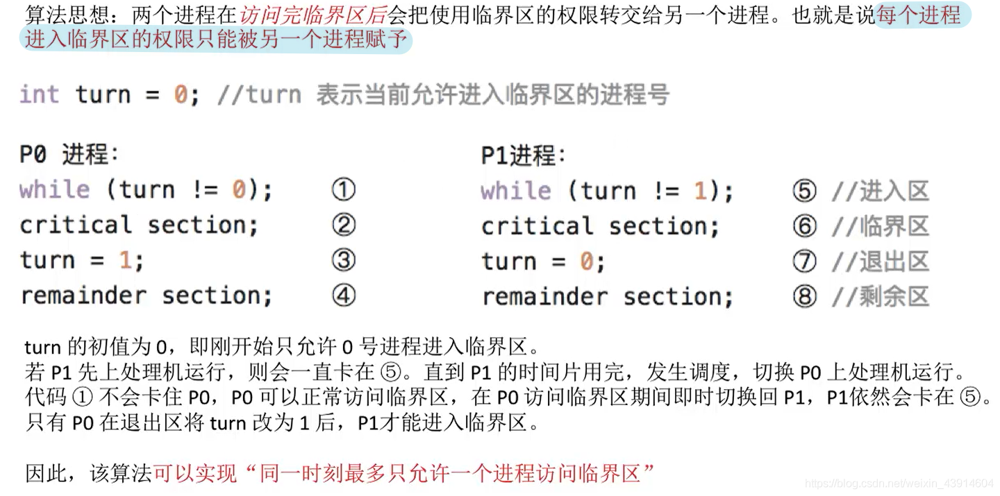
> > 
> > </div> 
> > 
> 
> * 代码如下（使用了`HTML`语言，实现两列代码块） 
> 
> <table>
>   <tr>
>   <td colspan = "2">
> 
> ```c++
> int turn = 0; // turn 表示当前允许进入临界区的进程号, 刚开始只允许0号进程进入临界区
> ```
> 
>   </td> 
>   </tr>
> 
>   <tr>
>   <td>
> 
> ```c++
> // P0 进程：                               
> while (turn != 0);  // 进入区  
> critical section;   // 临界区
> turn = 1;           // 退出区
> remainder section;  // 剩余区
> ```
> 
>   </td>
>   <td>
> 
> ```c++
> // P1 进程：
> while (turn != 1);  // 进入区
> critical section;   // 临界区
> turn = 0;           // 退出区
> remainder section;  // 剩余区 
> ```
> 
>   </td>
>   </tr>
> </table>
> 
> 


>
> **<font color="pink" size = 5>2. 双标志先检查法</font>**
> 
> > <div align=center>
> > 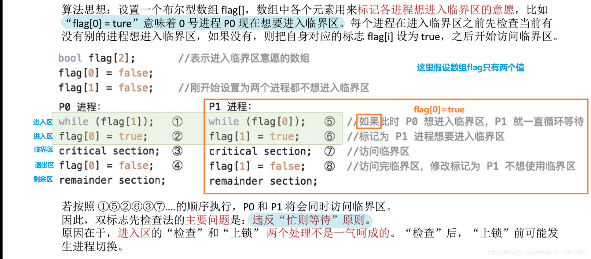
> > </div> 
> > 
>
> 
> * 代码如下（使用了`HTML`语言，实现两列代码块） 
> 
> <table>
>   <tr>
>   <td colspan = "2">
> 
> ```c++
> bool flag[2];     // 表示进入临界区意愿的数组, 这里假设数组flag只有两个值
> flag[0] = false;
> flag[1] = false;  // 刚开始设置为: 两个进程都不想进入临界区
> ```
> 
>   </td> 
>   </tr>
> 
>   <tr>
>   <td>
> 
> ```c++
> // P0 进程：                               
> while (flag[1]);    // 进入区  // 如果此时 P1 想进入临界区，P0 就一直循环等待
> flag[0] = true;     // 进入区  // 标记为 P0进程 想进入临界区 
> critical section;   // 临界区  // 访问临界区
> flag[0] = false;    // 退出区  // 访问完临界区，修改标记为 P0 不想使用临界区
> remainder section;  // 剩余区
> ```
> 
>   </td>
>   <td>
> 
> ```c++
> // P1 进程：
> while (flag[0]);    // 进入区   // 如果此时 P0 想进入临界区，P1 就一直循环等待
> flag[1] = true;     // 进入区   // 标记为 P1进程 想进入临界区 
> critical section;   // 临界区   // 访问临界区
> flag[1] = false;    // 退出区   // 访问完临界区，修改标记为 P1 不想使用临界区
> remainder section;  // 剩余区
> ```
> 
>   </td>
>   </tr>
> </table>
> 
> 


>
> **<font color="pink" size = 5>3. 双标志后检查法</font>**
> 
> > <div align=center>
> > 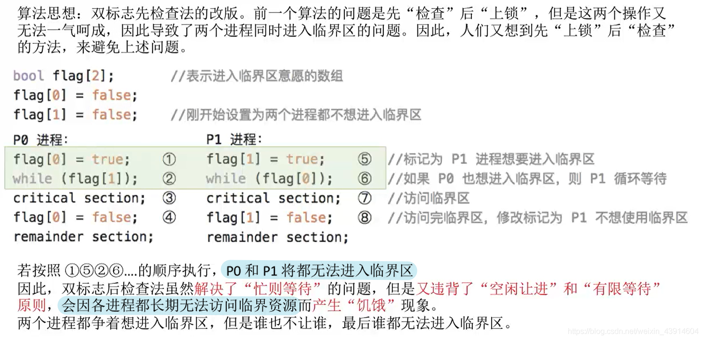
> > </div> 
> > 
>
> 
> * 代码如下（使用了`HTML`语言，实现两列代码块） 
> 
> <table>
>   <tr>
>   <td colspan = "2">
> 
> ```c++
> bool flag[2];     // 表示进入临界区意愿的数组, 这里假设数组flag只有两个值
> flag[0] = false;
> flag[1] = false;  // 刚开始设置为: 两个进程都不想进入临界区
> ```
> 
>   </td> 
>   </tr>
> 
>   <tr>
>   <td>
> 
> ```c++
> // P0 进程：
> flag[0] = true;     // 进入区  // 标记为 P0进程 想进入临界区
> while (flag[1]);    // 进入区  // 如果此时 P1 想进入临界区，P0 就一直循环等待
> critical section;   // 临界区  // 访问临界区
> flag[0] = false;    // 退出区  // 访问完临界区，修改标记为 P0 不想使用临界区
> remainder section;  // 剩余区
> ```
> 
>   </td>
>   <td>
> 
> ```c++
> // P1 进程：
> flag[1] = true;     // 进入区   // 标记为 P1进程 想进入临界区
> while (flag[0]);    // 进入区   // 如果此时 P0 想进入临界区，P1 就一直循环等待 
> critical section;   // 临界区   // 访问临界区
> flag[1] = false;    // 退出区   // 访问完临界区，修改标记为 P1 不想使用临界区
> remainder section;  // 剩余区
> ```
> 
>   </td>
>   </tr>
> </table>
> 
> 


>
> **<font color="pink" size = 5>4. Peterson算法</font>**
> 
> > <div align=center>
> > 
> >  
> > </div> 
> > 
> 
> 
>
> 
> * 代码如下（使用了`HTML`语言，实现两列代码块） 
> 
> <table>
>   <tr>
>   <td colspan = "2">
> 
> ```c++
> bool flag[2];     // 表示进入临界区意愿的数组, 这里假设数组flag只有两个值
> flag[0] = false;
> flag[1] = false;  // 刚开始设置为: 两个进程都不想进入临界区
> 
> int turn = 0;     // turn 表示当前允许进入临界区的进程号, 刚开始只允许0号进程进入临界区
> ```
> 
>   </td> 
>   </tr>
> 
>   <tr>
>   <td>
> 
> ```c++
> // P0 进程：
> flag[0] = true;               // 进入区  // 表示自己想进入临界区
> turn = 1;                     // 进入区  // 可以优先让对方进入临界区
> while (flag[1] && turn == 1); // 进入区  // 对方想进，且最后一次是自己"让梨"，那自己就循环等待
> critical section;             // 临界区  
> flag[0] = false;              // 退出区  // 访问完临界区，表示自己已经不想访问临界区了
> remainder section;            // 剩余区
> ```
> 
>   </td>
>   <td>
> 
> ```c++
> // P1 进程：
> flag[1] = true;               // 进入区  // 表示自己想进入临界区
> turn = 0;                     // 进入区  // 可以优先让对方进入临界区
> while (flag[0] && turn == 0); // 进入区  // 对方想进，且最后一次是自己"让梨"，那自己就循环等待  
> critical section;             // 临界区  
> flag[1] = false;              // 退出区  // 访问完临界区，表示自己已经不想访问临界区了  
> remainder section;            // 剩余区
> ```
> 
>   </td>
>   </tr>
> </table>
> 
> 


#### 2.3.3 实现临界区进程互斥的硬件实现方法

>
> https://blog.csdn.net/weixin_43914604/article/details/104944962
> 


>
> **<font color="pink" size = 5>思维导图</font>**
> 
> > <div align=center>
> > 
> > </div> 
> > 
> 
> 


>
> **<font color="pink" size = 5>1. 中断屏蔽方法</font>**
> 
> > <div align=center>
> > 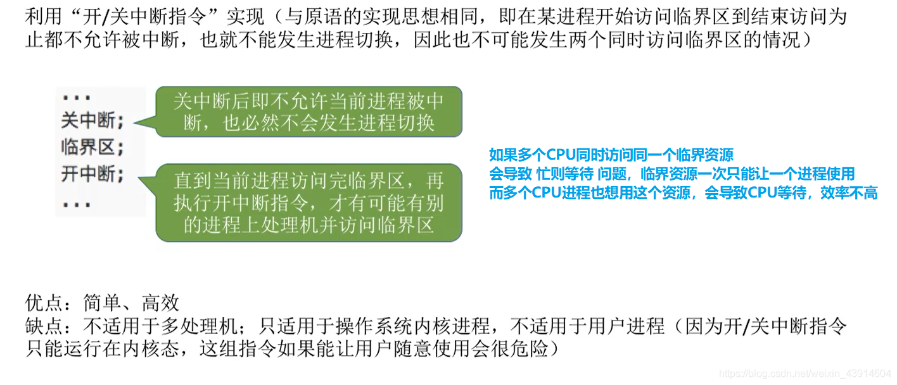
> > </div> 
> > 
> 
> 
> 


>
> **<font color="pink" size = 5>2. TestAndSet指令</font>**
> 
> > <div align=center>
> > 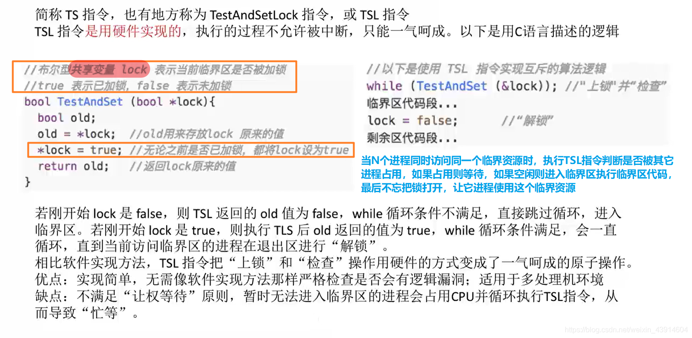
> > </div> 
> > 
> > 
> > 执行TSL指令时，它的内部运转逻辑：
> > 
> > * 假设`lock`现在为`false`，代表临界资源`A`空闲，那么我就可以访问这个资源，同时将`lock=true`，提醒别的进程，这个临界资源`A`我正在使用，让他们等等
> > 
> > * 假设`lock`为`true`，代表临界资源正在有人使用，所以我必须等待，并且将`lock=true`，并不影响什么，所以没关系，只是为了让`lock`为`false`时可以上锁，将上锁与检查在一个`TSL`指令完成。
> 
> 


>
> **<font color="pink" size = 5>3. Swap指令</font>**
> 
> > <div align=center>
> > 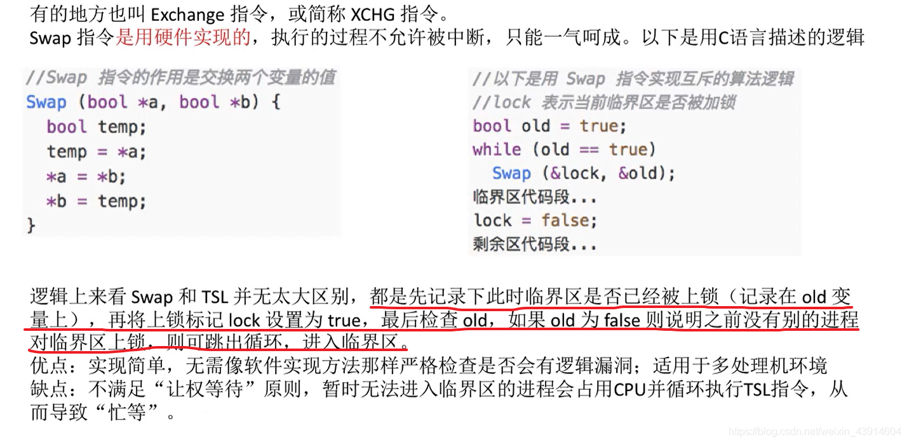
> > </div> 
> > 
> > 
> > `old是每个进程都要进行的一步，都必须将old=true`
> > 
> > `分析一下这样做的原因：`
> > 
> > > 因为`lock`是某一特定临界资源的共享变量，当每一个进程准备访问这个特定的临界资源时，初始化`old=true`，然后进入`while`循环进行交换，如果当前`lock`是`false`,则交换后`old=false`,则当前进程可以跳出循环进入临界区代码段，同时因为交换，`lock=old=true`上锁，不让别的进程来打扰，别的进程会因为`lock`变为`true`,一直在`while`循环等待,当我使用完临界资源，则将`lock=false`,此时别的进程再交换`old`和`lock`就能判断`old=false`,可以跳出循环，使用临界资源。
> > > 
> > 
> 
> 


#### 2.3.4 信号量机制（整型信号量、记录型信号量P、V）

>
> https://blog.csdn.net/weixin_43914604/article/details/104951182
> 


>
> **<font color="pink" size = 5>思维导图</font>**
> 
> > <div align=center>
> > 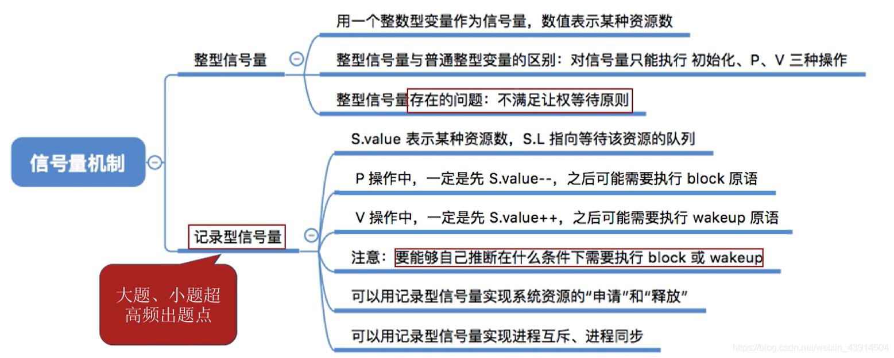
> > </div> 
> > 
> 
>
> `进程互斥的4个原则`
> > 
> > * `空闲让进`：临界区空闲时，应允许一个进程访问
> > * `忙则等待`：临界区正在被访问时，其他试图访问的进程需要等待
> > * `有限等待`：要在有限时间内进入临界区，保证不会饥饿
> > * `让权等待`：进不了临界区的进程，要释放处理机，防止忙等
>
> <font color="gree">记录型信号量，可以满足4个原则</font>
> 


>
> **<font color="pink" size = 5>1. 为什么引入信号量(Semaphore)机制？</font>**
>
> * `为了更好的解决进程互斥与同步的问题`
> 
> > <div align=center>
> > 
> > </div> 
> 
>
> 
> 
> 


>
> **<font color="pink" size = 5>2. 什么是信号量机制？</font>**
> 
> > <div align=center>
> > 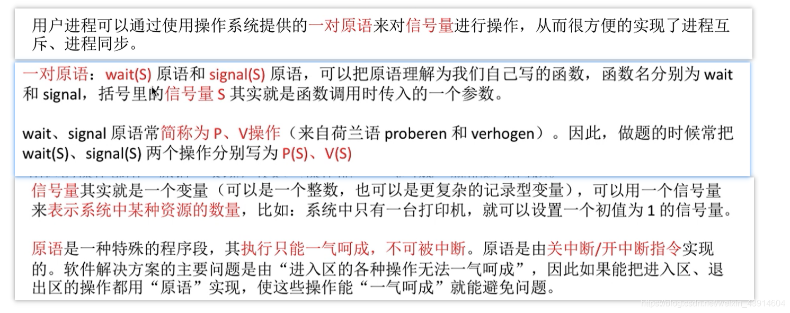
> > </div> 
> 
>
> * `信号量S`：整型变量(`int S`)、或记录型变量(`struct semaphore S`, 自定义结构体)，`表示系统中某种资源的数量`. 
>
> > * <font color="gree">当它的值大于`0`时，表示当前可用资源的数量；</font>
> > 
> > * <font color="gree">当它的值小于`0`时，其绝对值表示 等待使用该资源的进程 的个数。</font>
> > 
> > * `对信号量的操作只有3种：初始化、P操作、V操作`
> 
> 
> * `P、V操作`：又称`wait`,`signal`原语。主要是操作进程中对进程控制的`信息量的加减控制`。
>
> > * `P操作：wait原语（荷兰语proberen），可以理解为wait(S)函数，参数为信号量`
> > 
> > * `V操作：signal原语（荷兰语verhogen），可以理解为signal(S)函数，参数为信号量`
> > 
>
> https://blog.csdn.net/thebestway/article/details/105034840
> 
> * wait用法：
> > 
> > `wait(num)`,`num`是目标参数，`wait`的作用是使其（信息量）`减一`。
> > 
> > > 当前进程预定一个资源，信号量`减一`，然后判断
> > > 如果`信息量>=0`，则该进程继续执行；
> > > 如果`信息量<0`, 说明资源不够，该进程置为等待状态(阻塞态)，排入等待队列。
> 
> 
> * signal用法：
> > 
> > `signal(num)`,`num`是目标参数，`signal`的作用是使其（信息量）`加一`。
> > 
> > > 时间片结束，当前进程不能继续处于执行态，需要看别的进程脸色，
> > > 
> > > 信号量`加一`后，然后判断
> > > 如果`信息量>0`，说明该资源数量够用, 阻塞队列中没有其他进程，什么都不做；
> > > 如果`信息量<=0`, 则说明已经有别的一些进程预定了所有剩余资源，那些进程在等待队列中处于阻塞态，则唤醒`wakeup`等待队列中第一个等待信号量的进程。
> > 
> 
> 
> 
> 
> 


>
> **<font color="pink" size = 5>3. 整型信号量</font>**
> 
> > <div align=center>
> > 
> > </div> 
> 
> 
> <table>
>   <tr>
>   <td colspan = "4">
> 
> ```c++
> // 信号量初始化
> int S = 1;     // S表示当前系统中可用的打印机资源数
> 
> // 信号量P操作：wait原语，相当于进入区
> void wait(int S) {     
>     while (S <= 0);  // 如果资源数不够，就一直循环等待
>     S = S - 1;       // 如果资源数够，则占用一个资源
> }
>
> // 信号量V操作：signal原语，相当于退出区
> void signal(int S) {
>     S = S + 1;       // 使用完资源后，在退出区释放资源
> } 
> ```
> 
>   </td> 
>   </tr>
> 
>   <tr>
>   <td>
> 
> ```c++
> // 进程P0
> ...
> wait(S);       // 进入区，申请资源
> 使用打印机资源...    // 临界区，访问资源
> signal(S);     // 退出区，释放资源
> ```
> 
>   </td>
>   <td>
> 
> ```c++
> // 进程P0
> ...
> wait(S);
> 使用打印机资源...
> signal(S); 
> ```
> 
>   </td>
>   <td>
> 
> ```c++
> ...
> ```
> 
>   </td>
>   <td>
> 
> ```c++
> // 进程Pn
> ...
> wait(S);
> 使用打印机资源...
> signal(S); 
> ```
> 
>   </td>
>   </tr>
> </table>
> 
> 
>
> <font color="pink">
>
> 这样有问题，n个进程同时处于`运行态`的话, 如果`P0`此时使用打印机资源，其他的`P1、P2、...、Pn`需要一直等待，但是依旧`n-1个进程`一直占用`n-1个CPU`（因为是`运行态`, 分配了`CPU`），导致`忙等问题`，浪费`CPU`。无法实现`让权等待`
> 
> `让权等待`：进不了临界区的进程，要释放处理机，进入阻塞队列,防止忙等
>
> 怎么实现`让权等待`？
> > 
> > 1. 如果当前没有资源可用，就应该从`运行态`变为`阻塞态`，
> > 
> > 2. 当除了CPU以外的其他资源都准备好时，才能从`阻塞态`变为`就绪态`，
> > 
> > 3. 然后等待操作系统分配`CPU`，再从`就绪态`变为`运行态`
> 
> </font>
>
> 
> 


>
> **<font color="pink" size = 5>4. 记录型信号量</font>**
> 
> > <div align=center>
> > 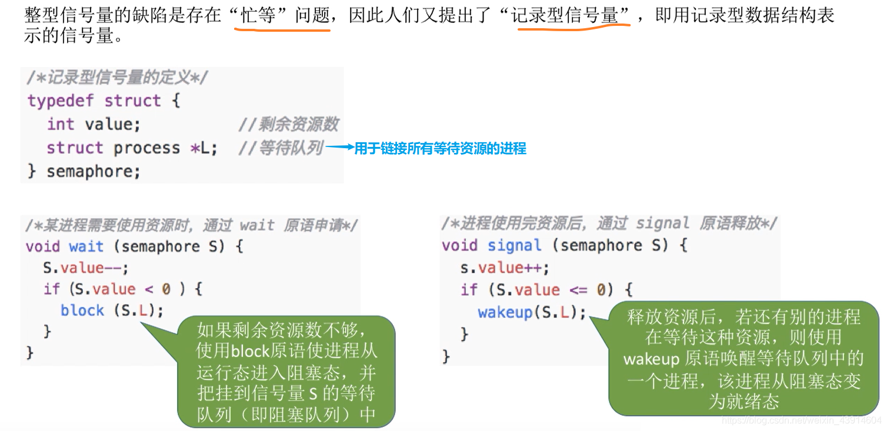
> > </div> 
> 
>
> <font color="pink">
>
> 实现了`让权等待`：进不了临界区的进程，要释放处理机，防止忙等
>
> 怎么解决的？
> > 
> > 1. 如果当前没有资源可用，就应该从`运行态`变为`阻塞态`，
> > 
> > 2. 当除了CPU以外的其他资源都准备好时，才能从`阻塞态`变为`就绪态`，
> > 
> > 3. 然后等待操作系统分配`CPU`，再从`就绪态`变为`运行态`
> 
> </font>
>
> 
> <table>
>   <tr>
>   <td colspan = "4">
> 
> ```c++
> /*记录型信号量的定义*/
> typedef struct {
>     int value;          // 剩余资源数 = 实际可用资源数 - 被预定资源数（等待队列）
>     struct process *L;  // 指向等待队列（即阻塞队列），用于连接所有等待资源的进程
> } semaphore;  // semaphore 翻译为 信号量
>
> /*某进程需要资源时，通过 wait 原语申请*/
> void wait (semaphore S) {
>     S.value--;          // 预定资源
>     if (S.value < 0) {  // 如果预定后S.value < 0, 说明当前根本没有资源可分配
>         block (S.L);    // 当前进程 运行态 --->>> 阻塞态 等待此预定资源释放
>     }
> }
>
> /*某进程使用完资源后，通过 signal 原语释放*/
> void signal(semaphore S) {
>     S.value++;
>     if (S.value <= 0) { // 释放资源后，本来应该S.value > 0, 但是由于已经被预定了，会出现 <= 0
>         wakeup (S.L);   // 这时候唤醒等待队列的进程, 阻塞态 --->>> 就绪态
>     }
> }
> ```
> 
>   </td> 
>   </tr>
> 
>   <tr>
>   <td>
> 
> ```c++
> // 进程P0
> ...
> wait(S);       // 进入区，申请资源
> 使用打印机资源...    // 临界区，访问资源
> signal(S);     // 退出区，释放资源
> ```
> 
>   </td>
>   <td>
> 
> ```c++
> // 进程P0
> ...
> wait(S);
> 使用打印机资源...
> signal(S); 
> ```
> 
>   </td>
>   <td>
> 
> ```c++
> ...
> ```
> 
>   </td>
>   <td>
> 
> ```c++
> // 进程Pn
> ...
> wait(S);
> 使用打印机资源...
> signal(S); 
> ```
> 
>   </td>
>   </tr>
> </table>
> 
> 
>
> 
> <font color="pink">4.1. 举一个生动形象的例子了解记录型信号量</font>
>
> * 一张图咱们回忆一下进程的状态
> 
> > <div align=center>
> > 
> > </div> 
> 
> 
>
> * 一个例子
> 
> > <div align=center>
> > 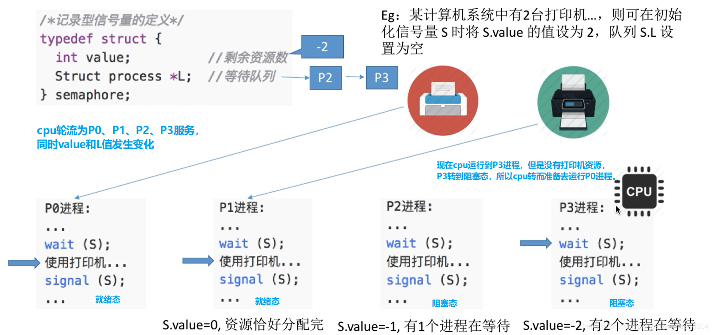
> > 
> > 
> > 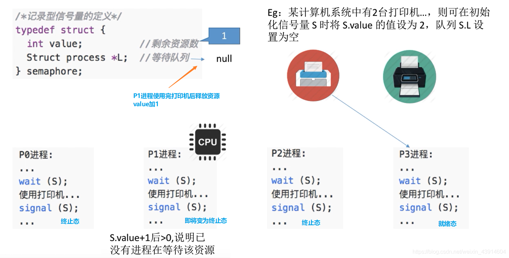
> > 
> > </div> 
> 
> 
> 
> 
> <font color="pink">4.2. 梳理一下记录型信号量的知识点（P、V）</font>
> 
> > <div align=center>
> > 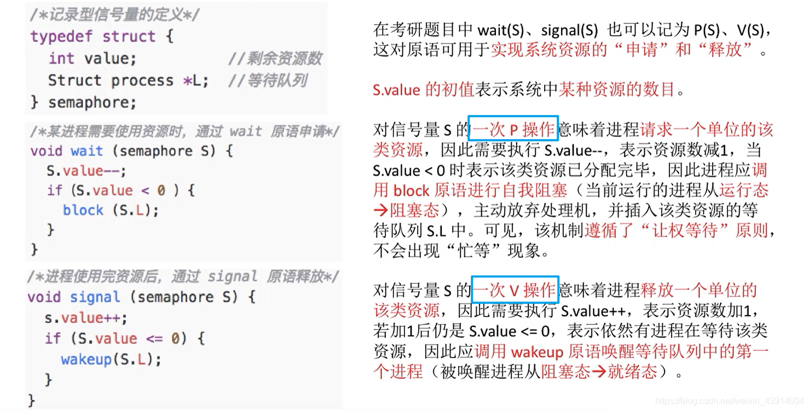
> > </div> 
>
> 
> `进程的互斥`:是指当有若干个进程都要使用某一共享资源时，任何时刻最多只允许一个进程去使用该资源，其他要使用它的进程必须等待，直到该资源的占用着释放了该资源。
> 
> `进程的同步`:是指在并发进程之间存在这一种`制约关系`，一个进程依赖另一个进程的`消息`，当一个进程没有得到另一个进程的`消息`时应`等待`，直到`消息`到达才被`唤醒`。
> 
> 


#### 2.3.5 信号量机制实现进程的互斥、同步与前驱关系

>
> https://blog.csdn.net/weixin_43914604/article/details/104954222
> 


>
> **<font color="pink" size = 5>思维导图</font>**
> 
> > <div align=center>
> > 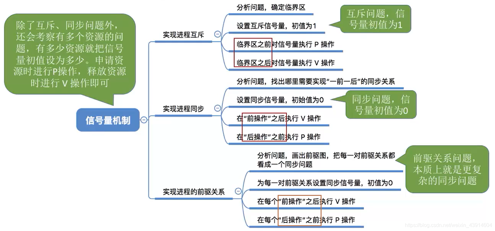
> > </div> 
> > 
>
> <font color="pink">
> 
> 因为`共享资源, 且资源有限`，才有了`进程互斥`，需要`（记录型）信号量机制`解决
>
> 因为有`进程并发（宏观并行，微观串行）`，才有了`进程异步`问题，需要`进程同步`解决, 其实还是使用`（记录型）信号量机制`解决
>
> </font>
> 
> <font color="gree">`进程互斥`和`进程同步`是两个问题</font>
> 
> 
>
> 
> 
> 1. `进程的互斥`:是指当有若干个进程都要使用某一`共享资源`时，任何时刻最多只允许一个进程去使用该`资源`，其他要使用它的进程必须`等待（阻塞态）`，直到该`资源`的占用着`释放`了该资源才被`唤醒（阻塞态 --->>> 就绪态）`。
>
> > `如果没有解决互斥关系，就会产生各种问题，特别是忙等问题，浪费CPU； 所以提出了进程同步`
> > 
> > `进程互斥的4个原则`
> > 
> > * `空闲让进`：临界区空闲时，应允许一个进程访问
> > * `忙则等待`：临界区正在被访问时，其他试图访问的进程需要等待
> > * `有限等待`：要在有限时间内进入临界区，保证不会饥饿
> > * `让权等待`：进不了临界区的进程，要释放处理机，防止忙等
> > 
> > 实现 多个进程 合理地分配资源 来使用
> 
> 
> 2. `进程的同步`:是指在并发进程之间存在这一种`制约关系`，一个进程依赖另一个进程的`消息`，当一个进程没有得到另一个进程的`消息`时应`等待（阻塞态）`，直到`消息`到达才被`唤醒（阻塞态 --->>> 就绪态）`。
> 
> > 
> > * `异步`：多道程序环境允许`多个程序并发`执行，但由于资源有限，如`CPU`只有一个，`进程的执行并不是一贯到底的，而是走走停停的`，它以不可预知的速度向前推进。
> > 
> > > <font color="green">比如A进程正在占用CPU计算，B进程这时也想占用CPU计算，B进程只有等，等A进程算完了，A进程去访问磁盘资源了，这时B进程再占用CPU进行计算，B进程还没计算完，A进程从磁盘取出资源了，A进程发现B这时在占用CPU，这时A进程就需要等待，等B算完后再继续到CPU中进行计算。由于每个进程占用资源的时间不固定，所以进程的执行以不可预知的速度前进</font>
> > 
> > 
> > `进程同步`: 解决`进程互斥`产生的`异步问题`，`使得并发的进程可以有序推进，保证前后关系`。
> > 
> 
> 
> 
> 


>
> **<font color="pink" size = 5>1. 信号量机制实现进程互斥</font>**
>
> <font color="yellow">
> 
> 讨论`进程互斥`问题时，假设`P0、P1、...、Pn`之间没有任何的`前驱关系`, 不涉及`进程同步`问题。
> 
> 只是都需要`临界区`的资源, 只涉及`进程互斥`问题
> 
> </font>
> 
> > <div align=center>
> > 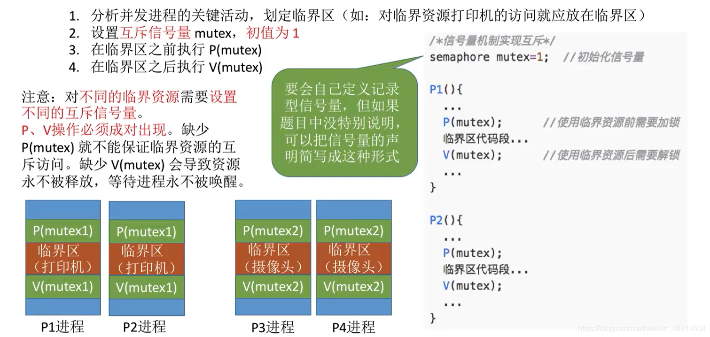
> > </div> 
> 
> 
> * `为了满足进程互斥的4个原则`，需要如下这样做：
> > 
> > <font color="gree">
> > 
> > * 在`临界区`（使用临界资源的代码）`之前`执行`P(mutex)`，`申请临界区资源, 上锁`
> > 
> > * 在`临界区`（使用临界资源的代码）`之后`执行`V(mutex)`，`释放临界区资源, 解锁`
> > 
> > </font>
>


>
> **<font color="pink" size = 5>2. 信号量机制实现进程同步 (按照某种顺序推进)</font>**
>
> <font color="yellow">
> 
> 讨论`进程同步`问题时，假设`P0、P1、...、Pn`之间不共享资源，不涉及`进程互斥`问题
> 
> 只是一些进程之间的部分代码有`依赖关系`, 只涉及`进程同步`问题
> 
> </font>
>
> * 想象一下四则运算的顺序，加减乘除；
> 
> > <div align=center>
> > 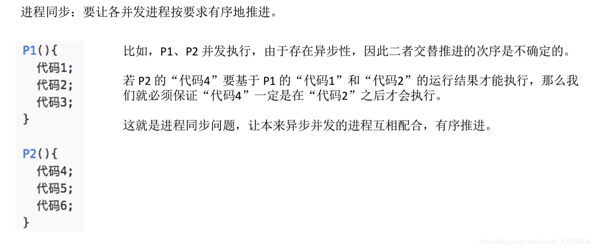
> > </div> 
> 
> 
> * 要想理解这一部分知识，必须知道`P、V操作`的内部实现原理
> 
> > <div align=center>
> > 
> > </div> 
> 
>
> <font color="gree">
> 
> `P0、P1、...、Pn之间`有`前驱关系`（`P1`中的`部分代码-后操作`，依赖于`P2`的`部分代码-前操作`的运行结果；）, 先执行哪个，后执行哪个，非常重要，`保证` 每个进程的`完整代码` 最终都能够得到`执行`。
> 
> 
> </font>
> 
> * `为了满足进程同步，避免出现异步问题（顺序错乱）`，需要如下这样做：
> > 
> > <font color="gree">
> > 
> > * 在`前操作`（进程`Pi`的部分代码）`之后`执行`V(S)`，`释放CPU，运行->阻塞`
> > 
> > * 在`后操作`（进程`Pj`的部分代码）`之前`执行`P(S)`，`申请CPU，阻塞->就绪`
> > 
> > </font>
>
> 
> 


>
> **<font color="pink" size = 5>3. 信号量机制实现前驱关系(本质上就是同步关系，只是更复杂)</font>**
> 
> > <div align=center>
> > 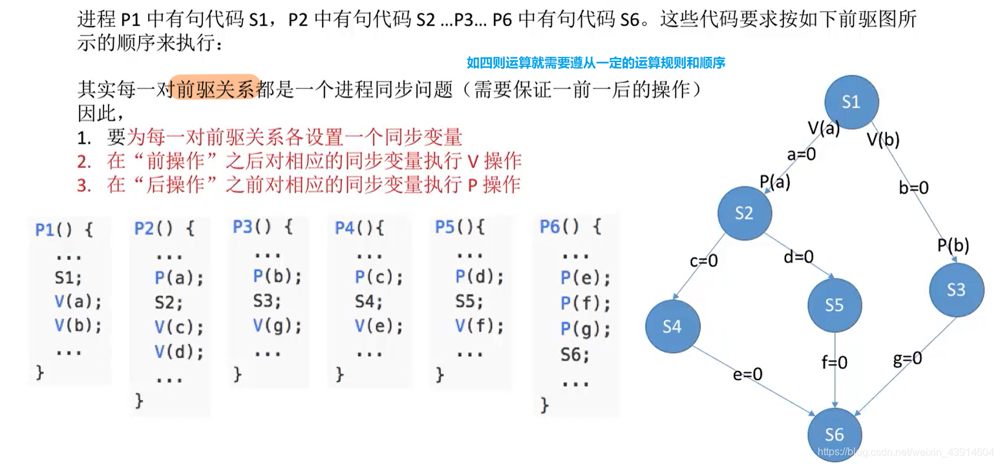
> > </div> 
> > 
> > <font color="gree">一共`7`对前驱关系</font>
> > 
> > `S1 --->>> S2`: 
> > 
> > > 则在`S1`之后设置`V`操作，`S2`之前设置`P`操作, 为了跟其他的前驱关系区分开, 设置为`V(a)，P(a)`
> > 
> > `S1 --->>> S3`: 
> > 
> > > 则在`S1`之后设置`V`操作，`S3`之前设置`P`操作, 为了跟其他的前驱关系区分开, 设置为`V(b)，P(b)`
> > 
> > `S2 --->>> S4`: 
> > 
> > > 则在`S2`之后设置`V`操作，`S4`之前设置`P`操作, 为了跟其他的前驱关系区分开, 设置为`V(c)，P(c)`
> > 
> > `S2 --->>> S5`: 
> > 
> > > 则在`S2`之后设置`V`操作，`S5`之前设置`P`操作, 为了跟其他的前驱关系区分开, 设置为`V(d)，P(d)`
> > 
> > `S3, S4, S5 --->>> S6`: 
> > 
> > > 则在`S3`之后设置`V`操作，`S6`之前设置`P`操作, 为了跟其他的前驱关系区分开, 设置为`V(e)，P(e); `
> > > 则在`S4`之后设置`V`操作，`S6`之前设置`P`操作, 为了跟其他的前驱关系区分开, 设置为`V(f)，P(f); `
> > > 则在`S5`之后设置`V`操作，`S6`之前设置`P`操作, 为了跟其他的前驱关系区分开, 设置为`V(g)，P(g); `
> > 
> 
> 
> 
> 


#### 2.3.6 进程同步与互斥经典问题（生产者-消费者问题、多生产者-多消费者问题、吸烟者问题、读者-写者问题、哲学家进餐问题）

>
> https://blog.csdn.net/weixin_43914604/article/details/105120888
> 


>
> **<font color="pink" size = 5>0. 前言</font>**
>
> 
> > <font color="pink">
> > 
> > 方便记忆
> > 
> > `P: 申请`，包括申请临界区资源、申请CPU
> > 
> > `V: 释放`，包括释放临界区资源、释放CPU
> > 
> > </font>
> 
> <br>
> <br>
> <br>
> 
> 
> > * `为了满足进程互斥的4个原则`，需要如下这样做：
> > 
> > > <font color="gree">
> > > 
> > > * 在`临界区`（使用资源的代码）`之前`执行`P(mutex)`，`申请临界区资源，上锁`
> > > 
> > > * 在`临界区`（使用资源的代码）`之后`执行`V(mutex)`，`释放临界区资源，解锁`
> > > 
> > > </font>
> > 
> > <font color="yellow">
> > 
> > 讨论`进程互斥`问题时，假设`P0、P1、...、Pn`之间没有任何的`前驱关系`, 不涉及`进程同步`问题。
> > 
> > 只是都需要`临界区`的资源, 只涉及`进程互斥`问题
> > 
> > </font>
> 
> <br>
> <br>
> <br>
> 
> > * `为了满足进程同步，避免出现异步问题（顺序错乱）`，需要如下这样做：
> > > 
> > > <font color="gree">
> > > 
> > > * 在`前操作`（进程`Pi`的部分代码）`之后`执行`V(S)`，`释放CPU，运行->阻塞`
> > > 
> > > * 在`后操作`（进程`Pj`的部分代码）`之前`执行`P(S)`，`申请CPU，阻塞->就绪`
> > > 
> > > </font>
> > 
> > 
> > <font color="yellow">
> > 
> > 讨论`进程同步`问题时，假设`P0、P1、...、Pn`之间不共享资源，不涉及`进程互斥`问题
> > 
> > 只是一些进程之间的部分代码有依赖关系, 只涉及`进程同步`问题
> > 
> > </font>
>
> <br>
> <br>
> <br>
> 
> > <font color="pink">现在，要同时出现`进程互斥`问题 和 `进程同步`问题了， 就需要`互斥信号量`、`同步信号量`都在</font>
> > 
> > 如果`P0`、`P1`之间有前驱关系，必须先执行完`P0`的一部分，`P1`才允许执行，然后`P0`和`P1`又都需要共享一些资源, 就麻烦了，如果`P1`先占用了资源，`P0`处于等待队列中，就会`卡住`，直到时间片结束。`P1`虽然也使用了资源，但是代码没有完整走完。
> > 
> > 
> > <div align=center>
> > 
> > </div> 
> 
> 


>
> **<font color="pink" size = 5>1. 生产者-消费者问题</font>**
> 
> <font color="pink">1.1. 问题描述</font>
> 
> > * 系统中有`一组生产者进程`和`一组消费者进程`，生产者进程`每次生产一个产品`放入缓冲区，消费者进程从缓冲区中`每次取出一个产品`并使用。(注: 这里的“`产品`”理解为`某种数据`)
> > 
> > * 生产者、消费者共享一个初始为空、大小为`n`的缓冲区。
> > 
> > * 只有缓冲区`没满`时，`生产者`才能把产品`放入`缓冲区，否则必须等待。
> > 
> > * 只有缓冲区`不空`时，`消费者`才能从中`取出`产品，否则必须等待。 
> > 
> > * `缓冲区是临界资源`，各进程必须`互斥`地访问。
> > 
> > <div align=center>
> > 
> > </div> 
>
> 
> 
> 
> <font color="pink">1.2. 问题分析</font>
> 
> > 1) `关系分析`。生产者和消费者对缓冲区互斥访问是`互斥关系`，同时生产者和消费者又是一个相互协作的关系，只有生产者生产之后,消费者才能消费，它们也是`同步关系`。 
> > 
> > 2) `整理思路`。根据各进程的操作流程确定P、V操作的大致顺序。
> > > 
> > > * 生产者每次要消耗(`P`）一个空闲缓冲区，并生产(`V`)一个产品。
> > > * 消费者每次要消耗(`P`）一个产品，并释放一个空闲缓冲区(`V`)。
> > > * 往缓冲区放入/取走产品需要互斥。
> > > 
> > 
> > 3) `信号量设置`。设置信号量。设置需要的信号量，并根据题目条件确定信号量初值。( `互斥信号量初值一般为1`，`同步信号量的初始值要看对应资源的初始值是多少`)
> > 
> > <div align=center>
> > 
> > </div> 
> > 
> > * `semaphore: 中文译为 "信号量"`
> > 
> > 
> 
> 
> 
> 
> <font color="pink">1.3. 如何实现？</font>
> 
> > <div align=center>
> > 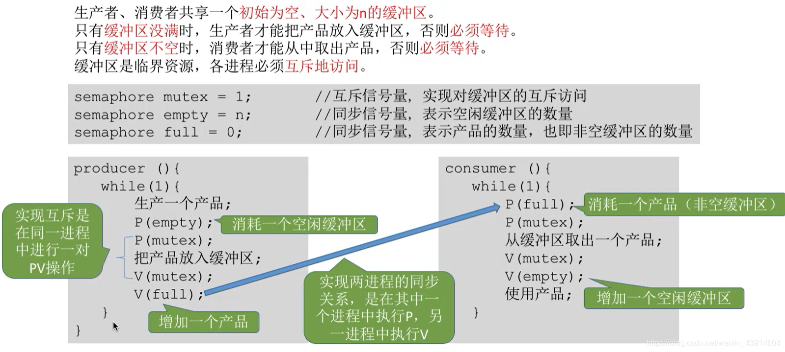
> > </div> 
> 
> 代码参考：
> https://blog.csdn.net/aimat2020/article/details/121641563
> https://blog.csdn.net/chenzhanqi/article/details/82854991
> 
> 
> <table>
>   <tr>
>   <td colspan = "2">
> 
> ```c++
> /*记录型信号量的定义*/
> typedef struct {
>     int value;          // 剩余资源数 = 实际可用资源数 - 被预定资源数（等待队列）
>     struct process *L;  // 指向等待队列（即阻塞队列），用于连接所有等待资源的进程
> } semaphore;  // semaphore 翻译为 信号量
>
> /*某进程需要资源时，通过 wait 原语申请*/
> void wait (semaphore S) {
>     S.value--;          // 预定资源
>     if (S.value < 0) {  // 如果预定后S.value < 0, 说明当前根本没有资源可分配
>         block (S.L);    // 当前进程 运行态 --->>> 阻塞态 等待此预定资源释放
>     }
> }
>
> /*某进程使用完资源后，通过 signal 原语释放*/
> void signal(semaphore S) {
>     S.value++;
>     if (S.value <= 0) { // 释放资源后，本来应该S.value > 0, 但是由于已经被预定了，会出现 <= 0
>         wakeup (S.L);   // 这时候唤醒等待队列的进程, 阻塞态 --->>> 就绪态
>     }
> }
> 
> 
> // 互斥信号量，初值为1； 
> // 同步信号量，初值为0；
> // 多个资源的同步信号量，开始有多少资源, 资源同步信号量初值就设为多少
> semaphore mutex; mutex.value = 1;  // 互斥信号量，实现对缓冲区的互斥访问
> semaphore buffer; buffer.value = n;  // 同步信号量，表示（空闲）缓冲区的数量
> semaphore product; product.value = 0;   // 同步信号量，表示产品的数量（也即非空缓冲区的数量）
> ```
> 
>   </td> 
>   </tr>
> 
>   <tr>
>   <td>
> 
> ```c++
> // 生产者进程
> producer () {
>     while(1) {
>         生产一个产品;
>         wait(buffer);        // 预定一个空闲缓冲区，空缓冲信号量-1；如果没有，先进入等待队列
>         wait(mutex);        // mutex = 0；说明正在被访问，上锁
>         把产品放入一个缓冲区; 
>         signal(mutex);      // mutex = 1；说明访问结束，解锁
>         signal(product);       // 增加一个产品，产品信号量+1；如果被预定了，唤醒等待队列
>     } 
> }
> ```
> 
>   </td>
>   <td>
> 
> ```c++
> // 消费者进程
> consumer () {
>     while(1) {
>         wait(product);         // 预定一个产品，产品信号量-1，如果没有，先进入等待队列
>         wait(mutex);        // mutex = 0；说明正在被访问，上锁
>         从缓冲区取出一个产品;
>         signal(mutex);      // mutex = 1；说明访问结束，解锁
>         signal(buffer);      // 增加一个空闲缓冲区，空缓冲信号量+1；如果被预定了，唤醒等待队列
>         使用产品; 
>     }
> }
> ```
> 
>   </td>
>   </tr>
> </table>
> 
> 
>
> <font color="gree">解释如下：</font>
> > 
> > 
> > > <font color="gree">
> > > 
> > > 为了实现`互斥`：有信号量`mutex`
> > > 
> > > * 在`临界区`（访问缓冲区）`之前`执行`P(mutex)`，`申请临界区资源，上锁`
> > > 
> > > * 在`临界区`（访问缓冲区）`之后`执行`V(mutex)`，`释放临界区资源，解锁`
> > > 
> > > * 每个进程中用于实现`互斥信号量mutex`的`P、V`操作必须成对出现。
> > > 
> > > </font>
> > 
> > > 
> > > <font color="gree">
> > > 
> > > 为了实现`同步`：有信号量`buffer`、`product`
> > > 
> > > * 在`前操作`（生产者访问缓冲区）`之后`执行`V(buffer)`，`释放CPU，运行->阻塞`  
> > > 
> > > * 在`后操作`（消费者访问缓冲区）`之前`执行`P(buffer)`，`申请CPU，阻塞->就绪`
> > > 
> > > * 在`前操作`（消费者访问产品）`之后`执行`V(product)`，`释放CPU，运行->阻塞`
> > > 
> > > * 在`后操作`（生产者访问产品）`之前`执行`P(product)`，`申请CPU，阻塞->就绪`
> > > 
> > > * 用于实现`同步/资源信号量S`的`P、V`操作也需要`成对出现`，`但处于不同的进程中`。
> > > 
> > > </font> 
> > 
> > > 
> > > <font color="gree">
> > > 
> > > * 实现`互斥`的`P`操作一定要在实现`同步`的`P`操作`之后`
> > > 
> > > > 必须先执行`（资源）同步信号量(S)`的`P`操作，再执行对`互斥信号量(mutex)`的`P`操作，否则可能引起进程死锁。
> > > 
> > > * `V`操作不会导致进程阻塞乃至死锁，所以`V`之间可以交换顺序
> > > 
> > > </font> 
>
> <br>
> <br>
> <br>
>
> <font color="pink">为什么实现`互斥`的`P`操作一定要在实现`同步`的`P`操作`之后`？</font> 
>
> > <font color="pink">假设`互斥`的`P`操作 在实现`同步`的`P`操作`之前`</font> 
> > 
> > <table>
> >   <tr>
> >   <td colspan = "2">
> > 
> > ```c++
> > 
> > // 互斥信号量，初值为1； 
> > // 同步信号量，初值为0；
> > // 多个资源的同步信号量，开始有多少资源, 资源同步信号量初值就设为多少
> > semaphore mutex; mutex.value = 1;  // 互斥信号量，实现对缓冲区的互斥访问
> > semaphore buffer; buffer.value = n;  // 同步信号量，表示（空闲）缓冲区的数量
> > semaphore product; product.value = 0;   // 同步信号量，表示产品的数量（也即非空缓冲区的数量）
> > ```
> > 
> >   </td> 
> >   </tr>
> > 
> >   <tr>
> >   <td>
> > 
> > ```c++
> > // 生产者进程
> > producer () {
> >     while(1) {
> >         生产一个产品;
> >         wait(mutex);        // 1
> >         wait(buffer);       // 2
> >         把产品放入一个缓冲区; 
> >         signal(mutex);      // 3
> >         signal(product);    // 4
> >     } 
> > }
> > ```
> > 
> >   </td>
> >   <td>
> > 
> > ```c++
> > // 消费者进程
> > consumer () {
> >     while(1) {
> >         wait(mutex);        // 5   
> >         wait(product);      // 6 
> >         从缓冲区取出一个产品;
> >         signal(mutex);      // 7
> >         signal(buffer);     // 8
> >         使用产品; 
> >     }
> > }
> > ```
> > 
> >   </td>
> >   </tr>
> > </table>
> > 
> >  
> > 
> > 
> > 
> > <font color="pink">情况1：</font> 
> > 
> > 此时，缓冲区中没有产品`buffer = n, product = 0, mutex = 1` ；
> > 
> > * 先执行`consumer`进程，执行到`5`使得`mutex=0`, 再执行到`6`则`consumer`被阻塞，进入等待队列（因为此时`product = 0;`并没有产品）；重要的是, 我们没有执行`V(mutex)`, `mutex`仍旧为`0`，`临界区依旧上锁`；
> > 
> > * 切换到`producer`进程，生产者执行到`1`，则`producer`直接被阻塞，进入等待队列（因为此时`mutex = 0`, `临界区并没有解锁`）；
> > 
> > 这就造成了生产者等待消费者解锁，而消费者又等待生产者生产产品的情况；都`等待`被对方`唤醒`，出现`死锁`
> > 
> > 
> > <font color="pink">情况2：</font> 
> > 
> > 此时，缓冲区中被产品占满`buffer = 0, product = n, mutex = 1` ；
> > 
> > * 先执行`producer`进程，执行到`1`使得`mutex=0`, 再执行到`2`则`producer`被阻塞，进入等待队列（因为此时`buffer = 0;`并没有空闲的缓冲区了）；重要的是, 我们没有执行`V(mutex)`, `mutex`仍旧为`0`，`临界区依旧上锁`；
> > 
> > * 切换到`consumer`进程，消费者执行到`5`，则`consumer`直接被阻塞，进入等待队列（因为此时`mutex = 0`, `临界区并没有解锁`）；
> > 
> > 这就造成了生产者等待消费者释放空闲缓冲区，而消费者又等待生产者解锁的情况；都`等待`被对方`唤醒`，出现`死锁`
> > 
> 
> 
> 
> 
> <font color="pink">1.4. 实现互斥的P操作一定要在实现同步的P操作之后</font>
> 
> > <div align=center>
> > 
> > </div> 
> 
> 
> 
> 
> 
> 
> <font color="pink">1.5. 知识回顾与重要考点</font>
> 
> > <div align=center>
> > 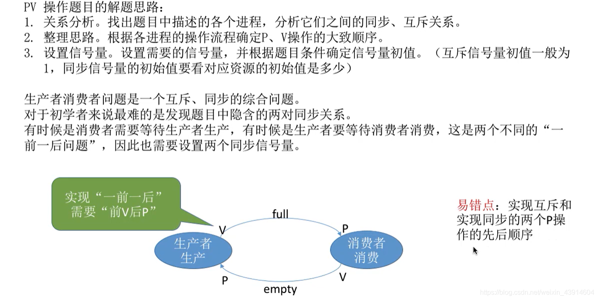
> > </div> 
> 
> 
> 
> 
> 


>
> **<font color="pink" size = 5>2. 多生产者-多消费者问题</font>**
> 
> <font color="pink">2.1. 问题描述</font>
> 
> > <div align=center>
> > 
> > </div> 
> 
> 
> 
> <font color="pink">2.2. 问题分析</font>
> 
> > <div align=center>
> > 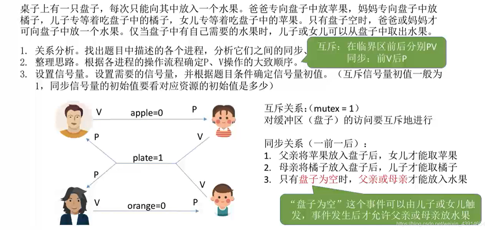
> > </div> 
> 
> 有哪些互斥关系？
>
> * 两个生产者`father`、`mother`和两个消费者`son`、`daughter`，四人对缓冲区的访问是互斥的，同一时刻只能允许一个人访问缓冲区
>
> 
>
> 有哪些是同步关系？
>
> * 资源信号量`buffer或者plate`、`apple`、`orange`需要同步
> 
> > 
> > > <font color="gree">
> > > 
> > > 为了实现`互斥`：有信号量`mutex`
> > > 
> > > * 在`临界区`（访问缓冲区）`之前`执行`P(mutex)`，`申请临界区资源，上锁`
> > > 
> > > * 在`临界区`（访问缓冲区）`之后`执行`V(mutex)`，`释放临界区资源，解锁`
> > > 
> > > * 每个进程中用于实现`互斥信号量mutex`的`P、V`操作必须成对出现。
> > > 
> > > </font>
> > 
> > > 
> > > <font color="gree">
> > > 
> > > 为了实现`同步`：有信号量`buffer`、`product`
> > > 
> > > * 在`前操作`（父亲访问盘子）`之后`执行`V(plate)`，`释放CPU，运行->阻塞`    
> > > 
> > > * 在`后操作`（女儿访问盘子）`之前`执行`P(plate)`，`申请CPU，阻塞->就绪`
> > > 
> > > * 在`前操作`（母亲访问盘子）`之后`执行`V(plate)`，`释放CPU，运行->阻塞`    
> > > 
> > > * 在`后操作`（儿子访问盘子）`之前`执行`P(plate)`，`申请CPU，阻塞->就绪`
> > > 
> > > * 在`前操作`（父亲访问苹果）`之后`执行`V(apple)`，`释放CPU，运行->阻塞`  
> > > 
> > > * 在`后操作`（女儿访问苹果）`之前`执行`P(apple)`，`申请CPU，阻塞->就绪`
> > > 
> > > * 在`前操作`（母亲访问橘子）`之后`执行`V(orange)`，`释放CPU，运行->阻塞`  
> > > 
> > > * 在`后操作`（儿子访问橘子）`之前`执行`P(orange)`，`申请CPU，阻塞->就绪`
> > > 
> > > 
> > > * 用于实现`同步/资源信号量S`的`P、V`操作也需要`成对出现`，`但处于不同的进程中`。
> > > 
> > > > 必须先执行`（资源）同步信号量(S)`的`P`操作，再执行对`互斥信号量(mutex)`的`P`操作，否则可能引起进程死锁。
> > > 
> > > </font> 
> > 
> 
> 
> 
> <table>
>   <tr>
>   <td colspan = "4">
> 
> ```c++
> /*记录型信号量的定义*/
> typedef struct {
>     int value;          // 剩余资源数 = 实际可用资源数 - 被预定资源数（等待队列）
>     struct process *L;  // 指向等待队列（即阻塞队列），用于连接所有等待资源的进程
> } semaphore;  // semaphore 翻译为 信号量
>
> /*某进程需要资源时，通过 wait 原语申请*/
> void wait (semaphore S) {
>     S.value--;          // 预定资源
>     if (S.value < 0) {  // 如果预定后S.value < 0, 说明当前根本没有资源可分配
>         block (S.L);    // 当前进程 运行态 --->>> 阻塞态 等待此预定资源释放
>     }
> }
>
> /*某进程使用完资源后，通过 signal 原语释放*/
> void signal(semaphore S) {
>     S.value++;
>     if (S.value <= 0) { // 释放资源后，本来应该S.value > 0, 但是由于已经被预定了，会出现 <= 0
>         wakeup (S.L);   // 这时候唤醒等待队列的进程, 阻塞态 --->>> 就绪态
>     }
> }
> 
> 
> // 互斥信号量，初值为1； 
> // 同步信号量，初值为0；
> // 多个资源的同步信号量，开始有多少资源, 资源同步信号量初值就设为多少
> semaphore mutex; mutex.value = 1;  // 互斥信号量，实现对缓冲区的互斥访问
> semaphore plate; plate.value = 1;  // 同步信号量，表示（空闲）缓冲区的数量，即盘子的容量
> semaphore apple; product.value = 0;   // 同步信号量，表示苹果的数量
> semaphore orange; product.value = 0;   // 同步信号量，表示苹果的数量
> ```
> 
>   </td> 
>   </tr>
> 
>   <tr>
>   <td>
> 
> ```c++
> // father进程
> father () {
>     while(1) {
>         准备一个苹果;
>         wait(plate);        
>         wait(mutex);        
>         把苹果放入盘子; 
>         signal(mutex);      
>         signal(apple);       
>     } 
> }
> ```
> 
>   </td>
>   <td>
> 
> ```c++
> // mother进程
> mother () {
>     while(1) {
>         准备一个橘子;
>         wait(plate);        
>         wait(mutex);        
>         把橘子放入盘子; 
>         signal(mutex);      
>         signal(orange);       
>     } 
> }
> ```
> 
>   </td>
>   <td>
> 
> ```c++
> // son进程
> son () {
>     while(1) {
>         wait(orange);         
>         wait(mutex);       
>         从盘子取出一个橘子;
>         signal(mutex);      
>         signal(plate);      
>         食用橘子; 
>     }
> }
> ```
> 
>   </td>
>   <td>
> 
> ```c++
> // daughter进程
> daughter () {
>     while(1) {
>         wait(apple);         
>         wait(mutex);       
>         从盘子取出一个苹果;
>         signal(mutex);      
>         signal(plate);      
>         食用苹果; 
>     }
> }
> ```
> 
>   </td>
>   </tr>
> </table>
>
> <font color="orange">以上代码，即使盘子的容量大于`1`（或者多个盘子，每个盘子容量`1`）, 也可以正常跑，只需要修改初始值`semaphore plate; plate.value = n; // n为盘子容量`</font> 
>
> 
> 
> 
> <font color="pink">2.3. 实现方法</font>
> 
> <font color="pink">① 有mutex</font>
> 
> > <div align=center>
> > 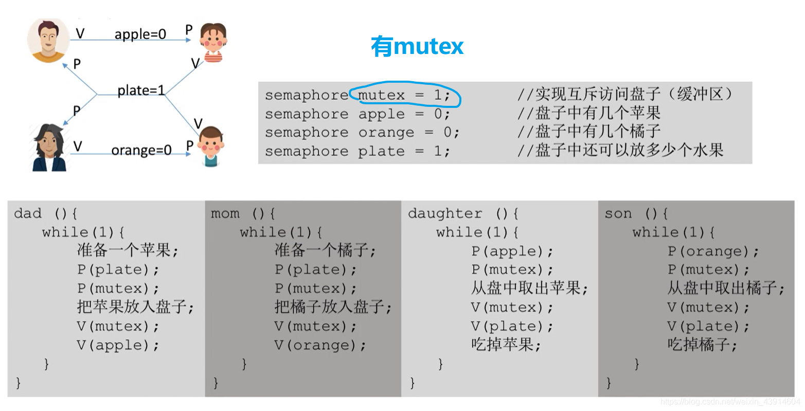
> > </div> 
> 
> <font color="pink">② 无mutex</font>
> 
> > <div align=center>
> > 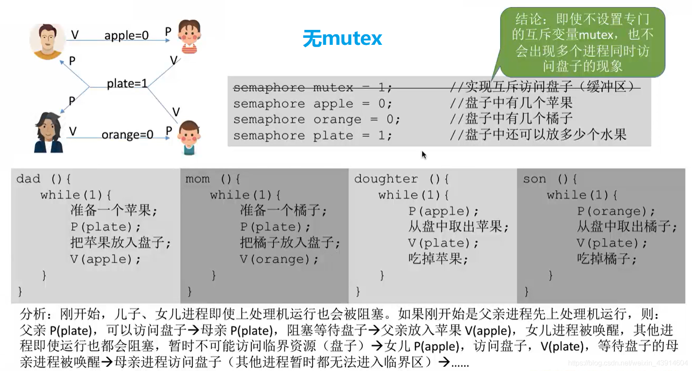
> > </div> 
> 
> <font color="pink">③ 为什么有mutex和没有mutex一样呢？</font>
> 
> * 原因在于:本题中的缓冲区大小为`1`，在任何时刻，`apple`、 `orange`、 `plate` 三个同步信号量中最多只有一个是`1`。因此在任何时刻，最多只有一个进程的`P`操作不会被阻塞，并顺利地进入临界区…
> 
> <font color="pink">④ 如果有两个盘子`plate`</font>
> 
> > <div align=center>
> > 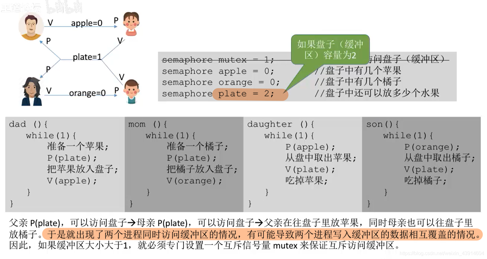
> > </div> 
> 
> 
> 
> 
> 
> <font color="pink">2.4. 知识总结与重要考点</font>
> 
> * `总结`:在生产者_消费者问题中，如果缓冲区大小为`1`，那么有可能不需要设置互斥信号量就可以实现互斥访问缓冲区的功能。当然，这不是绝对的，要具体问题具体分
> 
> * `建议`:在考试中如果来不及仔细分析，可以加上互斥信号量，保证各进程一定会互斥地访问缓冲区。但需要注意的是，`实现互斥的P操作一定要在实现同步的P操作之后`，否则可能引起`"死锁"`。
> 
> > <div align=center>
> > 
> > </div> 
> 
> 
> 
> 
> 


>
> **<font color="pink" size = 5>3. 读者-写者问题（没看懂）</font>**
>
> 
> <font color="pink">3.1. 问题描述</font>
> 
> > <div align=center>
> > 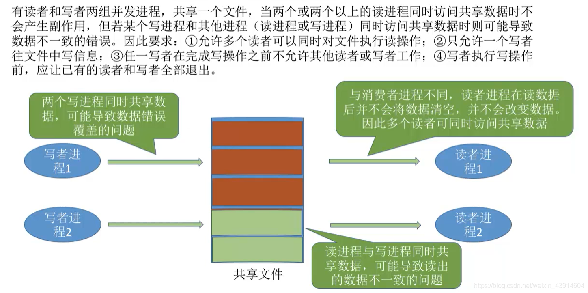
> > </div> 
> 
>  
> 
> <font color="yellow">试一试自己画出来`V + P`图？</font>
> 
> 
>
> 
> <font color="pink">3.2. 问题分析</font>
> 
> > <div align=center>
> > 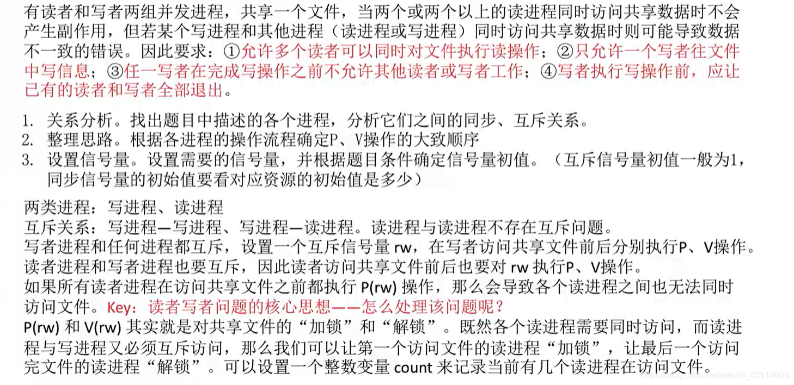
> > </div> 
> 
> 
> 
> 
> <font color="pink">3.3. 实现方法</font>
>
> <font color="pink">① 给count加mutex互斥访问 </font>
> 
> > <div align=center>
> > 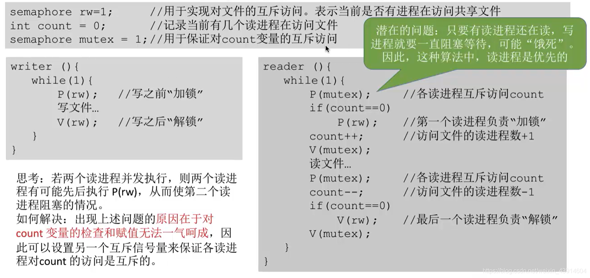
> > </div> 
> > 
> > 这里说一下为什么要加`mutex`。
> > 
> > 比如：
> > 
> > 当`count=0`时，第一个读者进程执行到`P(rw)`,`rw=0`, 有写进程访文件，所以只能等待了
> > 
> > 假设此时时间片到了，切换到第二个读者进程,第二个进程发现`count=0`, 则执行`P(rw)`，但是此时`rw=0`，于是第二个进程被堵在`P（rw）`这里，
> > 
> > 同理，后面的可能会有多个进程堵在`P(rw)`，
> > 
> > 只有当第一个进程再次获得时间片，执行`count++`, 让`count`不为`0`，然后其他进程就可以直接绕过if直接进行`count++`来访问文件，
> > 
> >  但是第三个读者进程和后面的几个可能堵在`P(rw)`的, 多个读者进程则必须得等`count–-`为`0`后才可以再次和写进程竞争来访问文件，对`count`的访问没有做到一气呵成，会导致本来一些进程一直堵在`P(rw)`。
> > 
> > 
> 
> 
>
> <font color="pink">② 加一个w实现“读写公平法”</font>
> 
> > <div align=center>
> > 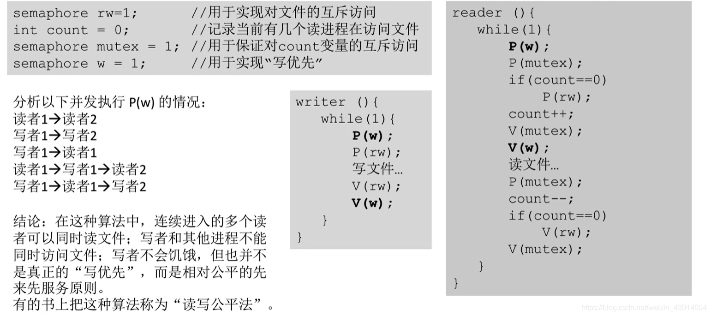
> > </div> 
> > 
> > 
> > * 在上面的算法中，读进程是优先的，即当存在读进程时，写操作将被延迟，且只要有 一个读进程活跃，随后而来的读进程都将被允许访问文件。这样的方式会导致写进程可能长时间等待，且存在写进程“饿死”的情况。
> > 
> > * 若希望写进程优先，即当有读进程正在读共享文件时，有写进程请求访问，这时应禁止后续读进程的请求，等到已在共享文件的读进程执行完毕，立即让写进程执行，只有在无写进程执行的情况下才允许读进程再次运行。为此，增加一个信号量并在上面程序的writer()和 reader()函数中各增加一对PV操作，就可以得到写进程优先的解决程序。
> > 
> 
> 
> 
> 
> 
> 
> <font color="pink">3.4. 知识回顾与重要考点</font>
> 
> > <div align=center>
> > 
> > </div> 
> > 
> 
> 
> 
>


>
> **<font color="pink" size = 5>4. 吸烟者问题（没看懂）</font>**
>
> 
> 
> <font color="pink">4.1. 问题描述</font>
> 
> > <div align=center>
> > 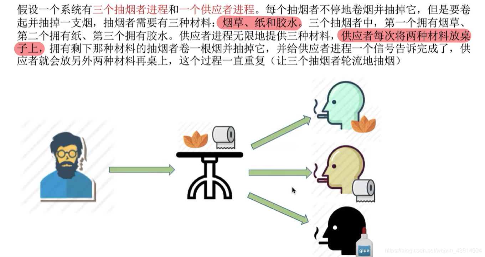
> > </div> 
> 
> 
> 
> 
> <font color="pink">4.2. 问题分析</font>
> 
> > <div align=center>
> > 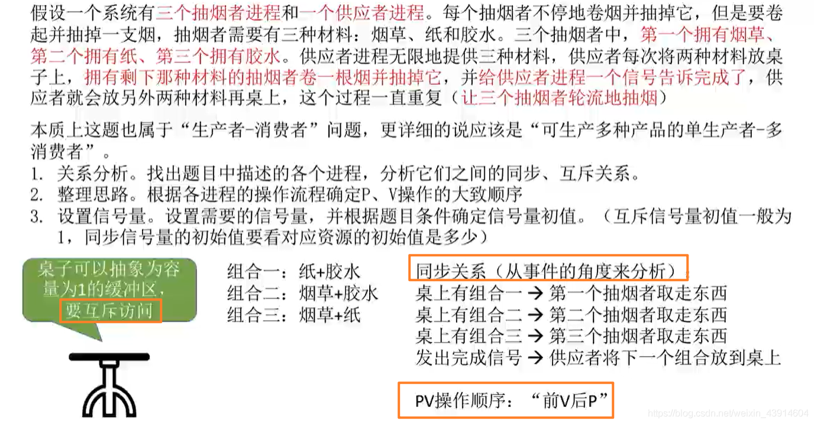
> > 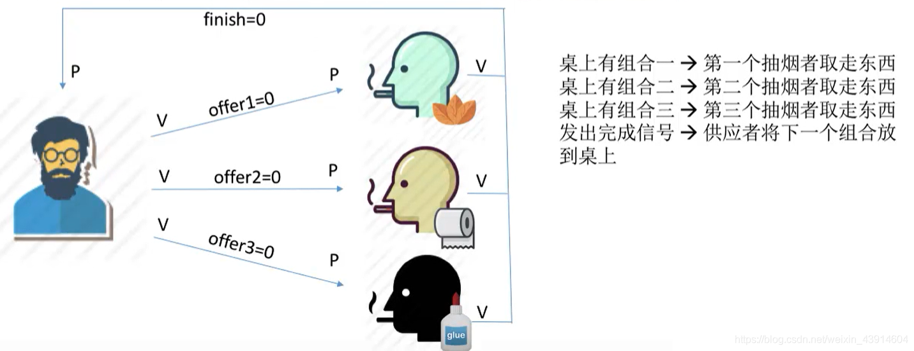
> > </div> 
> 
> 
> 
> 
> 
> <font color="pink">4.3. 实现方法</font>
> 
> > <div align=center>
> > 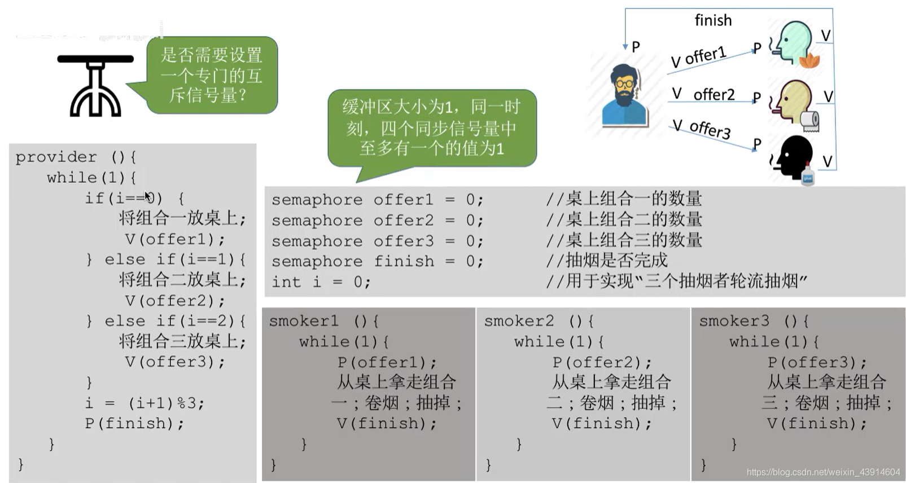
> > </div> 
> 
> 
> 
> 
> 
> 
> <font color="pink">4.4. 知识回顾与重要考点</font>
> 
> > <div align=center>
> > 
> > </div> 
> 
> 
> 


>
> **<font color="pink" size = 5>5. 哲学家进餐问题</font>**
> 
> 
> <font color="pink">5.1. 问题描述</font>
> 
> > <div align=center>
> > 
> > </div> 
> 
> 
> 
> <font color="pink">5.2. 问题分析</font>
> 
> > <div align=center>
> > 
> > </div> 
> 
> 
> 
> <font color="pink">5.3. 如何实现</font>
> 
> > <div align=center>
> > 
> > 
> > 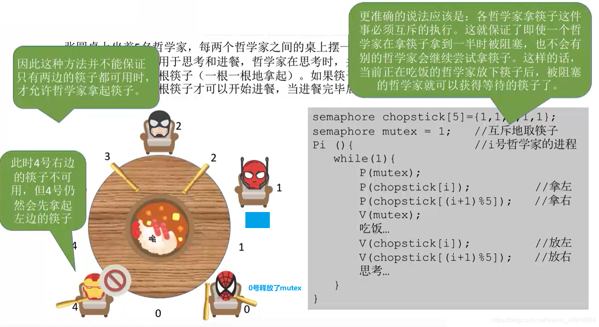
> > </div> 
>
> 
> 
> <table>
>   <tr>
>   <td colspan = "1">
> 
> ```c++
> /*记录型信号量的定义*/
> typedef struct {
>     int value;          // 剩余资源数 = 实际可用资源数 - 被预定资源数（等待队列）
>     struct process *L;  // 指向等待队列（即阻塞队列），用于连接所有等待资源的进程
> } semaphore;  // semaphore 翻译为 信号量
>
> /*某进程需要资源时，通过 wait 原语申请*/
> void wait (semaphore S) {
>     S.value--;          // 预定资源
>     if (S.value < 0) {  // 如果预定后S.value < 0, 说明当前根本没有资源可分配
>         block (S.L);    // 当前进程 运行态 --->>> 阻塞态 等待此预定资源释放
>     }
> }
>
> /*某进程使用完资源后，通过 signal 原语释放*/
> void signal(semaphore S) {
>     S.value++;
>     if (S.value <= 0) { // 释放资源后，本来应该S.value > 0, 但是由于已经被预定了，会出现 <= 0
>         wakeup (S.L);   // 这时候唤醒等待队列的进程, 阻塞态 --->>> 就绪态
>     }
> }
> 
> 
> // 互斥信号量，初值为1； 
> // 同步信号量，初值为0；
> // 多个资源的同步信号量，开始有多少资源, 资源同步信号量初值就设为多少
> semaphore mutex; mutex.value = 1;  // 互斥信号量，实现对筷子的互斥拿取
> semaphore chopstick[5]; chopstick[i].value = 1;  // 同步信号量，表示对应位置筷子的数量
> ```
> 
>   </td> 
>   </tr>
> 
>   <tr>
>   <td>
> 
> ```c++
> // 生产者进程
> Pi () {
>     while(1) {
>         P(mutex);                  // 拿筷子这件事，必须互斥的进行
>         P(chopstick[i]);           // 拿左
>         P(chopstick[(i+1) % 5]);   // 拿右
>         V(mutex);
>         吃饭...
>         V(chopstick[i]);
>         V(chopstick[(i+1) % 5]);
>     } 
> }
> ```
> 
>   </td>
>   </tr>
> </table>
> 
> 
> 
> 
> <font color="pink">5.4. 知识回顾与重要考点</font>
> 
> > <div align=center>
> > 
> > </div> 
> 
> 
> 
> 
> 


#### 2.3.7 管程（估计用不到）

>
> https://blog.csdn.net/weixin_43914604/article/details/105420594
> 


> **<font color="pink" size = 5>思维导图</font>**
> 
> > <div align=center>
> > 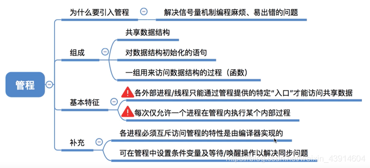
> > </div> 
> 
>
> 
>


>
> **<font color="pink" size = 5>1. 为什么引入管程？</font>**
> 
> > <div align=center>
> > 
> > </div> 
> 
> 
>


> **<font color="pink" size = 5>2. 管程的组成及基本特征</font>**
> 
> > <div align=center>
> > 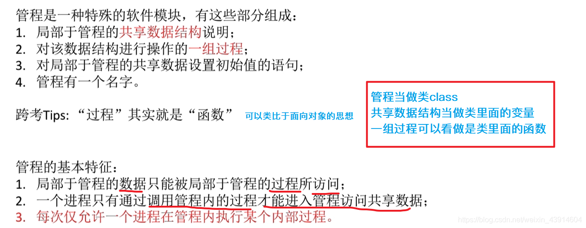
> > </div> 
> 
> 


> **<font color="pink" size = 5>3. 管程实现生产者消费者问题</font>**
> 
> > <div align=center>
> > 
> > 
> > 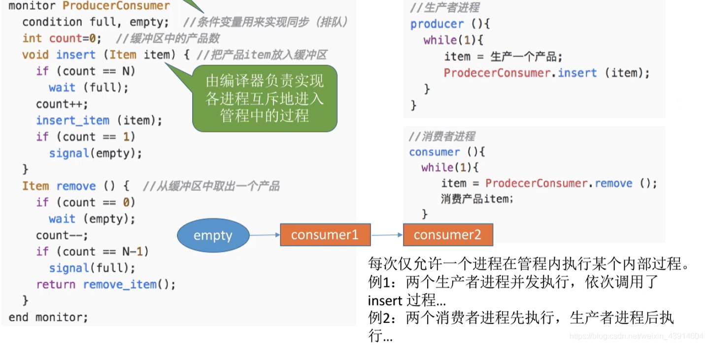 
> >  
> > </div> 
> 
> 


> **<font color="pink" size = 5>4. java中类似于管程的机制</font>**
> 
> > <div align=center>
> > 
> > </div> 
> 
> 


### 2.4 死锁

#### 2.4.1 死锁详解(预防、避免、检测、解除)

>
> https://blog.csdn.net/weixin_43914604/article/details/105437474
> 


> **<font color="pink" size = 5>思维导图</font>**
> 
> > <div align=center>
> > 
> > </div> 
> 
> 
> 
> 


>
> **<font color="pink" size = 5>1. 什么是死锁？</font>**
>
> <font color="pink">`死锁`：各进程互相等待对方手里的资源，导致各进程都阻塞，无法向前推进</font>
>
> 
> 
> > <div align=center>
> > 
> > 
> > </div> 
> 
> 
>


>
> **<font color="pink" size = 5>2. 死锁、饥饿、死循环的区别</font>**
>
> <font color="pink">
> 
> `死锁`：至少是两个进程一起死锁，死锁进程处于`阻塞态`
>
> `饥饿`：可以只有一个进程饥饿，饥饿进程可能是`阻塞态`（但长期得不到资源，例如无法获取I/O设备资源）也可能是`就绪态`（但一直无法进入`CPU`），例如短进程优先调度`PSF`算法
>
> `死循环`：可能只有一个进程发生死循环，死循环的进程可上处理机（`运行态`），死循环一般是由`程序bug`导致的。
> 
> </font>
>
> <font color="gree">`死锁`和`饥饿`是OS要解决的问题（`分配资源和CPU的策略不合理`），死循环是应用程序员要解决的问题（`代码有问题`）</font>
>
> 
> 
> > <div align=center>
> > 
> > 
> > </div> 
> 
> 
> 


>
> **<font color="pink" size = 5>3. 死锁产生的四个必要条件</font>**
>
> <font color="pink">
> 
> `互斥条件`：对必须互斥使用的资源的抢夺，才会导致死锁. 内存、扬声器这种可以同时访问的资源，不会造成死锁（进程不需要阻塞等待）。
>
> `不剥夺条件`：进程保持的资源只能主动释放，不可强行剥夺
>
> `请求和保持条件`：保持着某些资源不放的同时，请求别的资源。`"吃着碗里的，想着锅里的"`
>
> `循环等待条件`：① 存在一种进程资源的循环等待；② 循环等待未必死锁，当不在循环内的进程释放了一些资源后，即可能接触循环等待现象；③ 死锁一定有循环等待, 但是发生循环等待时未必死锁（循环等待是死锁的必要不充分条件）
>
> ```html
> 当同类资源数大于1时，循环等待是死锁的必要不充分条件；
> 当同类资源都只有1个时，循环等待是死锁的充分必要条件
> ```
> 
> </font>
> 
> > <div align=center>
> > 
> > </div> 
>  
> 
>


>
> **<font color="pink" size = 5>4. 什么时候会发生死锁？</font>**
>
> <font color="pink">
>
> 对不可剥夺资源的不合理分配（数量和顺序），可能导致死锁
>
> > `不可剥夺资源`：`只能`等占用该资源的进程`主动释放`，如`打印机`
> > 
> > `可剥夺资源`：`可以`让占用该资源的进程被`动释放`，如`CPU`
>
> "不合理分配"，具体指的是什么？
>
> > 1. 必要条件：对不可剥夺资源的竞争：
> > 
> > 2. 进程推进顺序非法。请求和释放资源的顺序不当，会导致死锁。`P1`占用`R1`，又请求`R2`；`P2`占用`R2`，又请求`R1`，卡住了
> > 
> > 3. 信号量使用不当。例如生产者-消费者问题中，如果`互斥P操作`在`同步P操作`之前，就回死锁。`可以把互斥信号量、同步信号量看作一种抽象的系统资源。`
> > 
> > 
> 
> </font>
>
> 
>
> > <div align=center>
> > 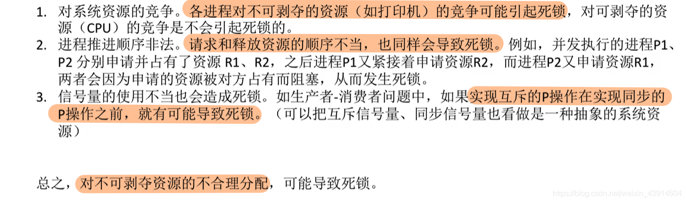
> > </div> 
>  
> 
> 
> 
>


>
> **<font color="pink" size = 5>5. 死锁的处理策略</font>**
>
> 
>
> * <font color="pink">不允许死锁发生</font>
> > 
> > 1. <font color="yellow">静态策略：预防死锁，即破坏四个必要条件中的一个</font>
> > > 
> > > 1.1. 破坏互斥条件: 临界资源(不可剥夺)改造为可共享资源(可剥夺)
> > > > 
> > > > 例如：SPOOLing技术
> > > > 
> > > > `缺点`：可行性不高，很多时候`无法破坏互斥条件`
> > > > 
> > > 1.2. 破坏不可剥夺条件: 让进程占用的资源可以被动释放，不用等进程主动释放
> > > > 
> > > > 方案一：申请资源得不到满足时，立即释放拥有的所有资源
> > > > 
> > > > 方案二：申请的资源被其他进程占用时，由操作系统协助剥夺（考虑优先级）
> > > > 
> > > > `缺点`：实现复杂；剥夺资源可能导致部分工作失效；反复申请和释放导致系统开销大；可能导致饥饿
> > > > 
> > > 1.3. 破坏请求和保持条件：不能吃着碗里的，想着锅里的
> > > > 
> > > > 运行前分配好所有需要的资源，之后一直保持
> > > > 
> > > > `缺点`：资源利用率低；可能导致饥饿
> > > > 
> > > 1.4. 破坏循环等待条件
> > > > 
> > > > 给资源编号，必须按编号从小到大顺序申请资源
> > > > 
> > > > `缺点`：不方便增加新设备；导致资源浪费；用户编程麻烦
> > > > 
> > 2. <font color="yellow">动态策略：避免死锁</font>
> > > 
> > > 2.1. 安全状态
> > > > 
> > > > 系统能按照某种顺序（如`<P1, P2, ...,Pn>`）来为每个进程分配其所需的资源，使每个进程都可顺序完成，则称系统处于安全状态。
> > > > 
> > > 2.2. 安全序列
> > > > 
> > > > 可是所有进行顺利执行的序列`<P1, P2, ...,Pn>`称为安全序列
> > > > 
> > > 2.3. 不安全状态
> > > > 
> > > > 如果不存在安全序列，则系统处于不安全状态
> > > > 
> > > 2.4. 安全序列、安全状态、不安全状态、死锁之间的关系
> > > 
> > > 2.5. 银行家算法---避免系统进入不安全状态
> > > 
> 
> * <font color="pink">允许死锁发生</font>
> > 
> > * <font color="yellow">死锁的检测</font>
> > > 
> > > * 数据结构：资源分配图
> > > >
> > > > <div align=center>
> > > > 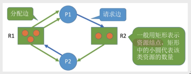
> > > > </div> 
> > > > 
> > > > 两种结点：
> > > > > 
> > > > > 进程节点
> > > > > 
> > > > > 资源节点
> > > > > 
> > > > 两种边：
> > > > > 
> > > > > 进程节点--->>>资源节点：请求边
> > > > > 
> > > > > 资源节点--->>>进程节点：分配边
> > > > > 
> > > >  
> > > 
> > > * 死锁检测算法（根据资源分配图）
> > > > 
> > > > 依次消除与不阻塞进程相连的边，直至无边可消
> > > > 
> > > > 注：所谓不阻塞进程是指其申请的资源数还不够的进程
> > > > 
> > > > 死锁定理：若资源分配图是不可完全简化的，即不能消除所有边，就说明发生了死锁
> > > 
> 
> > * <font color="yellow">死锁的解除</font>
> > > 
> > > * 资源剥夺法：OS挂起死锁进程，暂时放到外村，并释放资源
> > > 
> > > * 撤销/终止进程法：OS强制撤销部分或全部进程
> > > 
> > > * 进程回退法：让一个或多个进程回退到可以避免死锁的安全状态
> > > 
> >
> 
> <br>
> <br>
> <br>
> 
> 
> 
>
> > <div align=center>
> > 
> > </div> 
>
> 
>   
> <font color="pink">5.1. 预防死锁</font>
> 
> <font color="pink">① 破坏互斥条件</font>
>
> > <div align=center>
> > 
> > </div> 
> 
>
> <font color="pink">② 破坏不可剥夺条件</font>
>
> > <div align=center>
> > 
> > </div> 
> 
>
> <font color="pink">③ 破坏请求和保持条件</font>
>
> > <div align=center>
> > 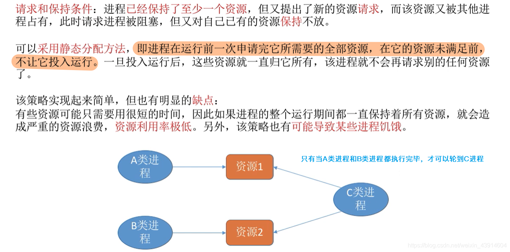
> > </div> 
> 
>
> <font color="pink">④ 破坏循环等待条件</font>
>
> > <div align=center>
> > 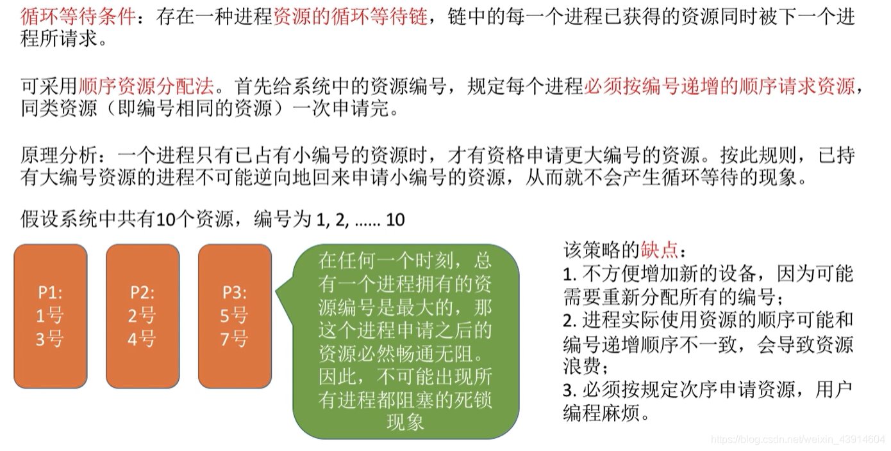
> > </div> 
>  
> 
> 
> 
> <br>
> <br>
> <br>
>    
> <font color="pink">5.2. 避免死锁</font>
> 
> <font color="pink">① 什么是安全序列？</font>
>
> > <div align=center>
> > 
> > 
> > 
> > 
> >  
> > </div> 
>  
> 
> <font color="pink">② 安全序列、安全状态、不安全状态、死锁之间的联系</font>
>
> > <div align=center>
> > 
> >  
> > </div> 
>  
> 
> <font color="pink">③ 避免系统进入不安全状态------银行家算法</font>
>
> > <div align=center>
> > 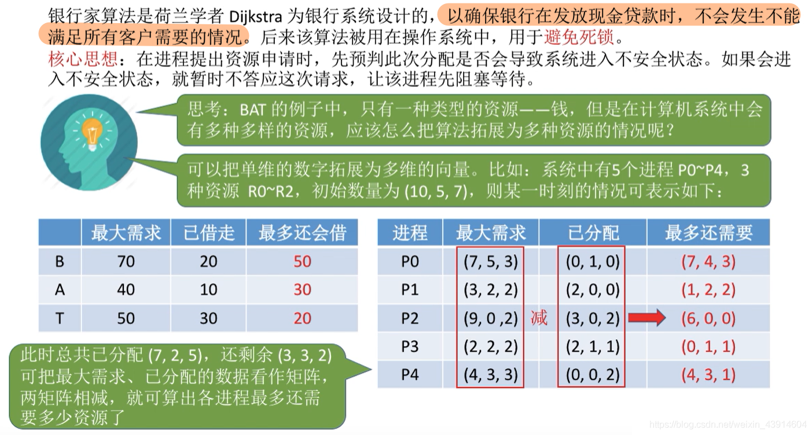
> > 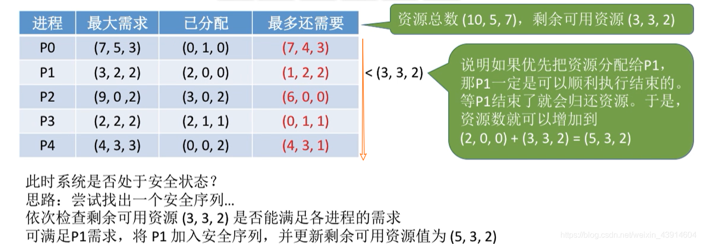
> > 
> > 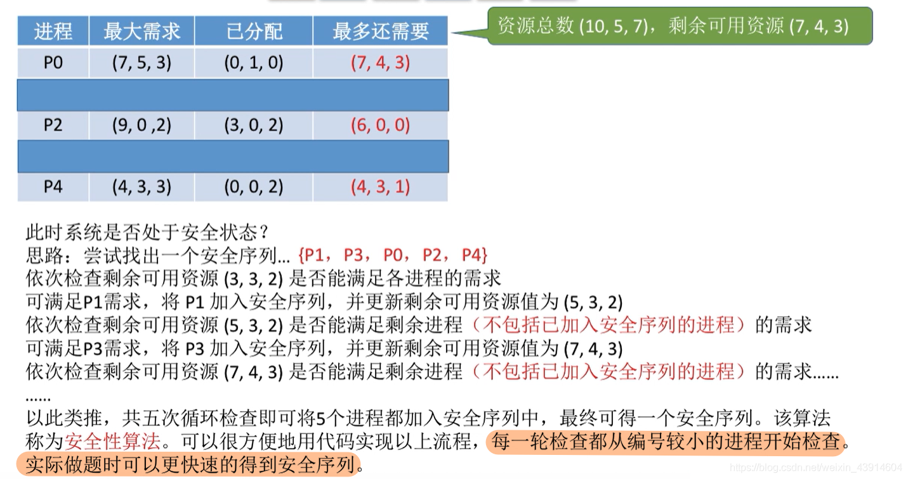
> >  
> >  
> >  
> >  
> > </div> 
> 
> 
> 
> <font color="pink">③ 使用代码实现------银行家算法</font>
>
> > <div align=center> 
> > 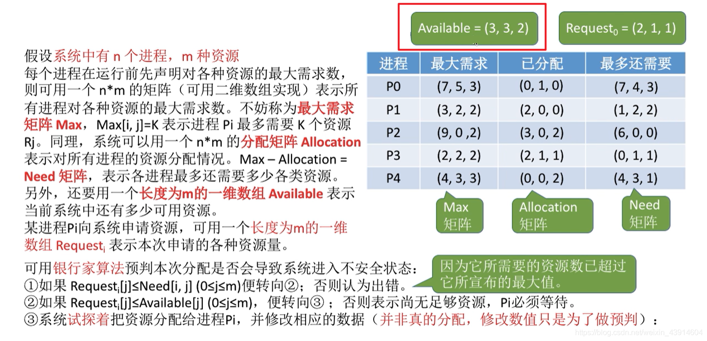 
> >  
> >  
> > </div> 
> 
> 
> <br>
> <br>
> <br>
> 
> 
> 
>
> 
>
> 
>   
> <font color="pink">5.3. 死锁的检测和解除</font>
>
> > <div align=center> 
> >  
> > </div> 
> 
> <font color="pink">① 死锁的检测</font>
>
> > <div align=center> 
> >  
> > </div> 
>
> 
> 
> * 举个例子，可以消除所有边，即无死锁发生
>
> > <div align=center> 
> > 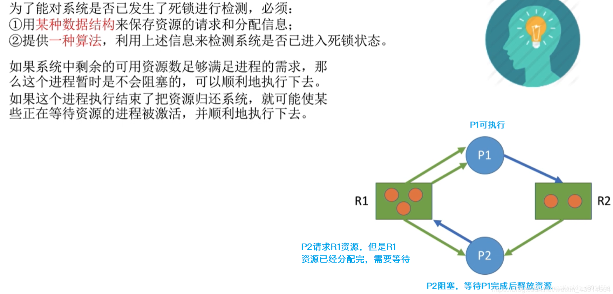 
> > 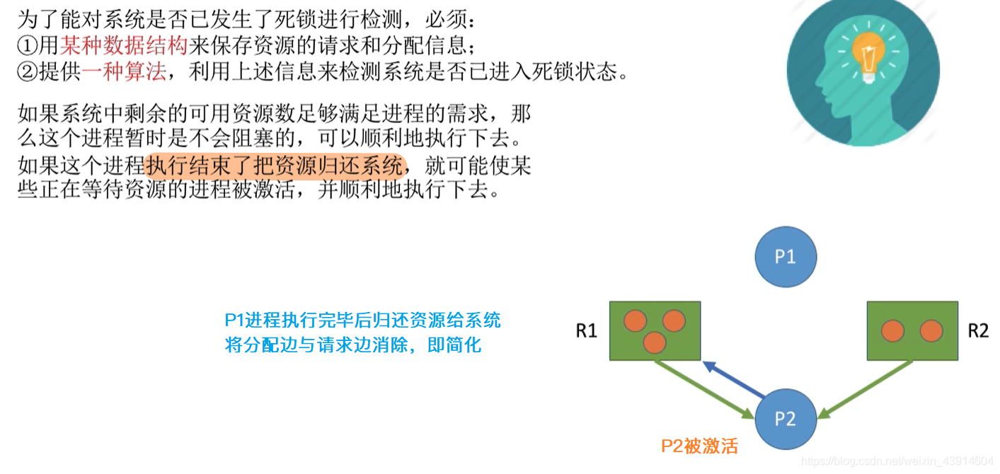 
> > 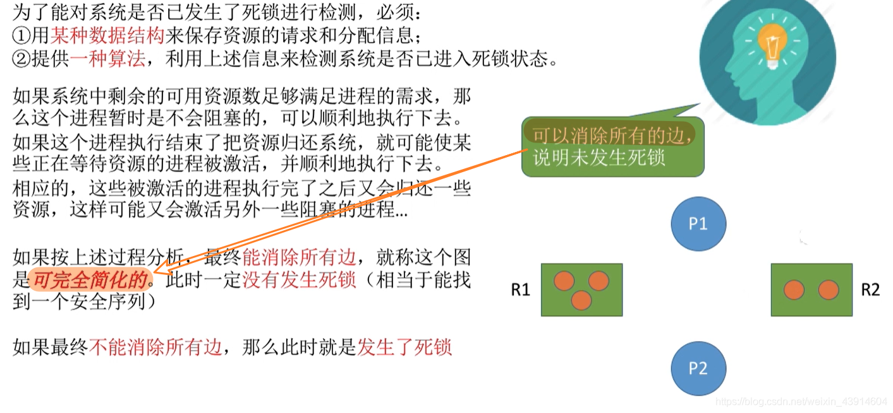  
> > </div> 
>
> 
> 
> * 举个例子，不可消除所有边，即产生死锁
>
> > <div align=center> 
> >   
> > 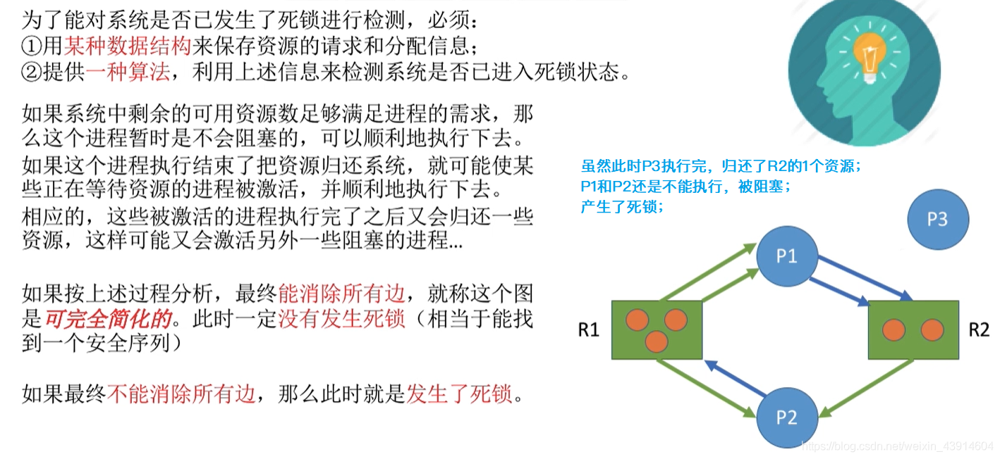  
> > 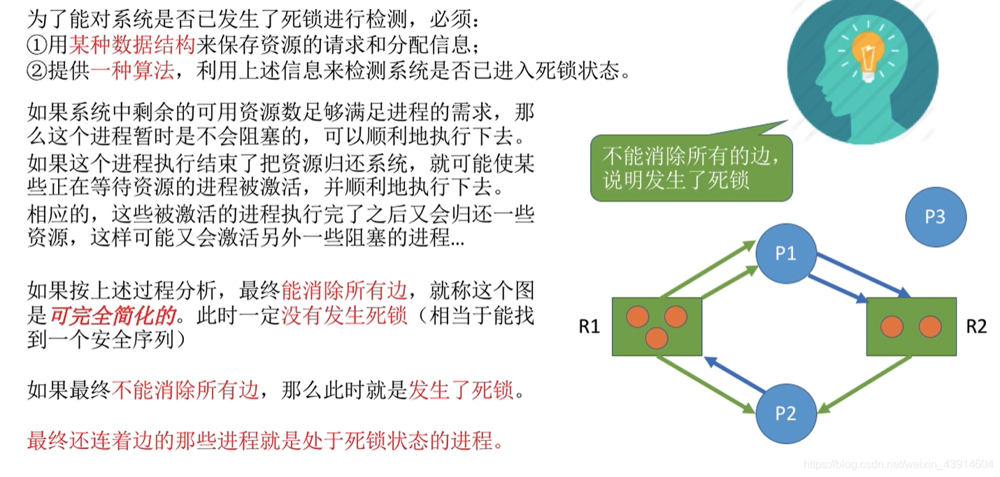  
> > 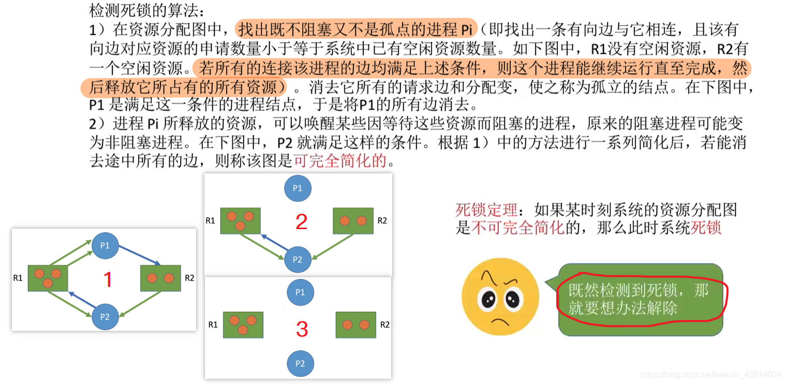  
> > </div> 
> 
> 
> 
> <font color="pink">② 死锁的解除</font>
>
> > <div align=center> 
> >  
> > </div> 
> 
> 
> 


## 第 3 章 内存管理


### 3.1 内存管理的概念


>
> <font color="pink">
> 
> 3.1.1 - 3.1.4 介绍内存管理
>
> 3.1.5 连续分区的分配管理方式
>
> 3.1.6 - 3.1.11 非连续分区的分配管理方式
> 
> </font>
> 


#### 3.1.1 什么是内存？进程的基本原理，深入指令理解其过程

>
> https://blog.csdn.net/weixin_43914604/article/details/105662331
>


>
> **<font color="pink" size = 5>思维导图</font>**
> 
> > <div align=center>
> > 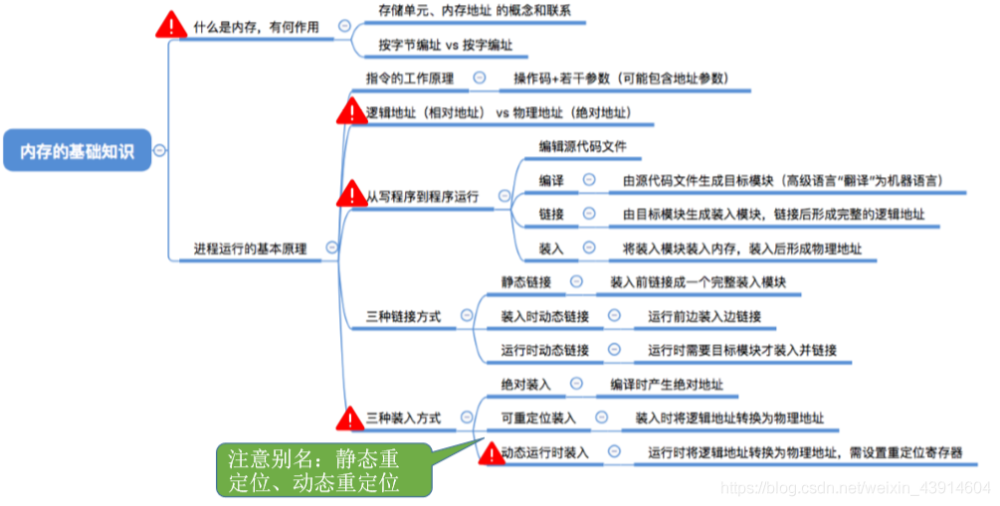
> > </div> 
> 


>
> **<font color="pink" size = 5>1. 什么是内存？有何作用？</font>**
> 
> > <div align=center>
> > 
> > </div> 
> 
>    
> <font color="pink">1.1. 存储单元</font>
> 
> > <div align=center>
> > 
> > </div> 
> 
>    
> <font color="pink">1.2. 几个常用数量单位&内存地址</font>
> 
> > <div align=center>
> > 
> > </div> 
>  
> `1GB`内存有$2^{30}$个字节，就需要`30`个二进制位表示地址，`地址长度为30bit`
>
> 则`4GB`地址长度为$\log_{2}{4} * 30 = 32$, 即`地址长度为32bit`
> 则`8GB`地址长度为$\log_{2}{8} * 30 = 33$, 即`地址长度为33bit`
> 则`16GB`地址长度为$\log_{2}{16} * 30 = 34$, 即`地址长度为34bit`
> 则`32GB`地址长度为$\log_{2}{32} * 30 = 35$, 即`地址长度为35bit`
> 则`64GB`地址长度为$\log_{2}{64} * 30 = 36$, 即`地址长度为36bit`
> 
> ...
>
> <font color="pink">那么现在电脑中普遍的`64bit`操作系统，寻址空间就非常大了，难以想象</font>
> 
> 


>
> **<font color="pink" size = 5>2. 进程运行的基本原理</font>**
>    
> <font color="pink">2.1. 指令的工作原理—操作码+若干参数（可能包含地址参数）</font>
> 
> * 从`X=X+1`大致看一下`指令的执行过程`
> 
> > <div align=center>
> > 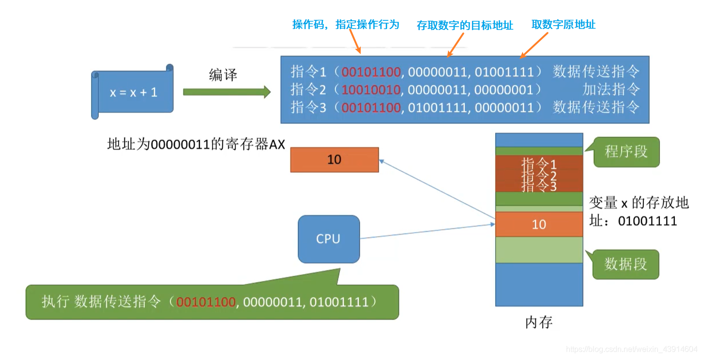
> > 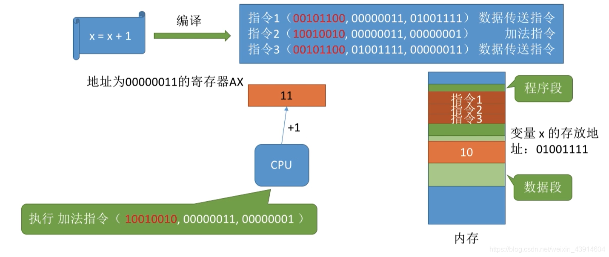
> > 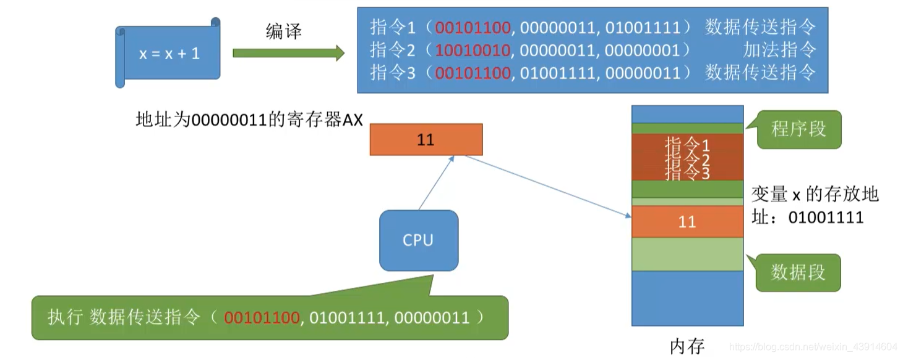
> > 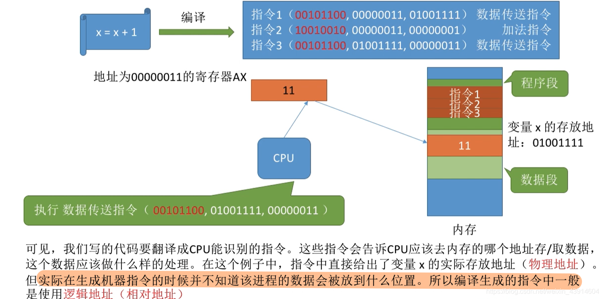
> > </div> 
> 
>    
> <font color="pink">2.2. 逻辑地址（相对地址）vs物理地址（绝对地址）</font>
> 
> > <div align=center>
> > 
> > </div> 
> 
>    
> <font color="pink">2.3. 从写程序到程序运行—编译、链接、装入</font>
> 
> > <div align=center>
> > 
> > </div> 
> 
>    
> <font color="pink">2.4. 装入模块装入内存</font>
>   
> * 不修改装入模块中的指令地址就直接装入内存的话：
> 
> > <div align=center>
> > 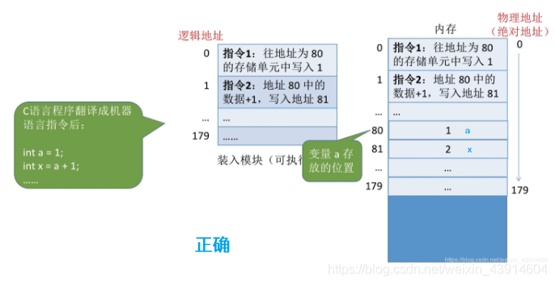
> > 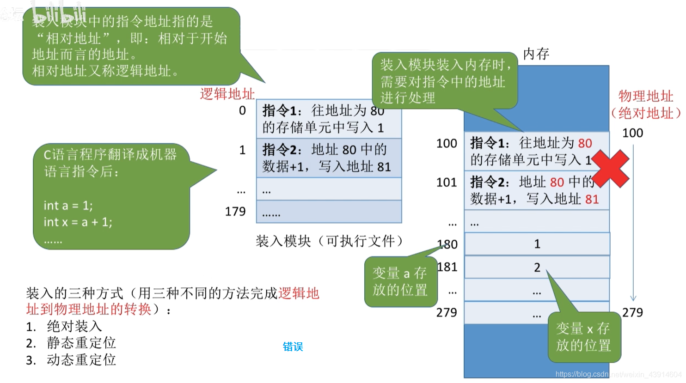
> > </div> 
> 
>    
> <font color="pink">2.5. 装入的三种方式</font>
>   
> <font color="pink">① 绝对装入（程序中使用绝对地址，不推荐 ）</font>
> 
> > <div align=center>
> > 
> > </div> 
> 
>   
> <font color="pink">② 静态重定位（装入内存后，CPU运行前，进行地址转换）</font>
> 
> > <div align=center>
> > 
> > </div> 
> 
>   
> <font color="pink">③ 动态重定位（CPU运行时，才进行地址转换）</font>
> 
> > <div align=center>
> > 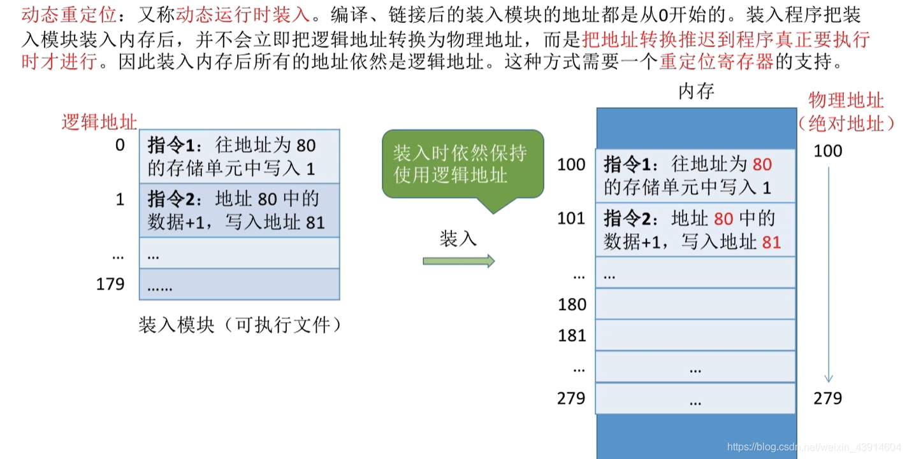
> > 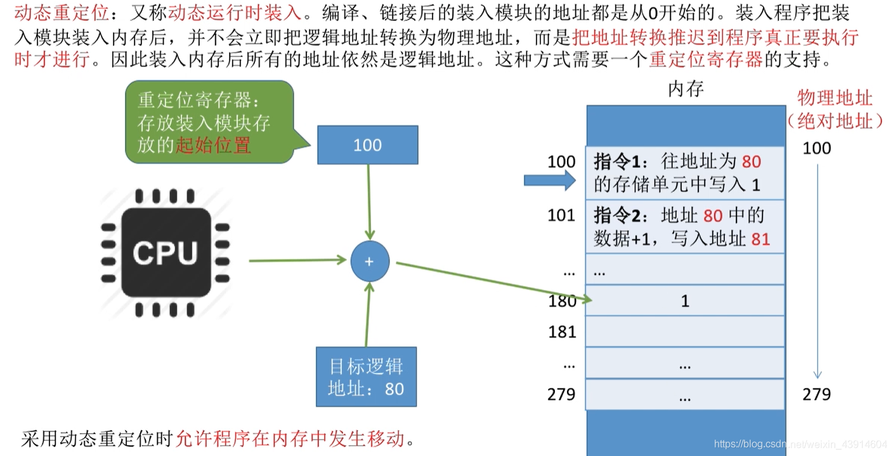
> > 
> > </div> 
>
> 
> 
>    
> <font color="pink">2.6. 链接的三种方式</font>
>   
> <font color="pink">① 静态链接（装入内存前，链接）</font>
> 
> > <div align=center>
> > 
> > </div> 
> 
>   
> <font color="pink">② 装入时动态链接（装入内存后，CPU运行前，链接）</font>
> 
> > <div align=center>
> > 
> > </div> 
> 
>   
> <font color="pink">③ 运行时动态链接（CPU运行时，链接）</font>
> 
> > <div align=center>
> > 
> > </div> 
>  
> 
> 
> 
> 


#### 3.1.2 内存管理管些什么？

> 
> https://blog.csdn.net/weixin_43914604/article/details/105667165
> 
> 


>
> **<font color="pink" size = 5>思维导图</font>**
> 
> > <div align=center>
> > 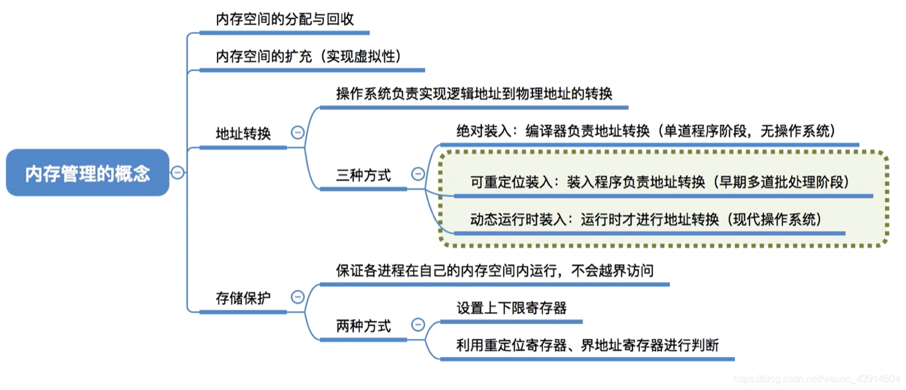
> > </div> 
> 
> 


>
> **<font color="pink" size = 5>1. 内存空间的分配与回收</font>**
> 
> > <div align=center>
> > 
> > </div> 
>  
> 
>
> **<font color="pink" size = 5>2. 内存空间的扩展（实现虚拟性）</font>**
> 
> > <div align=center>
> > 
> > </div> 
> 
>
> **<font color="pink" size = 5>3. 地址转换</font>**
> 
> > <div align=center>
> > 
> > </div> 
> > 
> > `三种装入方式`
> > 
> > <div align=center>
> > 
> > </div> 
>
>
> **<font color="pink" size = 5>4. 内存保护</font>**
> 
> > <div align=center>
> > 
> > </div> 
> > 
> > `两种方式`
> > 
> > <div align=center>
> > 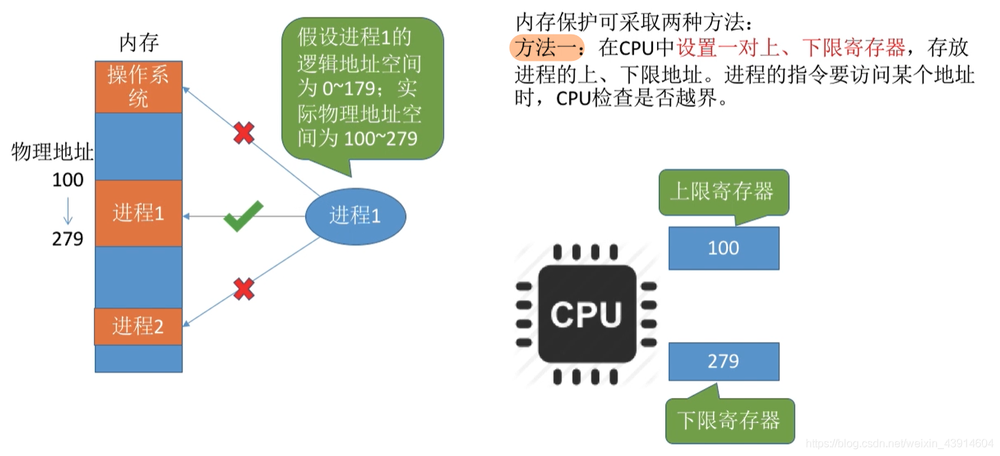
> > 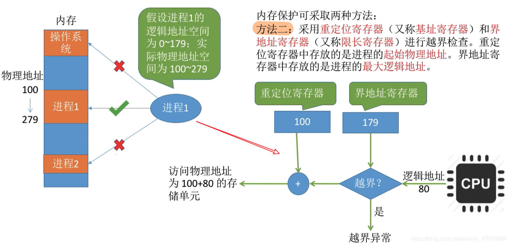
> > </div> 
> > 
> > 
>
>
> **<font color="pink" size = 5>总结</font>**
> 
> > <font color="gree">
> > 
> > 1. 负责内存的分配与回收
> > 
> > 2. 提供某种技术从逻辑上对内存空间进行扩充
> > 
> > 3. 负责程序的逻辑地址和物理地址的转化
> > 
> > 4. 对各个进程的内存空间进行保护，使得进程之间的内存空间互不干扰
> > 
> > </font>
>
> 
>    


#### 3.1.3 覆盖技术与交换技术的思想

> 
> https://blog.csdn.net/weixin_43914604/article/details/105713460
> 


>
> **<font color="pink" size = 5>思维导图</font>**
> 
> > <div align=center>
> > 
> > 
> > </div> 
> 
> 


>
> **<font color="pink" size = 5>1. 覆盖技术 (已弃用)</font>**
> 
> > <div align=center>
> > 
> > 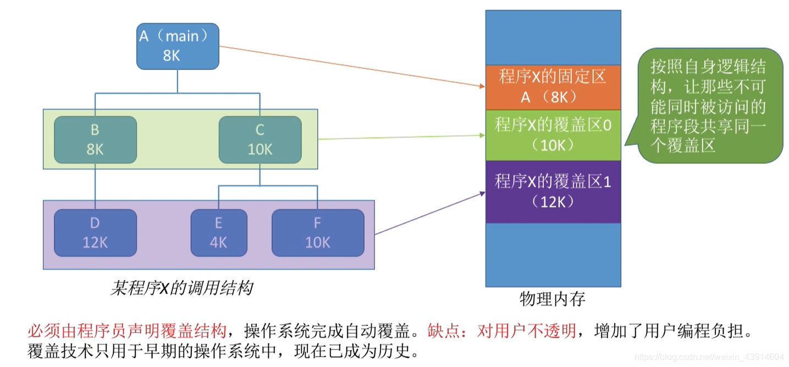
> > </div> 
> 
> 
>
> **<font color="pink" size = 5>2. 交换技术</font>**
> 
> > <div align=center>
> > 
> > 
> > </div> 
> 
> 
> 
> `我理解的内存调度`：
> > 当前进程已经存在，只是暂时轮不到该进程执行，为了提高内存利用率，将该进程从内存暂时调度到外存。但是呢，之前我们没遇到过这种进程状态，所以现在定义 `"暂时从内存调到外存等待的进程状态为 挂起状态"`。
>
> 注意：
> > 
> > * `PCB仍然在内存中`，并不是一起调到外存；`被调到外存的是进程数据`，PCB会记录进程数据在外存中的位置、进程状态等信息。
> > 
> > * `被挂起的进程PCB会被放到挂起队列中`
>
> 
> 
> > 
> > <font color="pink">进程的挂起状态与七状态模型</font>
> > 
> > <div align=center>
> > 
> > </div> 
> > 
> > `图注：进程映像 = 进程实体 = PCB + 程序段 + 数据段`
> > 
> > 上面提到了`挂起状态`，实际上可分为：`就绪挂起`、`阻塞挂起`
> > 
> > * `就绪挂起`和`就绪态`的唯一区别：除了`PCB`以外的进程实体被调到外存中
> > 
> > * `阻塞挂起`和`阻塞态`的唯一区别：除了`PCB`以外的进程实体被调到外存中
> > 
> > * `其他的各种状态间的转换关系，实际上是没变的。`
> > 
> > `就绪挂起  --- >>> 就绪态` 对应 `激活`
> > 
> > `就绪挂起 <<< ---  就绪态` 对应 `挂起`
> > 
> > `阻塞挂起  --- >>> 阻塞态` 对应 `激活`
> > 
> > `阻塞挂起 <<< ---  阻塞态` 对应 `挂起`
> > 
>
> 
> 


#### 3.1.4 内存的分配与回收（连续分配分区 用动态分配，其他两种弃用了）

> 
> https://blog.csdn.net/weixin_43914604/article/details/105714392
> 


>
> **<font color="pink" size = 5>思维导图</font>**
>
> > <div align=center>
> > 
> > 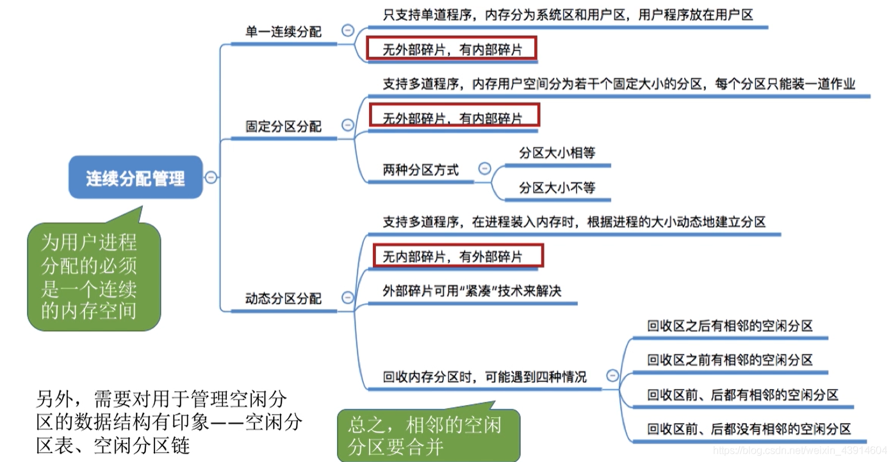
> > </div> 
> 
> 


>
> **<font color="pink" size = 5>1. 单一连续分配（只能有一个任务存入，不支持多道程序）</font>**
>
> > <div align=center>
> > 
> > </div> 
> 
> 


>
> **<font color="pink" size = 5>2. 固定分区分配（固定分区表：包括分区号、大小、起始地址、状态）</font>**
>
>
> > <div align=center>
> > 
> > </div> 
>
> `分区说明表`
>
> > <div align=center>
> > 
> > </div> 
>
> 
> 


>
> **<font color="pink" size = 5>3. 动态分区分配（进程装入时，才分配分区，分区表只记录空闲的分区：包括分区号、大小、起始地址、状态）</font>**
>
> > <div align=center>
> > 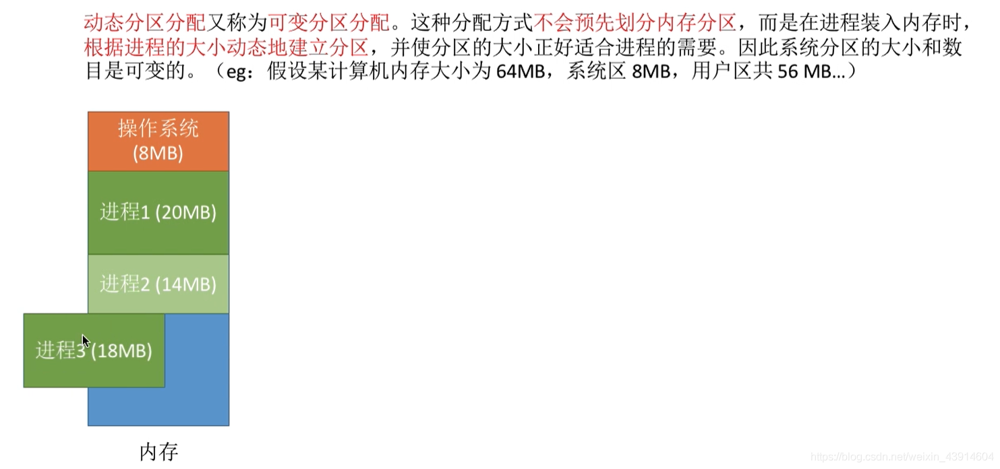
> > 
> > 
> > 
> > </div> 
> 
> 
> 
>    
> <font color="pink">3.1. 系统要用怎样的数据结构记录内存的使用情况呢？</font>
> 
> > <div align=center>
> > 
> > </div> 
> 
> 
> 
>    
> <font color="pink">3.2. 当多个空闲分区都能满足要求时，应该选择哪个分区进行分配？</font>
> 
> > <div align=center>
> > 
> > </div> 
> > 
> > <font color="gree">看`3.1.5`</font>
> > 
> 
> 
>    
> <font color="pink">3.3. 如何进行分区的分配和回收操作？</font>
> 
> > <div align=center>
> > 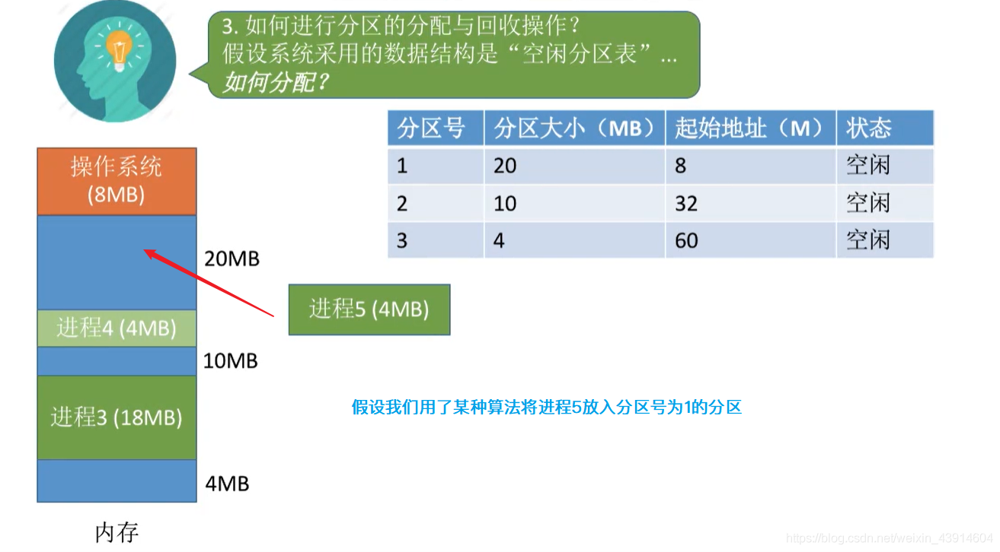
> > 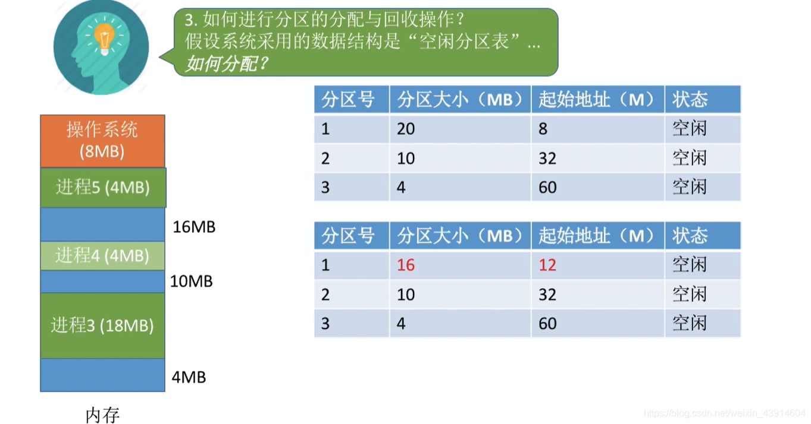
> > 
> > 
> > 
> > 
> > 
> > </div> 
> 
> 
> 
> 
> 


>
> **<font color="pink" size = 5>4. 内部碎片与外部碎片</font>**
> 
> > <div align=center>
> > 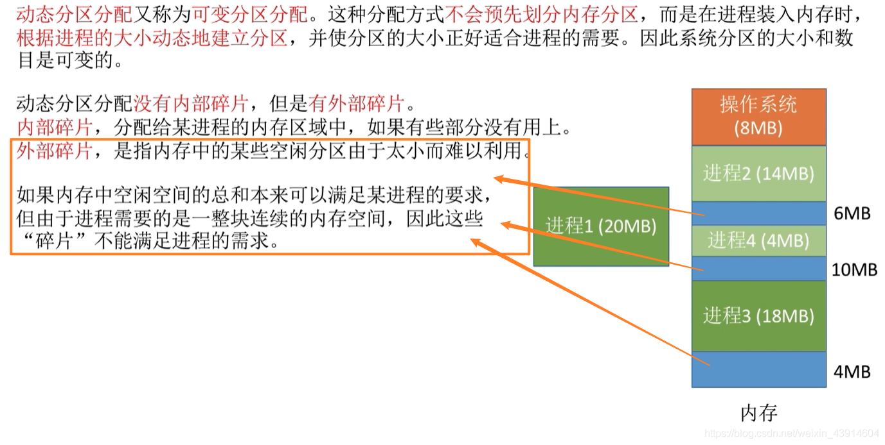
> > 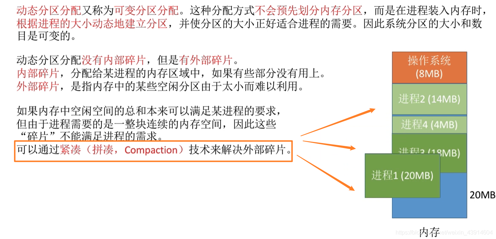
> > </div> 
>
> * `内部碎片`：分配给某进程的内存区域中，有些部分没有用上
>
> * `外部碎片`：是指内存中的某些空闲分区由于太小而难以利用
> 
> * `单一连续分配：内部碎片`
>
> * `固定分区分配：内部碎片`
>
> * `动态分区分配：外部碎片`
> 
> 
> 


#### 3.1.5 动态分区分配的四种算法（首次适应算法、最佳适应算法、最坏适应算法、临近适应算法）

> 
> https://blog.csdn.net/weixin_43914604/article/details/105718027
> 


>
> **<font color="pink" size = 5>思维导图</font>**
>
> <font color="gree">本篇文章是对上一篇文章内存的分配与回收提到的动态分区分配算法的补充</font>
>    
> <font color="pink">当多个空闲分区都能满足要求时，应该选择哪个分区进行分配？</font>
> 
> > <div align=center>
> > 
> > </div> 
> 
> 
> 
> 
> > <div align=center>
> > 
> > </div> 
>
> 
> <font color="yellow">动态分配内存产生的碎片，都是外部碎片</font>
>
> 


>
> **<font color="pink" size = 5>1. 首次适应算法（First Fit）</font>**
>
> <font color="gree">
>
> 1. 空闲分区以`地址递增`的次序排列（`双向链表`）
>
> 2. 找到大小满足要求的第一个空闲分区，直接占用；保证是所有满足要求的分区中`地址最低`的
>
> 3. 更新空闲分区链表
>
> </font>
>
>
> <font color="yellow">首次适应算法（First Fit）的`缺点`：没有明显短板；每次都要从头查找，都需要检索低地址的小分区。但是可以保证低地址部分的小分区被充分利用，高地址部分的大分区保留下来</font>
> 
> 
> > <div align=center>
> > 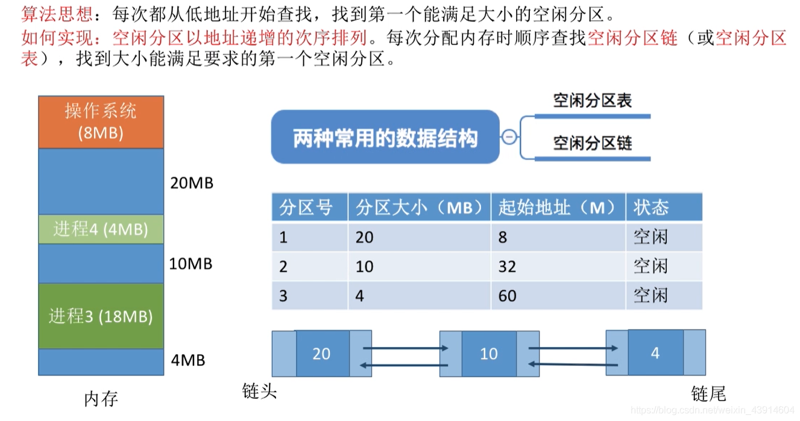
> > 
> > 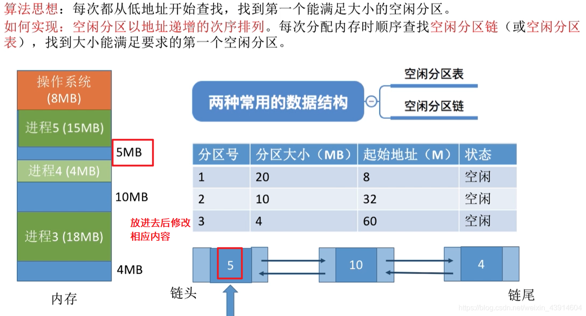
> > </div> 
>
> 
> 


>
> **<font color="pink" size = 5>2. 最佳适应算法（Best Fit）</font>**
>
> <font color="gree">
>
> 1. 空闲分区以`容量递增`的次序排列（`双向链表`）
>
> 2. 找到大小满足要求的第一个空闲分区，直接占用；保证是最佳的放置位置
> 
> 3. 更新空闲分区链表
>
> </font>
>
> <font color="yellow">最佳适应算法（Best Fit）的`缺点`：但是会产生很多小碎片（外部碎片），此后难以利用</font>
> 
> > <div align=center>
> > 
> > 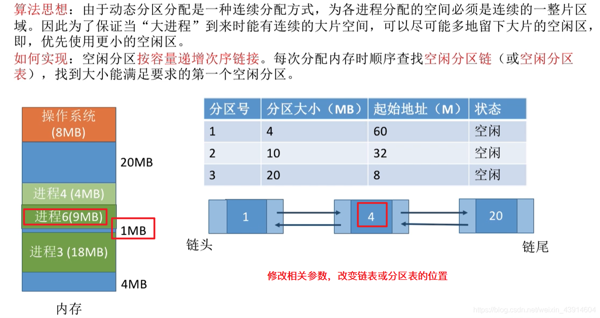
> > 
> > </div> 
>
> 
> 


>
> **<font color="pink" size = 5>3. 最坏（大）适应算法（Worst Fit or Largest Fit）</font>**
>
> <font color="gree">
>
> 1. 空闲分区以`容量递减`的次序排列（`双向链表`）
>
> 2. 找到大小满足要求的第一个空闲分区，直接占用；保证是最佳的放置位置
>
> 3. 更新空闲分区链表
>
> </font>
>
>
> <font color="yellow">最坏（大）适应算法（Worst Fit or Largest Fit）的`缺点`：很多较大的连续空闲区迅速用完，之后如果有新的大进程，无分区可用</font>
>  
> 
> > <div align=center>
> > 
> > 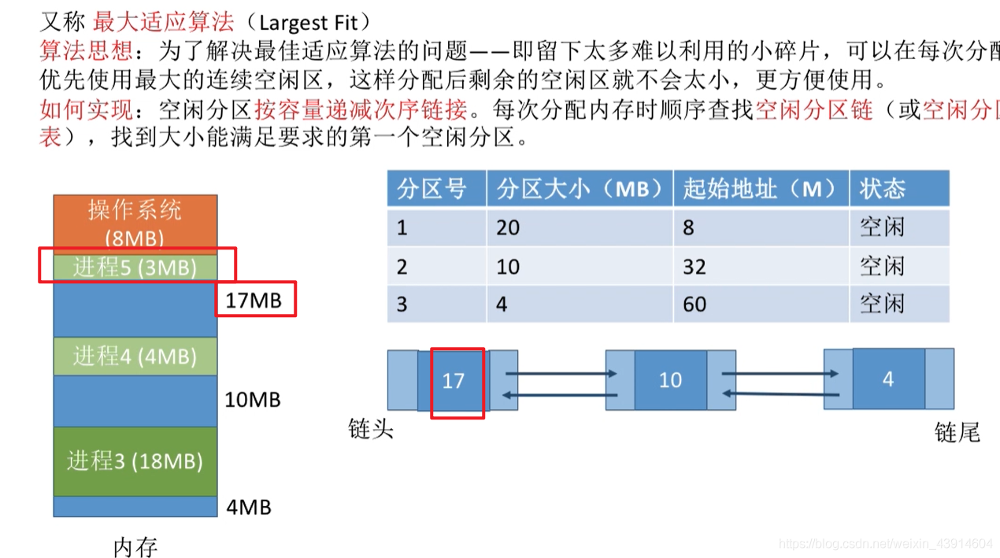
> >  
> > 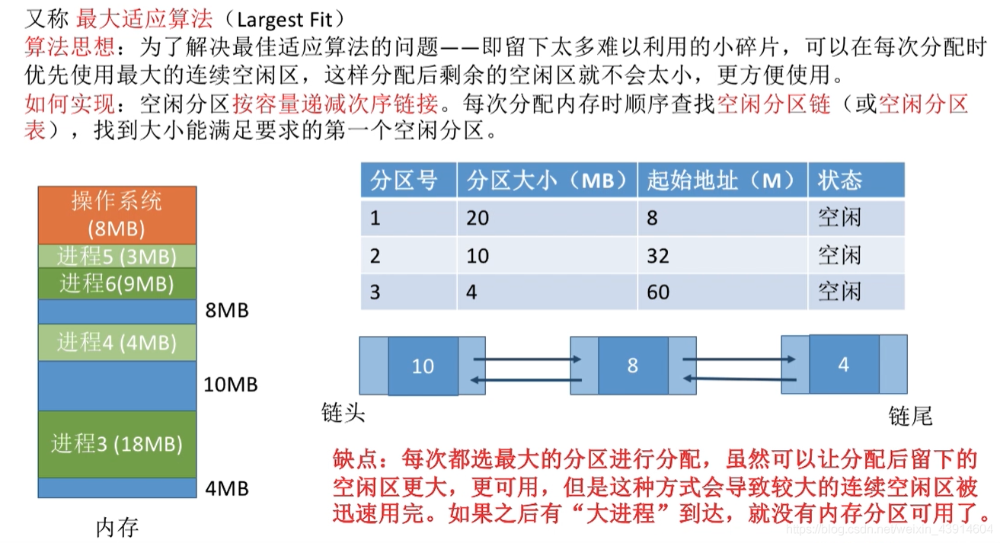
> > </div> 
>
> 
> 


>
> **<font color="pink" size = 5>4. 临近适应算法（Next Fit）</font>**
>
>
> <font color="yellow">首次适应算法（First Fit）的`缺点`：低地址部分出现很多小分区，难以利用了，但是每次查找又需要经过这些分区，查找的开销太大</font>
>
> 
>
> <font color="gree">
>
> 1. 空闲分区以`地址递增`的次序排列（`循环-双向链表`, 保证每一个地址都能被检索到）
>
> 2. `从上次查找结束的位置开始`，找到大小满足要求的第一个空闲分区，直接占用；保证是所有满足要求的分区中`地址最低`的
>
> 3. 更新空闲分区链表
>
> </font>
>
>
> <font color="yellow">临近适应算法（Next Fit）的`缺点`：几乎每个大的空闲分区，都会被一点点蚕食，导致后续大进程到来时，没有分区可用</font>
>
> 
> 
> > <div align=center>
> > 
> > 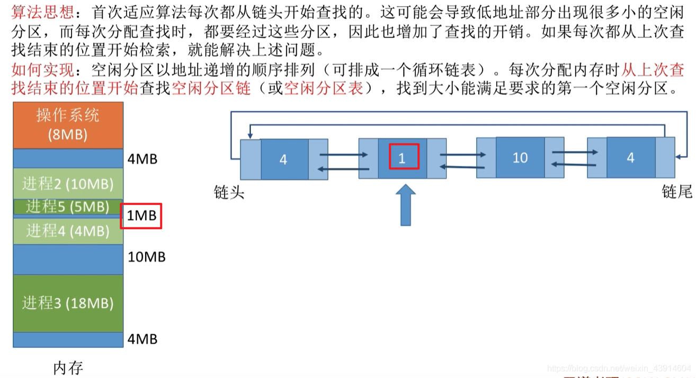
> > 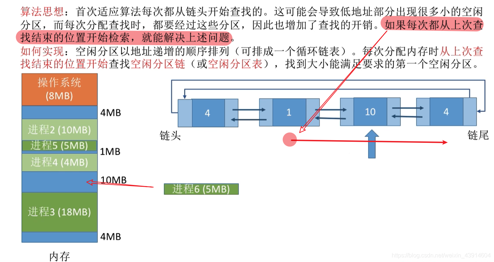 
> > 
> > 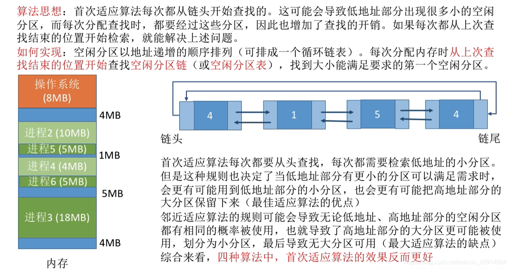
> > </div> 
>
> 
> 


>
> **<font color="pink" size = 5>5. 四种算法归纳比较</font>**
> 
> > <div align=center>
> > 
> > </div> 
> 
>
> <font color="yellow">
> 
> 首次适应算法（First Fit）的`缺点`：没有明显短板；每次都要从头查找，都需要检索低地址的小分区。但是可以保证低地址部分的小分区被充分利用，高地址部分的大分区保留下来
> 
>
> 最佳适应算法（Best Fit）的`缺点`：但是会产生很多小碎片（外部碎片），此后难以利用
> 
>
> 最坏（大）适应算法（Worst Fit or Largest Fit）的`缺点`：很多较大的连续空闲区迅速用完，之后如果有新的大进程，无分区可用
>  
>
> 临近适应算法（Next Fit）的`缺点`：几乎每个大的空闲分区，都会被一点点蚕食，导致后续大进程到来时，没有分区可用
>
> </font> 
> 
> <font color="gree">综上，`首次适应算法（First Fit）`的效果最好</font> 
>
> 
> 


#### 3.1.6 分页存储（页号、页偏移量等）

> 
> https://blog.csdn.net/weixin_43914604/article/details/105907291
> 


>
> **<font color="pink" size = 5>思维导图</font>**
> 
> > <div align=center>
> > 
> > 
> > </div> 
> 
> 
> <font color="gree">为了解决内存的`连续分配管理方式`（主要是`动态分区分配`）的问题，有了`非连续剧分配管理方式`</font> 
>
> 
> 


>
> **<font color="pink" size = 5>1. 为什么学习分页存储？</font>**
> 
> > <div align=center>
> > 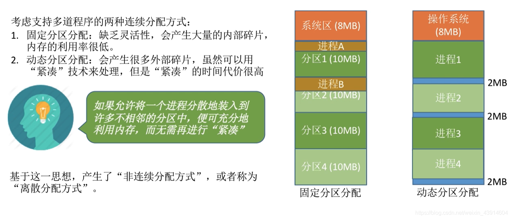
> > </div> 
> 
> 


>
> **<font color="pink" size = 5>2. 基本分页存储管理的思想</font>**
> 
> > <div align=center>
> > 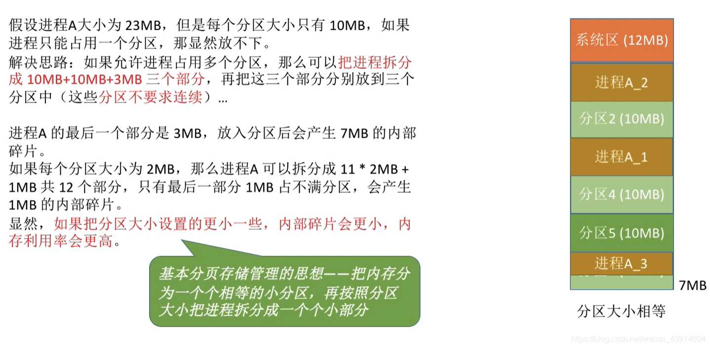
> > </div> 
>
> 
>
> <font color="yellow">
> 
> 1. 内存分为一个个相同大小的小分区
>
> 2. 按照分区大小把进程拆分成一个个小部分
>
> 可能会产生碎片（内部碎片），但是相对于连续动态分配的4种算法，产生的碎片已经很少了
>
> </font> 
> 
> 


>
> **<font color="pink" size = 5>3. 分页存储管理的重要概念</font>**
> 
> > <div align=center>
> > 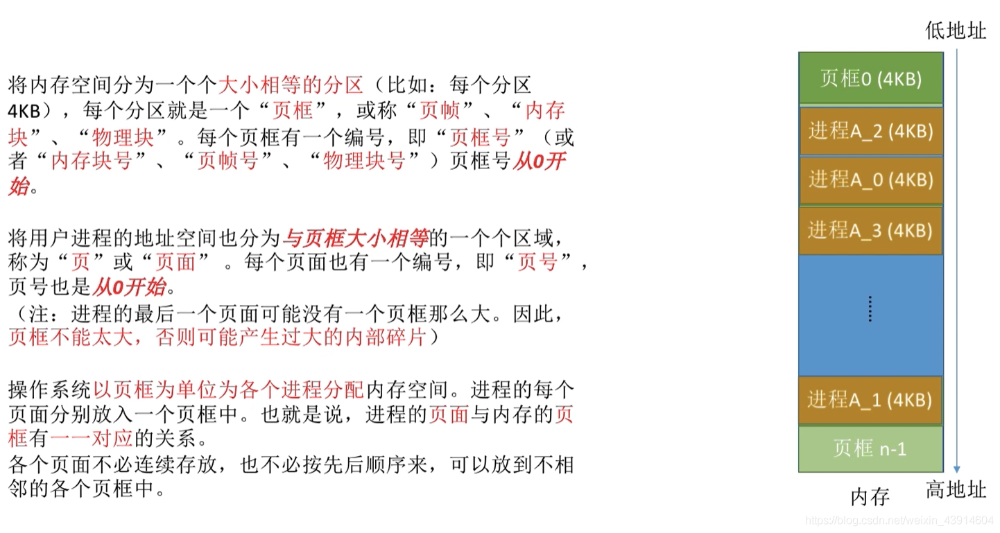
> > </div> 
>
> <font color="yellow">
>  
> 1. 内存分区：`页框`，页框号从0开始。 例如：页框0、页框1、页框2、...
>
> 2. 进程分区：`页`，每个进程的页号都分别从0开始。 例如：进程A_0、进程A_1; 进程B_0、进程B_1、进程B_2;
>
> 3. `页放入页框(一一对应)`，但是不必按照页号的先后顺序放入，也不必连续存放
>
> </font> 
> 
> 
> 


>
> **<font color="pink" size = 5>4. 如何实现地址的转换</font>**
> 
> > <div align=center>
> > 
> > 
> > 
> > </div> 
> 
>    
> <font color="pink">4.1. 如何计算页号和页偏移量</font>
> 
> > <div align=center>
> > 
> > </div> 
> > 
> > 
> > <font color="yellow">
> > 
> > 给定一个指令的逻辑地址，如何确认装入内存后，该指令的物理地址？
> > 
> > 已知 `逻辑地址` 和 `页面长度` 和 `每个页号对应页面 存入内存后的 起始物理地址`
> > 
> > 1. 计算`页号` 和 `页内偏移量`
> > 
> > >  `页号`：      `取整  逻辑地址 / 页面长度`
> > >  `页内偏移量`： `取余 逻辑地址 % 页面长度`
> > 
> > 2. `页面始址`：确认`页号`对应的页面在`内存中的起始物理地址`
> > 
> > 3. `物理地址 = 页面始址 + 页内偏移量`
> > 
> > 
> > </font> 
> > 
> > 
> > 
> > > <font color="gree">举例如下：</font>
> > > 
> > > 某指令的逻辑地址为80，内存划分的页面长度为50
> > > 
> > > 已知 `逻辑地址 = 80` 和 `页面长度 = 50`，及`每个页号对应页面 存入内存后的 起始物理地址`
> > > 
> > > 则页号 = 逻辑地址 / 页面长度 = 80 / 50 = 1；
> > > 则页内偏移量 = 逻辑地址 % 页面长度 = 80 % 50 = 30
> > >
> > > 查询到1号页在内存中的起始位置为450
> > >
> > > 物理地址 = 页面始址 + 页内偏移量 = 450 + 30 = 480
> > > 
> > 
>
> 
>
> 
> 
>
> <font color="pink">4.2. 为了方便计算，`页面大小`一般设为`2的整数次幂`</font> 
> 
> > <div align=center>
> > 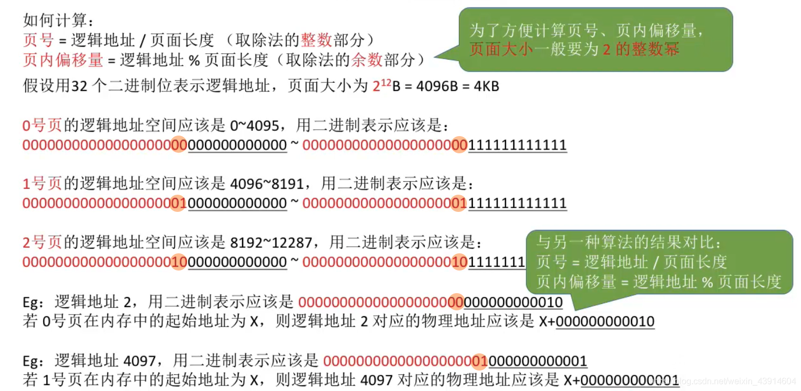
> > 
> > </div> 
> > 
>
> <font color="yellow">
>
> 设`内存为4KB大小`，则`地址空间长度32位`
> 
> 每个页面大小为$2^k B$, 我们一般用二进制表示逻辑地址，则
> `末尾K位即为页内偏移量`，
> `其余部分(前32-K位)就是页号`
>
> 这样，就可以很节省时间，`只需要两步`
>
> 1. 查询 指令 对应的 页号（逻辑地址前32-K位） 对应的 物理起始地址
>
> 2. `物理地址 = 页面始址（前32-K位对应的物理起始地址） + 页内偏移量（末尾K位）`
> 
> </font> 
>
> 
> 
> 
> 
>
> <font color="pink">4.3. 分页存储的逻辑结构</font> 
> 
> > <div align=center>
> > 
> > </div> 
> 
>
> 
> 
> 
> 
>
> <font color="pink">4.4. 已知页号，如何知道对应页面在内存中的起始地址？</font> 
>
> <font color="gree">页表</font> 
> 
> > <div align=center>
> > 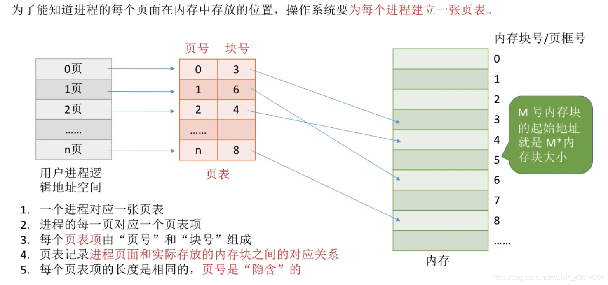
> >  
> > </div> 
> 
> 内存4GB，则地址空间长度为32位
>
> 页面大小为4KB，则后12位表示页面偏移量，前20位表示页号
>
> 内存一共有有$2^{20}$个内存块；（一个进程最多有$2^{20}$个页号）
>
> 
> <font color="gree">页表中，已知 `内存中 页表的物理起始地址X` 和 `页号M`，如果查找`页号M`对应的`内存块的物理起始地址`？</font> 
>
> 由于有$2^{20}$个内存块，则块号至少要20bit才能表示，又由于实际上是字节，所以至少得3个字节才行
>
> 那么页号对应的页表项存放的位置 = 页表存放的物理起始地址X + 页号M * 3
> 
> 直到了块号，就可以推导出 页号 对应的 内存块号 的 物理起始地址
> 
> `页号 对应的 页面（与一个内存块对应 内存块或称页框） 的 物理起始地址 = 对应内存块的块号 * 内存块长度 = （X + M * 3）* 内存块长度`
>
> 


#### 3.1.7 分页存储管理的基本地址变换结构

> 
> https://blog.csdn.net/weixin_43914604/article/details/105909842
> 


>
> **<font color="pink" size = 5>思维导图</font>**
> 
> > <div align=center>
> > 
> > 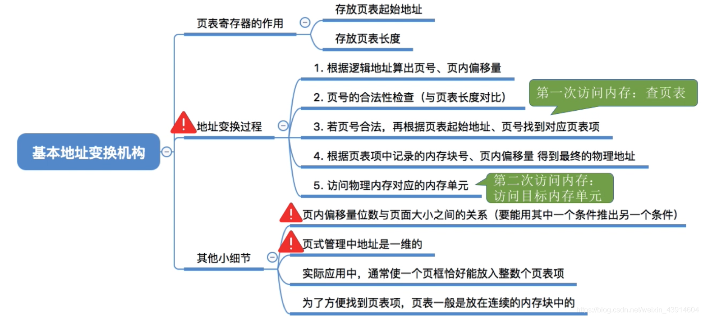
> > </div> 
> 
> 
> 


>
> **<font color="pink" size = 5>1. 页表寄存器</font>**
> 
> <font color="gree">
> 
> `页表寄存器`：存放 `页表在内存中的起始地址F` 和 `页表长度M`
>
> > 
> > 进程未运行：PCB中存储 `页表在内存中的起始地址F` 和 `页表长度M`
> > 
> > 进程运行：页表寄存器中存储 `页表在内存中的起始地址F` 和 `页表长度M`
> > 
> 
> </font>
> 
> > <div align=center>
> > 
> > </div> 
> 
>
> <font color="pink">1.1. 地址变换过程</font> 
> 
> > <div align=center>
> > 
> > 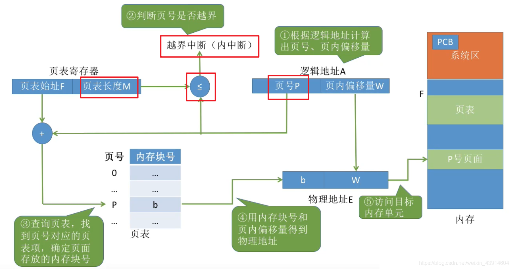
> > 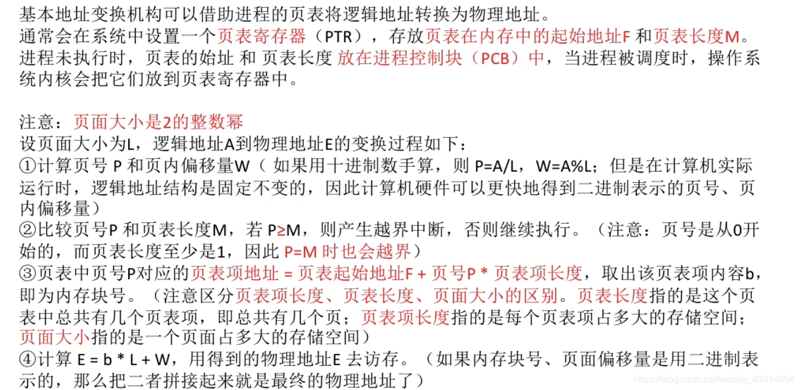
> > </div> 
> > 
> > <font color="pink">
> > 
> > 页表起始地址 + 页号 * 页表项长度，找到页表中的对应位置，里面有内存块好
> >  
> > E =  b * L + W， 即内存块号 * 内存块大小（和页面大小相同） + 页内偏移量
> > 
> > 如果是二进制，直接拼接就行，因为内存块地址空间如果是10bit长度，页内偏移量也是10bit长度
> > 
> > </font> 
>
> <font color="pink">1.2. 一道例题加深印象</font> 
> 
> > <div align=center>
> > 
> > </div> 
> > 
> 
> 分页存储管理中（已知页面大小），只要给出逻辑地址，就能退出物理地址
>
> 
> 
> 


>
> **<font color="pink" size = 5>2. 对页表项大小的进一步讨论</font>**
> 
> > <div align=center>
> > 
> > </div> 
> > 
> 
> 


#### 3.1.8 快表的地址变换结构 (快表是页表的一部分，放在高速缓存寄存器中，比内存速度快很多 )

> 
> https://blog.csdn.net/weixin_43914604/article/details/105929440
> 


>
> **<font color="pink" size = 5>思维导图</font>**
> 
> > <div align=center>
> > 
> > </div> 
> 
> 


>
> **<font color="pink" size = 5>1. 局部性原理引入快表机制</font>**
> 
> > <div align=center>
> > 
> > </div> 
>
> <font color="gree">有些内存块会很频繁的访问，这样总不能每次都查页表吧？</font> 
>
> 


>
> **<font color="pink" size = 5>2. 快表（TLB）</font>**
>
> <font color="gree">
> 
> * 快表 是 页表 的 一部分副本, 是近期查询过页表的一些页表项
>
> * 块表存放在更高速的存储器，比访问内存中的页表更节省时间
>
> </font> 
>
> 
> 
> > <div align=center>
> > 
> > </div> 
> 
>
> <font color="pink">2.1. 一个例图了解基于快表的地址变换结构</font> 
> 
> > <div align=center>
> > 
> > </div> 
>
> 
>
> <font color="pink">2.2. 引入快表后，地址变换的过程的文字描述</font> 
> 
> > <div align=center>
> > 
> > </div> 
> > 
> > <font color="yellow">其实访问快表也需要时间，只是相对于访问内存，高速缓存寄存器的时间可以忽略不急，所以约等于一次访存的时间（访存：访问内存）</font>
> > 
>
> 
> 


>
> **<font color="pink" size = 5>3. 基本地址变换与快表地址变换的比较</font>**
> 
> > <div align=center>
> > 
> > </div> 
>
> 
> 
> 
>


#### 3.1.9 二级页表的原理和地址结构

> 
> https://blog.csdn.net/weixin_43914604/article/details/105930570
> 
> 


>
> **<font color="pink" size = 5>思维导图</font>**
> 
> > <div align=center>
> > 
> > </div> 
>


>
> **<font color="pink" size = 5>1. 为什么引入二级页表？</font>**
>
>
> <font color="pink">1.1. 因为单级页表存在一些问题，所以引入二级页表和多级页表，有两个问题：</font> 
> 
> > <div align=center>
> > 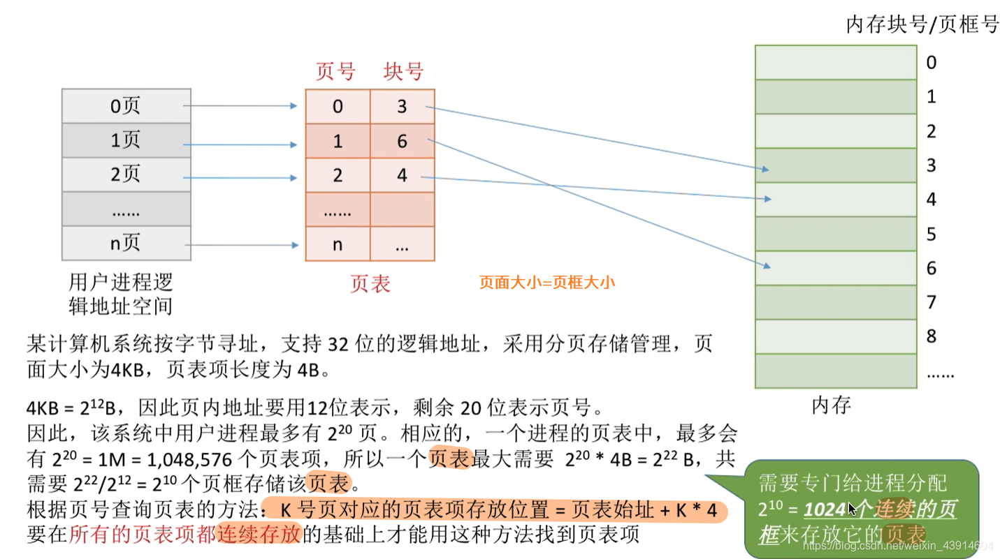
> > 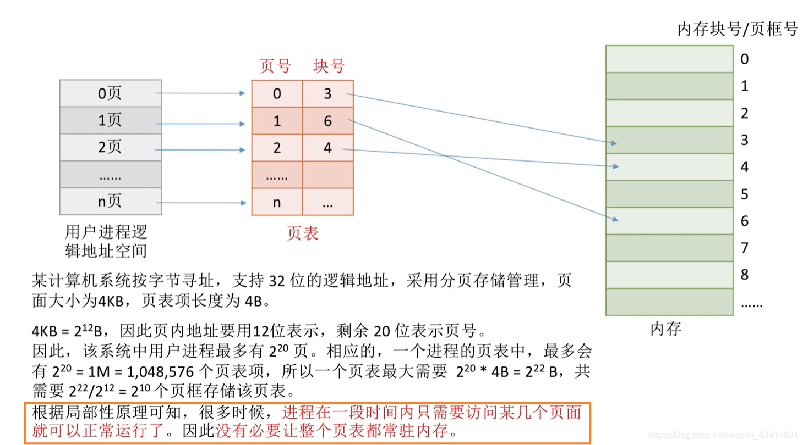
> > </div> 
>
> <font color="gree">
> 
> 1. 单单是一个页表，就占用很多的内存了，会需要很多的连续的页框（内存块）来存放页表
>
> 2. 但是一个进程只需要访问几个页面，根本用不到这么长的页表，没必要让整个页表放入内存中，太浪费了
> 
> </font> 
>
>
> <font color="pink">1.2.上面提到了这两个问题，那么总结一下，并提出解决思想，引入二级页表的概念。</font> 
> 
> > <div align=center>
> > 
> > </div> 
> 
> 
> 
> 
> 
> 
> 


>
> **<font color="pink" size = 5>2. 二级页表的原理和地址结构</font>**
>
>
>
> <font color="pink">2.1. 对页表再次分组</font> 
> 
> > <div align=center>
> > 
> > </div> 
>
>
> <font color="pink">2.2. 二级页表的地址结构及对应关系</font> 
> 
> > <div align=center>
> > 
> > </div> 
> 
> 
> 
> 
> 


>
> **<font color="pink" size = 5>3. 如何实现二级页表的地址变换？</font>**
> 
> > <div align=center>
> > 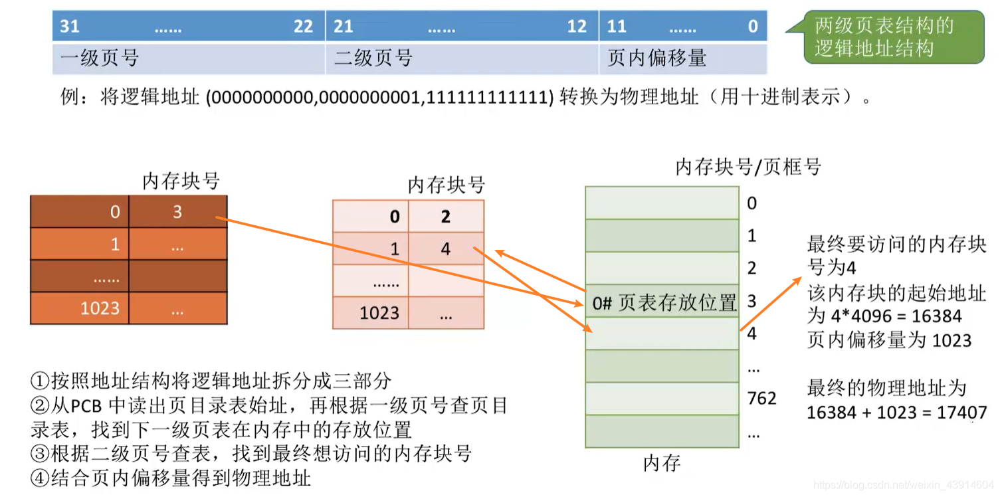
> > </div> 
> 
> 
> 上面的部分我们解决了问题一，接下来是问题二，这里简单叙述一下，后面的文章会继续深入剖析。
> 
> > <div align=center>
> > 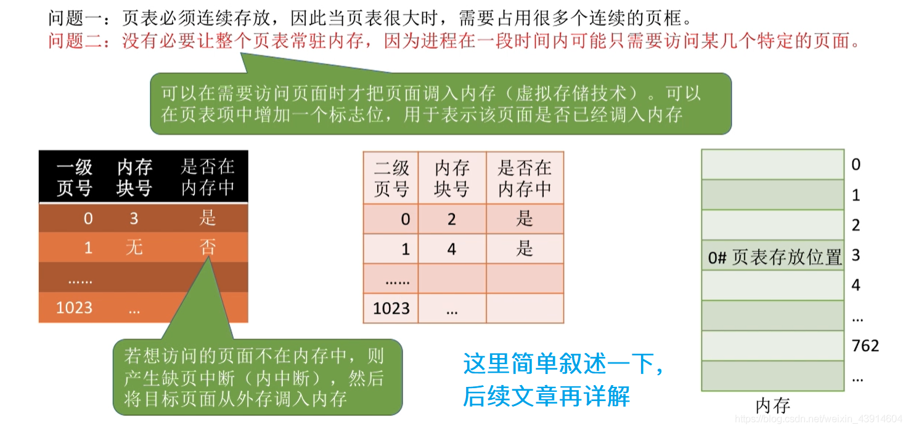
> > </div> 
> 
> <font color="gree">在后面的 3.2 虚拟内存管理中 继续讲解</font>
> 
> 
>


>
> **<font color="pink" size = 5>4. 几个小细节</font>**
> 
> > <div align=center>
> > 
> > </div> 
>
> <font color="gree">
> 
> 多级页表中，各级页表的大小不能超过一个页面。若两级页表不够，可以分更多级
>
> 多级页表的访存次数（假设没有块表结构）---N级页表访问一个逻辑地址要N+1次访存
>
> </font>
> 


#### 3.1.10 基本分段存储管理（段表、地址变换、信息共享）

> 
> https://blog.csdn.net/weixin_43914604/article/details/105970911
> 


>
> **<font color="pink" size = 5>思维导图</font>**
> 
> > <div align=center>
> > 
> > 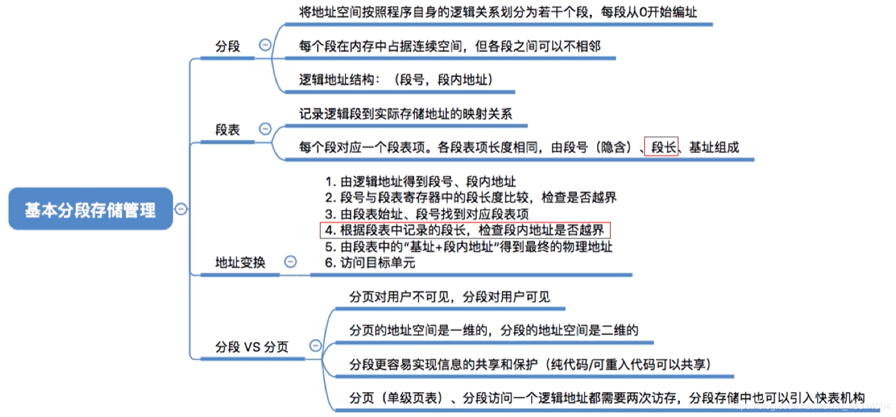
> > </div> 
>
> 
>


>
> **<font color="pink" size = 5>1. 什么是分段？</font>**
> 
> > <div align=center>
> > 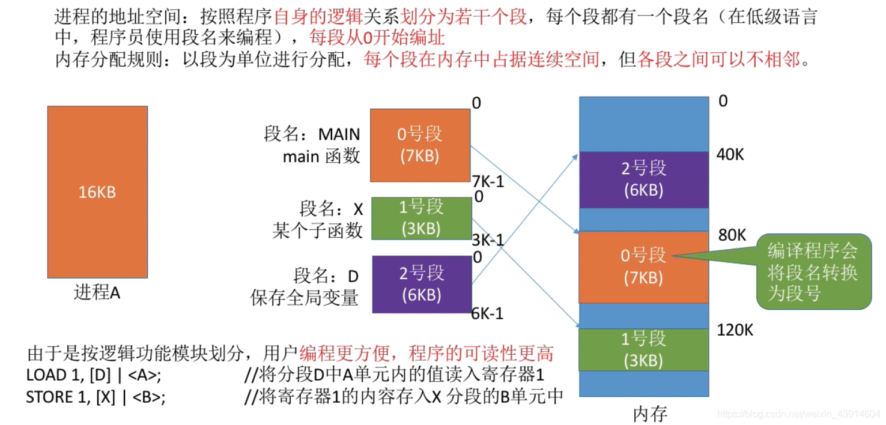
> > </div> 
> 
>
> <font color="pink">1.1. 分段的逻辑地址结构</font> 
> 
> > <div align=center>
> > 
> > </div> 
> 
> 
> 


>
> **<font color="pink" size = 5>2. 段表</font>**
> 
> > <div align=center>
> > 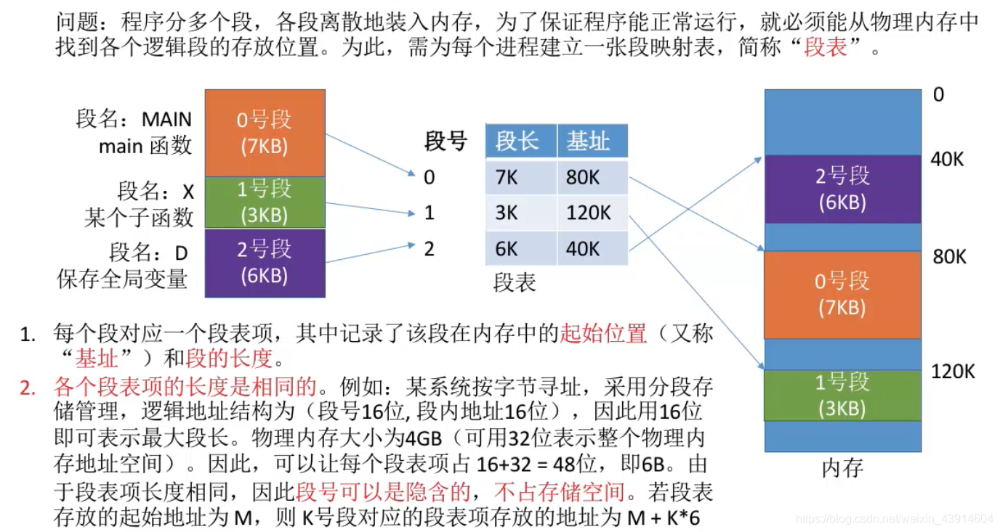
> > </div> 
>  
> 


> **<font color="pink" size = 5>3. 地址变换</font>**
> 
> > <div align=center>
> > 
> > 
> > </div> 
>   
> 
> 
> 
> 


> **<font color="pink" size = 5>4. 分段、分页管理的对比</font>**
> 
> > <div align=center>
> > 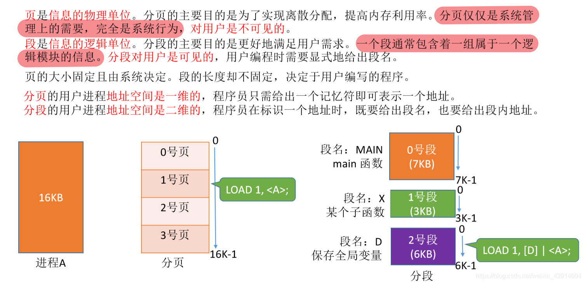
> > 
> > </div> 
>
> 
>  
> <font color="gree">相同点：</font>
>
> 1. 都是两次访存，
> 
> 2. 都可以通过引入快表结构（记录最近的部分页表/段表），变为一次访存
>
> <font color="gree">不同点：</font>
>
> 1. 分页是系统管理行为，用户不可见；分段是用户管理行为，例如汇编语言
>
> 2. 分页的地址空间是一维的，只需要一个地址；分段的地址空间是二维的，既要给出段名，也要给出段内地址
>
> > 
> > 分页之所以是一维的，原因在于分页的大小是固定的，且页码之间是连续的，操作的时候只需给出一个地址，就能够根据所给地址的大小与页面大小计算出在页码和页内地址，粗略举例，比如页面大小是4KB，给一个地址为5000，可以算出所在页码是2，页内地址是5000-4000=1000，即在第二页的第1000个位置。 
> > 
> > 而分段的因为每段的长度不一样，必须给出段码和段内地址
> > 
>
> 3. 分段更冗余实现信息的共享和保护（<font color="gree">没看懂这个说法</font>）
>
> 
> 
>
> <font color="pink">4.1. 分段实现信息共享共享</font> 
> 
> > <div align=center>
> > 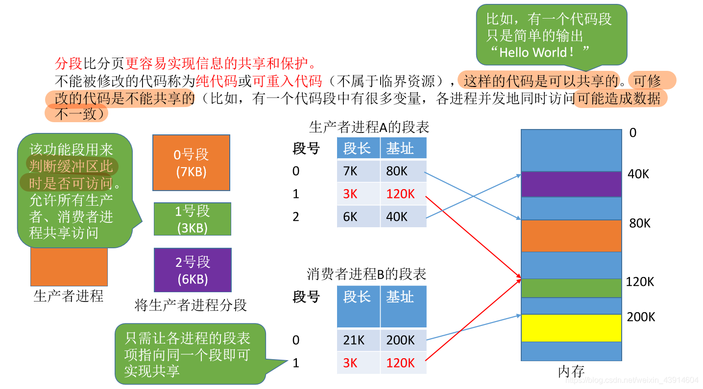
> > </div> 
>
>
> <font color="pink">4.2. 为什么分页不方便实现信息共享和保护？</font> 
> 
> > <div align=center>
> > 
> > </div> 
>
> 
> 
> 
> 
> 


#### 3.1.11 段页式存储管理（段表、页表、地址转换）

> 
> https://blog.csdn.net/weixin_43914604/article/details/105973485
> 


>
> **<font color="pink" size = 5>思维导图</font>**
> 
> > <div align=center>
> > 
> > 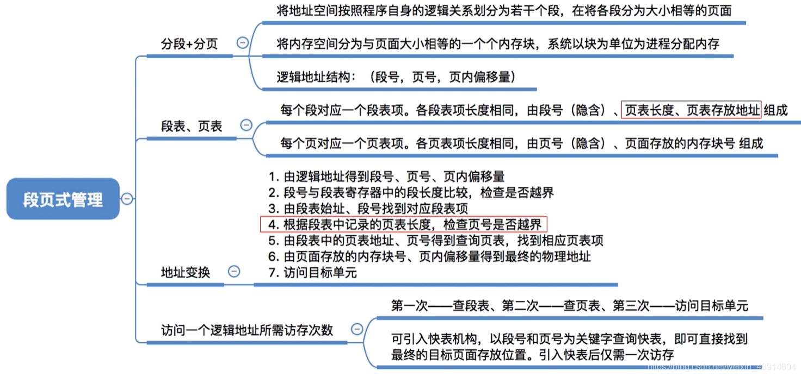
> > </div> 
> 
> 
> 


>
> **<font color="pink" size = 5>1. 分页、分段的优缺点分析</font>**
> 
> > <div align=center>
> > 
> > 
> > </div> 
> 
> 
> 
> 


>
> **<font color="pink" size = 5>2. 分段+分页=段页式管理</font>**
> 
> > <div align=center>
> > 
> > </div> 
> 
>
> <font color="pink">2.1. 段页式管理的逻辑地址结构</font> 
> 
> > <div align=center>
> > 
> > </div> 
> 
>
> <font color="pink">2.2. 段页式存储的段表、页表</font> 
> 
> > <div align=center>
> > 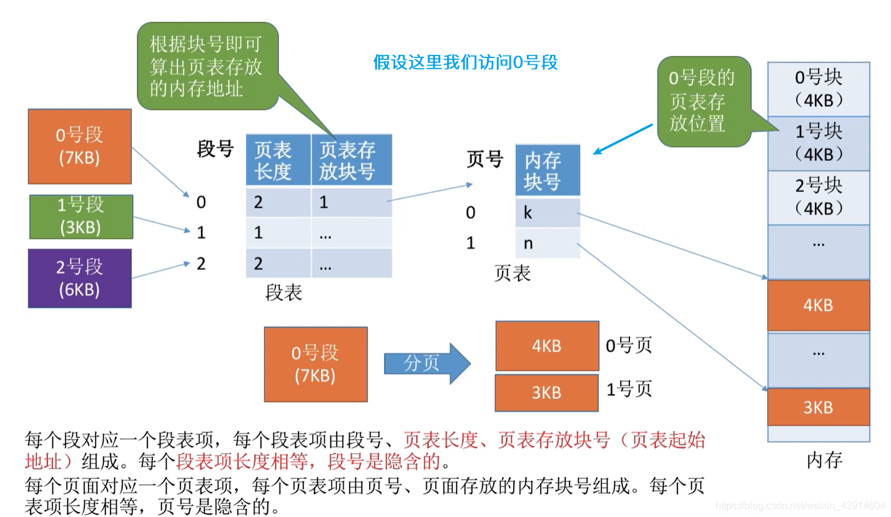
> > </div> 
> 
> 
> 
> 
> 


>
> **<font color="pink" size = 5>3. 段页式管理的地址转换过程</font>**
> 
> > <div align=center>
> > 
> > </div> 
> 
> 
> 


### 3.2 虚拟内存管理

#### 3.2.1 虚拟内存的基本概念（局部性原理、高速缓存、虚拟内存的实现）

> 
> https://blog.csdn.net/weixin_43914604/article/details/105977595
> 


>
> **<font color="pink" size = 5>思维导图</font>**
> 
> > <div align=center>
> > 
> > 
> > 
> > </div> 
> 
> 
> 


>
> **<font color="pink" size = 5>1. 传统存储管理的特征、缺点</font>**
> 
> > <div align=center>
> > 
> > </div> 
> 


>
> **<font color="pink" size = 5>2. 局部性原理</font>**
> 
> > <div align=center>
> > 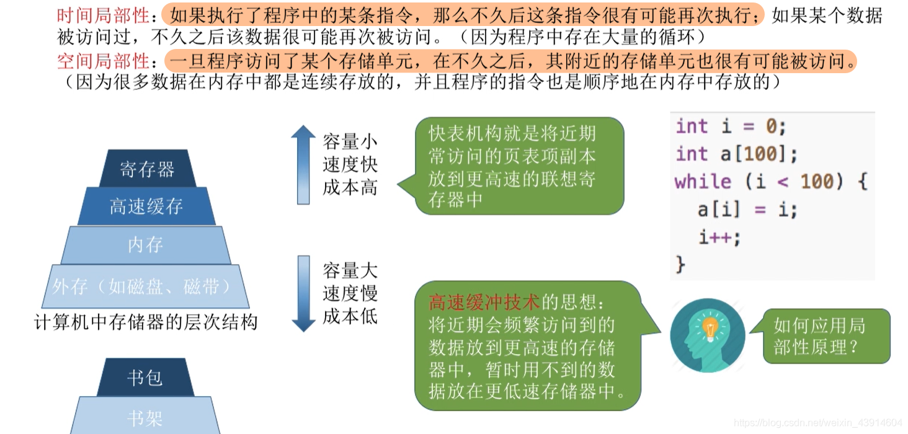
> > </div> 
> 
> `寄存器: Register`
>
> `高速缓存：Cache`
>
> `内存：Memory`
>
> `外存：一般是硬盘 Hard Disk Drive`
> 
> 
> 


>
> **<font color="pink" size = 5>3. 虚拟内存的定义和特征</font>**
> 
> > <div align=center>
> > 
> > 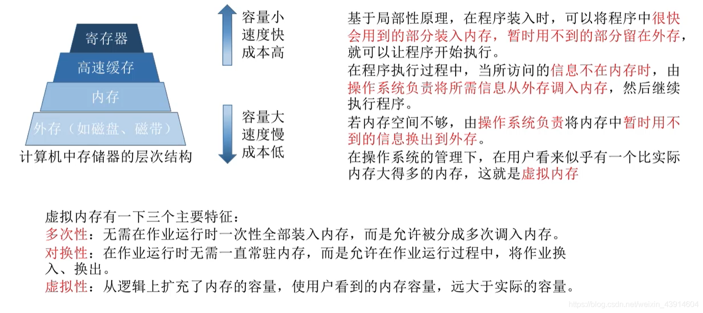
> > </div> 
> 
> 
> 


>
> **<font color="pink" size = 5>4. 如何实现虚拟内存技术</font>**
> 
> > <div align=center>
> > 
> > </div> 
> 
> 
> 


#### 3.2.2 请求分页管理方式（请求页表、缺页中断机构、地址变换机构）

> 
> https://blog.csdn.net/weixin_43914604/article/details/105978678
> 


>
> **<font color="pink" size = 5>思维导图</font>**
> 
> > <div align=center>
> > 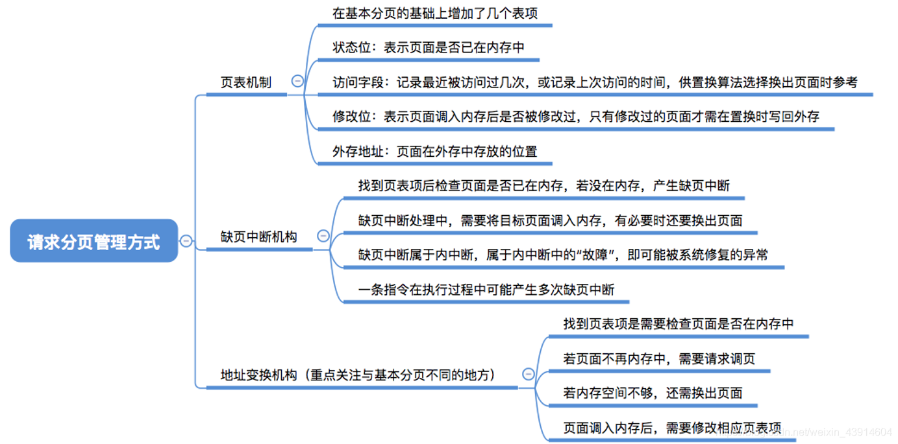
> > </div> 
> 
> 


>
> **<font color="pink" size = 5>1. 知识总览</font>**
> 
> > <div align=center>
> > 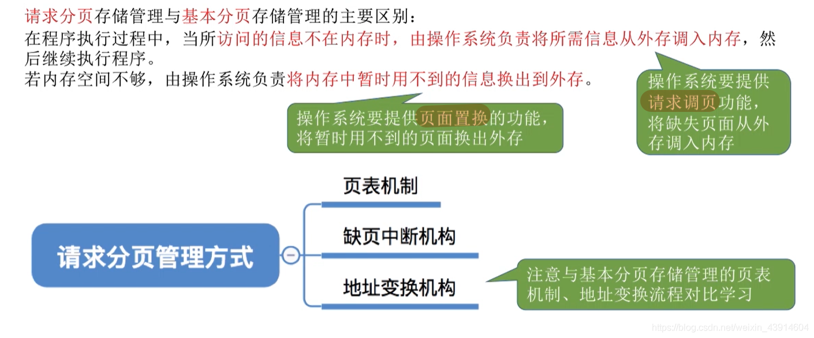
> > </div> 
>  
> <font color="gree">
> 
> 请求分页 = 基本分页 + 请求调页（外存 --->>> 内存） + 页面置换（内存 <<<--->>> 外存 ）
>
> 请求调页： 本质上是复制到内存，外存的地址`x`中还有一份副本，如果调入内存后，该页面没有修改过，那么之后调出时，直接丢弃就好；如果调入内存后被修改了，调出时，就需要覆盖掉原来的旧数据。所以页表里要记录 "调入内存后是否被修改过"
>
> 
> 
> </font>
>
> 


>
> **<font color="pink" size = 5>2. 页表机制—请求页表与基本页表的区别</font>**
> 
> > <div align=center>
> > 
> > </div> 
> 
> 


>
> **<font color="pink" size = 5>3. 缺页中断机制</font>**
>
> <font color="gree">
>
> 当进程的一部分（一个页面）没在内存中时，触发 缺页中断（属于"内部中断"）
>
> 该进程 运行态 --- >>> 阻塞态，加入等待队列
>
> 中断处理：页面调入，或者页面置换
>
> 中断结束后，唤醒该进程，阻塞态 --->>> 就绪态
>
> </font>
> 
> <font color="yellow">
> 
> 调入的本质是复制到内存，外存的地址`x`中还有一份副本，如果调入内存后，该页面没有修改过，那么之后调出时，直接丢弃就好；如果调入内存后被修改了，调出时，就需要写回地址`x`，覆盖掉原来的旧数据。所以页表里要记录 `"调入内存后是否被修改过"`
> 
> </font>
> 
> > <div align=center>
> > 
> > 
> > 
> > 
> > 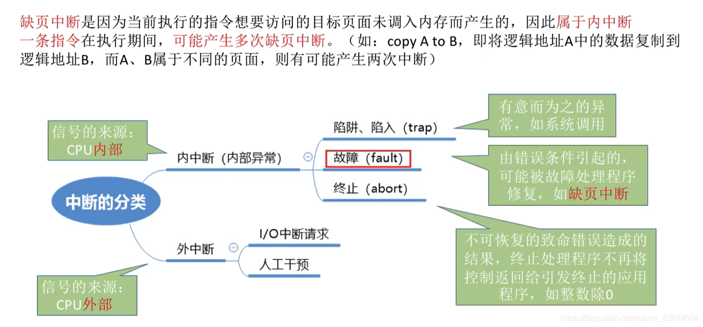
> > </div> 
> 
> 


>
> **<font color="pink" size = 5>4. 地址变换机制</font>**
>
> <font color="yellow">
>
> * 只有慢表：查页表（发现未调入内存）---调页---查页表
>
> * 快表+慢表：查快表（没有）---查慢表（发现未调入内存）---调页（同步更新快表）--查快表
> 
> </font>
> 
> 
> > <div align=center>
> > 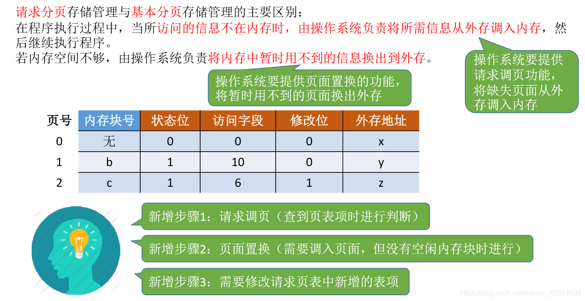
> > 
> > 
> > 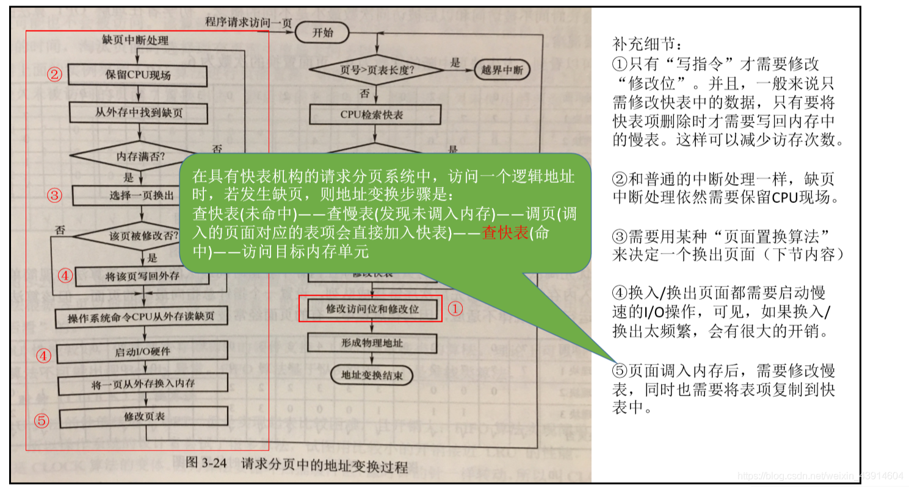
> > </div> 
> 
> 
> 
> 
> 


#### 3.2.3 页面置换算法（最佳置换算法、先进先出置换算法、最近最久未使用置换算法、普通时钟置换算法、改造型时钟置换算法）

> 
> https://blog.csdn.net/weixin_43914604/article/details/105997486
> 


>
> **<font color="pink" size = 5>思维导图</font>**
> 
> > <div align=center>
> > 
> > 
> > </div> 
> 
> <font color="gree">
> 
> `OPT`: 算法性能最好、但无法实现
>
> `FIFO`：实现简单，但是算法性能差
>
> `LRU`：实现需要专门的硬件支持（计算从上次访问以来的时间），但是性能最接近OPT
>
> `CLOCK/NRU`：性能和开销较为均衡
> 
> </font>
> 


>
> **<font color="pink" size = 5>1. 最佳置换算法—OPT(OPtimal)</font>**
>
>
> <font color="gree">
>
> 缺点：
> 
> OS 无法提前预判页面访问序列，所以不知道哪个页面以后不再使用，所以无法实现最佳置换算法
> 
> </font>
>  
> 
> > <div align=center>
> > 
> > 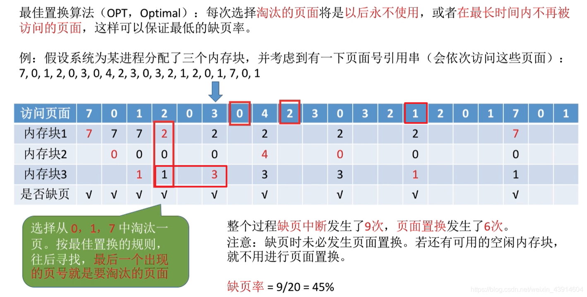
> > 
> > </div> 
> > 
> > `注：这里的7，0，1，2，...指的是页面7、页面0、页面1、页面2、...`
> > 
>


>
> **<font color="pink" size = 5>2. 先进先出置换算法—FIFO(Fist In First Out)</font>**
>
> <font color="gree">
>
> 缺点：
>
> 1. 内存块如果给了过多，反而会增大缺页中断的发生次数---Belady异常
> 
> 2. 最早进入的页面，可能后面会频繁用到，丢弃了会很影响进程运行，系统频繁再调入，开销大
> 
> </font>
>  
> > <div align=center>
> > 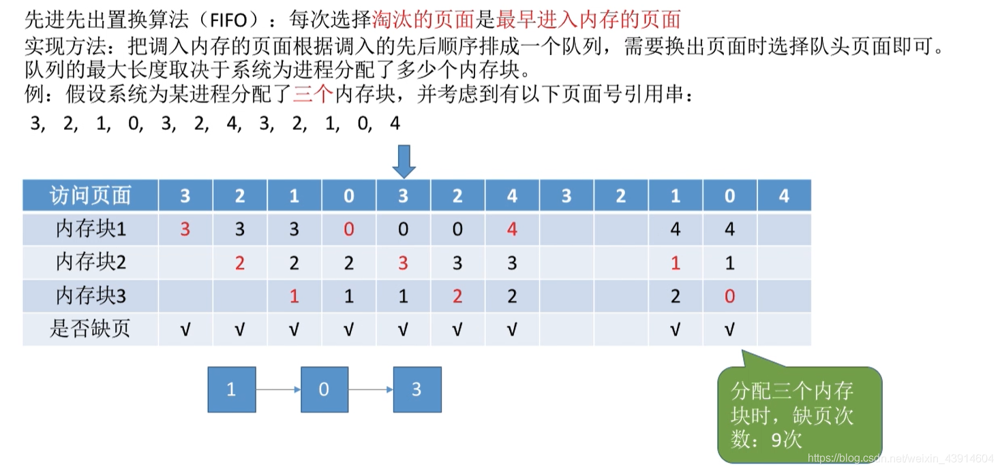
> > 
> > </div> 
> 
> 
>
> 


>
> **<font color="pink" size = 5>3. 最近最久未使用置换算法—LRU(Least recently Used)</font>**
>
> <font color="gree">
>
> 缺点：
>
> 需要专门的硬件支持，实现困难，开销大
> 
> </font>
>   
> > <div align=center>
> > 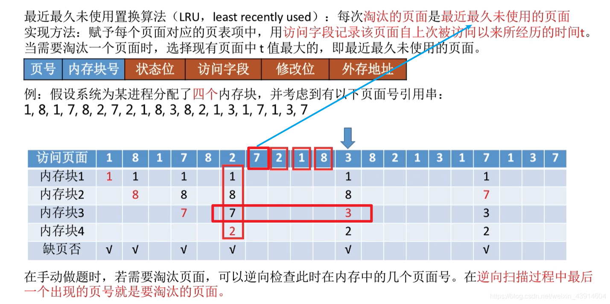
> > 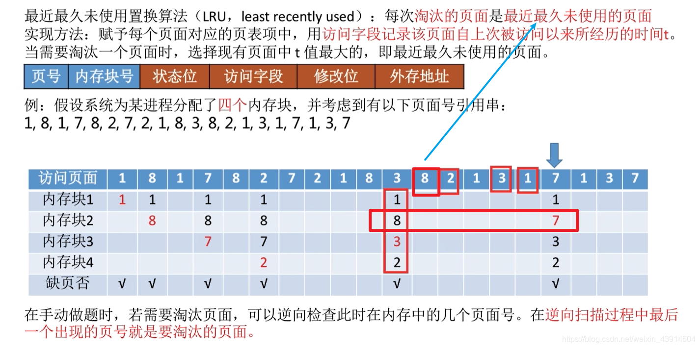
> > 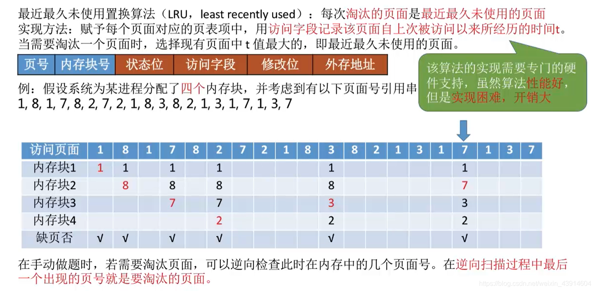
> > </div> 
> 
> 
>


>
> **<font color="pink" size = 5>4. 时钟置换算法—CLOCK</font>**
>   
> > <div align=center>
> > 
> > 
> > 
> > </div> 
> 
> 
> 
>


>
> **<font color="pink" size = 5>5. 改造型时钟置换算法</font>**
>
> <font color="yellow">只需一轮：</font>
>   
> > <div align=center>
> > 
> > </div> 
>
> <font color="yellow">需要两轮：</font>
>   
> > <div align=center>
> > 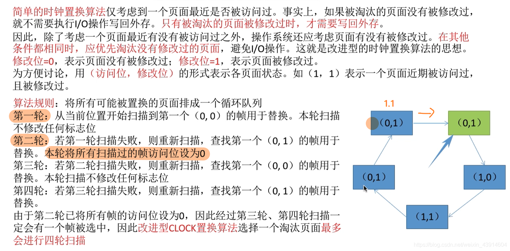
> > </div> 
>
> <font color="yellow">需要三轮：</font>
>   
> > <div align=center>
> > 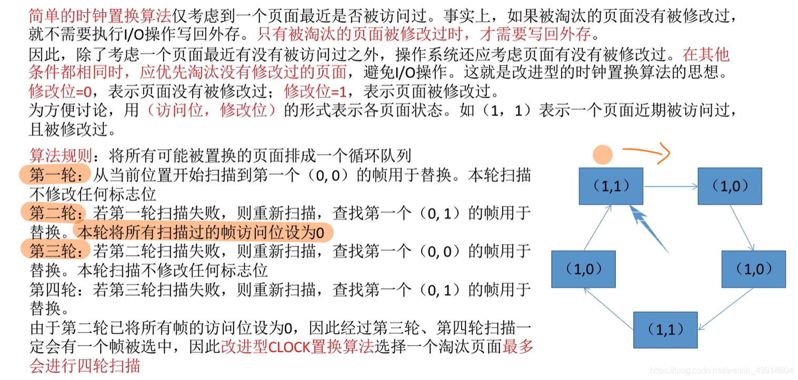
> > 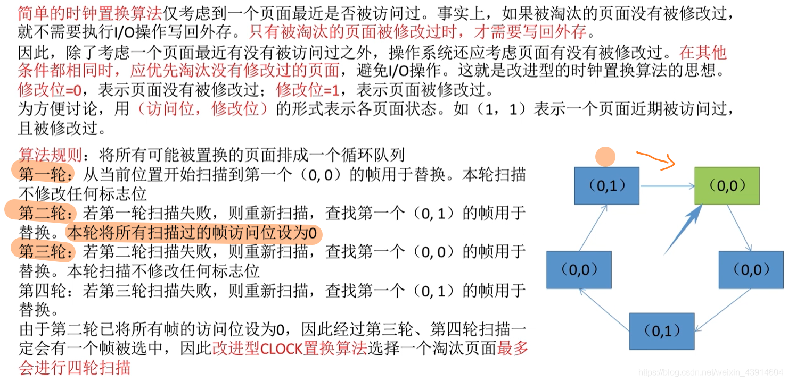
> > </div> 
>
> <font color="yellow">需要四轮：</font>
>   
> > <div align=center>
> > 
> > 
> > 
> > 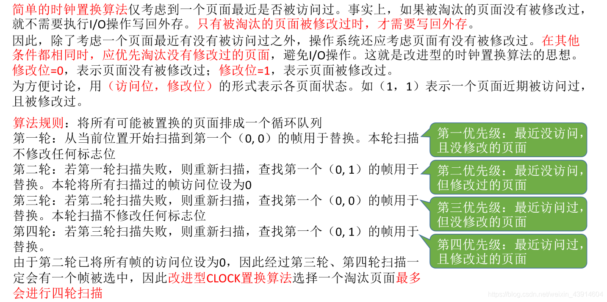
> > </div> 
>
>
> <font color="yellow">评论区：</font>
>   
> > <div align=center>
> > 
> > </div> 
>
> 
> 
>   


#### 3.2.4 页面分配策略（驻留集、页面分配、置换策略、抖动现象、工作集）

> 
> https://blog.csdn.net/weixin_43914604/article/details/106001486
> 

>
> **<font color="pink" size = 5>思维导图</font>**
> 
>   
> > <div align=center>
> > 
> > 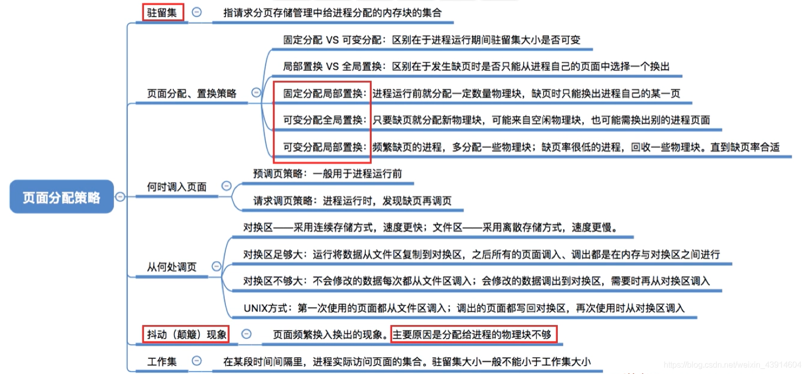
> > </div> 
> 
> 
> 


>
> **<font color="pink" size = 5>1. 驻留集</font>**
>   
> > <div align=center>
> > 
> > </div> 
> 
> 
>


>
> **<font color="pink" size = 5>2. 页面分配、置换策略</font>**
>   
> > <div align=center>
> > 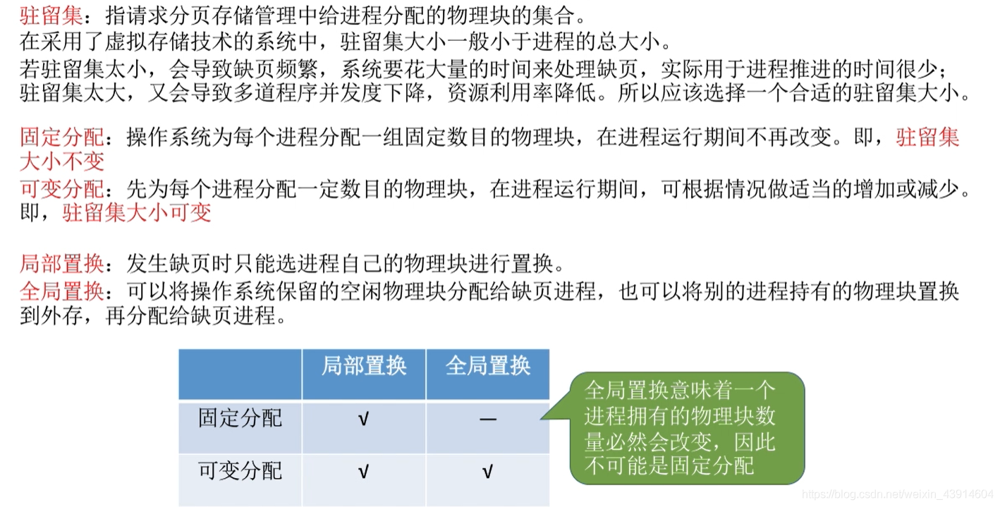
> > </div> 
> > 
> > * <font color="gree">固定分配局部置换、可变分配局部置换、可变分配全局置换</font>
> >   
> > <div align=center>
> > 
> >  
> > </div> 
>
> 
>


>
> **<font color="pink" size = 5>3. 何时调入页面？</font>**
>   
> > <div align=center>
> > 
> > </div> 
> 
> 


>
> **<font color="pink" size = 5>4. 从何处调页？</font>**
>   
> > <div align=center>
> > 
> > 
> > 
> > </div> 
> 
> 


>
> **<font color="pink" size = 5>5. 抖动（颠簸）现象</font>**
>   
> > <div align=center>
> > 
> > </div> 
> 
> 


>
> **<font color="pink" size = 5>6. 工作集</font>**
>   
> > <div align=center>
> > 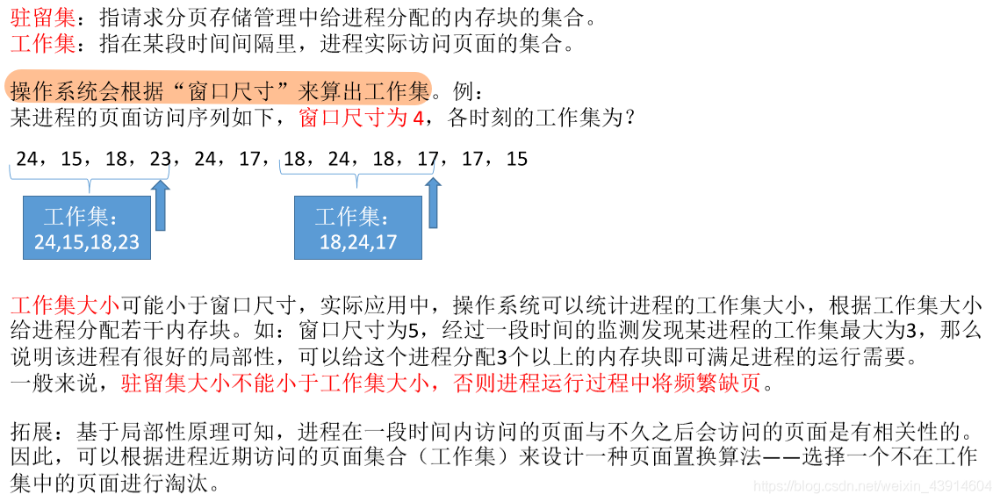
> > </div> 
> 
> 


>
> <font color="yellow">评论区：</font>
>   
> > <div align=center>
> > 
> > </div> 
> 
>


## 第 4 章 文件管理


### 4.1 文件系统

#### 4.1.1 初识文件管理概念和功能

>
> https://blog.csdn.net/weixin_43914604/article/details/106276876
> 


#### 4.1.2 文件逻辑结构（顺序文件、索引文件、索引顺序文件、多级索引顺序文件）关于数据库的索引如聚簇索引可以看一下索引文件例题的解析，感觉还是可以收获到东西的

>
> https://blog.csdn.net/weixin_43914604/article/details/106277412
> 


#### 4.1.3 文件目录结构（单级-两级-多级-无环图）、索引节点FCB瘦身

>
> https://blog.csdn.net/weixin_43914604/article/details/106298565
> 


#### 4.1.4 文件的物理结构(连续分配、链接分配[隐式-显式]、索引分配[链接方案-多层索引-混合索引])

>
> https://blog.csdn.net/weixin_43914604/article/details/106303759
> 


#### 4.1.5 文件管理空闲磁盘块的几种算法(空闲表法、空闲链表法、位示图法、成组链接法)

>
> https://blog.csdn.net/weixin_43914604/article/details/106373112
> 


#### 4.1.6 文件的基本操作原理(创建、删除、打开、关闭、读-写)

>
> https://blog.csdn.net/weixin_43914604/article/details/106376366
> 


#### 4.1.7 文件共享（索引节点-硬链接、符号链接-软链接）

>
> https://blog.csdn.net/weixin_43914604/article/details/106378152
> 


#### 4.1.8 文件保护（口令保护、加密保护、访问控制）

>
> https://blog.csdn.net/weixin_43914604/article/details/106384893
> 


#### 4.1.9 文件系统的层次结构

>
> https://blog.csdn.net/weixin_43914604/article/details/106387466
> 


### 4.2 磁盘组织与管理

#### 4.2.1 磁盘的结构（磁盘、磁道、扇区、盘面、柱面、磁头）

>
> https://blog.csdn.net/weixin_43914604/article/details/106387866
> 


#### 4.2.2 磁盘调度算法（FCFS、SSTF、SCAN、LOOK、S-SCAN、C-LOOK）

>
> https://blog.csdn.net/weixin_43914604/article/details/106388166
> 


#### 4.2.3 减少磁盘延迟时间的方法（交替编号、错位命名）

>
> https://blog.csdn.net/weixin_43914604/article/details/106389443
> 


#### 4.2.4 磁盘管理（磁盘初始化、引导块、坏块的管理）

>
> https://blog.csdn.net/weixin_43914604/article/details/106390034
> 


## 第 5 章 I/O管理


### 5.1 I/O管理概述

#### 5.1.1 什么是I/O设备？有几类I/O设备？

>
> https://blog.csdn.net/weixin_43914604/article/details/106136127
> 


#### 5.1.2 控制I/O设备的I/O控制器

>
> https://blog.csdn.net/weixin_43914604/article/details/106136990
> 


#### 5.1.3 控制I/O设备的几种方式？(程序直接控制方式、中断驱动方式、DMA、通道控制)

>
> https://blog.csdn.net/weixin_43914604/article/details/106144829
> 


#### 5.1.4 I/O软件的层次结构（用户层软件-设备独立性软件-设备驱动程序-中断处理程序）

>
> https://blog.csdn.net/weixin_43914604/article/details/106147270
> 


### 5.2 I/O核心子系统

#### 5.2.1 内核的I/O核心子系统及功能

>
> https://blog.csdn.net/weixin_43914604/article/details/106147949
> 


#### 5.2.2 I/O设备假脱机技术(SPOOLing)

>
> https://blog.csdn.net/weixin_43914604/article/details/106150766
> 


#### 5.2.3 I/O设备的分配与回收（DCT-COCT-CHCT-SDT）

>
> https://blog.csdn.net/weixin_43914604/article/details/106151353
> 


#### 5.2.4 缓冲区管理（单缓冲-双缓冲-循环缓冲-缓冲池）

>
> https://blog.csdn.net/weixin_43914604/article/details/106274269
> 


